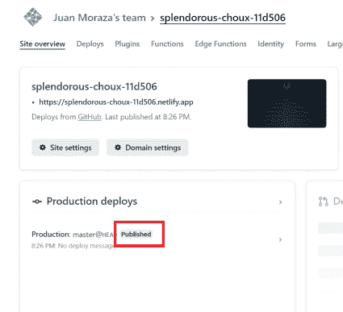

# 只需几个步骤即可免费部署个人网站(Github、Netlify、Freenom)

> 原文：<https://blog.devgenius.io/deploy-personal-website-for-free-in-few-steps-github-netlify-freenom-6348676913d7?source=collection_archive---------8----------------------->

# 你想建立自己的网站吗？你想免费做吗？那就从这里开始吧！

为了免费部署您的个人网站，我们需要在以下平台上创建几个帐户。别担心，这个过程中的一切都是免费的。

*   [Github](https://github.com/)
*   [Netlify](https://app.netlify.com/)
*   [笔名](https://www.freenom.com/)

# 克隆回购

创建所需帐户后的下一步是将以下回购文件克隆/下载到您新创建的 [GitHub](https://github.com/) 帐户。

[https://github.com/morazaone/my-links-page](https://github.com/morazaone/my-links-page)

# 在 Netlify 上部署回购

一旦你登录到[网络生活](https://app.netlify.com/)账户，

进入**团队概述**和**添加新站点** - > **导入现有项目**

用 Github 连接

并寻找我们刚刚在此过程开始时添加的克隆回购

对于**基本目录**和**发布目录**字段，只需输入“/”并点击“**部署站点**按钮

给它一些时间，而它处理它，几分钟后刷新网站。如果一切顺利，您应该会看到发布的绿色文本

点击绿色 https 网址查看现场直播

# 将网站指向个性化域

一旦你成功地部署了你的站点，下一步就是复制域名服务器并粘贴到 Freenom 上

要获取网络名称服务器，请转到域设置

然后点击**添加自定义域**按钮

输入您的个性化域名，点击**添加域名**按钮

然后点击**检查 DNS 配置**链接

向下滚动弹出菜单，单击**为域**设置有效 DNS 链接

完成此窗口中的步骤，并复制名称服务器

# 在 Freenom 中设置网络域名服务器

然后我们想导航到 [Freenom](https://freenom.com/) 并转到**服务** - > **我的域名**

点击**管理域名**按钮获取所需域名

在下一个窗口进入**管理工具** - > **域名服务器**

最后，在此页面中从 Netlify 复制名称服务器

# 恭喜您，您已经免费部署了您的站点！

结论

这个过程可能有点长，但完全值得，因为它是免费的。

如果您对这个过程或它对您有帮助有更多的问题，请查看下面的视频，如果它对您有帮助，请留下您的评论或喜欢/订阅！

# [https://youtu.be/zDSYqCndvXc](https://youtu.be/zDSYqCndvXc)