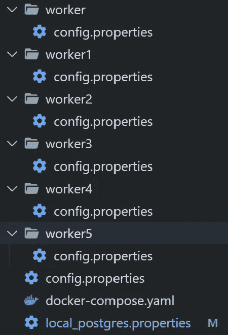
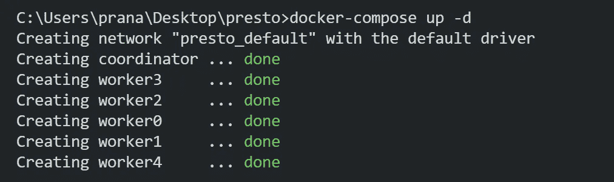
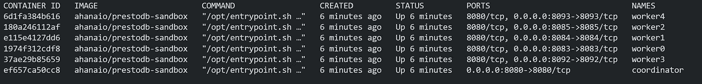
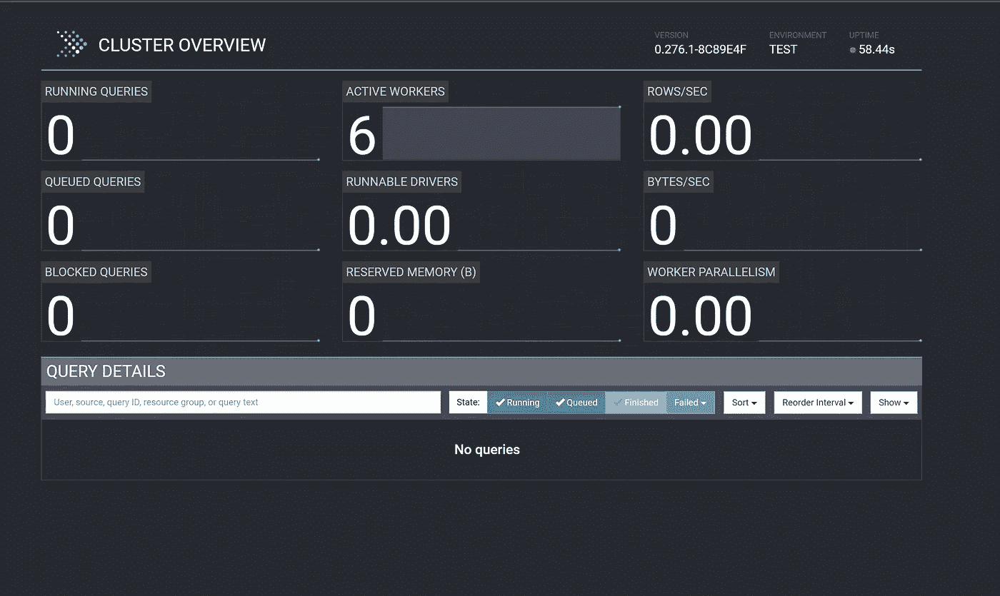

# 使用 docker compose 快速部署多个工作人员

> 原文：<https://blog.devgenius.io/deploy-presto-with-multiple-workers-using-docker-compose-166ffefcd45?source=collection_archive---------4----------------------->

## 更快的分析和查询执行


[活动发起人](https://unsplash.com/@campaign_creators?utm_source=medium&utm_medium=referral)在 [Unsplash](https://unsplash.com?utm_source=medium&utm_medium=referral) 上的照片

[**Presto**](https://prestodb.io/) 是分布式 SQL 引擎，主要用于查询大型数据集。Presto 快速、可靠且可扩展。

Presto 在 2013 年由**脸书**开源。Presto 不是数据库，它充当的是 Hive、 [Kafka](https://kafka.apache.org/) 、 [Cassandra](https://cassandra.apache.org/_/index.html) 、 [Postgres](https://www.postgresql.org/) 、MySQL 等关系数据库和 NOSQL 数据库的计算层。

presto 的典型部署需要一个 presto 协调器和几个 Presto 工作器。

**Presto-Coordinator** —用于提交查询和调度查询执行。它还管理所有的工人。

**Presto-Workers** —它用于处理查询和拆分查询，以便更快地执行。

现在我们可以看到如何使用 docker compose 用 6 个工人部署 Presto。

1)拉 Docker 图像。

2)编写自定义 Docker 编写文件。

3)使用 Docker compose 部署它。

你可以从 https://github.com/pranav1699/prestodb-docker-compose 那里得到密码。

# 调出 Docker 图像

这里我们将使用由 [ahanaio](https://ahana.io/getting-started/) 提供的[**prestodb-sandbox**](https://hub.docker.com/r/ahanaio/prestodb-sandbox)Docker 映像

```
docker pull ahanaio/prestodb-sandbox
```

# 编写自定义 Docker 编写文件

在创建自定义 Docker 合成文件之前，我们需要为协调器和工作器创建配置属性文件。

创建名为 **config.properties** 的属性文件

协调器的[**config . properties**](https://github.com/pranav1699/prestodb-docker-compose/blob/master/config.properties)文件如下所示:

```
coordinator=true
node-scheduler.include-coordinator=true
http-server.http.port=8080
discovery-server.enabled=true
discovery.uri=http://localhost:8080
```

这里我们必须将**协调人**属性设置为`true`，因为这是针对协调人的。

如果您希望协调器也充当工作者，那么将**节点调度器的值设置为`true`。**

worker 的[**config . properties**](https://github.com/pranav1699/prestodb-docker-compose/blob/master/config.properties)文件如下所示:

```
coordinator=false
http-server.http.port=8083 #different port for different workers
discovery.uri=http://coordinator:8080
```

在这个文件中，我们需要将**协调员**属性设置为`false`，因为这是为工人设置的。

我们必须为将要部署的每个工作人员更改 **http-server.http-port** 。

并将 **discovery.uri** 设置为部署协调器的 uri。

如图所示，为每个员工创建单独的文件夹



开始创建[**docker-compose . YAML**](https://github.com/pranav1699/prestodb-docker-compose/blob/master/docker-compose.yaml)文件

```
version: '3'services:
  coordinator:
    image: ahanaio/prestodb-sandbox
    ports:
      - "8080:8080"
    container_name: "coordinator"
    volumes:
      - ./config.properties:/opt/presto-server/etc/config.properties
      - ./local_postgres.properties:/opt/presto-server/etc/catalog/local_postgres.properties

  worker:
    image: ahanaio/prestodb-sandbox
    container_name: "worker0"
    ports:
      - "8083:8083"
    volumes:
      - ./worker/config.properties:/opt/presto-server/etc/config.properties
    depends_on:
      - coordinator
  workerone:
    image: ahanaio/prestodb-sandbox
    container_name: "worker1"
    ports:
      - "8084:8084"
    volumes:
      - ./worker1/config.properties:/opt/presto-server/etc/config.properties
    depends_on:
      - coordinator
  workertwo:
    image: ahanaio/prestodb-sandbox
    container_name: "worker2"
    ports:
      - "8085:8085"
    volumes:
      - ./worker3/config.properties:/opt/presto-server/etc/config.properties
    depends_on:
      - coordinatorworkerthree:
    image: ahanaio/prestodb-sandbox
    container_name: "worker3"
    ports:
      - "8092:8092"
    volumes:
      - ./worker4/config.properties:/opt/presto-server/etc/config.properties
    depends_on:
      - coordinator

  workerfour:
    image: ahanaio/prestodb-sandbox
    container_name: "worker4"
    ports:
      - "8093:8093"
    volumes:
      - ./worker5/config.properties:/opt/presto-server/etc/config.properties
    depends_on:
      - coordinator
```

# 使用 docker compose 部署它

在 cli 中使用 docker compose 命令部署它

```
docker-compose up -d
```



现在码头集装箱开始运行。

然后去 [localhost:8080](http://localhost:8080) 看看 presto UI。



# 摘要

在这篇博客中，我们已经看到了如何使用 docker compose 部署多个 workers 的 presto。你也可以增加工人的数量，工人的数量越多分析速度越快。

# 还好奇？

如果你想探索更多关于普雷斯托，这个页面提供了一个很好的选择:[https://github.com/prestodb/presto](https://github.com/prestodb/presto)