# 将 Python 应用程序部署到 Kubernetes

> 原文：<https://blog.devgenius.io/deploy-python-app-into-kubernetes-4e783dbad320?source=collection_archive---------1----------------------->

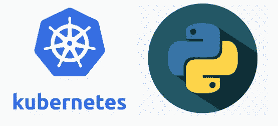

本文旨在概述 Kubernetes/ *K8s* 的基础知识，并学习如何在 Kubernetes 中部署一个简单的 python 服务。

## **什么是 Kubernetes / k8s？**

Kubernetes 或简称 k8s 是一个开源的容器编排系统，允许部署、扩展和管理容器化的应用程序。

## **关键术语**

*   ***Image-*** 它是一个不可变的文件，包含运行一个 app 的源代码、库、依赖项和工具。
*   ***容器***——它是一个图像的运行实例。
*   ***集群-*** 是运行容器化 app 的节点集合。
*   ***节点-*** 它是 Kubernetes 中计算硬件的最小单位。
*   ***Pod-*** 它们是 Kubernetes 中最小的可展开单位。每个 pod 可以由一个或多个容器组成。
*   ***服务-*** 它支持对 Kubernetes 中的一组 pod 进行网络访问。
*   ***部署***——用于创建或修改 pod 的实例，并向应用程序提供声明性更新。
*   [***Docker-***](https://medium.com/dev-genius/containerize-a-python-application-using-docker-f8cea56568dd)它是一套用于构建、共享容器映像和运行容器的工具。

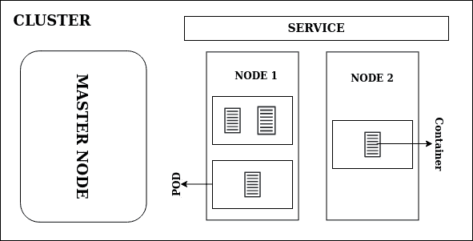

概观

## **Kubernetes 对象**

它们是库伯内特系统中的持久实体。你可以创建这些对象，然后 Kubernetes 确保你想要的状态得到维护。Pods、服务、卷、名称空间、作业、cronjobs、部署是 kubernetes 对象的几个例子。每个对象都有两个特定的属性

1.  ***状态-*** 对象的当前状态(创建、运行、终止、挂起等)
2.  ***spec-*** 包含关于对象的详细信息(标签、要显示的端口、要运行的容器图像等)

Kubernetes 对象是用一个 [YAML](https://medium.com/dev-genius/yaml-with-python-d6787a9bd8ab) 文件描述的。这个 [YAML](https://medium.com/dev-genius/yaml-with-python-d6787a9bd8ab) 文件由一组称为必填字段的字段组成。

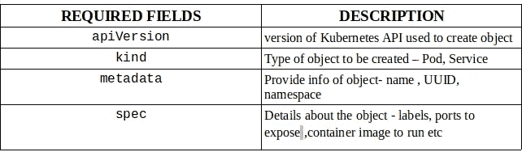

必填字段

pod 的示例描述

## 库贝特尔

它是一个命令行工具，用于对 Kubernetes 集群运行命令。kubectl 命令的一般语法是

```
kubectl <command><type><name><flag>
```

***命令*** -要执行的动作(删除、获取、应用、创建)

***类型*** - kubernetes 对象(pod、service、deployment)

***名称***——赋予 kubernetes 对象的名称

***标志*** -指定选项

最常用的 kubectl 命令是:

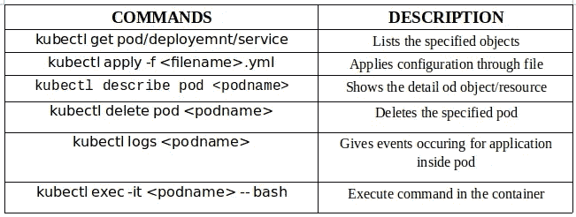

最常用的命令

# 入门指南

我们将创建一个简单的通知服务，其主要功能是发送电子邮件，然后将这个 python 服务部署到 kubernetes 中。

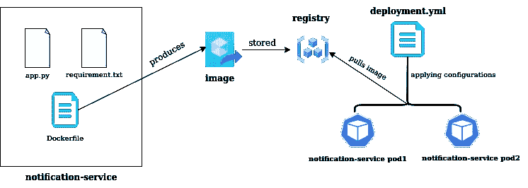

项目概述

## 1.装置

*   下载 [Docker](https://docs.docker.com/get-docker/) ， [kubernetes](https://kubernetes.io/releases/download/)
*   安装库[烧瓶](https://flask.palletsprojects.com/en/2.1.x/installation/)， [mailjet_rest](https://pypi.org/project/mailjet-rest/)

## 2.密码

*   app.py

app.py(通知服务)

*   requirements.txt

requirement.txt

*   Dockerfile 文件

Dockerfile 文件

*   部署. yml

部署. yml

## 3.部署

打开“终端”并导航到项目。

*   通过运行下面的命令从 Dockerfile 构建一个映像。

```
docker build -t notification-service .
```

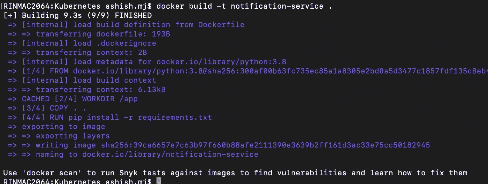

码头工人建造

*   要验证构建的映像，请使用以下命令。

```
docker images
```

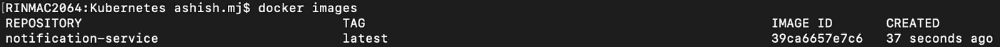

docker 图像

*   使用下面的命令创建部署对象。

```
kubectl apply -f deployment.yml
```

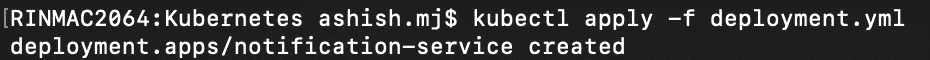

kubectl 应用

*   交叉检查已创建的部署和 pod 是否启动并运行。执行这两个命令。

```
kubectl get deployments
```

```
kubectl get pods
```

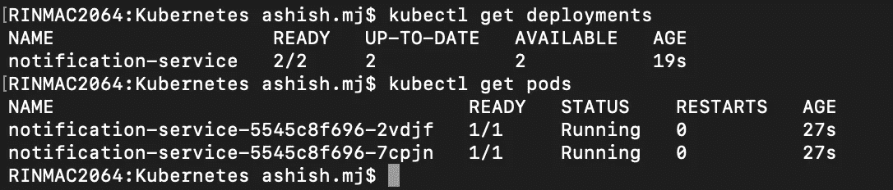

kubectl get

## 4.测试

*   要测试通知服务的功能，首先进入交互终端，然后点击 curl 命令。

```
kubectl exec -it notification-service-5545c8f696-2vdjf -- bash
```

```
curl -H 'Content-Type: application/json' -d  '{"name": "Ashish M J" ,"email": "your_mail@gmail.com"}' -X POST http://localhost:5000/sendEmail
```

***注意:替换第一个命令中的 pod 名称，并在第二个命令*** 中使用正确的 emailId

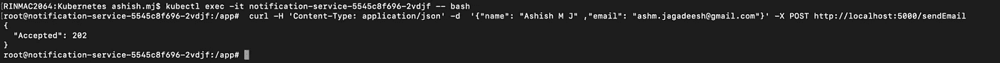

回应状态 202(已接受)

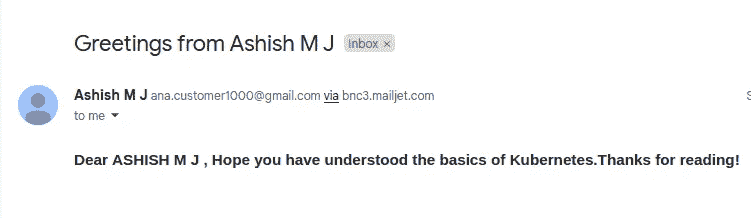

收到电子邮件

*   如果出现任何问题，可以通过执行以下命令来检查日志。

```
kubectl logs notification-service-5545c8f696-2vdjf
```

***注:替换吊舱名称***

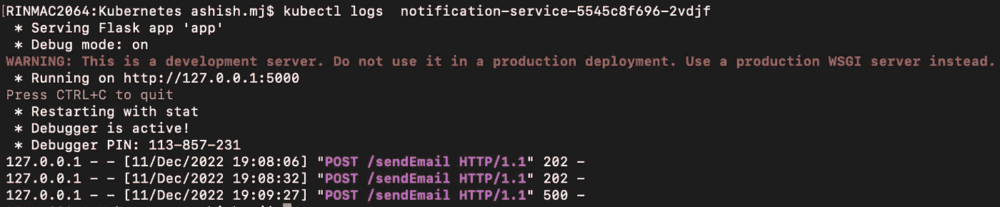

kubectl 日志

## 结论

在这个故事中，我们已经了解了 kubernetes 的基础知识，并学习了如何通过简单的步骤将 python 应用程序部署到 kubernetes 中。希望你已经了解了 kubernetes 的基本知识。

感谢阅读！

[Github](https://github.com/ashish-mj/Kubernetes)网站 Linkedin