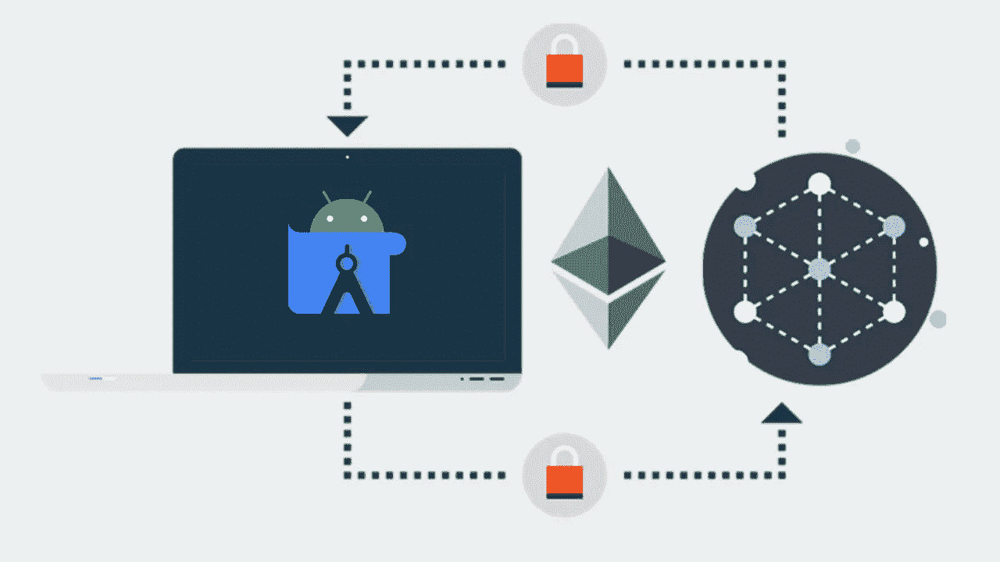
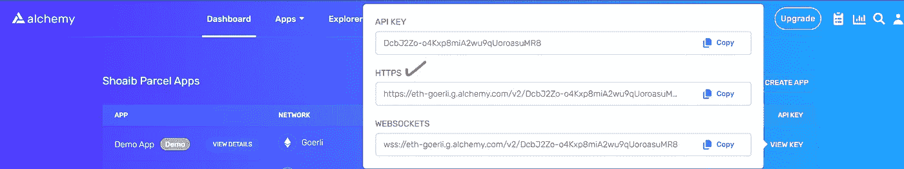
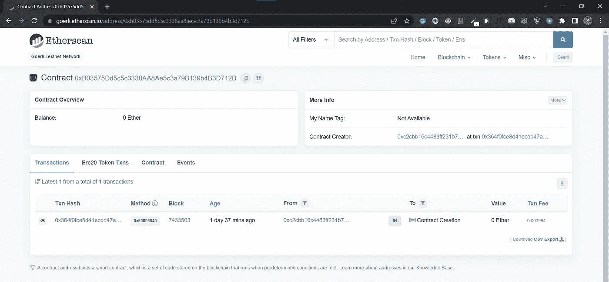

# 在 Android Studio 中使用 Web3j 在以太坊区块链上部署智能合约。

> 原文：<https://blog.devgenius.io/deploy-smart-contract-on-ethereum-blockchain-using-web3j-in-android-studio-7fd1bfe1bb82?source=collection_archive---------4----------------------->



图片作者[作者](https://medium.com/@shoaibkakal)

## 背景故事

上周，我在做一个项目，在这个项目中，我必须从一个安卓应用程序中创造 NFT。这个需求看起来很简单，但是它有很多复杂性。要打造 NFT，第一个要求是创建一个钱包并部署一个智能合约。经过一些谷歌搜索后，我发现使用 web3j 我们可以与以太坊互动，但 web3j 文档不亚于一场噩梦，大多数页面都有一个段落，底部有一些链接指向其他网站，其中一些网站关闭了。经过一周的努力，首先在 javascript 中部署了智能合约，我们仅使用 web3j 的两行函数`.deploy()`成功地部署了智能合约，但主要步骤仍然很棘手。🍕

> 事不宜迟，让我们一步一步地部署我们的第一个智能合同。

## 步骤 0(安装必要的库):

a)安装`solc`和`web3j`库。

安装 [solc](https://www.npmjs.com/package/solc) 运行

`npm install -g solc`

检查 solc 版本

`solcjs --version`

安装 web3j 下载。zip 从下面的链接，不要忘了广告到路径。[如何给路径环境变量添加一个目录。](https://stackoverflow.com/questions/9546324/adding-a-directory-to-the-path-environment-variable-in-windows)

```
[https://github.com/web3j/web3j/releases/tag/v4.1.1](https://github.com/web3j/web3j/releases/tag/v4.1.1)
```

检查 web3j 版本

`web3j --version`

b)现在在 alchemy.com 上创建一个帐户，登录后你会看到一个演示应用程序 HTTPS 的网址，很可能是歌利网络。如果您想使用任何其他链，您可以使用指定的链创建一个新的密钥。我们需要这个网址连接到一个测试区块链(林克比，格利，孟买等)。



图片来自[炼金术](https://www.alchemy.com/)

c)将 web3j 库添加到您的 android 项目

```
//web3j
implementation 'org.web3j:core:4.8.7-android'
```

很好，到目前为止，您已经安装了部署以太坊智能合约并与之交互所需的两个库。

## 步骤 1(生成 abi 和 bin 文件):

我们将使用下面的 HelloWorld.sol 文件作为智能合约。它有三种不言自明的方法。您可以在您的 android 项目中创建一个 HelloWorld.sol 文件，并粘贴以下代码。

```
// SPDX-License-Identifier: MIT
pragma solidity ^0.8.16;
contract HelloWorld {
    uint256 counter = 5;

    function add() public {  //increases counter by 1
        counter++;
    }

    function subtract() public { //decreases counter by 1
        counter--;
    }

    function getCounter() public view returns (uint256) {
        return counter;
    }

}
```

编译后，智能协定生成 abi 和 bin 文件。我们将使用我们之前安装的`solc`库来为我们的智能合约编译和生成 abi 和 bin 文件。

在命令提示符下运行以下命令

```
solc <contract>.sol --bin --abi --optimize -o <output-dir>/
```

我的命令看起来像这样

```
solcjs HelloWorld.sol --bin --abi --optimize -o C:\Users\Hp\AndroidStudioProjects\ShoaibSmartContract\app\src\main\java\com\example\shoaibsmartcontract
```

成功运行该命令后，您将在您提供的路径下看到 abi 和 bin 文件，在我的例子中是 its:(C:\ Users \ Hp \ AndroidStudioProjects \ ShoaibSmartContract \ app \ src \ main \ Java \ com \ example \ ShoaibSmartContract)

> 注意:现在，我们将使用 abi 和 bin 文件来创建一个 java 文件，以便我们可以与我的智能合同进行交互。

## **步骤 2(使用 ABI 和 BIN 文件生成 Java 代码):**

使用 web3j 库，我们可以将我们的 solidity 文件转换成 java，这样我们就可以调用我们在 solidity 文件中编写的方法。

```
web3j solidity -b /path/to/<smart-contract>.bin -a /path/to/<smart-contract>.abi -o /path/to/src/main/java -p com.your.organisation.name
```

我的命令看起来像这样

```
web3j solidity -b HelloWorld.bin -a HelloWorld.abi -p com.example.shoaibsmartcontract -o C:\Users\Hp\AndroidStudioProjects\ShoaibSmartContract\app\src\main\java\com\example\shoaibsmartcontract
```

成功运行该命令后，您将在输出目录路径中看到一个新的 Java 文件`HelloWorld.java`。

您也可以在这里找到上面生成的文件:

1.  [HelloWorld.sol](https://gist.github.com/ShoaibKakal/692a90a704c985a756f338867299bbb4)
2.  [HelloWorld.bin](https://gist.github.com/ShoaibKakal/3ac8a4ed449caf9cca5b2e706b9475c7)
3.  [HelloWorld.abi](https://gist.github.com/ShoaibKakal/952b6b8e14a46fd5f2c6c5330c1c511d)
4.  [HelloWorld.java](https://gist.github.com/ShoaibKakal/bbddd8030649f53a0f7c6f4ba6d4bc0b)

**步骤 3(智能合约部署):**

> 注意:我用的是我自己的私人和炼金术钥匙，你可以添加你自己的。

在 MainActivity 中，添加以下全局变量

```
// Your Wallet Private Key
private val PRIVATE_KEY = "41483ea50f9b2f73f7d8229cb5f0eee145f71edce74a9949cde6aa822f50b022"// Your Alchemy API Https url
private val [ALCHEMY_API](https://gist.github.com/ShoaibKakal/bbddd8030649f53a0f7c6f4ba6d4bc0b) ="https://eth-goerli.g.alchemy.com/v2/zXC-cavYVle3qt-JvQXtjKxqznhYWIWY"private lateinit var web3j: Web3j//CoroutineScope to do network related 
private val scope = *CoroutineScope*(Dispatchers.IO)
```

在声明和初始化一些重要的变量后，现在将下面的方法添加到 MainActivity.kt 中

返回凭证对象，当我们需要我们私有地址的凭证时，我们将使用它。

```
private fun getCredentialsFromPrivateKey(): Credentials {
    return Credentials.create(PRIVATE_KEY)
}
```

现在，关键时刻到了。让我们编写一个方法来部署我们的智能契约。

```
private fun deployContract() {

    web3j =
        Web3j.build(HttpService(ALCHEMY_API))

    val deployedContractAddress = HelloWorld.deploy(
        web3j,
        getCredentialsFromPrivateKey(),
        DefaultGasProvider()
    )
        .send()
        .*contractAddress* Log.d(*TAG*, "Contract address is deployed at Address: $deployedContractAddress ")
}
```

我的整个 MainActivity.kt 看起来是这样的

```
class MainActivity2 : AppCompatActivity() {
    private val PRIVATE_KEY = "41483ea50f9b2f73f7d8229cb5f0eee145f71edce74a9949cde6aa822f50b022"
    private val ALCHEMY_API ="https://eth-goerli.g.alchemy.com/v2/zXC-cavYVle3qt-JvQXtjKxqznhYWIWY"
    private lateinit var web3j: Web3j
    private val scope = *CoroutineScope*(Dispatchers.IO)

    override fun onCreate(savedInstanceState: Bundle?) {
        super.onCreate(savedInstanceState)
        setContentView(R.layout.*activity_main2*)

        scope.*launch* **{** deployContract()
        **}** }

    private fun deployContract() {

        web3j =
            Web3j.build(HttpService(ALCHEMY_API))

        val deployedContractAddress = HelloWorld_sol_HelloWorld.deploy(
            web3j,
            getCredentialsFromPrivateKey(),
            DefaultGasProvider()
        )
            .send()
            .*contractAddress* Log.d(*TAG*, "Contract address is deployed at Address: $deployedContractAddress ")
    }

    private fun getCredentialsFromPrivateKey(): Credentials {
        return Credentials.create(PRIVATE_KEY)
    }

}
```

运行应用程序后，您可以在日志中看到已部署的契约地址，在我的情况下，它是**` 0xb 03575 DD 5 C5 c 3338 aa 8 AE 5 C3 a 79 b 139 B4 B3 d 712 b `,**您还可以在您正在使用的测试网络链上检查您的契约地址详细信息，在我的情况下，它是 goerli，所以我可以在这里检查这个契约地址



我们在格利的部署合同。

恭喜你，你已经通过 Android 应用部署了你的第一个合同地址。

为了更深入地了解它，你可以查看 webj [文档](https://docs.web3j.io/4.8.7/)，同样，是的，这个文档不亚于一场噩梦。