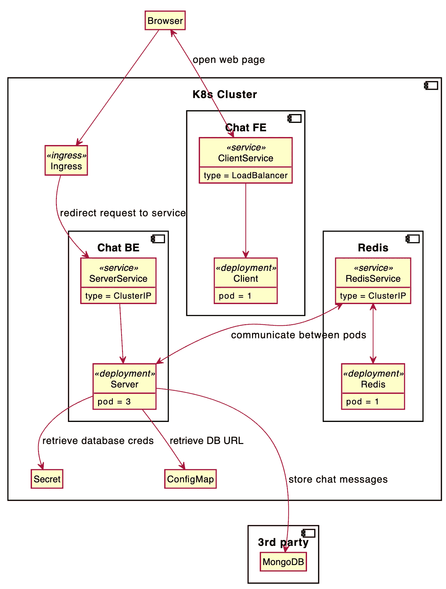

# 将 Socket.io 部署到 Kubernetes——第 0 部分:概述

> 原文：<https://blog.devgenius.io/deploy-socket-io-to-kubernetes-part-0-overview-f192428b48a4?source=collection_archive---------13----------------------->

## 插座。木卫一和库伯内特

## 如何在 Kubernetes 上轻松运行实时应用程序？

凯利·西克玛在 [Unsplash](https://unsplash.com?utm_source=medium&utm_medium=referral) 上的照片

要阅读其他部分:

*   [第一部分:聊天应用](/deploy-socket-io-to-kubernetes-part-1-chat-application-f0824fed648a)
*   [第二部分:基础设施](/deploy-socket-io-to-kubernetes-part-2-infrastructure-7764fec252d0)

我很难将 Socket.io 应用程序部署到 Kubernetes。好像 Kubernetes 不是为 Socket.io 和 Websocket 设计的。尽管 Socket.io 有潜力，但将其部署到 Kubernetes 并不像看起来那么简单。这也是为什么我想和大家分享我关于如何将 Socket.io 部署到 Kubernetes 的经验。

# 背景

在我 3 年的软件工程师生涯中(2 年全职，1 年实习)，我从未成功开发(甚至学习)[双向系统](https://stackoverflow.com/a/12366688)。我要么使用 [RPC](https://github.com/sofastack/sofa-rpc) 要么使用 HTTP，其中两个系统都是单向系统，这意味着只有客户端可以将更新“推”到服务器。我从双向系统中得到的最接近的东西是消息代理，其中有消息发布者(或生产者)和订阅者(或消费者)。这就是为什么我想学习双向系统(在这里是 Socket.io)，这样我至少知道如何构建“实时”应用程序。

至于为什么在 Kubernetes，还有另外一个故事。我目前正在学习 Kubernetes。我和 Kubernetes 的第一个项目是[在 Linode cloud](https://learnk8s.io/terraform-lke) 中部署 hello-world image(教程是由 [learnk8s.io](https://learnk8s.io/blog) 制作的，你也应该去看看)。我很高兴，但我想更进一步，在 Kubernetes 部署双向系统。这就是我开始这个副业的原因。

# 系统结构

由于双向系统对我来说是新的，我对如何设计架构没有一个大致的想法(至少在 Kubernetes 上)。所以，我花了相当多的时间来设计这个建筑。

我首先只暴露后端，不使用入口。我认为通过只暴露后端，我们可以避免复杂的设计。这被证明是一个坏主意，因为我们需要公开客户端(确保用户可以看到网络)和服务器(在客户端之间发送和交换消息)。

我的第二个迭代是通过使用 [Kubernetes 的服务](https://kubernetes.io/docs/concepts/services-networking/service/)来公开客户端和服务器。我的想法是，通过在 Kubernetes 中使用[负载平衡器服务](https://medium.com/google-cloud/kubernetes-nodeport-vs-loadbalancer-vs-ingress-when-should-i-use-what-922f010849e0)，我不需要设置入口(我不习惯这样)，从而避免创建新的 [Kubernetes 对象](https://kubernetes.io/docs/concepts/overview/working-with-objects/kubernetes-objects/)。为什么我尽量避免新的对象？因为新对象意味着额外的复杂性。但是，事实证明这并不奏效。

下面是成功在云端运行 Socket.io 的最终系统架构。至于详细的故事，这将在这个项目的第二部分进一步解释。

高级系统架构。

# 云提供商

对于这个项目，我使用谷歌云。为什么？实际上没有什么特别的原因，除了我有 300 美元的免费信用额度可以花。理论上，你可以使用任何你想要的云提供商。然而，这个项目中的 Terraform 配置文件适合 Google Cloud。

我希望在这篇文章中，你了解这个项目的概况。在接下来的两篇文章中，我将向您解释该应用程序是如何制作并部署到云中的。敬请期待！