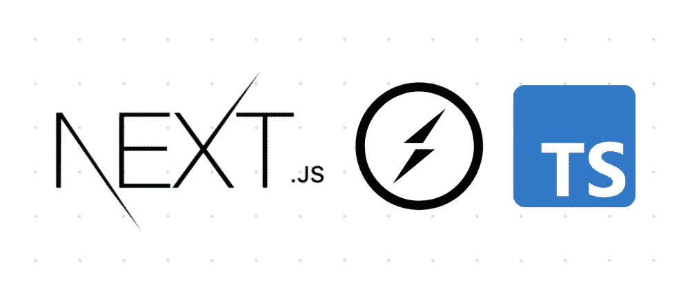
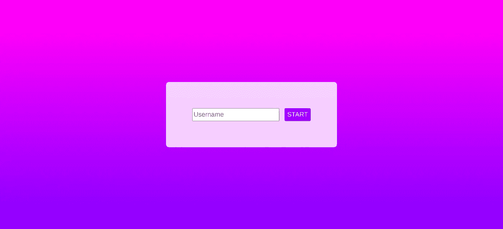
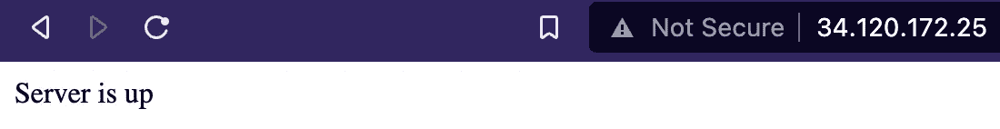
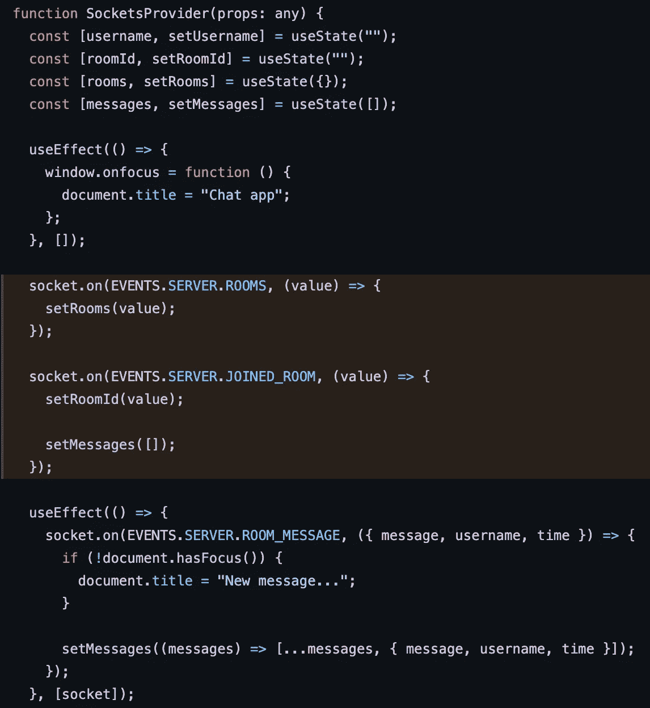

# 将 Socket.io 部署到 Kubernetes -第 1 部分:聊天应用程序

> 原文：<https://blog.devgenius.io/deploy-socket-io-to-kubernetes-part-1-chat-application-f0824fed648a?source=collection_archive---------3----------------------->

## 插座。木卫一和库伯内特

## 解释聊天应用程序的工作原理和对原始教程的改进。

要阅读其他部分:

*   [第 0 部分:概述](/deploy-socket-io-to-kubernetes-part-0-overview-f192428b48a4)
*   [第二部分:基础设施](/deploy-socket-io-to-kubernetes-part-2-infrastructure-7764fec252d0)

欢迎回到我在 Kubernetes 上部署 Socket.io 的旅程！在这一部分，我想解释一下这个聊天应用程序是如何工作的，以及这个应用程序的构建模块和我开发这个应用程序的经验。

# 聊天应用程序的工作原理

聊天 app 基本上有两个部分，客户端/前端和服务器/后端。客户端和服务器通过 Socket.io 连接，socket . io 构建在 Websocket 之上。在这一节中，我将描述客户机如何与服务器通信。

## 客户

这里的客户端/前端是指用户看到并与之交互的网站。这个项目中的客户端是用 Next.js 构建的，因为它是 React 的高级包装器。与 React 相比，它更容易与 CSS 库(如 Tailwind)集成。与我们必须放置自己布局的 React 相比，Next.js 一开始就有一个结构化的文件夹布局。但是，如果您认为 Next.js 太大或者根本没有必要，您可以使用 React。

现在，我不会详细介绍 React 和/或 Next.js，但是我想首先指出客户端的一些关键部分，这些部分使得开发聊天应用程序成为可能:

1.  钩子:这个钩子允许我们在内存中存储数据。不仅如此，存储在这个钩子中的数据成为组件的状态，这意味着它们影响组件的行为，从显示不同的数据到根据不同的状态进行后台处理。
2.  `useContext` hook:如果 useState 中的数据可以在组件内部使用，那么存储在 useContext hook 中的数据可以在整个应用程序中存储和使用。这对于聊天应用程序很有帮助，因为我们希望处理跨组件使用的数据，例如房间 ID 和我们当前的用户名。
3.  `useEffect`钩子:`useEffect`允许我们根据某些依赖关系做一些逻辑。这在某些情况下很有用，例如，每当客户端收到新消息时就重新呈现页面。此外，在这个聊天应用程序中，我使用`useEffect`为每个事件创建 Socket.io 监听器，这样我就不用为每个页面渲染创建监听器了(在最后一部分有更多关于这个 bug 的信息)。

至于我是怎么学会这个的，你可以看看，还有我从原教程中做的改进。

 [## socket io-chat-app/master iam dejan 上的客户端/socketio-chat-app

### 这是一个用 create-next-app 引导的 Next.js 项目。首先，运行开发服务器:打开…

github.com](https://github.com/iamdejan/socketio-chat-app/tree/master/client) 

聊天应用程序的客户端或前端。

## 计算机网络服务器

聊天服务器的健康检查端点。

服务器没有什么特别的，除了用来:

1.  接收消息；
2.  在数据库上存储消息；和
3.  将消息广播给同一房间的其他客户。

服务器使用 Socket.io 与客户端通信，确保来自一个客户端的每个更新都可以转发到其他客户端。

服务器是建立在 Express.js 之上的，因为 Socket.io 是为了配合 Express.js 使用而设计的，Socket.io 团队建议程序员在 Express.js 服务器上附加 Socket.io 库，这样当 Express.js 启动时，Socket.io 连接也会启动。

 [## socket io-chat-app/主 iamdejan 上的服务器/socketio-chat-app

### 使用 Next.js 和 Socket.io 制作的简单聊天应用程序。通过创建一个…

github.com](https://github.com/iamdejan/socketio-chat-app/tree/master/server) 

## 用于通信的 Socket.io

[Socket.io](https://socket.io/) 是一个双向网络通信库，构建在 Websocket 之上。它使用 Websocket 协议来发送和接收来自客户端和服务器的消息。在 Websocket 不可用的情况下，Socket.io 可以回退到 [HTTP 轮询](https://www.pubnub.com/blog/http-long-polling/)(虽然我个人禁用了这个，因为 HTTP 轮询是资源密集型的)。

Socket.io 有很多有用的特性，但是在创建聊天应用程序时非常有用的一个特性叫做[房间](https://socket.io/docs/v4/rooms/)。Socket.io 可以为您创建一个“房间”，然后您可以将您的消息广播仅限于该房间内的其他用户，就像真实世界的通信一样。用户可以加入和离开房间，就像真实世界一样。这是 Websocket 没有的功能(而且要自己实现)。

我使用 Socket.io 的原因是 Socket.io 被设计成 Websocket 的高级包装器。换句话说，Socket.io 的设计比 Websocket 更容易使用。另外，Socket.io 有一个[有用的备忘单](https://socket.io/docs/v4/emit-cheatsheet/)在开发过程中帮助程序员。

注意:Socket.io 不是一个专用的服务，而是一个依附于服务器和客户端的库。

## 雷迪斯

您可能认为我使用 Redis 进行缓存。然而，不，我不使用 Redis 进行缓存。相反，我使用 [Redis 发布/订阅](https://redis.io/topics/pubsub)进行 pod 间通信。我的计划是，当我将这个应用程序部署到 Kubernetes 时，我将创建不止 1 个 [pod](https://kubernetes.io/docs/concepts/workloads/pods/) (可能是 3 个)，仅仅是为了可伸缩性。但这意味着，每个 pod 都需要与其他 pod 通信，这就是为什么我们需要发布-订阅系统。

现在，在所有的发布-订阅系统中，为什么是 Redis？原因是 Redis Pub/Sub 是 Socket.io 支持的[。Socket.io 有一个名为“adapters”的特性，我们可以将几个发布-订阅系统连接到 Socket.io，这样每当我们创建一个 Socket.io 服务器集群时，这些服务器就可以进行通信和协调，以完成它们的任务。](https://socket.io/docs/v4/redis-adapter/)

## MongoDB

在这个应用程序中，我使用 MongoDB 持久化消息。对于那些不知道的人来说，MongoDB 是一个很受欢迎的 NoSQL 持久性数据库，尤其是在 JavaScript 和 TypeScript 开发人员中。它的灵活性让程序员爱不释手。至于我为什么用 MongoDB，你可以在下面的`Improvement #2: Persistent Messages`一节阅读。

# 我从哪里学的这个？

我从 TomDoesTech 制作的 YouTube 上的一个视频中了解到这一切。他在 Next.js 上讲解了如何使用 Socket.io，视频很长(1 小时左右)，但值得一看。然而，我可以从视频中做出一些改进。

## 改进#1:内存泄漏错误

 [## 主 TomDoesTech/real time-Chat-Application/socket . context . tsx

### 此文件包含双向 Unicode 文本，其解释或编译可能与下面显示的不同…

github.com](https://github.com/TomDoesTech/Realtime-Chat-Application/blob/main/client/context/socket.context.tsx#L38-L46) 

原始代码，其中 bug 用深橙色代码块标记。

如果你打开代码或者看到上面的截图，你会看到原来的代码并没有把`socket.on(...)`放在`useEffect`钩子里面。效果是 Socket.io 将注册(读取:创建)每个页面呈现的每个侦听器。我在测试中艰难地学会了这一点。我不知道为什么页面没有反应。我问过我的朋友，他们也不知道为什么。最终，我在的 dev.to 上找到了[这篇文章，解释了如何在 React 中使用 Socket.io。当阅读那篇文章时，我突然记起所有放在`useEffect`之外的东西都会在每一页渲染时被执行。](https://dev.to/bravemaster619/how-to-prevent-multiple-socket-connections-and-events-in-react-531d)

## 改进 2:持久消息

我对聊天应用程序做的第二个改进是将这些消息存储在数据库中。我选择 MongoDB 有两个原因:

1.  在 Kubernetes 中，使用数据库的最佳实践是使用 [StatefulSet](https://kubernetes.io/docs/concepts/workloads/controllers/statefulset/) 。然而，对于像我这样的 Kubernetes 初学者来说，管理 StatefulSet 可能是一件痛苦的事情。因此，我尝试将 MongoDB 管理外包给第三方。甚至 Bret Fisher 和 Nana Janashia(来自 Techworld with Nana)(两人都是知名的 Docker 船长)都建议，除非我们有专门的数据库管理员(来管理数据库)，否则最好将数据库管理外包出去。
2.  我有一个来自 MongoDB Atlas 的免费计划。虽然不多(只有 5 GB)，但对于学习来说，绰绰有余。

如果想坚持，不一定要用 MongoDB。您可以使用任何可用的持久数据库，无论是 MySQL、PostgreSQL 还是其他数据库。碰巧我有一个免费计划，我懒得为数据库和表的创建编写 SQL 脚本:-)

我希望上面的文章解释了应用程序部分，以及它们如何作为一个聊天应用程序一起工作。在下一部分中，我将讨论允许 Socket.io 部署到 Kubernetes 的基础设施和配置。敬请期待！