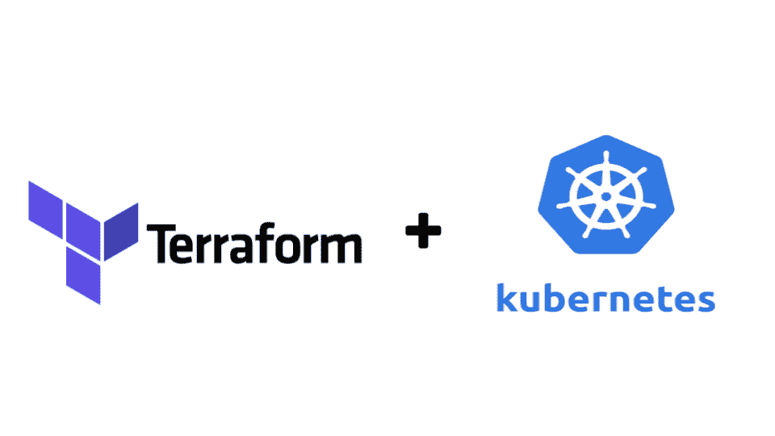
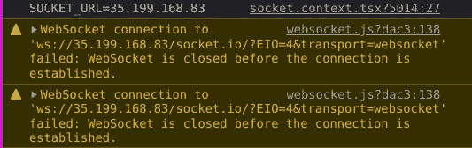

# 将 Socket.io 部署到 Kubernetes -第 2 部分:基础设施

> 原文：<https://blog.devgenius.io/deploy-socket-io-to-kubernetes-part-2-infrastructure-7764fec252d0?source=collection_archive---------3----------------------->

## 插座。木卫一和库伯内特

## 聊天应用程序如何在 Terraform 提供的 Kubernetes 集群上运行。

Terraform 和 Kubernetes 标志。

要阅读其他部分:

*   [第 0 部分:概述](/deploy-socket-io-to-kubernetes-part-0-overview-f192428b48a4)
*   [第一部分:聊天应用](/deploy-socket-io-to-kubernetes-part-1-chat-application-f0824fed648a)

欢迎回到我在 Kubernetes 上部署 Socket.io 的旅程！在这一部分(很遗憾，是最后一部分)，我想向您展示我是如何设法使用 Terraform 提供 Kubernetes 集群，然后将应用程序(以及配置和秘密)部署到集群的。

# 系统架构概述

高级系统架构。

提醒一下，这个聊天应用程序的高层架构是客户端和服务器在 Kubernetes 集群中公开。当浏览器打开网站时，浏览器将“下载”该网站，然后浏览器将尝试使用客户端配置(在环境变量中)给出的 URL 连接到服务器。然后在服务器中发生的事情是，server 会处理消息，存储到 MongoDB(由 MongoDB Atlas 托管)中，并将消息广播给其他用户。服务器(包含在 pod 中)将通过 Redis 相互通信。

# 谷歌云概念

在本节中，我将简要解释 Google 云平台中的一些概念，这些概念有助于理解聊天应用基础架构中的组件和用法。

## 区域和地带

物理服务器需要存放在某个地方，对吗？这也包括谷歌云拥有的服务器。这些服务器的物理位置在一个区域内。一个地区是一个特定的地理位置(Google 是这样定义的，但是我更愿意把这个地区想象成“一个城市”)，这里的区域是服务器实际所在地区的子集。

你可以从[谷歌云的文件](https://cloud.google.com/compute/docs/regions-zones)中了解地区和区域。在该文档中，您还可以找到谷歌目前拥有的地区和区域列表。

## 虚拟计算机

虚拟机是运行代码的虚拟计算机。通常也叫“实例”。一台物理服务器可以有许多实例，因为一台服务器的 CPU 中有如此多的处理核心。一个实例总是有一个区域，这就是为什么您必须确定要在哪里(区域)配置虚拟机的原因。

你可以在[谷歌云的文档](https://cloud.google.com/compute/docs/instances)中了解更多关于虚拟机实例的信息。

现在，对于 Kubernetes，虚拟机或实例在 Kubernetes 中被称为节点。而且，就像其他服务器一样，你必须为它分配一个 IP 地址。但是这部分将在下一节解释。

## 虚拟专用集群(VPC)

默认情况下，Google Cloud [项目](https://cloud.google.com/resource-manager/docs/creating-managing-projects)中的所有实例在互联网上都是隐藏的。原因是，默认情况下，你在谷歌云中创建的每个实例实际上都位于一个名为“虚拟专用集群”(VPC)的网络中。VPC 只允许你“暴露”一定数量的实例，这样你就不必暴露所有的实例。

虚拟专用集群的图示。来源:谷歌云。

VPC 与库伯内特公司和这个项目有什么关系？答案很简单。每次创建 Kubernetes 集群时，基本上都必须将该集群放入网络，无论是放入“默认”网络，还是创建新的 VPC。在我的项目中，由于我遵循 learnk8s.io 的指南[，我通过创建一个新的 VPC 并将 Kubernetes 集群中的所有节点封装到该 VPC 来遵循他们的方法。那样的话，只有一个入口，那就是通过 Kubernetes 的](https://learnk8s.io/terraform-gke)[控制平面](https://kubernetes.io/docs/concepts/overview/components/#control-plane-components)。

另一件要注意的事情是，由于 Kubernetes 实例正在创建和使用自己的 VPC，这意味着我们必须分配子网，以便任何放在新 VPC 中的实例都可以有自己的 IP 地址。

## 外部静态 IP 地址

在 Google Cloud 中，我们可以保留一个或多个 IP 地址，这些地址可以“转发”(链接)到我们拥有的任何服务器。至少有两种外部静态 IP 地址:

1.  区域:这个 IP 地址属于一个特定的区域。这种类型的 IP 地址通常与 Kubernetes 的负载平衡器一起使用，因为负载平衡器不能使用全局 IP 地址。注意，这并不意味着这个 IP 地址可以从某个地区访问。只是这个 IP 地址只允许附加在同一个区域的一个资源(例如实例)上。
2.  全局:此 IP 地址没有特定的区域。这种类型的 IP 地址通常由 Kubernetes 的入口使用，因为负载平衡器不能使用区域 IP 地址。

你可以在这里查看静态 IP 地址的文档。至于如何分配 IP 地址，可以看这里的。关于负载均衡器使用区域 IP 地址和入口使用全局 IP 地址的解释，你可以在这里阅读。

# 我的试错经验

找出这种配置并不容易。在得出最终配置之前，我必须尝试多种配置。有两个原因:

1.  我是 Kubernetes 的初学者。我不习惯公开带有服务的容器，因为 Docker Swarm 中没有这种东西。我不仅需要学习概念，还需要学习必要的配置。
2.  Socket.io 的 Kubernetes 教程或 blogposts 并不多，我不确定为什么，但我认为这是因为 Kubernetes 的主要用例(esp。Ingress，您将在接下来的几节中了解到)仅适用于 HTTP 调用。由于双向通信并不常见，配置双向通信的人要么在一个公司，要么依靠[掌舵图](https://helm.sh/)(我并不清楚)。

## 尝试#1:使用负载平衡器公开客户端和服务器

我的第一次尝试是用 LoadBalancer 公开客户机和服务器。这样做的原因是我想模仿 Docker Compose 的配置。简而言之:我尝试用 Docker Swarm 暴露客户端和服务器，它工作得非常完美。聊天应用程序的配置很简单，所以这就是为什么我认为简单地“模仿”配置就足够了。

客户端无法连接到服务器，因为 Websocket 连接已关闭。

我错了。从我打开网站的那一刻起，客户端就失去了与服务器的连接。我很困惑。“到底哪里出了问题？它与 Docker Swarm 合作。”我试着在网上找答案，但都没用。直到我找到一个使用入口来配置服务器的指南。

## 尝试 2:对客户端和服务器都使用入口

我发现了两篇关于用 Kubernetes 部署 Websocket 的帖子([一篇来自 Aymeric Augustin](https://websockets.readthedocs.io/en/latest/howto/kubernetes.html) 另一篇来自 Civo )。在两篇帖子中，他们通过 Ingress 公开了所有内容，这让我相信我的应用程序应该遵循与那两篇帖子相同的模式。

所以我两样都试了。现在我被困在是否要使用 GCP 入口或 Nginx 入口。我决定改用 Nginx 入口，因为我不知道如何配置 GCP 入口。接下来，我尝试配置 Ingress，这样对服务器的请求将发送到`/server`，对客户端的请求(主要是加载网页)将发送到`/client`。但是，结果是不成功。我甚至无法访问健康检查端点。这时，我意识到我的聊天应用不能使用后缀(`/client`和`/server`)，因为它被设计成不使用 URL 后缀。所以，现在我意识到我必须同时公开这两者，完全不用 URL 后缀。

## 尝试#3:改为通过 HAProxy 公开服务器

我的下一个尝试是尝试使用 HAProxy 来暴露服务器。如果你查看`docker`文件夹(在源代码上)，你可以看到 3 个 Docker 合成文件。你可以清楚地看到，我使用 HAProxy 到服务器。现在，HAProxy 最初的用途是用于负载平衡。但是，如果您在`haproxy`文件夹中看到`haproxy.cfg`文件，也有一个管理连接超时的设置。这就是为什么我认为我们应该使用 HAProxy。

直到失败。失败原因和第一次尝试一样，都是连接超时。似乎尽管 HAProxy 已经配置了超时，Google Cloud 仍然关闭了连接。这意味着我们不能使用 HAProxy 来“保持”连接打开。我们必须用别的东西。

## 尝试#4:分别公开客户端和服务器

第三次尝试失败后，我再次在谷歌上寻找答案。我在 asserted.io 上找到了[一篇文章，他们告诉我使用 BackendConfig(你稍后会学到这一点)。读完那篇文章后，我得出结论:](https://asserted.io/posts/kubernetes-cluster-nodejs-api-with-socket-io-and-ssl)

1.  我必须公开没有 URL 后缀的服务器和客户端；
2.  不会，通过 HAProxy 暴露服务器无济于事；
3.  我需要使用 Ingress，但是要有一个配置(BackendConfig)来防止连接死亡。

这些把我带到了最后的配置。

# 地形最终构型

对于 Terraform 的最终配置，大部分部分和我从 learnk8s.io 那里了解到的[差不多。但是，与原始教程有几个不同之处:](https://learnk8s.io/terraform-gke)

1.  我从 gcloud CLI 生成`kube-config`文件，而不是从`gke_auth`模块。原因主要是实际的，因为我希望能够从我的笔记本电脑上创建 Kubernetes 对象(或者至少进行一次试运行)。**注意**:不要对生产服务器这样做，因为这可能会带来安全风险。来自`gke_auth`的`kube-config`文件不能做预演，不同于你从`gcloud` CLI 生成的文件。但是从`gcloud`生成的`kube-config`文件对集群拥有完全的权限。
2.  我没有保留 1 个 IP 地址，而是保留了 2 个 IP 地址。原因是我想同时公开**服务(由客户端/前端使用)和入口(由服务器/后端使用)。**

 [## socket io-chat-app/main . TF at master iam dejan/socket io-chat-app

### 此时您不能执行该操作。您已使用另一个标签页或窗口登录。您已在另一个选项卡中注销，或者…

github.com](https://github.com/iamdejan/socketio-chat-app/blob/master/terraform-k8s/main.tf) 

上面的源代码是 Kubernetes 集群供应的主要逻辑。

 [## socket io-chat-app/output . TF at master iam dejan/socket io-chat-app

### 此文件包含双向 Unicode 文本，其解释或编译可能与下面显示的不同…

github.com](https://github.com/iamdejan/socketio-chat-app/blob/master/terraform-k8s/output.tf) 

以上源代码是生成`kube-config`文件的地形配置。

# Kubernetes 最终配置

在这一部分，我将讨论 Kubernetes 配置的不同部分(或者我应该说对象？)这使得在云中运行聊天应用成为可能。对于 Kubernetes 速成班(如果你不熟悉的话)，可以在这里学习[。](https://www.youtube.com/watch?v=s_o8dwzRlu4)

至于 Kubernetes 的设计，我从[这篇关于连接配置和 pod 反亲和性的文章](https://asserted.io/posts/kubernetes-cluster-nodejs-api-with-socket-io-and-ssl)中获得了灵感，你可以在接下来的几节中了解这两方面。

## 配置图

对于那些不熟悉 [ConfigMap](https://kubernetes.io/docs/concepts/configuration/configmap/) 的人来说，ConfigMap 允许你以键值模式存储配置。然后，您存储的任何配置都可以在部署中“注入”到 pods 中(稍后我将向您展示)。

对于这个项目，我使用 ConfigMap 来存储 Redis URL 和端口。如果你还记得上一篇文章，Redis 发布/订阅是用于 pod 内部通信的，所以所有的 pod 都需要能够访问 Redis。

 [## socket io-chat-app/chat app-config map . YAML at master iam dejan/socket io-chat-app

### 此文件包含双向 Unicode 文本，其解释或编译可能与下面显示的不同…

github.com](https://github.com/iamdejan/socketio-chat-app/blob/master/terraform-k8s/chatapp-configmap.yaml) 

注意，我把`redis-service`作为 Redis URL。为什么？因为即使在集群内部，一个 pod 也不能直接访问不同部署中的另一个 pod，所以我们必须访问公开 Redis 部署的服务。

## 秘密

Kubernetes Secret 是一种存储敏感数据的方式，比如数据库凭证。Kubernetes 自动将加密数据存储在集群中(使用 etcdv3)，因此与 ConfigMap 不同，它被安全地存储。

 [## socket io-chat-app/chat app-mongo-secret . YAML at master iam dejan/socket io-chat-app

### 此文件包含双向 Unicode 文本，其解释或编译可能与下面显示的不同…

github.com](https://github.com/iamdejan/socketio-chat-app/blob/master/terraform-k8s/chatapp-mongo-secret.yaml) 

注意:在这个项目中，秘密配置被推送到云存储库。在 read 生产系统中，机密应该安全地存储在本地笔记本电脑中，而不要将其放入云存储库中。

## Pod 和部署

把 pod 想象成一个 Docker 容器。那会让你的生活更轻松。至于部署，最好引用 Kubernetes[官方文档](https://kubernetes.io/docs/concepts/workloads/controllers/deployment/)中的这段话来描述:

> 一个*部署*为[容器](https://kubernetes.io/docs/concepts/workloads/pods/)和[复制集](https://kubernetes.io/docs/concepts/workloads/controllers/replicaset/)提供声明性更新。

在这个项目中，我使用 deployment 来创建基于我之前上传到 Docker Hub 的客户机和服务器映像的 pod。这些图像将由 Kubernetes 提取，然后这些吊舱将从这些图像启动。

 [## socket io-chat-app/chat app-client . YAML at master iam dejan/socket io-chat-app

### 此文件包含双向 Unicode 文本，其解释或编译可能与下面显示的不同…

github.com](https://github.com/iamdejan/socketio-chat-app/blob/master/terraform-k8s/chatapp-client.yaml)  [## socket io-chat-app/chat app-server . YAML at master iam dejan/socket io-chat-app

### 此文件包含双向 Unicode 文本，其解释或编译可能与下面显示的不同…

github.com](https://github.com/iamdejan/socketio-chat-app/blob/master/terraform-k8s/chatapp-server.yaml) 

反关联性配置基本上防止您的 pod 聚集在一个/几个节点中。它确保每个节点都有一个服务器单元。原因是为了防止节点之间的负载不平衡。这个聊天应用中的 Pod 反亲和，灵感来源于[这个帖子](https://asserted.io/posts/kubernetes-cluster-nodejs-api-with-socket-io-and-ssl)。

## 服务

服务是公开部署的 Kubernetes 对象。正如我前面说过的，默认部署不能被其他部署或 pod 访问，所以我们需要创建一个对象来公开一个部署。而这个对象就是服务。

有许多种服务。为了在内部公开部署，我总是使用`ClusterIP`。为了向互联网公开服务，我总是使用`LoadBalancer`。你可以在这里了解更多关于各种服务的信息。

至于源代码(包括服务器和客户端)，您可以在部署部分查看源代码。我将部署和服务的配置合并到一个文件中，因为它们密切相关。

## 进入

ingress 是一个 Kubernetes 对象，它处理外部请求，主要是来自 HTTP 的请求(尽管我们仍然可以使用带有 Ingress 的 Websocket)。Ingress 可以做很多事情，从简单的 URL 路由到连接管理。

在这个项目中，我使用 Ingress 来“暴露”服务器。我使用 Ingress 的原因是因为我可以管理连接。对于连接管理，配置存储在 BackendConfig 中，您可以在下一节中了解到。

想了解更多关于 Ingress 的内容，可以阅读 Kubernetes 的[官方文档](https://kubernetes.io/docs/concepts/services-networking/ingress/)。

 [## socket io-chat-app/chat app-ingress . YAML at master iam dejan/socket io-chat-app

### 此时您不能执行该操作。您已使用另一个标签页或窗口登录。您已在另一个选项卡中注销，或者…

github.com](https://github.com/iamdejan/socketio-chat-app/blob/master/terraform-k8s/chatapp-ingress.yaml) 

## BackendConfig

BackendConfig 是一个 Kubernetes 对象，您可以在其中配置入口。有一些有用的配置，如连接消耗、超时和 CDN。

在这个项目中，我使用 BackendConfig 来管理会话关联、连接超时和连接耗尽超时。原因是我需要配置超时，这对 Websocket 很重要。Websocket 是一个面向连接的协议，所以我需要确保在用户真正完成之前连接不会被切断。

你可以在这里了解更多关于 BackendConfig [的信息。](https://cloud.google.com/kubernetes-engine/docs/how-to/ingress-features#configuring_ingress_features_through_backendconfig_parameters)

 [## socket io-chat-app/chat app-be-config . YAML at master iam dejan/socket io-chat-app

### 此时您不能执行该操作。您已使用另一个标签页或窗口登录。您已在另一个选项卡中注销，或者…

github.com](https://github.com/iamdejan/socketio-chat-app/blob/master/terraform-k8s/chatapp-be-config.yaml) 

这篇文章总结了我将 Socket.io 部署到 Kubernetes 集群的旅程。我希望你喜欢他们所有人！别忘了关注我的其他故事。