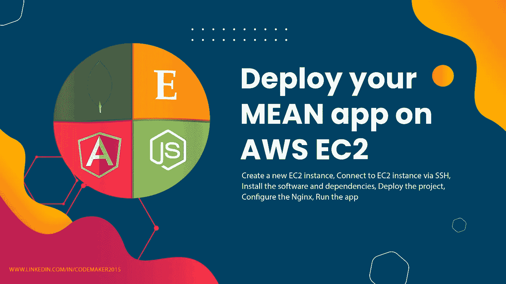
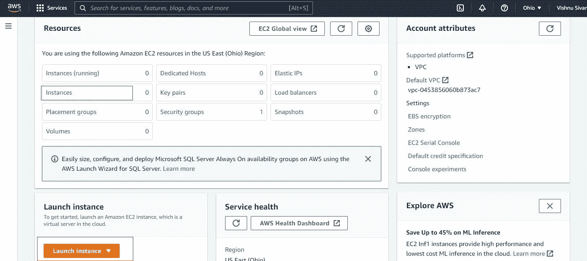

# 在 AWS EC2 上部署您的应用程序

> 原文：<https://blog.devgenius.io/deploy-your-mean-app-on-aws-ec2-a24fe3c2073f?source=collection_archive---------3----------------------->



由于 MEAN stack 开发在构建快速、可维护和健壮的 web 应用程序方面的多功能性，对它的需求已经增加。它提供了支持热重新加载的单页应用程序，因此无需刷新页面即可查看应用程序中所做的更改。

MEAN 是 MongoDB(数据库)、ExpressJS(后端框架)、AngularJS(前端框架)和 NodeJS(后端运行时)的缩写。它是一个用于构建动态 web 应用程序的开源 JavaScript 框架。

EC2 是 AWS 技术堆栈的核心计算组件，它在云中提供安全且可调整大小的计算能力。它简化了扩展 AWS 实例以及其他服务集成的过程，并遵循一个按需付费的计划，在该计划中，您只需根据使用量付费。

# 入门指南

在本教程中，我们将学习如何在 AWS EC2 上设置 web 服务器。接下来，我们将在单个实例上部署和配置应用程序的前端和后端。

## 目录

*   [创建一个新的 EC2 实例](#cb1e)
*   [通过 SSH 连接到 EC2 实例](#4e8f)
*   [安装软件和依赖项](#488e)
*   [部署项目](#2228)
*   [配置 Nginx](#bcb4)
*   [运行应用程序](#9030)

## 步骤 1:创建一个新的 EC2 实例

*   登录 [AWS 管理控制台](https://aws.amazon.com/console/)。如果您还没有帐户，请单击“创建免费帐户”按钮。
*   在搜索栏上键入 EC2，导航到 EC2 部分。


*   点击**启动实例**按钮或**实例**文本进行实例创建。



*   请提供有效的实例名称。


*   选择 Ubuntu Server 18.04 LTS (HVM)，SSD 卷类型作为亚马逊机器映像(AMI)。


*   选择 t2.micro 实例类型。


*   创建一个密钥对，密钥名为 aws-key，密钥对类型为 RSA，私钥文件格式为. pem。


*   在网络设置中，选择允许来自任何地方的 SSH 流量和允许来自互联网的 HTTP 流量。


*   单击启动实例按钮。


*   成功创建实例后，您将收到一条成功消息。单击查看所有实例或实例 id 以查看实例信息。


*   单击实例 id 可查看有关该实例的更多信息。


## 步骤 2:通过 SSH 连接到 EC2 实例

*   单击“连接”按钮查看连接到实例的各种选项。


*   复制 SSH 命令，在 pem 文件所在的文件夹中打开一个终端，并执行复制的命令来连接到实例。


*   如果您遇到一些错误，如**对“key-file-name.pem”的权限过于开放，**请按照下面给出的 link StackOverflow 解决方案更改文件权限。

[](https://stackoverflow.com/a/63990596/7103882) [## "未受保护的私钥文件！"在 Amazon EC2 实例(AWS)中使用 SSH 时出错

### 对某些人来说，这可能是一个愚蠢的简单问题:)我在 Amazon EC2 上创建了一个新的 linux 实例，作为…

stackoverflow.com](https://stackoverflow.com/a/63990596/7103882) 

## 步骤 3:安装软件和依赖项

需要在实例上安装 nodejs、angular cli、pm2、mongodb、nginx 来部署 MEAN app。

要安装软件和依赖项，请执行以下自定义脚本。该命令将使用户能够安装依赖项，而无需在安装上花费太多时间。

```
curl [https://gist.githubusercontent.com/codemaker2015/341b7c964c34e95fd3ac4c8c3c0e7caf/raw/5fbd631d72a41f9c2dbe7ae02019183bbff8e51e/setup-nodejs-mongodb-production-server-on-ubuntu-1804.sh](https://gist.githubusercontent.com/codemaker2015/341b7c964c34e95fd3ac4c8c3c0e7caf/raw/5fbd631d72a41f9c2dbe7ae02019183bbff8e51e/setup-nodejs-mongodb-production-server-on-ubuntu-1804.sh) | sudo bash
```


## 步骤 4:部署项目

如果您有兴趣从头开始在 VM 实例上创建一个 MEAN 项目，那么您可以这样做。为了降低教程的复杂性，我们将克隆下面的 GitHub 库，其中包含一个平均应用后端和前端代码。

```
git clone [https://github.com/codemaker2015/mean-stack-crud-app.git](https://github.com/codemaker2015/mean-stack-crud-app.git)
```


*   切换到`mean-stack-curd-app/frontend`目录，使用 npm 安装软件包。

```
cd mean-stack-curd-app/frontend
npm install
```


*   使用 npm 构建前端。成功构建后，您将能够看到一个`dist`文件夹和里面的`mean-stack-curd-app`。

> 确保`baseUri`设置为`“/api”`


```
npm run build --prod
```


*   现在，切换到后端文件夹并安装依赖项

```
cd ..
cd backend
npm install
```


> 确保后端路径根设置为`“/”`作为`server.js`文件中的入口点


*   使用 PM2 启动后端服务器

```
sudo pm2 start server.js
```


## 步骤 5:配置 Nginx

意味着堆栈项目通常包含后端和前端部分。但是，我们需要通过 HTTP 80 端口映射它们。大多数 API 请求将通过前端连接，但是以`/api/*`开头的 API 将被代理到在端口 4000 上运行的 Node.js API。

按照步骤配置 Nginx。

*   使用 nano 打开默认 Nginx 文件

```
sudo nano /etc/nginx/sites-available/default
```

*   按如下方式更改条目，

```
server {
 listen 80 default_server;
 listen [::]:80 default_server; server_name _; location / {
  root /home/ubuntu/mean-stack-crud-app/frontend/dist/mean-stack-crud-app;
  try_files $uri $uri/ /index.html;
 } location /api/ {
  proxy_pass [http://localhost:4000/](http://localhost:4000/);
 }}
```

*   重启 Nginx 来看看变化

```
sudo systemctl restart nginx
```


*   部署过程完成。

## 第六步:运行应用程序

在浏览器上打开公共 IPV4 地址。如果您在没有 SSL 证书的情况下运行应用程序，请确保您已提供 HTTP 作为协议。


## 步骤 7:终止或停止实例(可选)

如果您长时间使用该实例，如果您长时间使用它，您可能会收到 AWS 团队的过度使用账单。因此，如果不使用实例，建议终止或停止它。


感谢阅读这篇文章。

感谢 [Gowri M Bhatt](https://www.linkedin.com/in/gowri-m-bhatt-85b31814b/) 审阅内容。

这篇文章也可以在 Dev 上找到。

本教程的完整源代码可以在这里找到，

[](https://github.com/codemaker2015/mean-stack-crud-app) [## GitHub-codemaker 2015/mean-stack-crud-app

### 此项目是使用 Angular CLI 版本 14.0.4 生成的。为开发服务器运行 ng serve。导航到…

github.com](https://github.com/codemaker2015/mean-stack-crud-app)