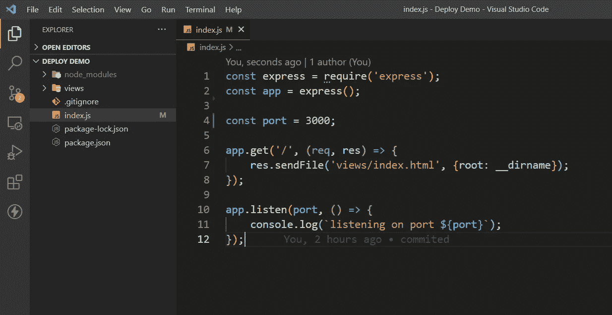
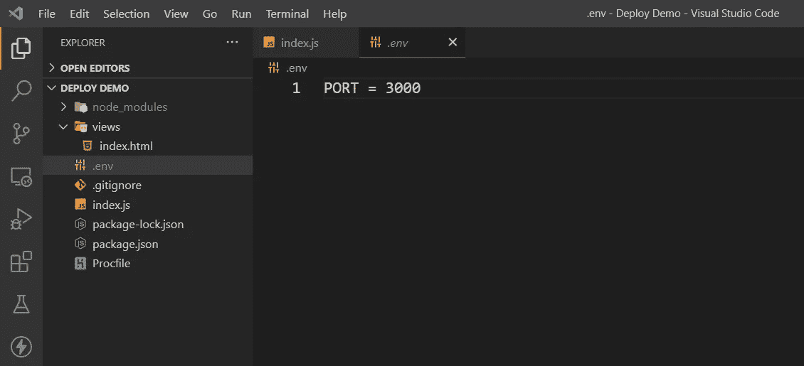
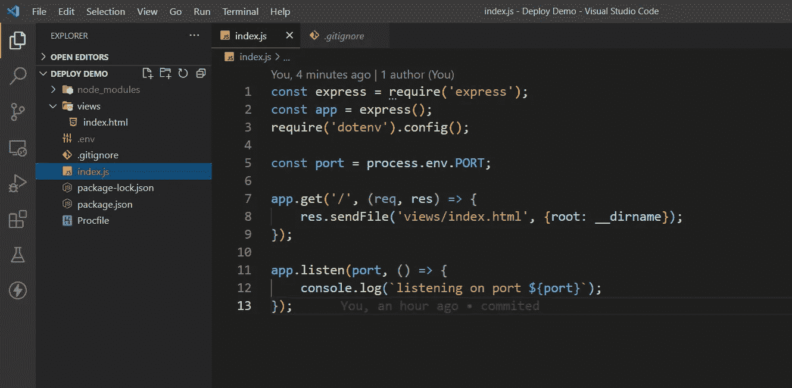
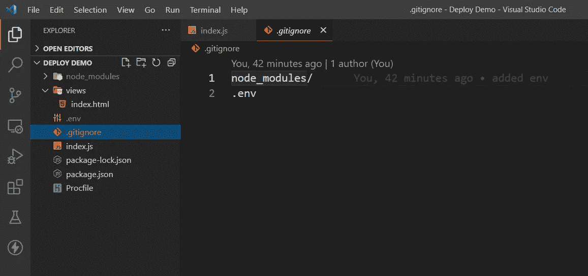
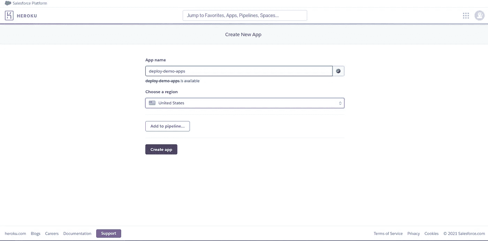
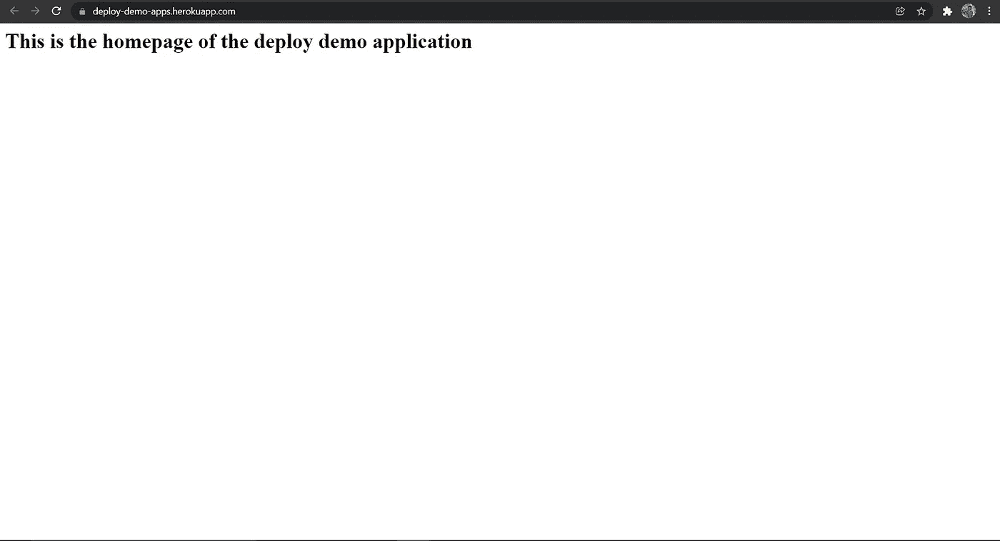

# 使用 GitHub 在 Heroku 上部署 Node.js 应用程序

> 原文：<https://blog.devgenius.io/deploy-your-node-js-app-on-heroku-using-github-f7487d002e15?source=collection_archive---------2----------------------->


在本教程中，我们将免费介绍在 Heroku 上部署 Node.js 应用程序的过程。部署应用程序可能是一项单调乏味的任务，但如果我们正确地遵循这些步骤，那么这是一件轻而易举的事情。

当我部署我的第一个应用程序时，我不得不浏览许多文章以了解完整的步骤，为了节省您的时间，我在这里列出了部署您的应用程序的逐步步骤。

> 要开始，你需要一个很容易创建的 heroku 帐户

这里我采用了一个简单的演示项目来演示部署。



这就是我们的 Node.js 项目的样子，它只包含一个 index.html 文件，这个文件将在网站的主页上呈现。

# 1.初始化项目中的 git 存储库

要初始化 git 存储库，请在项目目录中打开一个终端并运行以下命令。

或者，如果您的项目已经有 git repo，那么您可以跳过这一部分:)

```
git init
```

# 2.使用环境变量配置您的应用程序

环境变量允许我们配置应用程序，而无需重新构建。它将应用程序的特定于环境的方面具体化了。

环境变量有助于配置参数，例如

1.  运行应用程序的端口。
2.  如果你的项目使用一个 API 或者任何其他包含敏感信息的东西。

首先，您需要安装“dotenv”包，这可以在您的终端上完成

```
npm install dotenv
```

您需要将添加到 index.js 文件中

```
require('dotenv).config();
```

现在，在您的项目目录中创建一个. env 文件，并添加您想要在外部配置的参数。



同样，您可以添加其他参数。

要在您的应用程序中使用这些变量，您可以使用

> 索引文件中的“process.env. <name_of _your_variable="">”。</name_of>



在上面的例子中，我已经使用上面提到的语法添加了端口。

> 重要！
> 
> 别忘了加上你的。环境文件到。gitignore，因为如果你不这样做，当你把你的项目推给 GitHub 时，你的 API 密匙和敏感数据就会暴露。还要将 node_modules 文件夹添加到. gitignore。

完成上述步骤后，您的。gitignore 文件至少应该有。env 和 node_modules。



# 3.创建 Procfile

Procfile 是一个指定**应用程序启动时执行的命令的文件。**

在项目目录中创建一个名为 Procfile 的文件，并向其中添加以下命令。

```
web: node index.js
```

在对项目进行更改后，现在是提交您的更改的好时机，要将您的回购推送到 GitHub，您可以遵循[这篇](https://docs.github.com/en/github/importing-your-projects-to-github/importing-source-code-to-github/adding-an-existing-project-to-github-using-the-command-line)文章。

# 4.下载 Heroku CLI 并登录

[](https://devcenter.heroku.com/articles/heroku-cli) [## Heroku CLI

### Heroku 命令行界面(CLI)使得直接从终端创建和管理您的 Heroku 应用程序变得非常容易…

devcenter.heroku.com](https://devcenter.heroku.com/articles/heroku-cli) 

从以上链接下载并安装 CLI。

通过运行命令登录到 CLI，它会将您带到 Heroku 登录页面，您可以在那里填写您的凭据。

```
heroku login
```

# 5.在 Heroku 上创建新的应用程序


创建一个新的应用程序，它会提示您输入应用程序的名称。



如果您的应用程序使用 API 密钥，并且您已经在。env 文件然后:

1.  转到设置
2.  在 config vars 部分，在键值输入中添加 API 密钥或您的秘密密钥。

> 注意:key，values 中的输入应该与您在中给定的变量名相匹配。环境文件

# 6.用 Heroku 连接您的 GitHub 存储库并部署您的应用程序

嗯，那是相当多的工作；)

现在，在应用程序仪表板的 deploy 部分，选择部署方法 GitHub。


输入要部署的存储库名称，然后进行连接。

在您的存储库连接后，只需向下滚动并部署您的应用程序，经过一两分钟的处理后，它会要求您访问已部署的应用程序。

在我们的情况下，这是它看起来 xD。



恭喜您已经成功部署了 Node.js 应用程序，现在您可以在世人面前展示您的项目了:)

如果你喜欢这个教程，请点击👏按钮，并随时留下评论。欢迎反馈。

您可以通过 [Twitter](https://twitter.com/Kunal_rts) 、 [GitHub](https://github.com/Kunal4now) 、 [LinkedIn](https://www.linkedin.com/in/kunal-rohitas-a96205a9) 与我联系，我很乐意回答您的任何问题！

*更多内容尽在*[*blog . devgenius . io*](http://blog.devgenius.io)*。*