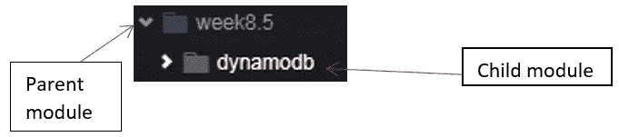
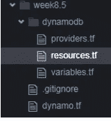
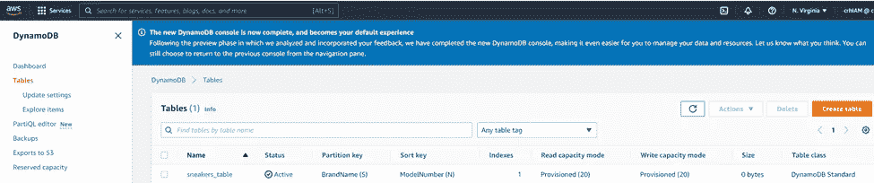
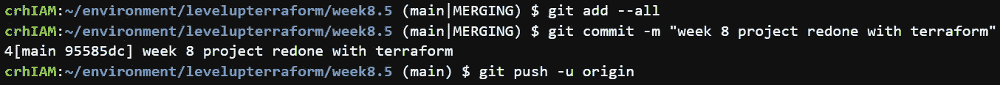
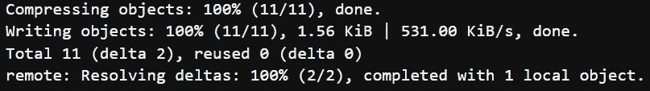

# 使用 Terraform 模块部署 DynamoDB 表

> 原文：<https://blog.devgenius.io/deploying-a-dynamodb-table-using-terraform-modules-ae5621312f10?source=collection_archive---------2----------------------->

***简介***

当我继续探索 Terraform 作为一种工具时，导师给我和我的同伴的一个想法是重新审视以前的项目，并使用 Terraform 完成它们。它可以作为一种手段，让我们更加熟悉和舒适地使用它。给我解开这个谜？您更愿意通过控制台部署一个或多个资源，还是使用 Terraform 来自动化整个过程？我认为最好是后者。在需要多个资源之前，使用管理控制台启动一个资源是一件非常有趣的事情。或者需要重复使用和部署相同的资源。本教程是一个已经熟悉的项目的不同旋转。这是一个初学者友好而广泛的使用 Terraform 模块部署 DynamoDB 表的演练。

**先决条件:**

1.您选择的 IDE。

2.AWS 账户。

3.已经安装并配置了 Terraform。

4.GitHub 账户。

***目录创建***

通常情况下，这个过程的第一步是创建一个目录来存放我们所有必需的文件。请随意参考我以前的 terraform 文章，了解如何去做。为了一切正常工作，应该有一个父模块，也就是你的根目录。并且父模块应该包含子模块。

您的父模块应该包含—您的子模块、您的。gitignore 和您的 dynamo.tf 文件。

而子模块应该包含 providers.tf、resources.tf 和 variables.tf 文件。

请参考上面的图片作为您的目录结构的指南。

***源代码***

我们的文件所需的源代码可以通过点击以下链接找到:

[https://registry . terra form . io/providers/hashi corp/AWS/latest/docs/resources/dynamo db _ table _ item](https://registry.terraform.io/providers/hashicorp/aws/latest/docs/resources/dynamodb_table_item)。

源代码将在接下来的几个步骤中派上用场。

***迪纳摩. tf***

这个 dynamo.tf 文件位于我们的父模块或主目录中，它由调用子资源的资源组成，以便部署我们的基础设施。下面是我的 dynamo.tf 文件。

***Providers.tf***

根据 Terraform.io 提供者是允许 Terraform 与服务、云提供者和其他 API 交互的插件。简单地说，可以把它看作是 Terraform 和其他服务之间的桥梁。注意，为了自动化起见，我们的区域是作为变量输入的。万一需要重用这段代码，硬编码就少了一件事。单击下面的链接可以找到 providers.tf 的源代码:

[https://registry . terraform . io/providers/hashi corp/AWS/latest/docs](https://registry.terraform.io/providers/hashicorp/aws/latest/docs)

下面是我的 providers.tf 文件

**resources . TF**

从本教程源代码部分提供的链接中复制源代码，将其粘贴到 resources.tf 文件中，并进行必要的更改。下面是我更新的 resources.tf 文件。

***Variables.tf***

到目前为止，您应该已经注意到在我们的配置文件中频繁使用“var”这个词。这是因为我们将某些值作为变量赋值或传递。

***命令***

创建完所有文件后，请从终端运行以下命令。

Terraform init —初始化包含 Terraform 代码的工作目录。

Terraform validate —加倍检查配置文件的语法，以避免可能的语法错误。

Terraform apply —用于将计划中指定的所有更改应用到 motion 中。

***控制台*** 中的双重检查

现在让我们转向管理控制台，以确保我们所有的资源都已成功创建。瞧啊。！！！

***消灭***

一旦您确认成功创建了资源，为了避免不必要的费用，请确保销毁所有资源。这可以通过在终端中输入 Terraform destroy 命令来实现。

通常作为一个提醒，养成把你的代码推向回购的习惯。

这可以通过输入以下命令来完成:

git 提交。

git commit -m

git 推。

瞧啊。！！

如果您已经做到了这一步，并且遵循了上面的步骤，那么您已经成功地并且应该知道如何利用 terraform 模块来部署可重用的资源，比如 DynamoDB 表。

也可以随时在 linkedin 上关注我(点击[链接](https://www.linkedin.com/in/claude-r-hector-mba/))，因为我希望与志同道合的人联系

谢谢你的时间，下次再见。

你友好的邻居云开发工程师。