# 在 Azure 应用服务中部署 Java Web 应用

> 原文：<https://blog.devgenius.io/deploying-a-java-web-app-in-azure-app-services-9bc346805d5c?source=collection_archive---------9----------------------->

在本文中，我们将使用 springboot 框架从头开始编写一个非常简单的 java web app，构建 war 包并将其部署到 Azure Web App 服务。

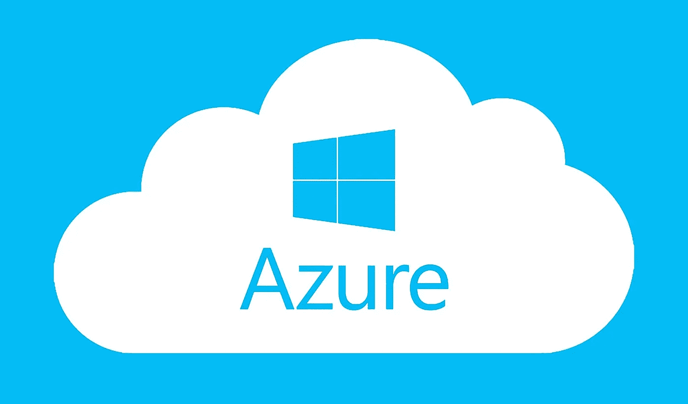

# 先决条件

*   Azure 订阅

即使你不懂 java 或者 springboot，也没关系。我们将编写一个非常简单的应用程序，并将其部署到 Azure。

如果你擅长 springboot，并且知道创建 war 包的步骤，那么你可以跳到本文中的部分— **将包部署到 Azure App Services** 。

# 弹簧初始化器

Springboot 是最流行的框架，广泛用于 java 应用程序。要在 springboot 中启动一个项目，最简单的方法是使用 Spring Initializer。

 [## 弹簧初始化 r

### Initializr 生成的 spring boot 项目正好是你快速启动所需要的！

start.spring.io](https://start.spring.io/) 

我在这里创建一个 java web 应用程序。这很简单。

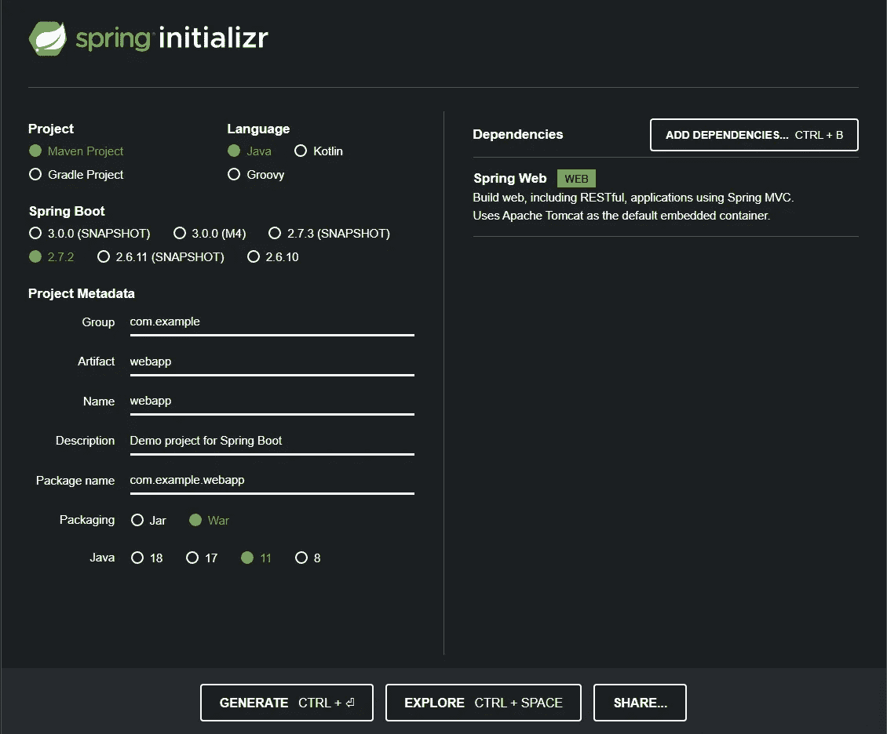

按照上面的图像，使用相同的配置。由于我们正在创建一个 web 应用程序，我们将添加 **Spring Web** 依赖项。还有，我们正在使用**战争**包装。我使用一个 war 打包系统，因为它基本上用于部署在 Tomcat 服务器上。我的系统里有 java 11。你想要什么都可以。配置好一切后，点击**生成**按钮。

# 创建基本的 java web 应用程序

java 开发人员最流行的 IDE 是 IntelliJ，所以我将使用它。强烈建议大家也用一样的。我使用的是免费的社区版。

现在，提取下载的文件并用 Intellij 打开它。

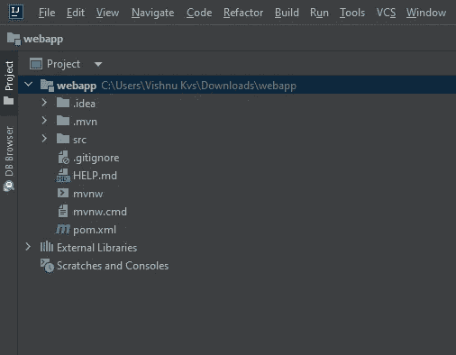

转到 **pom.xml** 文件。与我们项目相关的所有配置都在这里。您可以在这里看到我们的项目使用的 spring boot 版本、java 版本、依赖项等。现在转到 build 标签并添加 below 标签。<版本>$ { project . parent . version }</版本>

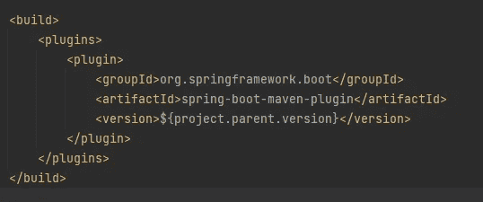

我们只是指定构建版本，有时如果不存在可能会导致错误。如果您对 pom.xml 文件做了任何更改，您需要重新加载它。只需点击右上角弹出的 ***m 符号*** 即可轻松完成。

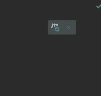

我们的主应用程序驻留在文件路径中:src > main > Java > com . example . web app > web app application

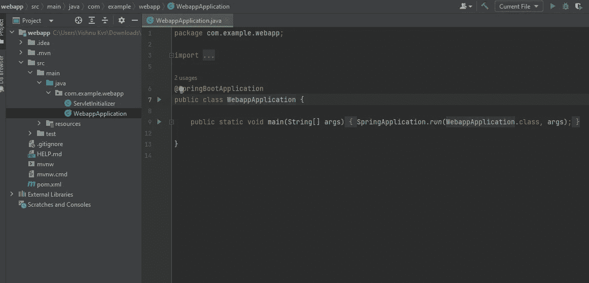

现在，我们将在这里添加代码来显示一些文本。

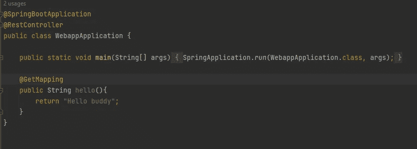

现在我们将构建并运行应用程序。如果它是一个 jar 应用程序，你可以直接在 intellij 中运行它，但是在 war 中就不行了。因此，我们构建包，然后运行它。

在 ide 的右边，我们有 maven 插件。

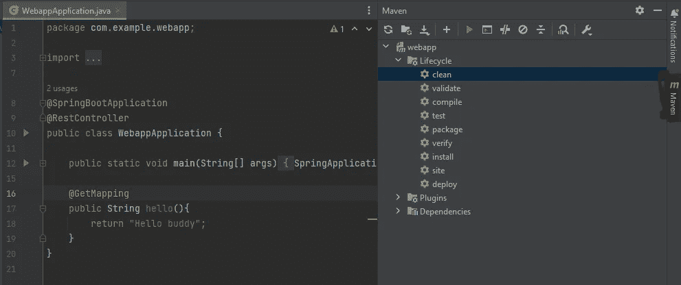

我们的项目是一个 maven 项目。一个 maven 项目有不同的生命周期。现在创建一个包，我们运行 **mvn install** 。这里我们可以使用插件，双击**生命周期**中的**安装**。

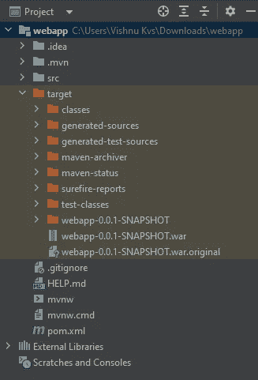

成功完成后，一个新的文件夹 **target** 被生成，其中包含我们的 war 包。这里是**web app-0 . 0 . 1-snapshot . war .**

要运行我们的应用程序，请打开集成终端，进入目标文件夹并运行下面的命令

> java -jar <filename>。战争</filename>

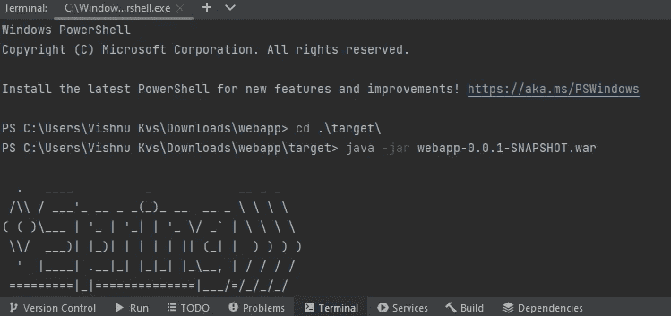

从日志中，您可以看到 tomcat 服务器已经在端口 8080 启动。去浏览器查一下。

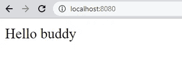

我们的应用程序运行正常。现在我们将在 Azure Web App 中上传这个 war 包。

# 将包部署到 Azure 应用服务

转到 Azure 门户>应用服务>创建 Web 应用

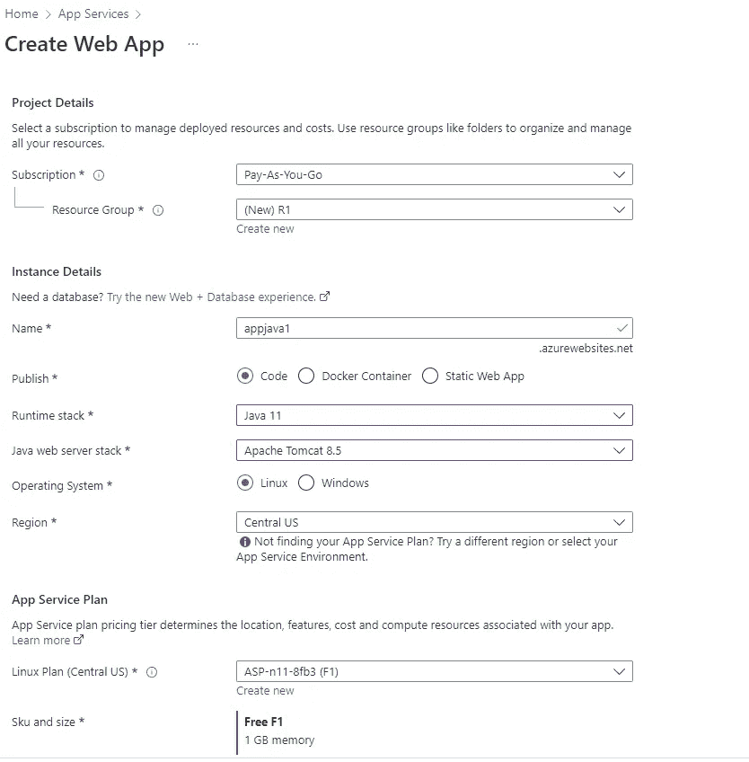

我选择 Java 11 作为运行时，Apache tomcat 8.5 作为 webserver 栈。在**发布**部分选择**代码**。免费 F1 应用服务计划是最好的，因为我们的应用程序一点也不复杂。不需要配置其他任何东西。只需点击**审核+创建**即可创建 webapp。

创建后，转到资源。您将获得应用程序的 URL。打开的话会得到一个 Azure 提供的样本模板 app。

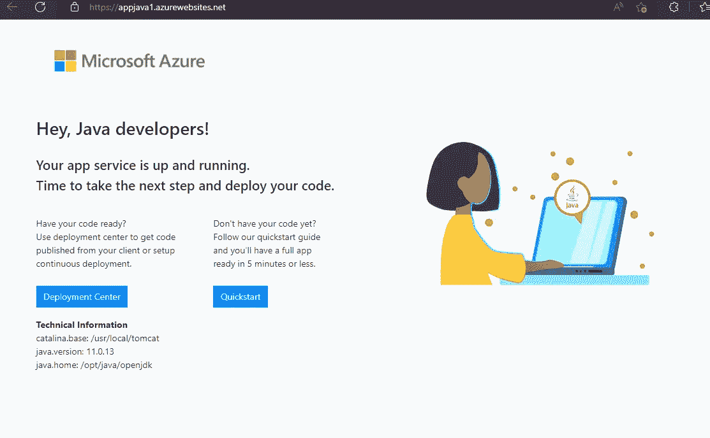

你可以在这里看到技术信息。您还可以看到，要部署我们的代码，我们需要去部署中心。

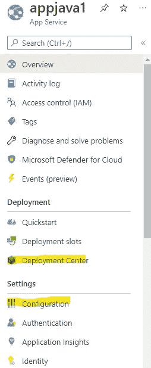

在此之前，您可以检查**设置**栏中的**配置**。转到配置中的常规设置。

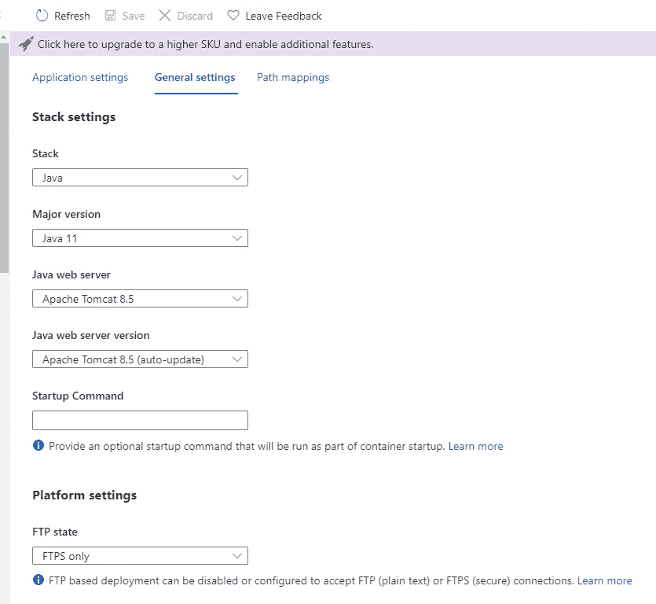

您可以找到我们在创建过程中定义的所有配置。如果你愿意，你可以更新你的 java 版本，java 网络服务器等。这在实验时非常有用。

现在，去部署中心。

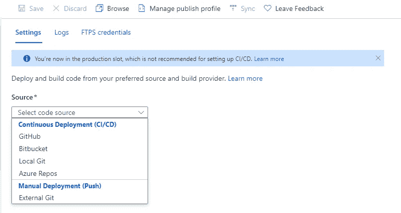

在这里，你可以附上你的源代码。也就是说，我们可以将代码上传到 Github，然后在这里连接回购。休息吧，蔚蓝会小心的。它构建和部署。但现在我们的首要任务是上传我们的艺术品。我们通过 FTP 来做。FTP 是一种协议，通过它我们可以传输文件。

我们需要一个 FTP 客户端。FileZilla 是一个广泛使用的 FTP 软件。

点击这里下载并安装 FileZilla。

现在，打开 FileZilla 应用程序。

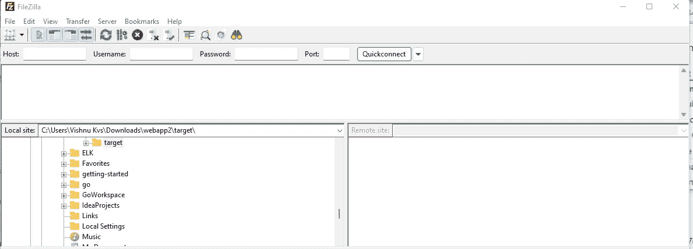

你需要主机，用户名，密码来连接。我们可以从 Azure 获得。

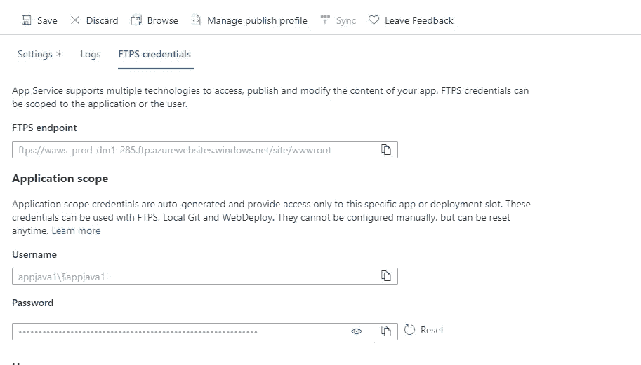

使用 FileZilla 中的这些凭证连接到您的应用程序。连接后，你进入文件系统。

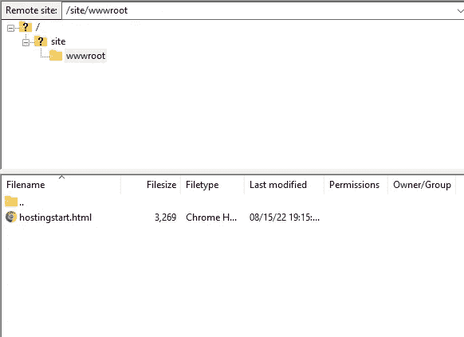

你可以删除**hostingstart.html**文件。在 tomcat 服务器中，我们需要在站点> wwwroot > webapps >中上传 war 包。

在这里，我们在 wwwroot 中创建 webapps 文件夹并上传 war 文件。

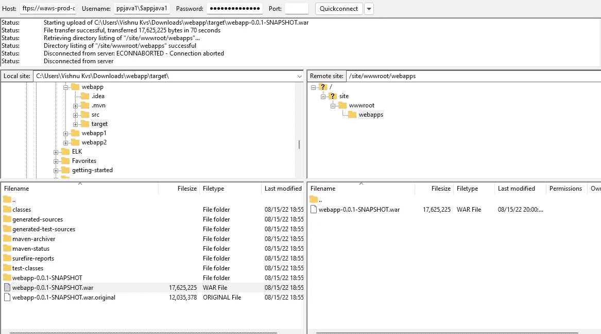

现在，将该文件重命名为 ROOT.war。如果将它重命名为 ROOT，tomcat 服务器会默认检测到它，并将其加载到/ path 中，否则您需要使用类似/webapp-0.0.1-SNAPSHOT 的包名来调用它

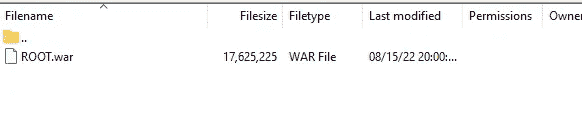

现在，您可以在 Azure 中重新启动 webapp 并检查 URL。更新需要时间。

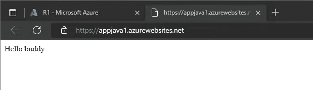

**我们完成了…**

就像我说的，很简单。感谢阅读这篇文章。

如果你想了解 **maven** 的基础知识，可以看看我的文章

 [## 通过创建一个简单的 java 项目来理解 Maven

### 使用 Maven 项目管理工具创建简单的计算器应用程序

blog.devgenius.io](/understanding-maven-by-creating-a-simple-java-project-2b432ca635c8) 

此外，我还撰写了各种技术主题的文章。您可以在我的个人资料中查看我的所有文章。如果你喜欢我的文章，请跟我来🤞。