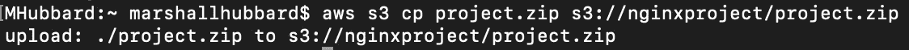

# 利用 Docker 通过 AWS S3 部署 Nginx 静态网站

> 原文：<https://blog.devgenius.io/deploying-a-nginx-static-website-through-aws-s3-utilizing-docker-8b1d09df6df6?source=collection_archive---------2----------------------->

欢迎回到我的博客！在这个项目中，我们将深入探讨 Docker，以及它如何让云工程师的工作变得更加轻松。我们将介绍为什么它是一项非常重要的技能，以及它如何无缝集成到 AWS 资源中。

**我们将在本实验中完成的任务:**您的团队需要您快速部署自定义映像，并在文件中编写快速脚本来完成任务。

**开始之前我们需要知道的事情:**

*   **什么是 Docker？** Docker 是一个开源工具，旨在通过使用容器来简化应用程序的创建、部署和运行。容器允许开发人员将应用程序与它需要的所有部分打包在一起，比如库和其他依赖项，然后作为一个包发送出去。通过这样做，由于有了容器，开发人员可以放心，应用程序将在任何其他 Linux 机器上运行，而不管该机器的任何定制设置可能与用于编写和测试代码的机器不同。
*   **什么是 AWS S3？**亚马逊 S3 或亚马逊简单存储服务(Amazon Simple Storage Service)是亚马逊网络服务(Amazon Web Services)提供的一项服务，通过网络服务接口提供对象存储。亚马逊 S3 使用与 Amazon.com 相同的可扩展存储基础设施来运行其全球电子商务网络。
*   **Nginx 是什么？Nginx 是一个流行的轻量级 web 应用程序，用于开发服务器端应用程序。它是一个开放源代码的 web 服务器，可以在多种操作系统上运行。**

**开始之前我们需要做的事情:**

*   将 AWS CLI 下载到您的本地计算机上。如果您查看了我的实验“从 CLI 创建自动缩放组”，我将介绍如何下载 AWS CLI 以及 CLI 相对于使用 AWS 控制台 GUI 的优势。
*   通过 Docker 桌面和 CLI 访问设置 Docker 帐户。将它下载到您的本地机器上
*   您选择的文本编辑器已经下载并准备好了。我选择使用微软 VS 代码

**现在我们已经解决了这个问题，下面是我们将在本实验中完成的 4 项任务:**

*   我们将使用 Nginx 创建一个定制的 Docker 图像
*   我们将在文件中添加一些日期/时间文本，这样它就不会显示默认页面
*   我们将部署端口 8080 打开的容器
*   然后，我们将数据存储在 AWS S3 存储桶中

这里有几个网站，你应该在一个单独的选项卡中打开，这将有助于你理解命令和每个字母代表什么，特别是如果你想定制你的命令。我将尽我所能解释它们，但是对于教科书上的解释，请参考实际的文档:

*   [Docker 的](https://docs.docker.com/engine/reference/commandline/build/)文档解释了如何**运行**你的镜像
*   [AWS](https://docs.aws.amazon.com/cli/latest/userguide/cli-services-s3-commands.html) 说明如何从 CLI 向 S3 上传文件的文档
*   [Docker 的](https://docs.docker.com/engine/reference/commandline/run/)文档，解释了**构建**容器的变量

好吧，希望你还在。我们开始吧，让派对开始吧！

**第一步** -建立你的形象

首先，我们必须首先将 ginx 图像拖到我们的终端，这样我们就可以从它构建自定义图像。为此，先去 [Nginx 的网站](https://hub.docker.com/_/nginx)获取 pull 命令。当您想要构建 Docker 映像时，无论是自定义映像还是标准映像，您都需要访问 [Docker hub](https://hub.docker.com/) 网页来查找您想要构建的映像，然后找到要使用的命令。对于 Nginx，我们使用以下命令:

$ docker pull nginx

接下来我们要做的是创建一个目录，并在该目录中放入 cd，以保存我们的 Dockerfile 和 index.html 文件(我们将在后面详细介绍)。进入目录后，创建一个名为 Dockerfile 和 index.html 文件的文件。在构建您的映像之前建立一个 Docker 文件是很重要的，因为当您进入下一步时，您的 Docker 构建命令会将您的 Docker 文件作为如何构建您的映像的说明。让我解释一下我的 Dockerfile 文件的每个部分是什么:

`FROM`创建一个层

`COPY`添加 Docker 客户端当前目录中的文件。

`CMD`指定在容器中运行什么命令。

`EXPOSE`该指令指示容器监听连接的端口。

现在，我们将使用文本编辑器向刚刚创建的 index.html 文件添加一些代码。这一步也非常重要，因为它为 Nginx 提供了一个显示网页时需要遵循的脚本。我将使用的脚本是在我们的静态 Nginx 网页上显示日期和时间，而不是默认的“欢迎使用 Nginx”页面。*更改这个默认页面比我最初想象的要困难得多，但我们稍后会解决这个问题。

一旦到了这一步，下一个命令将按照 docker 文件中的说明构建您的映像。但是在我们构建这个映像之前，让我们回顾一下命令的组成部分。“-t”是“tag”的缩写，它实际上是你正在构建的图像的名称。请不要忘记结尾的“.”在命令中。这个“.”指定路径在本地目录中。现在我们已经解决了这个问题，您将使用的命令是:

$ docker build -t <name>。</name>

**第二步** -码头运行

一旦我们构建了自定义映像，我们现在就可以构建容器了。构建容器的命令总是以“docker run”开始，然后你可以参考我在上面发布的网页来选择你想要在命令中使用的变量。“-it”是保持 STDIN 打开，即使没有连接，并分配一个伪 TTY。"-rm "会在容器退出时自动删除它。"-d "在后台运行容器并打印容器 ID。"-p "向主机发布容器的端口。我选择 8080:80 作为我想要打开的端口，但是这实际上并不需要，因为我选择在 docker 文件中公开它。我只是忘记了我是在打这个命令的时候做的，lol。下面是以下命令:

$ docker run-it-RM-d-p 8080:80-name Marshall container nginx

一旦这样做了，不幸的是你仍然会看到默认的 Nginx 网页，lol。但是不用担心，我们将在下一步处理这个问题。只需庆幸容器已经启动并运行。我们总是可以改变网页本身。仅供参考，要访问此页面，请在您的 web 浏览器的搜索栏中键入 localhost:8080。

现在我们将更改默认页面。这个命令将允许您进入容器本身并在其中执行命令。我们将首先使用“cat index.html”显示默认的 index.html 文件，它将显示我在上面直接发布的内容。这是默认的 Nginx 页面，我们不希望这个项目。然后，我创建了一个新目录，并切换到该目录。然后，我们将创建另一个 index.html 文件，并再次使用 VS 代码将我们的时间/日期脚本复制并粘贴到该文件中。

一旦完成，我们应该能够看到我们构建的自定义映像。现在我们必须把这个文件上传到 S3 AWS。

**步骤 3-** 将我们的容器上传到 S3

现在困难的部分已经解决了，我们现在要做的就是使用下面的命令创建我们的 bucket，然后将文件上传到其中。请记住，S3 是一个**全局**名称空间，因此要确保这是一个唯一的名称，因为没有两个存储桶可以共享同一个名称。

$ aws s3 mb s3:// *名称*

我们可以随时去控制台仔细检查我们的工作。一旦您看到您的存储桶显示出来，您就可以继续了。

现在我们将压缩包含 docker 文件和 index.html 文件的 docker-demo 目录，这样我们就可以准备好上传到 AWS S3。使用下面的命令:

zip-r*whateveryouwanttonamithiszipfile**文件夹名称*

现在我们将把我们的 zip 文件上传到 aws s3。使用下面的命令来上传它。如果成功，您应该会从 aws cli 获得一个上传返回。

aws s3 cp *您的 zipfile 名称* e s3:// *您的 bucketname* / *您的 zip file 名称*

现在，我们将再次检查我们的工作，以确保我们成功了。如果您的 zip 文件出现在您的存储桶下面，**祝贺您**。您现在已经完成了本实验。

感谢您加入我的实验，希望您过得愉快！