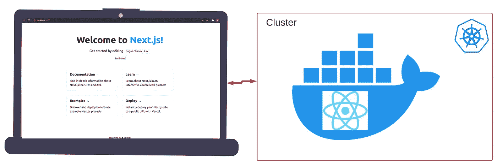

# 在 Kubernetes (Minikube)中部署 React 应用程序

> 原文：<https://blog.devgenius.io/deploying-a-react-app-in-kubernetes-minikube-fc71f4e8da61?source=collection_archive---------0----------------------->



在本教程中，我们将看到如何在 Kubernetes 中部署一个简单的 react 应用程序并访问它。可以把它看作是应用程序如何实时工作的一瞥。

让我们从下载我们将在教程中使用的 react 应用程序开始，我将使用。

```
npx create-next-app — example with-typescript with-typescript-app
```

> **注意:为了让这个工作，你需要有 docker 和 Kubernetes，以及对整个主题的一些熟悉。**

现在，我们需要创建一个 Dockerfile，它使用我们的项目并构建一个相同的映像。

请遵循以下步骤:

1.  制作一个目录结构如下。


2.创建一个包含以下内容的 Dockerfile 文件。


注意，公开端口非常重要，因为应用程序将在那里运行。

3.现在，我们已经创建了 Dockerfile 文件，我们需要将它转移到 Kubernetes 环境中。在我的例子中，它运行在 minkube 上，minkube 有一个运行在 docker 上的节点，因此我需要手动将这个 docker 文件和项目转移到节点上，或者将 docker 文件放在 Dockerhub 中，以便 docker 可以提取图像。我们将手动将其放入节点中。

4.运行`docker ps`并在运行后查看容器 id

```
docker cp test-project/ container_name:/home/
```

将所有文件放入容器中以供使用。


5.最后，我们需要从节点内相应的 docker 文件构建一个图像，以便它可以在 Kubernetes YAML 文件中使用。你只需运行`docker build -t typescript-app .`


在这之后，它将开始建立一个图像，你可以通过`docker images`查看它


我们已经完成了初始步骤！您可以专注于创建 pod 或部署，无论您喜欢什么。

# 使用我们刚刚创建的图像创建一个 pod


pod.yml

创建这个文件后，运行`kubectl apply -f pod.yml`来运行节点内的 pod。但你仍然无法访问该应用程序，为此，你需要创建一个服务。至于我为什么这么做，你会在这里找到答案[。](https://faun.pub/accessing-pods-outside-of-the-cluster-in-kubernetes-400be73db519)


service.yml

最后，使用`kubectl apply -f service.yml`创建服务

您可以使用`kubectl get pods` & `kubectl get svc`查看 pod 和正在运行的服务

完成后，您可以在`http://nodeIP:30008`上访问您的应用程序，其中 **30008** 恰好是我们的节点端口。


欢迎在评论区提出你的疑问和建议！

> *快乐学习！:)*