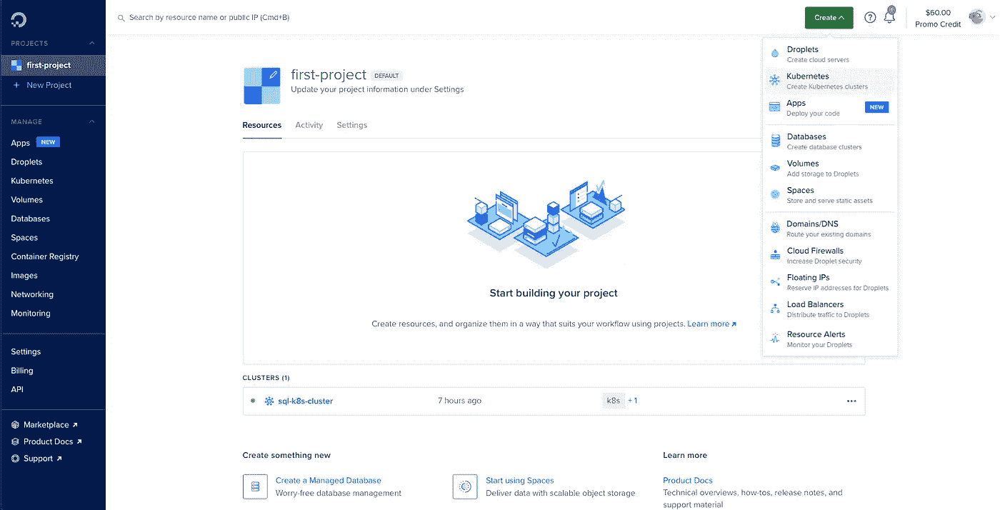

# 在 Kubernetes 上部署可伸缩的 SQL 集群

> 原文：<https://blog.devgenius.io/deploying-a-scalable-sql-cluster-on-kubernetes-d7907cb1605e?source=collection_archive---------1----------------------->


由[铃木](https://unsplash.com/@orenarypaladin?utm_source=unsplash&utm_medium=referral&utm_content=creditCopyText)在 [Unsplash](https://unsplash.com/s/photos/digital-ocean?utm_source=unsplash&utm_medium=referral&utm_content=creditCopyText) 上拍摄的照片

# 介绍

在本文中，我们将了解如何在 Kubernetes 上部署可伸缩的 SQL 集群。在我们开始之前，了解 Kubernetes 是什么以及围绕它的一些细节是很重要的。如果你不知道基本知识，我建议你看一下这个链接开始学习。

[](https://kubernetes.io/docs/concepts/overview/what-is-kubernetes/) [## 什么是 Kubernetes？

### Kubernetes 是一个可移植、可扩展的开源平台，用于管理容器化的工作负载和服务，它…

kubernetes.io](https://kubernetes.io/docs/concepts/overview/what-is-kubernetes/) 

为了部署一个可扩展的 MySQL 结构，我们可以将其分为 3 个部分:

> 在数字海洋上创建 Kubernetes 集群
> 
> 设置 MySQL 操作符和数据库
> 
> 测试集群功能并进行试验

# 在数字海洋上创建 Kubernetes 集群

从 DigitalOcean 的控制面板中，创建一个新的 Kubernetes 集群。



从下拉列表中选择 Kubernetes 以创建 K8s 集群

我选择我的数据中心区域为 Bangalore (BLR1)，但是您可以选择任何区域。


选择数据中心区域

在创建集群的过程中，除了我设置为`sql-k8s-cluster`的名称之外，我没有更改任何其他内容。


更改集群的名称

之后，点击“创建”,我们就可以开始了！

设置集群需要 5 分钟，在此期间，您可以下载集群的配置文件并将其添加到您正在工作的目录中。我的配置文件叫做`sql-k8s-cluster-kubeconfig.yaml`。一旦集群开始运行，我们运行以下命令。

```
cd ~/.kube && kubectl --kubeconfig="sql-k8s-cluster-kubeconfig.yaml" get nodes
```

这将显示节点及其详细信息。输出如下所示。


获取集群中的节点

下一步是设置 MySQL 操作符和我们的数据库。

# 设置 MySQL 操作符和数据库

为了理解 MySQL 操作符是什么，我们需要理解 Kubernetes 中的操作符是什么。一个**操作员**打包、部署和管理一个 Kubernetes 应用程序。

## **MySQL 操作符**

MySQL 操作员管理 Kubernetes 集群中的 MySQL InnoDB 集群设置。操作员处理整个生命周期，包括设置和维护应用程序—自动升级和备份。

> **注意**:Kubernetes 的 MySQL 操作器目前处于预览状态。不要在生产中使用—*GitHub 上的 MySQL 操作符*。

## InnoDB 是什么？

MySQL 参考手册说:

> InnoDB 是一个**通用存储引擎**，它平衡了高可靠性和高性能。在 MySQL 5.6 中，InnoDB 是默认的 MySQL 存储引擎。

基本上，它是一个 MySQL 软件组件，处理 SQL 操作，如表的创建、读取、更新和删除。

我们首先从这里的[安装 MySQL 操作符](https://github.com/mysql/mysql-operator)，并执行下面的命令。为了让它工作，确保安装了 Helm(一个运行在 K8s 之上的包管理器)。

```
helm install mysql-operator helm/mysql-operator --namespace mysql-operator --create-namespace --kubeconfig ~/.kube/sql-k8s-cluster-kubeconfig.yaml
```

输出应该是这样的。


通过 Helm 安装 MySQL 操作器

## 名称空间

在 Kubernetes 中，名称空间允许在单个集群中隔离资源。资源名在一个名称空间中应该是唯一的，但在不同的名称空间中则不是。

接下来，我们通过执行下面的命令创建一个名为`sql-cluster`的名称空间。

```
kubectl create namespace sql-cluster --kubeconfig ~/.kube/sql-k8s-cluster-kubeconfig.yaml
```


创建名称空间

为了使用`kubectl`创建 MySQL InnoDB 集群，我们需要创建一个包含凭证的秘密。在您的终端中执行以下命令，并设置您选择的密码。

```
kubectl create secret generic mypwds \
        --from-literal=rootUser=root \
        --from-literal=rootHost=% \
        --from-literal=rootPassword="your secret password, REPLACE ME"
```


为我们的群集设置凭据

下一步是编写我们的集群的配置。我们创建一个名为`config.yaml`的文件，并输入以下细节。

```
apiVersion: mysql.oracle.com/v2alpha1kind: InnoDBClustermetadata: name: sql-cluster namespace: sql-clusterspec: secretName: mypwds instances: 3 router: instances: 1
```

保存文件后，运行以下命令将配置应用到我们的 MySQL 集群。

```
kubectl apply -f config.yaml --kubeconfig ~/.kube/sql-k8s-cluster-kubeconfig.yaml
```


在我们的终端中运行上述命令后

为了查看我们集群的状态，并了解 pod 是如何启动的，我们执行以下命令并见证奇迹。这需要将近 5 分钟，所以去喝杯咖啡吧！☕️

```
kubectl get innodbcluster --watch --namespace sql-cluster --kubeconfig ~/.kube/sql-k8s-cluster-kubeconfig.yaml
```


豆荚点火了

为了获得服务细节并查看我们的 MySQL 集群在哪个端口上是可访问的，运行下面的命令就可以了。

```
kubectl get service sql-cluster  --namespace sql-cluster --kubeconfig ~/.kube/sql-k8s-cluster-kubeconfig.yamlkubectl describe service sql-cluster  --namespace sql-cluster --kubeconfig ~/.kube/sql-k8s-cluster-kubeconfig.yaml
```


我们的 MySQL 集群的服务详情

为了访问 MySQL 集群，我们将它转发到一个端口，并通过命令行访问它。我们也可以使用 MySQL 客户端，比如 DataGrip 或 PHPMyAdmin。我们运行以下命令，注意到可以从端口 6446 访问群集。

```
kubectl port-forward service/sql-cluster mysql  --namespace sql-cluster --kubeconfig ~/.kube/sql-k8s-cluster-kubeconfig.yaml
```


可以通过端口 6446 访问集群

我们现在可以通过执行下面给出的命令来访问端口 6446 上的集群。系统会提示我们输入之前设置的密码。

```
mysql -h127.0.0.1 -P6446 -uroot -p
```


连接到 MySQL 集群

至此，我们已经使用 MySQL operator 成功创建了 MySQL 集群。现在，我们来看看添加数据和测试我们的 Kubernetes 集群的功能。

# 测试集群功能并进行试验

为了了解我们的集群的弹性和可伸缩性，我们需要一些数据。

我们创建了一个名为`students`的表，它存储了学生的`id`、`name`和`department`。

```
CREATE TABLE students (id INT(3) PRIMARY KEY, name VARCHAR(20) NOT NULL, dept VARCHAR(5) NOT NULL);INSERT INTO user (1, "Anjaneya", "CSE");SELECT * FROM students;
```

执行后，我们得到以下内容。


现在，我们的数据库中已经有了一些数据，让我们看看当我们删除存储数据的 pod 时，我们的集群的情况如何。

## 弹性

我们首先需要确定存储上表的 pod。我们通过确定 MySQL 中哪个变量的变量名设置为`hostname`来识别它。

```
SHOW VARIABLES WHERE Variable_name = 'hostname';
```

我得到的回应是`sql-cluster-3`，但这因用户而异。如果你取了别的名字也不用担心。

现在，我们通过执行以下命令(在另一个终端窗口中)来删除这个 pod。

```
kubectl delete -n sql-cluster pod sql-cluster-3
```


删除包含我们数据的 pod


[来源](http://memegenerator.net)

在我们之前的终端窗口中，我们可以实时观察变化。


简直是魔法

我们可以看到 MySQL 服务器失去连接，确定连接丢失，然后重新连接到另一个实例，并向我们显示我们的数据，就像什么也没发生一样。


[来源](http://makeameme.org)

## 可量测性

为了确定我们的集群是否是可伸缩的，我们需要修改配置文件(`config.yaml`)。

让我们将实例的数量从 3 个改为 4 个。

```
apiVersion: mysql.oracle.com/v2alpha1kind: InnoDBClustermetadata: name: sql-cluster namespace: sql-clusterspec: secretName: mypwds instances: 4 router: instances: 1
```

现在，让我们看看 kubernetes 集群是如何产生新实例的。它意识到实际状态与期望状态不同，并立即开始努力实现期望状态。

请确保在观看之前应用更改！

```
kubectl apply -f config.yaml --kubeconfig ~/.kube/sql-k8s-cluster-kubeconfig.yamlkubectl get innodbcluster --watch  --namespace sql-cluster kubeconfig ~/.kube/sql-k8s-cluster-kubeconfig.yaml
```


可扩展集群


[来源](https://memegenerator.net/instance/73892688/rain-man-scalable-definitely-scalable)

也就是说，我们已经成功部署了我们的 MySQL 集群，并确保它具有弹性和可伸缩性！

[](https://github.com/AnjaneyaTripathi/k8s-mysql) [## GitHub-AnjaneyaTripathi/k8s-MySQL

### 在数字海洋上创建 Kubernetes 集群，设置 MySQL 数据库和 MySQL 操作员测试集群…

github.com](https://github.com/AnjaneyaTripathi/k8s-mysql) 

`config.yaml`可以在 GitHub 资源库上找到。

## 资源

[](https://www.digitalocean.com/community/tutorials/an-introduction-to-kubernetes) [## Kubernetes |数字海洋简介

### Kubernetes 是一个强大的开源系统，最初由 Google 开发，用于管理容器化的应用程序

www.digitalocean.com](https://www.digitalocean.com/community/tutorials/an-introduction-to-kubernetes) [](https://github.com/mysql/mysql-operator) [## GitHub-mysql/MySQL-Operator:Kubernetes 的 MySQL 操作员

### MYSQL Operator for Kubernetes 是一个用于管理 MySQL InnoDB 集群设置的 Kubernetes 操作员

github.com](https://github.com/mysql/mysql-operator)