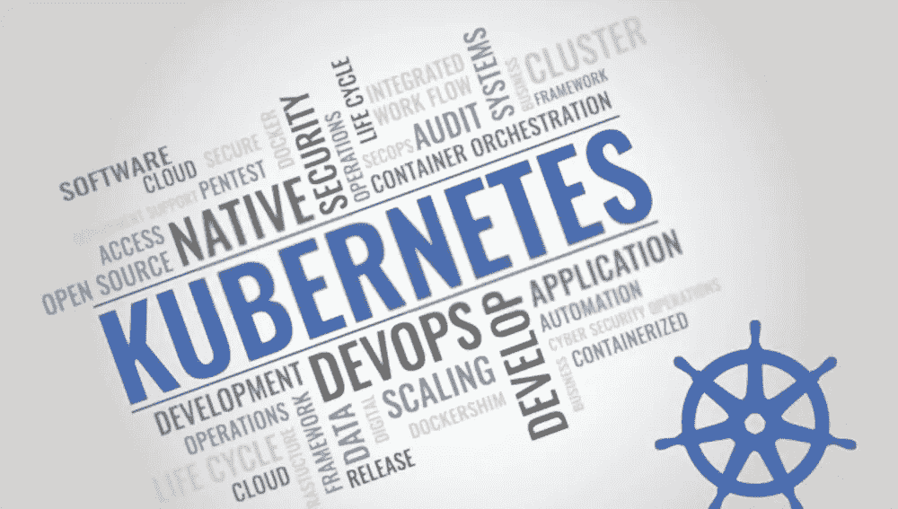
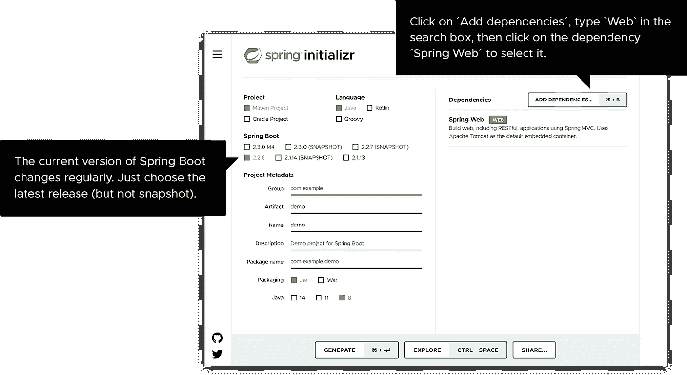
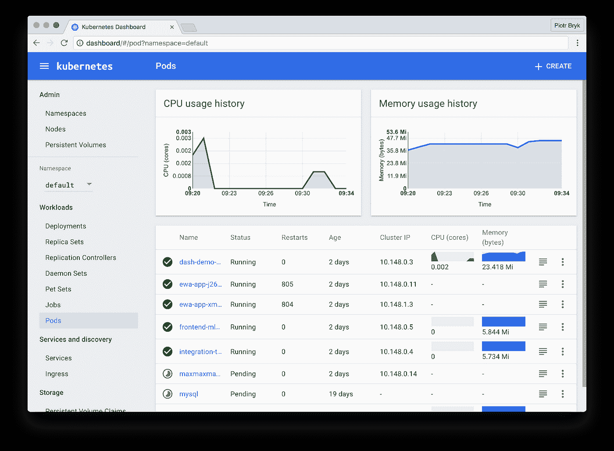

# 将 Spring Boot 应用程序部署到 Kubernetes

> 原文：<https://blog.devgenius.io/deploying-a-spring-boot-app-to-kubernetes-d4aadc0bca20?source=collection_archive---------0----------------------->

来源:shutterstock.com

# 概观

让我们面对现实吧，为了做出令人惊叹的软件产品，开发人员总是倾向于新的工具和技术，这些工具和技术可以节省时间，并在开发周期结束时提供最佳的输出。在软件开发领域，您一定听说过 Kubernetes。今天，越来越多的开发人员正在使用它，原因很明显。Kubernetes 已经成为开发人员的首选，因为它是强大的部署平台之一。

在这里，我们将通过分解步骤来讨论和浏览将 spring boot 应用程序部署到 Kubernetes 的整个过程。在文章的最后，你会了解到，

*   Kubernetes 和 Spring boot 概述
*   正在初始化 spring boot 应用程序设置
*   创建 docker 图像
*   在本地安装 Kubernetes(你也可以称之为 Minikube)
*   最后，在 Kubernetes 上部署 spring boot 应用程序

现在，在进入本文有趣的部分之前，最好先理解一下库伯内特和 Spring Boot 的定义。

# 什么是 Spring Boot？

简单来说， [Spring boot](https://spring.io/guides/gs/spring-boot/) 是一个开源的基于 Java 的框架。它提供了一种用 Java 编写和构建应用程序的快速方法。基于 Spring 框架构建的应用程序可以在所有平台上运行，受到了行业专家的强烈推荐。尽管进入 spring 框架并不容易，但是您必须经历一些配置挑战。但是一旦你通过了所有的挑战，你就可以用最少的投入创造出令人惊叹的应用程序。此外，你还将利用下面的优势。

*   XML 和 JavaBeans 的灵活配置
*   无需人工干预的自动配置
*   创建基于注释的 spring 应用程序
*   减少对第三方库的依赖
*   使 web 应用程序测试变得容易，因为它带有像 Jetty 和 Tomcat 这样的嵌入式 HTTP 服务器

总的来说，Spring Boot 让你用更少的开发工作来构建和开发应用程序，同时也确保了更高的生产率。

# 什么是 Kubernetes

简而言之，Kubernetes 是一个可移植的、开源的容器编排平台，使应用程序的部署、伸缩和管理自动化。最初由 Google 发起，但现在由 Cloud-Native Computing Foundation 管理，并得到 Google、AWS、IBM、Intel、Red Hat 和 Cisco 等主要行业参与者的支持。使用 Kubernetes，您可以在微服务架构中部署和操作应用程序。

如今，越来越多的组织转向云结构架构师，他们一直在寻找一个强大的平台，Kubernetes 拯救了他们，并提供了几个优势，如

*   动作快点
*   经济高效的解决方案
*   Kubernetes 是云不可知的

这些都是吸引开发者注意力的原因。如果你想了解更多关于 Kubernetes 的信息，你应该花些时间查看他们的官方文档。

现在进入本文的主要部分，在 Kubernetes 上部署 spring boot 应用程序，让我们看看您需要什么。

# 先决条件

首先，[访问此 repo](https://github.com/sbrosinski/spring-boot-on-k8s) 并确保您已准备好以下工具:

*   Docker:用于 docker 映像和部署
*   Minikube:当地的 Kubernetes 环境
*   kubectl:如果你有 mac OS，安装 Kubernetes-cli

您应该对 Java 编程语言及其工具足够熟悉。

# 将 Spring Boot 应用程序部署到 Kubernetes 的步骤

让我们详细分解每个步骤。在这里，我们将部署一个 spring boot 应用程序，最终得到一个可伸缩的、高效的 [Kubernetes 应用程序](https://kubernetes.io/docs/tasks/run-application/)。

# 步骤 1:初始化 Spring Boot 应用程序设置

第一步是建立一个 Spring Boot 应用程序。开始使用 [Spring Initializr](https://start.spring.io/) web 应用程序并执行以下步骤。

来源:[弹簧](https://spring.io/quickstart)

单击“生成项目”按钮，几分钟后，它将下载新项目及其依赖项。在这里，您可以看到“添加依赖项”选项，这意味着选择 Spring Web，以便您可以直接开始编写 Hello World REST API。

让我们编写 Hello World REST API

现在您已经有了 Spring Boot 安装程序，用您的 IDE 打开项目文件夹并创建另一个名为 Application 的文件夹。kt 并添加以下代码:

包 com . bael dung . demosprinboot . controller

导入 org . spring framework . web . bind . annotation . get mapping

导入 org . spring framework . web . bind . annotation . rest controller

@RestController

类别应用程序{

@GetMapping("/")

fun home(): String {

返回“Hello World”；

}

}

**1.2 构建并运行应用**

现在你必须有一个内嵌 Gradle 的 zip 文件，为了构建和运行应用程序，确保你在正确的路径上，写下下面的代码，

~/code/demos/demo-spring-boot master >。/gradlew 版本

启动一个 Gradle 守护进程(后续构建会更快)

>任务:测试

2020–11–29 20:44:55.227 INFO 43582—[extShutdownHook]o . s . s . concurrent . threadpooltasktexecutor:正在关闭 ExecutorService ' applicationtasktexecutor '

8s 内构建成功

7 项可行任务:3 项已执行，4 项最新

之后，您将在 build/libs 下得到一个 jar 文件。您可以使用 java-jar build/libs/ <your-app>来运行它。您的设置将显示 Spring 横幅和以下消息:</your-app>

demosborimpootapplicationkt:在 1.492 秒内启动了 demosborimpootapplicationkt(JVM 运行时间为 1.852)

现在去 localhost:8080 看“Hello World”。

# 步骤 2:创建 Docker 图像

Kubernetes 只处理 Docker 图像。这意味着您需要首先对图像进行 Docker 化，以便将它们推送到 Docker 注册表中。您可以在应用程序中创建 Docker 图像，并要求 Kubernetes 启动您已经创建的图像的一个或多个实例。首先，从 Spring Boot 服务中创建一个图像。运行以下命令获取 Docker 映像:

-“依赖性”:

- "BOOT-INF/lib/dependency1.jar "

- "BOOT-INF/lib/dependency2.jar "

-“弹簧靴加载器”:

- "org/"

-“快照依赖性”:

-" BOOT-INF/lib/dependency 3-snapshot . jar "

-" BOOT-INF/lib/dependency 4-snapshot . jar "

-“应用”:

- "BOOT-INF/classes/"

- "META-INF/"

您还可以构建一个 Docker 映像，并借助 Spotify 开发的 Maven 插件将其推送到 Docker 注册表，因为它简单且易于实现。如果你想用 Maven 插件对图片进行分类，你必须通过下面的命令。

<groupid>org.springframework.boot</groupid>

<artifactid>spring-boot-maven-plugin</artifactid>

<version>{gradle-project-version}</version>

<configuration></configuration>

<layers></layers>

<enabled>真</enabled>

安装完成后，在匿名浏览器中打开 localhost: 8080 并检查以下消息:

你好，来自库伯内特的世界！

现在，最后一步是通过运行以下命令将 Docker 映像推送到 repo:

**$ docker 推送 myrepo/bi-admin**

现在我们有了 Docker 映像，可以直接创建一个 Kubernetes 环境来实现这些映像。

# 第三步:在本地安装 Kubernetes(你也可以称之为 Minikube)

根据 [Kubernetes 官网](https://kubernetes.io/docs/setup/minikube/)，

Minikube 是一个强大的工具，让您可以轻松地在本地运行 Kubernetes。如果你想了解更多关于 Minikube 的信息，可以访问它在 GitHub 上的项目页面。在这里，您还将了解如何在 Windows、Linux 或 macOS 上安装和设置 Kubernetes。这里还需要 Kubectl，这是一个命令行工具，可以帮助您在 Kubernetes 上快速部署应用程序。键入以下命令开始使用 Kubernetes，

**Minikube 启动**

在这之后，你也可以使用 Kubernetes 仪表板，你会看到下面的图像

来源: [Kubernetes](https://kubernetes.io/docs/tasks/access-application-cluster/web-ui-dashboard/)

# 步骤 4:将应用程序部署到 Kubernetes

这是要执行的最后一步。所有的 Kubernetes 配置通常以 YAML 格式编写，这样所有的 Kubernetes 配置都可以被人类阅读。大多数开发人员使用 YAML 而不是 JSON。现在我们有了 docker 映像，已经在本地环境中设置了 Kubernetes。现在是时候在 Kubernetes 集群上部署应用程序了。为此，创建部署配置文件，该文件包括关于应用程序应该如何执行的配置。

有了文件夹后，运行下面的命令，

apiVersion: apps/v1

种类:部署

元数据:

名称:kubernetesdemo

标签:

应用程序:kubernetesdemo

规格:

副本:1

选择器:

匹配标签:

应用程序:kubernetesdemo

规格:

容器:

-名称:kubernetesdemo

图片:yolanv/kubernetsdemo

端口:

-集装箱港口:8080

在部署应用程序时，您将面临许多问题。让我们分解每一行代码，以便您可以正确理解它。前两行代码都是关于您正在使用的 API 版本以及正在使用的 Kubernetes 对象的种类。然后，3-6 行代码告诉元数据标签，这样程序员就可以很容易地知道他们正在开发哪个应用程序。

其余的代码行解释了容器是如何制作的，以及可以运行哪些图像。这里的图像是指我们在步骤 2 中创建的 docker 图像。最后一部分是告诉集装箱应该遵循的端口，在本例中是 8080。

这里你的工作还没有完成。您已经部署了该应用，但无法在群集外访问它。因此，您需要创建一个“桥梁”，使外部访问成为可能。那么如何做到这一点。别担心，我们有 Kubernetes 服务。

在这里，您需要创建服务，以便最终用户可以访问应用程序。按照下面的命令创建服务

sudo ku bectl expose deployment/mykubernetes-spring boot-type = " node port "-端口 8080

上述命令背后的公式是，我们希望外界通过 NodePort 访问该应用程序。一旦你执行了上面的命令，你的屏幕上会出现一条消息“service ' mykubernetes-spring boot ' exposed”，这意味着这个应用程序现在可以被任何人使用。

现在是时候访问您的应用程序了。请记住，该应用程序位于一个 Pod 中，我们已经创建了一个允许我们从集群外部使用该应用程序的服务。现在访问您的浏览器，键入带有 Hello 的 IP，您将看到应用程序被顺利部署，并且可以从集群外部访问。

恭喜你！这里，您已经在 Kubernetes 中部署了一个简单的 spring root 应用程序。

# 结论

我们希望本指南能够帮助您将 Spring Boot 应用程序部署到 Kubernetes。在这里，我们讨论了 Spring boot 应用程序和 Kubernetes 的概述，如何创建 docker 映像以及如何部署 Kubernetes 服务。那么，你还在等什么？立即开始部署您的应用程序。

这篇深入的文章由 Brijesh Vadukia 撰写和分享，他是 Elluminatiinc.com 的营销官，喜欢帮助品牌在全球数字世界中推广他们的业务。