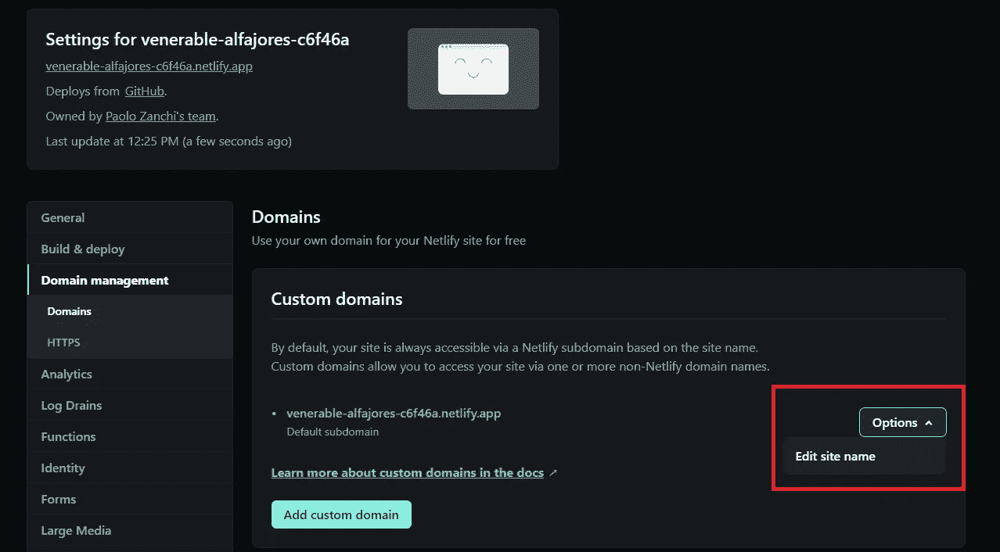

# 将使用 Telegraf.js 开发的电报机器人部署到 Netlify

> 原文：<https://blog.devgenius.io/deploying-a-telegram-bot-developed-with-telegraf-js-aef341ec0d4f?source=collection_archive---------5----------------------->


谁知道这段代码做什么，我只是需要一个漂亮的图像。对 [Unsplash](https://unsplash.com?utm_source=medium&utm_medium=referral) 的信贷

在花了相当糟糕的一天时间尝试(并且失败)遵循一个两年前的关于如何将 Telegraf.js 制作的电报机器人部署到 Netlify 的教程后，我决定写一个更新的。

> 本教程将重点介绍在 Netlify 上正确部署电报机器人所需的配置，**掩盖了机器人的逻辑和一些基本步骤和概念**(请求电报机器人令牌，使用 Git/Github，…)。

让我们从基础开始。本教程需要的主要内容是:

*   [Node.js](https://nodejs.org/) 已安装
*   一个净值账户
*   一个 [Github](https://github.com/) 账户(或任何其他版本控制系统)
*   一个[电报](https://telegram.org/)账户和一个电报机器人令牌(如果你不知道如何获得一个机器人令牌，请在进一步阅读之前按照此处描述的步骤

# 开源代码库

## 存储库设置

首先在 Github 上创建一个[新的存储库，然后通过终端在您的机器上克隆它。](https://docs.github.com/en/get-started/quickstart/create-a-repo)

```
git clone https://github.com/*<your_username>*/*<repository_name>*
```

# 密码

## package.json

通过终端导航到新克隆的目录后，键入以下内容:

```
npm init -y
```

这将创建一个新的 *package.json* ，其中已经填充了默认的键，只需确保键*“name”*有一个您喜欢的名称(默认将与文件夹的名称相同)。

此外，运行以下命令:

```
npm install telegraf
npm install netlify-lambda
```

[Telegraf.js](https://telegraf.js.org/) (在撰写本文时，最新版本是 4.9.0)是一个*“Telegram Bot API framework for node . js”*，它通过代码简化了(很多)Telegram 的 API 的使用。我尝试过不使用框架走“纯”路线，但是花时间去理解 Telegram APIs 文档是不值得的。

Netlify-lambda 是一个“帮助在本地和 CI 环境中构建和服务 lambda 功能”的工具。

## netlify.toml

在与 *package.json* 相同的目录下，也创建一个名为 *netlify.toml* 的文件，内容如下(编辑 09/10/2022: [Anais Reyes](https://medium.com/u/962f9e337686?source=post_page-----aef341ec0d4f--------------------------------) 正确指出了前面的一个错误。toml 文件，现已修复):

```
[build]
  functions = "functions"
  command = "netlify-lambda install && mkdir ./public"
[[redirects]]
  from = "/api/*"
  to = "/.netlify/functions/:splat"
  status = 200
```

Netlify 在构建和部署过程中使用该配置文件。更多信息可在 [Netlify 文档](https://docs.netlify.com/configure-builds/file-based-configuration/)中找到。

## 子文件夹

我们现在需要创建这些子文件夹:

*   **功能**
*   *功能* **/bot** (注意:这个子文件夹需要在第一个里面**)。**

## bot.js

现在让我们编写一个基本的机器人，当它在聊天中收到“/start”命令时，用“Hi”来响应。

我们需要在 *functions/bot* 子文件夹中创建一个名为 *bot.js* 的文件。

bot.js 源代码

> 请注意 **exports.handler** 的语法(称为 AWS 事件处理程序语法)，这不仅是使这个机器人与 Netlify 函数一起工作的必要条件，也是所有教程都忘记提到的部分。

## 。gitignore

创建[。git 忽略项目根目录中的](https://git-scm.com/docs/gitignore)文件，只需键入:

```
node_modules
```

## 最终文件夹结构

运行 *npm install* 命令后，您应该有以下文件夹结构:

```
.
├── .git/ (automatically created when cloning the repository)
├── functions/
│   └── bot/
│       └── bot.js
├── node_modules/
│   └── <dependencies files>
├── .gitignore
├── netlify.toml
├── package.json
└── package-lock.json (auto-generated after running npm install)
```

很好！既然我们已经完成了“编码”,我们就**提交并把所有东西**推送到存储库中。

# 网络生活

## 站点部署

将我们的代码推送到 Github 后，我们登录 Netlify。这里我们需要:

*   创建新站点(通过选择**导入现有项目**)
*   选择 Github(或您的版本控制系统提供商)
*   选择我们推送 bot 代码的存储库。
*   检查默认设置(在我的例子中，我必须从 **/dist，**中更改“发布目录”的默认值，将该字段留空。


基本网站设置。

*   我们需要存储 BotFather 提供的电报 bot 令牌。为此，点击**显示高级**，然后点击**新变量。** 变量的*键*应该是 **BOT_TOKEN** 并且 BotFather 提供的 BOT 的 TOKEN 必须粘贴在 Value 字段。


环境变量设置。

*   点击**部署站点**。如果需要，您可以自定义**站点名称**(站点设置>域管理>选项>编辑站点名称)



网站名称定制页面

## Webhook

我们现在必须告诉 Telegram 将用户发送给机器人的所有消息转发到哪里。为此，我们需要设置 webhook。

复制下面的 URL，替换 **< your_bot_token >** 和 **< your_site_name >** ，然后将结果粘贴到你的浏览器地址栏并导航。

```
https://api.telegram.org/bot**<your_bot_token>**/setWebhook?url=https://**<your_site_name>**.netlify.app/api/bot
```

例如，我的 URL 应该是(别担心，bot 令牌现在无效):

```
https://api.telegram.org/bot5594307469:AAEx9aeF6KeOMaQeAGJ79xa-tAB5RkWOdlg/setWebhook?url=https://venerable-alfajores-c6f46a.netlify.app/api/bot
```

如果 webhook 设置正确，您应该会看到以下结果:

```
{"ok":true,"result":true,"description":"Webhook was set"}
```

# 测试

如果你做的一切都正确，机器人现在会在收到*/开始*命令时回复“嗨”。


机器人开始工作了！

🥳祝贺你，你已经成功部署了你的机器人！🎉

## 解决纷争

*   检查 Netlify 部署是否成功(您应该会看到下面的 **Published** 徽章)。如果您看到**失败的**徽章，您可以点击它并检查部署日志。


*   在 Netlify 上更新任何环境变量的值后，必须触发新的部署，以便在生产中更新它。您可以从 Netlify 手动完成此操作，或者通过将新的提交推送到存储库中的主分支来完成。这将触发新的部署。
*   你可以通过进入你的网站的功能部分并点击 **bot** 来检查你的 bot 日志。


社会联系

[领英](https://www.linkedin.com/in/paolo-zanchi/)

[Github](https://github.com/paolozanchi)

[Instagram](https://www.instagram.com/paozanchi/)