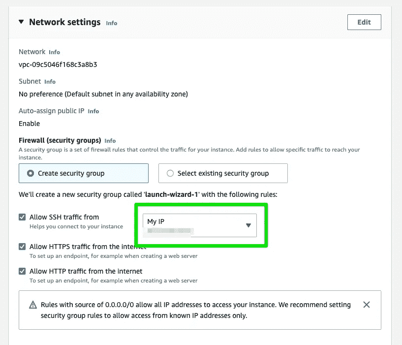
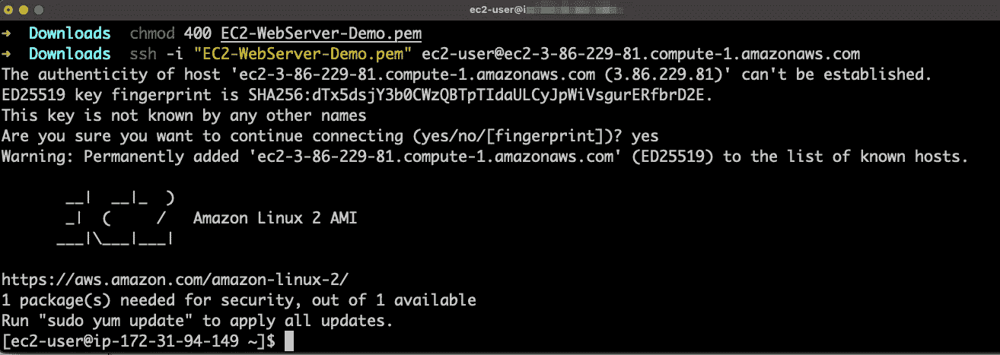

# 在 AWS 中部署 EC2 实例并安装 Apache

> 原文：<https://blog.devgenius.io/deploying-an-ec2-instance-in-aws-and-installing-apache-81d3c3670b9?source=collection_archive---------4----------------------->

## 亚马逊网络服务和 Apache


# 场景:

您的公司希望开始从使用本地服务器转向使用云中的服务器。他们要求您在 AWS 中创建一个 EC2 实例来托管他们的新网站，而不是购买数据中心的所有基础设施。

# 要求

*   AWS 自由层帐户

# 步骤 1:部署 EC2 实例

通过您的 AWS 帐户访问 EC2 服务。如果服务没有列在您的主页上，请使用左上角的搜索栏查找服务。


点击**“启动实例”**


现在我们可以命名它并选择想要的 **AMI** 和**实例**类型。我将选择保留在空闲层中的实例类型。


接下来，我们需要创建一个**密钥对**。这将发出一组 SSH 密钥，使我们能够通过 SSH 远程访问我们的实例。


接下来，我们需要创建一个新的安全组，允许公众访问网页，并允许我们通过 ssh 进入服务器。选中所有复选框，并在“**允许来自**的 SSh 流量”下拉菜单中输入您的 IP 地址。这将只允许来自您的 IP 的访问能够 SSH 到服务器。



点击**启动实例**部署实例。


# 步骤 2: SSH 进入实例

现在将 SSh 导入实例。在 EC2 服务页面中，找到并单击您的实例。


点击“**连接**按钮，然后点击“ **SSH 客户端选项卡**”。这将显示我们将用于远程输入的必要信息和命令。


在您的本地机器上打开一个终端，并按照概述的说明进行操作。



显示成功登录

# 步骤 3:安装 Apache

让我们为安装创建一个 BASH 脚本。打开您最喜欢的编辑器，输入以下代码。

```
#!/bin/bash
sudo yum update -y
yum install -y httpd
sudo systemctl start httpd
sudo systemctl enable httpd
sudo echo '<center><h1>This Apache Web Server is Running on an AWS EC2 Instance </h1></center>' > /var/www/html/index.html
```

将文件保存为“**install . sh”**并赋予其执行权限，运行脚本。


运行 BASH 脚本

# 最后一步:访问网站

既然服务已经安装并正在运行。在 web 浏览器中输入实例的公共 IP 进行确认。

