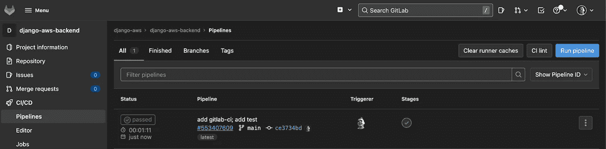

# 使用 Terraform 在 AWS 上部署 Django 应用程序。GitLab CI/CD

> 原文：<https://blog.devgenius.io/deploying-django-application-on-aws-with-terraform-gitlab-ci-cd-fbc2bbc0d286?source=collection_archive---------8----------------------->


在前面的部分中，我们已经[将 Django web 应用程序部署到 ECS](https://medium.com/@eugen1j.bondar/deploying-django-application-on-aws-with-terraform-minimal-working-setup-d6075b3b8299) 并且[将 PostgreSQL](https://medium.com/@eugen1j.bondar/bcd9c29d6276) 连接到它。但是现在，我们必须手动部署应用程序更改。在这一部分中，我们将通过以下步骤自动完成这一过程:

*   为[后端](https://gitlab.com/django-aws/django-aws-backend)和[基础设施](https://gitlab.com/django-aws/django-aws-infrastructure)仓库创建一个 GitLab 组和项目。
*   添加`test` CI/CD 阶段以运行测试。
*   添加`build` CI/CD 阶段以构建 docker 映像并将其推送到 ECR。
*   添加`deploy` CI/CD 阶段以更新 AWS 上的应用程序。

# 创建项目

让我们从创建 GitLab 组和项目开始。去[gitlab.com](https://gitlab.com/)注册一个账户。

然后[创建](https://gitlab.com/groups/new#create-group-pane)一个 [GitLab 组](https://docs.gitlab.com/ee/user/group/)。组就像是项目的文件夹。您可以为它们配置共享设置，如访问策略和 CI 变量。

为该组中的 [Django](https://gitlab.com/django-aws/django-aws-backend) 和 [Terraform](https://gitlab.com/django-aws/django-aws-infrastructure) 创建项目。确保删除“使用自述文件初始化存储库”选项，以创建干净的存储库。

另外，把你的 ssh 密钥添加到 [SSH 密钥](https://gitlab.com/-/profile/keys)部分。它允许你通过 Git 访问你的项目。

现在，让我们将两个库都推送到 GitLab。

```
# Push backend
cd ../django-aws-backend
git remote add origin git@gitlab.com:django-aws/django-aws-backend
git push --set-upstream origin main# Push infrastructure
cd ../django-aws-infrastructure
git remote add origin git@gitlab.com:django-aws/django-aws-infrastructure
git push --set-upstream origin main
```

在浏览器中检查您的 GitLab 项目，并验证推送是否成功。

# 阶段:测试

现在让我们向 Django 项目添加单元测试检查。Django 的单元测试使用 Python 标准库模块 [unittest](https://docs.python.org/3/library/unittest.html#module-unittest) 。点击查看更多关于测试 Django 应用程序[的信息。](https://docs.djangoproject.com/en/3.2/topics/testing/overview/)

转到 Django 项目，激活`venv`并启动一个 PostgreSQL Docker 容器:

```
$ cd ../django-aws-backend
$ . ./venv/bin/activate
$ docker-compose up -d
```

让我们创建`django_aws/tests.py`并添加一个简单的测试来检查数据库连接:

在本地运行`python manage.py test`:

```
$ python manage.py test
Creating test database for alias 'default'...
System check identified no issues (0 silenced).
.
----------------------------------------------------------------------
Ran 1 test in 0.010sOK
Destroying test database for alias 'default'...
```

现在，让我们在 GitLab 端添加这个检查。如果你不知道 GitLab CI 是什么，看看这里的。一般来说，GitLab 会运行[中指定的代码。存储库中的每次推送。](https://docs.gitlab.com/ee/ci/yaml/)

创建包含以下内容的`.gitlab-ci.yml`文件:

解释:

*   `image: python:3.10`。默认情况下，GitLab 使用 [docker 执行器](https://docs.gitlab.com/runner/executors/docker.html)在 GitLab 托管的共享运行器上运行 CI/CD 管道。这里我们为执行者指定 docker 图像。
*   `stages:`。一个管道可以有几个阶段。现在我们只有`test`阶段。未来我们会有三个阶段:`test`、`build`、`deploy`。GitLab 将按照指定的顺序执行阶段。
*   `services: postgres:14.2`。GitLab 将在`test`阶段在一个单独的容器中运行 PostgreSQL。因此，我们的 Django 应用程序将能够运行 DB 相关的测试。
*   `variables: POSTGRES_PASSWORD, POSTGRES_DB DATABASE_URL`-Django 和 PostgreSQL docker 容器的环境变量。
*   `cache: key:`。这里我们缓存了`pip install`命令的结果，以加速流水线执行。如果键`files: requirements.txt`自上次运行以来没有改变，GitLab 将下载`venv`和`.cache/pip`目录的缓存。
*   `script: ...`是要执行的命令。GitLab 逐个执行命令。如果某个命令返回非零退出代码，GitLab 将中断管道执行，并将其标记为*失败*。如果所有命令都已成功执行，GitLab 将当前阶段标记为*成功*并进入下一阶段。

现在，推动更改并查看 GitLab Django 项目的 [CI/CD](https://gitlab.com/django-aws/django-aws-backend/-/pipelines) 选项卡。

```
$ git add .
$ git commit -m "add gitlab-ci; add test"
$ git push
```



# 阶段:构建

测试通过了，所以我们进入了`build`阶段。在这个阶段，我们需要将 GitLab 帐户与 AWS 帐户连接起来，以授予 GitLab 访问 ECR 存储库的权限。为此，我们将创建一个拥有有限权限的单独的 AWS 用户`gitlab`。让我们转到 AWS IAM 控制台，创建一个新用户[。](https://us-east-1.console.aws.amazon.com/iam/home#/users$new?step=details)

> *你可以在这里* 找到如何创建 AWS 用户 [*的说明*](https://medium.com/@eugen1j.bondar/deploying-django-application-on-aws-with-terraform-minimal-working-setup-d6075b3b8299#0f15)

向此用户添加`AmazonEC2ContainerRegistryPowerUser`策略，以启用对此帐户上任何 ECR 存储库的读写权限。进入用户创建的最后一步，保存`ACCESS_KEY_ID`和`SECRET_ACCESS_KEY`。

现在转到 GitLab 组设置，添加`AWS_ACCOUNT_ID`、`AWS_SECRET_ACCESS_KEY`、`AWS_ACCESS_KEY_ID`和`AWS_DEFAULT_REGION`变量。GitLab runner 将使用这些凭据进行 AWS CLI 调用。

添加 GitLab CI/CD 变量

确保屏蔽敏感变量`AWS_ACCOUNT_ID`、`AWS_SECRET_ACCESS_KEY`和`AWS_ACCESS_KEY_ID`以隐藏它们在 GitLab 日志中的值。查看 [AWS 部署](https://docs.gitlab.com/ee/ci/cloud_deployment/index.html#aws)文档页面以获取更多信息。

然后添加到`.gitlab-ci.yml`构建模块:

解释:

*   `image: registry.gitlab.com/gitlab-org/cloud-deploy/aws-base:latest`。此映像允许在 CI/CD 期间使用 AWS CLI 命令。
*   `services: docker:20.10-dind`。我们使用 [docker-in-docker](https://docs.gitlab.com/ee/ci/docker/using_docker_build.html#use-docker-in-docker) 在 [docker 执行器](https://docs.gitlab.com/runner/executors/docker.html)中构建 docker 映像。Docker 作为一个独立的服务启动，因此我们可以从 GitLab 作业中访问 docker 守护进程。
*   `variables: DOCKER_HOST, DOCKER_TLS_CERTDIR`。指定 docker-in-docker 守护程序的路径，并禁用 TLS 连接。
*   `AWS_REGISTRY_URL`。从项目名称构建 ECR URL。确保 ECR repo 和 Gitlab 项目的名称相同。
*   `before_script: aws ecr get-login-password`。登录到 ECR。
*   `docker pull $AWS_REGISTRY_URL || true`。提取实际图像以将其用作缓存
*   `docker push $AWS_REGISTRY_URL`。将图像上传到 ECR。
*   `only: main`。我们将只为`main`分支建立一个 docker 映像。

提交您的更改并检查 CI/CD 管道:

```
$ git add .
$ git commit -m "add build stage"
$ git push
```


# 阶段:部署

构建阶段已过，现在我们将把容器从 ECR 部署到 ECS。

但是让我们从运行迁移开始。我们希望将迁移作为单独的 ECS 任务来运行，以避免对 web 应用程序产生任何副作用。转到`infrastructure`项目，在`ecs.tf`中进行以下更改并应用更改:

这里我们为`container_vars`中的`migration`和`web`容器移动了相同的变量。然后，我们为迁移容器创建了一个单独的任务定义和日志流。现在，我们可以使用指定的任务定义来启动任务，以便为每个版本应用迁移。

现在让我们创建一个部署脚本。返回 Django 项目并创建`scripts/deploy.sh`文件

```
cd ../django-aws-backend
mkdir scripts
touch scripts/deploy.sh
chmod 777 scripts/deploy.sh
```

包含以下内容:

您可以查看[运行-任务](https://awscli.amazonaws.com/v2/documentation/api/latest/reference/ecs/run-task.html)、[等待任务-停止](https://awscli.amazonaws.com/v2/documentation/api/latest/reference/ecs/wait/tasks-stopped.html)和[更新-服务](https://awscli.amazonaws.com/v2/documentation/api/latest/reference/ecs/update-service.html)命令的文档。

在本地运行该脚本进行检查:

```
$ ./scripts/deploy.sh
Collecting data...
Running migration task...
Task arn:aws:ecs:us-east-2:947134793474:task/prod/dcc06d7ec1ac4bb69bba445565eddf8b running...
Updating web...
"prod-backend-web"
Done!
```

我们已经由用户`admin`成功运行了这个脚本。GitLab CI/CD 将使用`gitlab`用户，因此我们需要授予所有需要的权限。

让我们创建一个新策略`gitlab-deploy-ecs`，并将其添加到`gitlab`用户。转到 [IAM 控制台](https://us-east-1.console.aws.amazon.com/iam/home)，选择“用户”选项卡并点击`gitlab`用户。


接下来，单击“Add inline policy”并添加 JSON 策略定义。你需要用你的`AWS_ACCOUNT_ID`而不是`947134793474`号。


解释政策:

*   `ec2:DescribeSubnets`、`ec2:DescribeSecurityGroups`——用于“收集数据……”舞台。
*   `ecs:RunTask`、`iam:PassRole` —用于运行迁移 ECS 任务。
*   `ecs:DescribeTasks` —用于等待迁移 ECS 任务结束。
*   `ecs:UpdateService` —用于更新 ECS Django web 应用程序。

点击“查看策略”，命名策略`gitlab-ecs-deploy`，点击“创建策略”。现在，`gitlab`用户将能够执行`deploy.sh`脚本。

将部署阶段添加到`.gitlab-ci.yml`

在部署阶段，我们只需运行`deploy.sh`脚本。我们使用`aws-base`映像来访问 AWS CLI 命令。

最后，让我们给 Django 添加一些更改，看看我们的应用程序会自动更新。让我们更改 Django 管理标题文本。将此行添加到`django_aws/urls.py`:

现在提交您的更改，看看您的管道进展如何。

```
$ git add .
$ git commit -m "add deploy stage"
$ git push
```


检查您的管理页面`prod-57218461274.us-east-2.elb.amazonaws.com/admin`并查看新标题。更新 ECS 服务可能需要一些时间。


此外，不要忘记将基础设施代码推送到 GitLab。

恭喜你！我们已经成功地用 GitLab 为我们的 web Django web 应用程序设置了 CI/CD。现在我们可以将代码提交到`main`分支，GitLab CI/CD 将自动测试、构建并在 AWS 上部署它。

但是`prod-57218461274.us-east-2.elb.amazonaws.com`域看起来不是用户友好的:)此外，我们需要用 SSL 证书保护用户和 Django 应用程序之间的连接。在下一部分中，我们将把 Namecheap 域连接到 AWS，并为它们设置一个 SSL 证书。

你可以在这里和这里找到后端和基础设施项目的源代码[。](https://gitlab.com/django-aws/django-aws-backend)

如果您的项目需要技术咨询，请查看我们的[网站](https://daiquiri.team/services/technical-consulting?utm_medium=referral&utm_source=medium_blog&utm_campaign=django_aws_3)或直接通过 [LinkedIn](https://www.linkedin.com/in/yevhen-bondar/) 与我联系。