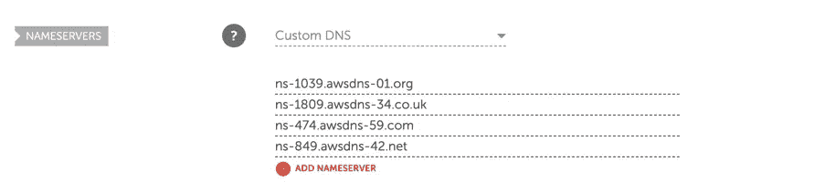

# 使用 Terraform 在 AWS 上部署 Django 应用程序。廉价域名+ SSL

> 原文：<https://blog.devgenius.io/deploying-django-application-on-aws-with-terraform-namecheap-domain-ssl-457779e3a20?source=collection_archive---------8----------------------->

在前面的步骤中，我们已经用 AWS ECS[部署了 Django，](https://www.notion.so/Deploying-Django-Application-on-AWS-with-Terraform-Minimal-Working-Setup-a48cfb630cf344a7a4f9b0f20f57a385)[将其连接到 PostgreSQL RDS](https://www.notion.so/Deploying-Django-Application-on-AWS-with-Terraform-Connecting-PostgreSQL-RDS-b8349e46f19548bb8ec41d8e8d28a5b9) ，并且[设置了 GitLab CI/CD](https://www.notion.so/Deploying-Django-Application-on-AWS-with-Terraform-GitLab-CI-CD-900e9fadec1945c099f88504343d4e3f)

在这一步中，我们将:

*   将[name price](https://www.namecheap.com/)域连接到 [Route53 DNS](https://aws.amazon.com/route53/) 区域。
*   用[证书管理器](https://aws.amazon.com/certificate-manager/)创建一个 SSL 证书。
*   将 HTTP 流量重新路由到 HTTPS，并禁用 Django 应用程序的 ALB 主机。
*   添加`/health/`健康检查路线。

# 设置 name price API

我已经在 [Namecheap](https://www.namecheap.com/) 上有了一个域名。所以我选择将 Namecheap 域连接到 AWS Route53 区域。但是你可以[用 AWS Route53 注册域名](https://docs.aws.amazon.com/Route53/latest/DeveloperGuide/domain-register.html)。

首先，让我们为 Namecheap 启用 API 访问。浏览[本](https://www.namecheap.com/support/api/intro/)指南以接收`APIKey`并将您的 IP 添加到白名单中。

其次，将 [Namecheap provider](https://registry.terraform.io/providers/namecheap/namecheap/latest/docs) 添加到 Terraform 项目中。将以下代码添加到`provider.tf`文件中:

在`variables.tf`中添加:

还将`TF_VAR_namecheap_api_username`和`TF_VAR_namecheap_api_key`变量添加到`.env`中，为相应的地形变量提供值。

用`export $(cat .env | xargs)`导入`.env`变量，并运行`terraform init`向项目添加一个 Namecheap 提供者。

# 将域连接到 AWS

现在，让我们为 Namecheap 域创建一个 Route53 区域，并设置 AWS 名称服务器。因此，所有 DNS 查询都将被路由到 AWS Route53 名称服务器，我们可以从 AWS Route53 区域管理 DNS 记录。

向`variables.tf`添加以下代码:

添加一个`route53.tf`文件:

跑`terraform apply`。查看 Namecheap 上的域名服务器:

域名廉价域名服务器

# 正在创建 SSL 证书

现在，让我们为`api.example53.xyz`域创建一个 SSL 证书并设置 DNS A 记录。

向`route53.tf`添加以下代码:

这里我们将为`api.example53.xyz`创建一个新的 [SSL 证书](https://aws.amazon.com/certificate-manager/)，通过 [DNS CNAME](https://docs.aws.amazon.com/acm/latest/userguide/dns-validation.html) 记录验证 SSL 证书，并且[将 DNS A 记录添加到负载均衡器](https://docs.aws.amazon.com/Route53/latest/DeveloperGuide/routing-to-elb-load-balancer.html)。

使用`terraform apply`应用更改，并等待证书验证。通常，最多需要几分钟。但在某些情况下，可能需要几个小时。你可以点击查看更多信息[。](https://aws.amazon.com/blogs/security/easier-certificate-validation-using-dns-with-aws-certificate-manager/)

# 将 HTTP 重定向到 HTTPS

现在让我们使用颁发的 SSL 证书来启用 HTTPS。用以下代码替换`load_balancer.tf`中的`resource "aws_lb_listener" "prod_http"`块:

这里，我们将不安全的 HTTP 流量重定向到 HTTPS，并为 HTTPS 端口添加一个侦听器。应用更改并检查[https://API . example 53 . XYZ](https://api.example53.xyz)URL。你应该看到 Django 的起始页。

# 设置 ALLOWED_HOSTS 变量

现在，让我们为 Django 应用程序提供 [ALLOWED_HOSTS](https://docs.djangoproject.com/en/3.2/ref/settings/#std-setting-ALLOWED_HOSTS) 设置。防止 [HTTP 主机头攻击](https://docs.djangoproject.com/en/3.2/topics/security/#host-headers-virtual-hosting)很重要。因此，Django 应用程序应该只接受主机头中的域`api.example53.xyz`。

现在 Django 接受任何域，例如负载平衡器的域。请访问`https://prod-1222631842.us-east-2.elb.amazonaws.com`核实这一事实。您可以忽略关于无效 SSL 证书的警告，并查看 Django 对该主机的响应。

此外，让我们禁用调试模式，并从代码中删除`SECRET_KEY`值以提高安全性。将带有随机生成值的`TF_VAR_prod_backend_secret_key`变量添加到`.env`中，运行`export $(cat .env | xargs)`，并在`variables.tf`中指定该变量:

接下来，在`ecs.tf`中传递域名和`SECRET_KEY`，在`backend_container.json.tpl`中设置`SECRET_KEY`、`DEBUG`和`ALLOWED_HOSTS`变量，并应用更改:

现在我们在 ECS 上有了所有必要的环境变量。转到 Django 应用程序并更改`settings.py`:

这里我们从 env 变量接收`SECRET_KEY`、`DEBUG`和`ALLOWED_HOSTS`变量。我们提供默认的`SECRET_KEY`来允许在本地运行应用程序，而无需在`.env`文件中指定`SECRET_KEY`。

# 健康检查

所有用户的请求都有主机头`api.example53.xyz`。但是，我们也有来自负载平衡器的[健康检查请求](https://docs.aws.amazon.com/elasticloadbalancing/latest/network/target-group-health-checks.html)。

AWS 负载平衡器可以自动检查我们的容器的健康状况。如果容器正确响应，负载平衡器认为目标*是健康的*。否则，目标将被标记为*不健康*。负载平衡器仅将流量路由到*健康的*目标。因此，用户请求不会命中不健康的容器。

> *对于 HTTP 或 HTTPS 运行状况检查请求，主机头包含负载平衡器节点和侦听器端口的 IP 地址，而不是目标和运行状况检查端口的 IP 地址。*

我们不知道负载平衡器的 IP 地址。还有，这个 IP 过一段时间就可以换了。因此，我们不能将负载平衡器主机添加到`ALLOWED_HOSTS`中。

解决方案是编写一个定制的[中间件](https://docs.djangoproject.com/en/3.2/topics/http/middleware/)，在主机检入`SecurityMiddleware`之前返回一个成功的响应。

首先，转到基础设施，将`load_balancer.tf`中的健康检查 URL 更改为`/health/`，并应用更改:

返回 Django 项目并创建`django_aws/middleware.py`:

将该中间件添加到`SecurityMiddleware`之前的`settings.py`:

在浏览器中运行`python manage.py runserver`并检查`127.0.0.1:8000/health/` URL。您应该会看到文本响应`Healthy!`。

提交和推送更改，等待管道并再次检查负载平衡器域`https://prod-57218461274.us-east-2.elb.amazonaws.com/`。现在，我们得到一个`Bad Request`错误。此外，我们没有看到回溯或其他调试信息，因此我们可以确定调试模式已被禁用。

此外，在浏览器中导航至`https://prod-57218461274.us-east-2.elb.amazonaws.com/health/`以检查`health_check_middleware`。我们得到了`Healthy!`响应。因此，负载平衡器将能够检查容器的健康状况，而无需提供正确的主机头。

恭喜你！我们已经成功地设置了域名，创建了健康检查，禁用了调试模式，并从源代码中删除了`SECRET_KEY`值。不要忘记将基础设施代码推送到 GitLab。

你可以在这里和这里找到后端和基础设施项目的源代码[。](https://gitlab.com/daiquiri-team/templates/django-aws/djaws-infrastructure)

如果您的项目需要技术咨询，请查看我们的[网站](https://daiquiri.team/services/technical-consulting?utm_medium=referral&utm_source=medium_blog&utm_campaign=django_aws_4)或直接通过 [LinkedIn](https://www.linkedin.com/in/yevhen-bondar/) 与我联系。