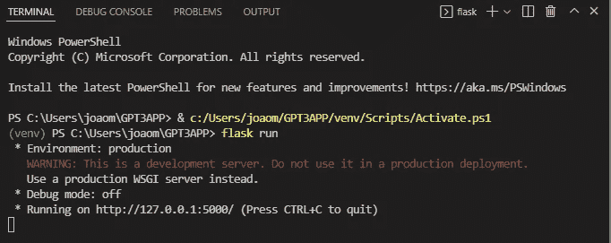
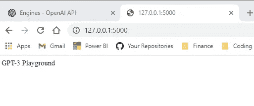

# 在烧瓶应用中部署 GPT-3

> 原文：<https://blog.devgenius.io/deploying-gpt-3-in-a-flask-application-eeb0d00de573?source=collection_archive---------0----------------------->

GPT-3 是开放人工智能开发的一个令人惊叹的 NLP 模型，它的 API 几个月前刚刚公开。该模型使用人工智能来处理文本，“几乎适用于任何涉及理解或生成自然语言或代码的任务”。这意味着使用人工智能来总结文本，作为一个聊天框工作，写故事(和代码)等…

在这个小例子中，GPT-3 将根据角色和经验水平向用户提供一系列准备面试问题。

这个简短的项目有望成为探索 GPT-3 的一个门户，同时也与 Heroku 合作，将 Flask 应用程序部署到在线环境中，以便每个人都可以与您的应用程序进行交互！

我们将把这个小项目分成两个部分:

1.  将应用程序部署到 Heroku
2.  将 GPT-3 应用到您的应用中

# 部署 Heroku 应用程序

类似于我之前关于用 Netlify 上传应用程序到网络的帖子，我们可以用 Heroku 做同样的事情。然而，这个例子的不同之处在于我们的 web 应用程序是动态的。这意味着我们不只是部署静态的 HTML，而是可以使用一个框架将变量传递到我们的标记中，并动态生成响应和 HTML 代码。

我们将使用 Flask，这是一个用于 Python web 开发的微框架。为什么是 Python？总的来说，Python 是一种很好的处理人工智能和机器学习模型的语言，有大量的文档，我们可以很快得到一些简单的东西。还有像 Django 这样的其他框架，然而，对于我们的应用程序，我们不需要额外的复杂性。

为什么是 Heroku？Heroku 是免费的主机，也相对简单。如果你的网站有更高的负载，你将需要付费，但是，在我的情况下，谢天谢地/可悲的是，在这个教程中我没有很多人访问网站，所以我不需要付费。

## Heroku 入门

首先，我将在下面的教程中使用的命令是针对**窗口的。Powershell 或 GitBash 命令因平台而异，所以如果你在 Mac 机器上，有些东西可能会改变。**

1.  打开 Visual studio 并按 Ctrl + ' —这将打开命令行。在右边选择 **Powershell。我个人更习惯于 Powershell，但是你也可以使用 Git Bash！**
2.  创建一个目录并放入 cd:

```
mkdir GPT3APP
cd GPT33APP
```


3.为 Python 创建虚拟环境并激活它

```
python -m venv venv
venv\Scripts\activate.ps1
```


您可以看到虚拟环境(称为 venv)已被激活，因为它以绿色突出显示。

4.安装依赖项:

```
python -m pip install Flask==1.1.2
python -m pip freeze > requirements.txt
```


5.创建 App.py 并粘贴:

```
from flask import Flask
app = Flask(__name__)

@app.route("/")
def index():
    return "GPT-3 Playground"
```


6.运行 Flask 并在本地主机上测试:

```
flask run
```



如果你点击了网站运行的链接，你可以查看我们的网络应用程序。这将是一个带有文本“`GPT-3 Playground`”的空白屏幕



本地主机上的 Web 应用程序

7.按 Ctrl + C 停止应用程序运行并粘贴:

```
$env:FLASK_ENV = "development"
flask run
```


8.设置您的 git repo

```
git init
echo venv > .gitignore
echo __pycache__ >> .gitignore
git add .gitignore app.py requirements.txt
git commit -m "Initialize Git repository"
```


9.设置您的 Heroku 帐户。为此，请访问 Heroku 的网站并免费注册账户。此时你还需要安装 [Heroku 的 CLI](https://devcenter.heroku.com/articles/heroku-cli) 。请选择并安装您的操作系统。通过键入“Heroku”来测试是否已在 Powershell 间隔上安装了 CLI。


10.登录 Heroku:

```
heroku login
```


11.在 git 中将文件夹提交到 Heroku。

```
echo "web: gunicorn app:app" > Procfile
python -m pip install gunicorn==20.0.4
python -m pip freeze > requirements.txt
git add Procfile requirements.txt
git commit -m "Add Heroku deployment files"
```


12.创建 Heroku App，将总支推入 App。如果您的文件尚未提交，请转到源代码管理，点击“…”并提交。这可能需要一段时间，因此在执行下一步之前，请等待所有文件都正确提交。


```
heroku create gpt-3-app-playground
git push heroku master
```

你现在应该可以在 Heroku 的用户界面上看到你的应用了。

我之前已经在 Heroku 上部署了我的网站，你可以通过进入仪表盘并点击打开应用来打开你的应用。

现在我们已经启动并运行了我们的应用程序，让我们添加 GPT3 的代码:

## 使用 Open AI 创建一个帐户并获取您的密钥

要使用 GPT-3 你需要在[开放 AI](https://beta.openai.com/signup) 注册。点击右上方的个人资料，输入您的钥匙:


您需要这些键来调用从 GPT-3 获取响应的 API。有了这些钥匙，你就可以获得价值 18 美元的信用额度。每次你调用 API 的时候，你都会从这 18 美元中扣除一些积分。GPT-3 有不同的[型号](https://beta.openai.com/docs/engines/gpt-3)，用于不同的目的和不同的“智能”水平。他们是达芬奇，居里，巴比奇和阿达。达芬奇是最有能力的，可以执行其他模型可以执行的所有任务，通常性能更好。也是最贵的。另一方面，Ada 是一个功能稍弱的模型，但速度非常快，可用于解析文本，解决简单分类类型的校正问题。

在我们的例子中，我使用 Davinci，因为我不担心计费，但是考虑最适合您的应用程序的模型是很重要的。我真的鼓励研究这些模型，以更好地理解它们的行为。

在 App.py 中添加我们需要的库和我们的密钥:

```
from flask import Flask, render_template, request
from datetime import date
import os
import openai
import json
import requests
key1 = 'sk-YQtgOUqZXkJ8oFLzORo2T3'
key2 = 'BlbkFJ7RbBtMo9KMz6RKXt2VbA'
openai.api_key = f"{key1}{key2}"
```

我将密钥分成两个密钥，因为 OpenAI 感觉到我的密钥已经暴露，并为了安全起见不断发布新密钥。这是因为这个项目在 GitHub 上是公开的。我将密钥分开，以确保它们无法被解析。对于生产，您永远不应该暴露您的密钥。

确保在 venv 中跟踪这些依赖关系，并通过在云外壳上再次执行来更新 requirements.txt:

```
python -m pip freeze > requirements.txt
```

我的 requirements.txt 是这样的，供你参考:

```
certifi==2021.10.8
charset-normalizer==2.0.11
click==8.0.3
colorama==0.4.4
et-xmlfile==1.1.0
Flask==2.0.2
gunicorn==20.1.0
idna==3.3
itsdangerous==2.0.1
Jinja2==3.0.3
MarkupSafe==2.0.1
numpy==1.22.2
openai==0.14.0
openpyxl==3.0.9
pandas==1.4.0
pandas-stubs==1.2.0.47
python-dateutil==2.8.2
pytz==2021.3
requests==2.27.1
six==1.16.0
tqdm==4.62.3
urllib3==1.26.8
Werkzeug==2.0.2 
```

现在添加我们需要的两个页面的代码。一个是面试登录页面，用户需要提示他们正在面试什么职位，以及专业知识的水平。然后这些参数作为变量传递给一个句子，让达芬奇做出响应。

```
[@app](http://twitter.com/app).route("/interviewPrompt", methods=["POST", "GET"])
def login():
    if request.method == "POST":
        job = request.form["job"]
        experience = request.form['experience']
        print(job)
        print(experience)response = openai.Completion.create(
        engine="text-davinci-001",
        prompt=f"Create a list of 8 questions for my interview as a {experience} {job}\n",
        temperature=0.5,
        max_tokens=150,
        top_p=1,
        frequency_penalty=0,
        presence_penalty=0)

        text = response.choices[0].text
        print(text)
        list = text.split('\n')[1:]
        list = filter(None, list)
        # list = ["sfsdgfsegds","sfsargsgd","sefsargsrgdsr"]return render_template("interview.html", 
        list=list
        )else:
     return render_template("interviewPrompt.html")
```

创建两个单独的文件来保存标记。HTML interview.html 是:这里我扩展了我提交的 base.html 模板，但本质上我保留它来保持我的跨页面网站结构。

```
 Login Page 
<style>
  .grad {
    background-color: #4158d0;
    background-image: linear-gradient(
      43deg,
      #4158d0 0%,
      #c850c0 46%,
      #f2893e 100%
    );
  }
</style><div class="container">
  <div class="row">
    <div class="col-sm-8">
      <div class="p-4 p-md-5 mb-4 text-white rounded grad">
        <div class="col-md-6 px-0">
          <h1 class="display-4 fst-italic">AI interviewing</h1>
          <p class="lead my-2">
            GPT-3 Powered prep interview questions. Insert a job position like
            "research assistant" and your experience level (junior, senior, Phd)
          </p>
        </div>
      </div>
    </div><div class="col-sm">
      <div class="p-4 p-md-5 mb-4 text-black rounded">
        <form class="text-center" action="#" method="post">
          <p class="font-weight-bold">
            What position are you interviewing for?
          </p><p><input type="text" name="job" /></p>
          <p>What's your experience level?</p>
          <p><input type="text" name="experience" /></p>
          <p><input type="submit" value="submit" /></p>
        </form>
      </div>
    </div>
  </div>
</div>
```


登陆页面(这段代码包含样式，我不在这里介绍，因为它是我的主网站的一部分)

和 interviewPrompt.html 的 HTML。这个 HTML 块获取 Davinci 响应的输出，该输出已经被转换成一个答案列表，并在 for 循环中显示包装在一个样式化 div 中的每个句子。

```
 Interview Page <style>
  .grad {
    background-color: #4158d0;
    background-image: linear-gradient(
      43deg,
      #4158d0 0%,
      #c850c0 46%,
      #f2893e 100%
    );
  }
</style><div class="p-2 p-md-5 mb-4 text-white rounded grad">
  <div class="col-md-6 px-0">
    <h1 class="display-4 fst-italic">Your interview Questions</h1>
  </div>
</div><div class="container">
  <div class="row mb-4">
    <div class="col-sm-2"></div>
    <div class="col-sm">
      <div class="card m-2">
        <div class="card-body">{{ value }}</div>
      </div>
    </div><div class="col-sm-2"></div>
  </div>
</div>
```


采访页面

用户传递了两个变量:“研究员”和“高级”，这意味着传递给达芬奇的输出句子是必不可少的:

```
Create a list of 8 questions for my interview as a senior researcher
```

从之前的提示可以看出，这正是我们收到的输出。高级研究员职位的八个面试问题。你甚至可以面试宇航员！这是惊人的，但远远不是一个人可以用 GPT-3 实现的全部可能性。

下面是一个例子，你可以用 GPT-3 做更多的事情！


希望这篇文章带给你一些好奇心，让你亲自测试这个 AI。你可以在 OpenAI 的网站[这里](https://beta.openai.com/playground)玩这个技术。

一如既往，感谢您的时间，如果您有任何问题或想分享什么，请随时联系我们！

-饶