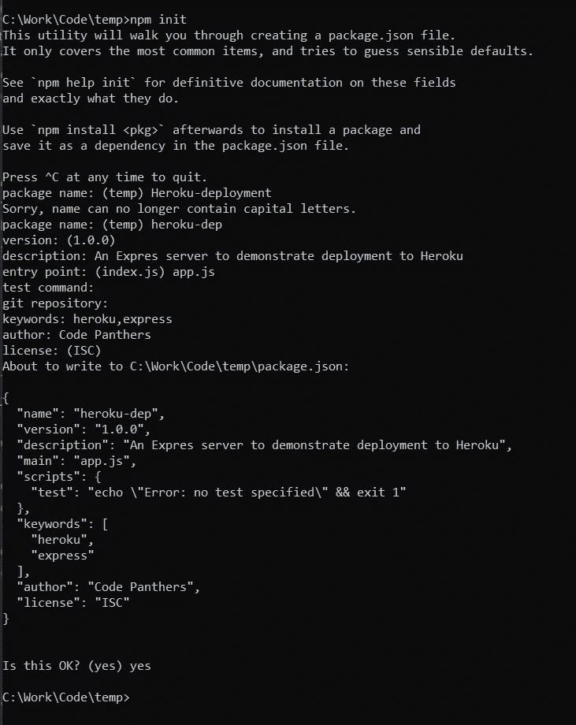

# 将 Node.js 部署到 Heroku

> 原文：<https://blog.devgenius.io/deploying-node-js-to-heroku-2ebe4c6bd946?source=collection_archive---------10----------------------->


在这个简短的故事中，我们将快速浏览一个简单的 Node.js 项目，具体来说，是一个 express 服务器，展示几个端点并将其部署到 Heroku。

在我们开始之前，看看下面的先决条件

# 先决条件

*   这不是一个扫兴的人。你需要在 Heroku 上有一个经过验证的账户。无需添加类似 CC 的支付方式。虽然那会给你每个月额外的空闲时间，但这完全取决于你
    这是到 https://signup.heroku.com/[Heroku 的链接](https://signup.heroku.com/)
*   安装了流行的 Git(流行的 VCS 工具)
    [https://git-scm.com/downloads](https://git-scm.com/downloads)
*   接下来是 Heroku CLI 工具，它将在这里找到
    [https://dev center . Heroku . com/articles/Heroku-CLI # install-the-Heroku-CLI](https://devcenter.heroku.com/articles/heroku-cli#install-the-heroku-cli)
*   最后，从这里安装 **node.js** ，这个大男孩(我们为本文选择的框架)
    [https://nodejs.org/en/download/](https://nodejs.org/en/download/)

> 确保安装 Node.js 的 **LTS** 版本，以获得最大兼容性。在撰写本文时，我使用的是 v16.14.0

# 服务器设置

## 创建新项目

好了，让我们打开你最喜欢的代码编辑器(Visual studio 代码)

打开指向项目根目录的终端，创建一个新的节点项目

```
npm init
```

这将在命令提示符下打开一个表单。只要继续按下一步或填写你认为合适的值(大多与项目名称，关键字等有关。这是一个示例屏幕



完成了吗？太好了！让我们进入下一步

## 设置 Git

对于 Heroku 部署，我们需要将项目设置为 git 存储库。只需在项目的根目录中键入以下命令

```
git init     // Setup up a new Git Repository
git add .    // Add already existing filed for Tracking changes
git stage .  // Add tracked files to the staging area
git commit -m "INITIAL COMMIT"  
// Commit all the changes in the staged area with a message
```

现在我们有了一个 Node.js 项目，它被设置为 git 存储库，并提交了初始更改

## 添加依赖关系

因为我们应该在我们的项目中使用 Express 构建一个 web 服务器，所以我们需要添加相关的包依赖项。现在我们只需要快递包裹。使用 NPM(节点程序包管理器)添加程序包

```
npm i --save express
```

对于典型的 Node.js 项目，我们对通过 git 跟踪存储在 **node_modules** 中的包不感兴趣。所以我们会告诉 git 忽略一些这样的文件和文件夹。这里有一个完全成熟的**。gitignore** 文件，它可以很好地设置您可以创建的所有节点项目

太多了？？？嗯，这个项目用比较简单的版本。给**加上下面一行。gitignore**

```
node_modules
```

## 编码吧

这里有一个简单的服务器代码，您可以参考它快速启动

确实很简单！！！。只需从根目录点击`node app.js`,您就可以让您的服务器在端口 80 上本地运行

注意第 3 行
Heroku 分配了一个动态端口来运行您的应用程序。通常存储在环境变量**端口**中。因此，请确保表达式如代码片段所示

这是一个简单的入门项目。现在让我们转到实际部署

# 部署到 Heroku

## 登录 Heroku CLI

首先要做的是用我们的 Heroku 凭证认证 CLI 工具。打开终端，输入以下命令

```
heroku login
```

这将打开一个新的浏览器标签，你会看到 Heroku 登录页面。完成该过程并返回到项目根目录。

## 新 Heroku 应用程序

Heroku 的部署以**应用**的形式管理。我们第一次部署某个东西的时候，Heroku 会为它创建一个 app，后续的部署，app 版本会递增。让我们先创建一个应用程序

```
heroku apps:create <app-name>
```

这将创建一个以你选择的名字命名的 Heroku 应用程序(考虑到它是可用的)。这样做的目的是在 Heroku 的域下创建一个空的远程 Git 存储库，它将作为远程库添加到我们的本地项目中。我们将把我们的更改推送到远程分支，以创建新的部署。所以我们就这么做吧。

## 部署到 Heroku

配置了本地 Git 并创建了一个新的 Heroku 应用程序后，我们需要做的就是将本地更改推送到 Heroku 的远程存储库。下面是相同的命令

```
git push heroku master
```

瞧！！！！

如果一切顺利，你会得到一个指向 Heroku 应用的 URL，这是你在互联网上的服务器代码。享受你在赫罗库🥂的第一次部署

> 注意:对于免费部署，Heroku 会让你的应用程序休眠 15 分钟。下一个电话可能需要比通常更长的时间来给你回应，因为应用程序实际上是从睡眠状态中醒来的(冷启动)。
> 不要担心，因为后续请求会非常快

# 最后…..

这就是本教程的全部内容。我希望你部署成功。请继续关注 Code Panthers，获取更多类似的袖珍教程和关于所有编程和云的详细系列。

**谢谢！！！**

[](https://www.buymeacoffee.com/fardeen9983)