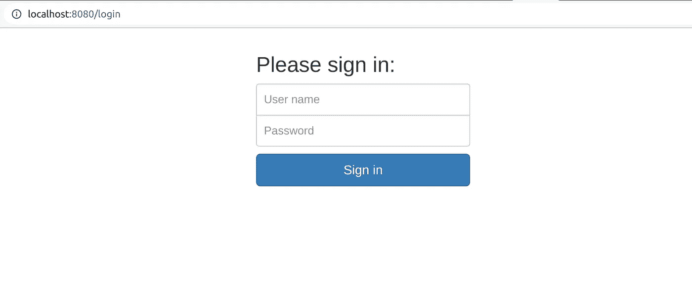

# 通过 shinyproxy 部署闪亮的应用程序

> 原文：<https://blog.devgenius.io/deploying-shiny-apps-through-shinyproxy-df28cca1e137?source=collection_archive---------8----------------------->


照片来自 [simplus](https://www.simplus.com/choose-right-deployment-strategy/)

Shinyproxy 是一个开源系统，它使得部署 dockerized 应用程序成为可能。用 shinyproxy 部署您的应用程序的美妙之处在于，它为您提供了开源环境中的企业特性。

使用 shinyproxy 系统的一些好处是:

*每个应用程序会话的工作空间隔离。
*你可以拥有尽可能多的用户。
*你不仅可以部署闪亮的应用，甚至可以部署 django、flask 等。
*你可以使用 docker API 来控制内存和 cpu 的使用

然而，该系统有一些缺点:

*用户必须等待容器旋转起来。
*设置 shinyproxy 系统需要一些努力和 docker 的高级知识。

说到这里，我们现在可以看一些关于如何在你的电脑上设置 shinyproxy 平台的七步指南。

1.  **安装 java**
    访问该网站并下载 Java:[*https://www.azul.com/downloads/?package=jdk*](https://www.azul.com/downloads/?package=jdk)
    从终端导航到您下载文件的位置并运行:

```
sudo apt install ./zulu17.30.15-ca-jdk17.0.1-linux_amd64.deb
```

**2。下载 shinyproxy**
从他们的网站下载 shiny proxy:[*https://www.shinyproxy.io/downloads/*](https://www.shinyproxy.io/downloads/) *挑文件用。jar 扩展
在你的电脑上创建一个文件夹，命名为 shinyproxy，然后将 jar 文件复制到这个文件夹中。*

***3。Docker+shinyproxy**
shiny proxy 将需要与 docker 守护进程对话，以便运行闪亮的应用程序容器，默认情况下，shiny proxy 通过端口 2375 连接。因此，我们必须对 docker 启动选项进行一些调整，以确保两个系统能够连接。*

*如果您的机器使用 systemd (ubuntu 16.04 LTS 及更高版本)，请使用以下内容:*

```
 *sudo systemctl edit docker*
```

*打开编辑器后，将以下几行添加到文件中:*

```
*[Service]
      ExecStart = 
      ExexStart = /usr/bin/dockerd -H unix:// -D -H tcp://127.0.0.1:2375*
```

*保存文件，关闭编辑器，然后重启 docker*

```
*sudo systemctl restart docker*
```

***4。从 openanalytics 下载演示图片:***

```
*sudo docker pull openanalytics/shinyproxy-demo*
```

***5。创建 application.yml 文件**
导航到你的 shinyproxy 文件夹，然后点击 application.yml*

*将以下内容复制到。yml 文件并保存更改:*

```
***proxy:**
  **title:** Open Analytics Shiny Proxy
  **logo-url:** https://www.openanalytics.eu/shinyproxy/logo.png
  **landing-page:** /
  **heartbeat-rate:** **10000**
  **heartbeat-timeout:** **60000**
  **port:** **8080**
  **authentication:** ldap
  **admin-groups:** scientists
  *# Example: 'simple' authentication configuration*
  **users:**
  - **name:** jack
    **password:** password
    **groups:** scientists
  - **name:** jeff
    **password:** password
    **groups:** mathematicians
  *# Example: 'ldap' authentication configuration*
  **ldap:**
    **url:** ldap://ldap.forumsys.com:389/dc=example,dc=com
    **user-dn-pattern:** uid={0}
    **group-search-base:**
    **group-search-filter:** (uniqueMember={0})
    **manager-dn:** cn=read-only-admin,dc=example,dc=com
    **manager-password:** password
  *# Docker configuration*
  **docker:**
    **cert-path:** /home/none
    **url:** http://localhost:2375
    **port-range-start:** **20000**
  **specs:**
  - **id:** 01_hello
    **display-name:** Hello Application
    **description:** Application which demonstrates the basics of a Shiny app
    **container-cmd:** **[**"R"**,** "-e"**,** "shinyproxy::run_01_hello()"**]**
    **container-image:** openanalytics/shinyproxy-demo
    **access-groups:** **[**scientists, mathematicians]
  - **id:** 06_tabsets
    **container-cmd:** **[**"R"**,** "-e"**,** "shinyproxy::run_06_tabsets()"**]**
    **container-image:** openanalytics/shinyproxy-demo
    **access-groups:** scientists

**logging:**
  **file:**
    **name:** shinyproxy.log*
```

*至此，您已经创建了 application.yml 文件，shinyproxy 使用它来启动和管理您的 docker 映像。*

**不适用:将认证从 ldap 更改为简单。您可以删除 ldap 验证配置部分**

***6。启动 shinyproxy**
要启动 shinyproxy，请导航到您创建的 shinyproxy 文件夹并运行以下命令:*

```
*java -jar shinyproxy-2.6.0.jar*
```

**注意:根据您的版本更改 jar 文件名，即您的版本可以是 shinyproxy-2.5.0.jar**

*现在你可以进入你的浏览器，输入地址: [http://127.0.0.1:8080](http://127.0.0.1:8080) 就会出现下面的页面:*

**

*使用 application.yml 文件中提供的凭据登录:*

```
 *username: jack
            password: password

            username: jeff
            password: password*
```

**不适用:您可以根据自己的喜好更改登录凭证**

*7.将您的 dockerized 应用程序添加到 shinyproxy*

*如果你能够与演示图像进行交互，那么我们知道我们的 shinyproxy 和 docker 系统目前工作正常。如果是这样的话，那么我们可以继续添加我们的 dockerized 应用程序，只是有一个过程是如何工作的感觉。*

*为此，我们需要编辑放在 shinyproxy 文件夹中的 application.yml 文件。导航到该文件夹并运行以下命令:*

```
*sudo nano application.yml*
```

****nano*** *是我们用来编辑文本文件的编辑器。**

*运行上述命令后，编辑器将打开 application.yml 文件。转到 specs:下的部分，并添加您的应用程序，如下所示:*

```
 *specs: 
             - id: myapp
               display-name: Student profile application
               description: This is an application the has details of students and their performance
               container-cmd: ["R","-e","shiny::runApp('/shiny/dashboard')"]
               container-image: yourname/appimage*
```

**N/B 相应调整容器-cmd 和容器-图像。此外，确保 container-cmd 命令与 dockefile 中的一样，否则您的容器将无法启动。**

*一旦你做了调整，你现在可以回到运行 shinyproxy 的终端。用 ***control + c*** 终止该进程，然后再次重启 shinyproxy，以便它拾取 yml 文件上的编辑。*

*像以前一样打开你的浏览器，输入地址[***http://127 . 0 . 0 . 1:8080***](http://127.0.0.1:8080*)。使用适当的凭证登录，您将在列表中看到您的应用程序。*

***还有 huuuurrrraaaaay！！我们已经设法建立了一个本地的 shinyproxy 系统。***

*参考*

1.  *[shinyproxy 文档](https://www.shinyproxy.io/documentation)*
2.  *[https://lukesingham.com/shiny-containers-with-shinyproxy/](https://lukesingham.com/shiny-containers-with-shinyproxy/)*
3.  *[https://hub.analythium.io/docs/shinyproxy/](https://hub.analythium.io/docs/shinyproxy/)*