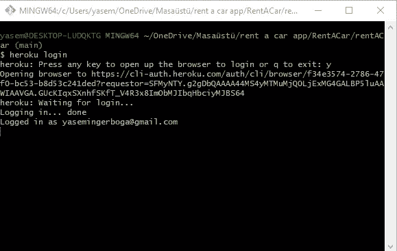

# 将 Spring Boot 应用部署到 Heroku

> 原文：<https://blog.devgenius.io/deploying-spring-boot-applications-to-heroku-dbd9d2b7923e?source=collection_archive---------4----------------------->

大家好！今天我要讲的是如何在 Heroku 上部署 spring boot 项目。很简单很简短。Heroku 是一个平台即服务，使开发人员能够完全在云中构建、运行和操作应用程序。Heroku 提供了一个托管 PostgreSQL 数据库的免费计划。

让我们部署我们的项目吧！首先，你必须在 Heroku 的[注册](https://signup.heroku.com/login)。注册后或者如果你已经有一个账户，你可以直接进入[登录页面](https://id.heroku.com/login)。登录后，主页出现在屏幕上。

主页

我以前部署过一个项目。因此，我的主页(上面的照片)可能和你看到的不一样。如果你是新来的，它将是空的。之后，您将点击“创建新应用程序”按钮。如果您是新手，它在主页上，但是如果您以前部署过项目，它在屏幕的右上角。你可以在下面的照片中看到它。

创建新应用程序按钮

点击此按钮后，您可以看到以下页面。

创建新应用程序页面

您可以选择应用程序名称和区域。你可以选择你附近的地区作为地点。如果您的应用程序名称被其他人使用，您必须更改名称。

之后，您应该单击“创建应用程序”按钮。

现在，我将解释如何使用 Heroku CLI 部署项目。

首先你需要安装 Heroku 命令行界面。Heroku CLI 需要 Git，这是流行的版本控制系统。没有的话可以从这里[安装](https://git-scm.com/book/en/v2/Getting-Started-Installing-Git)。如果你有 Git 或者在你安装了它之后，你可以从[这里](https://devcenter.heroku.com/articles/heroku-cli)安装 Heroku CLI。

安装后，你只需打开项目文件夹，点击右键，Git Bash 在这里。

你可以在下面的照片或网站上看到这些步骤。

现在，你必须登录你的 Heroku 账户。您应该将“heroku login”命令写入您的 git bash。此命令会在您的浏览器中打开登录页面。

然后，您应该将代码提交到存储库，并将其部署到 Heroku。在此之前，如果您没有“system.properties”文件，您需要在“pom.xml”文件所在的位置创建它。这个文件应该包含您在项目中使用的 Java 版本。如果不知道项目中使用的是哪个版本，可以从 IDE 中查看。我举一个来自 Eclipse IDE 的例子。

JDK·韦里森

system.properties 文件

之后，你应该输入命令
*git init*
*heroku git:remote-a your-application-name
git add。
git commit -am "您的提交消息"
git 分别推送 heroku master*
。

饭桶推 heroku 主人

建立成功

完成了！你可以在 Heroku 的网页上查看。如果您点按“打开应用程序”按钮，您可以看到您的网页。如果你用的是 Swagger-UI，你应该这样写网址:“https://your-application-name . heroku app . com/Swagger-UI/index . html #/”

你可以从[这里](https://rent-car-application.herokuapp.com/swagger-ui/index.html#/)查看我的申请。如果你有任何问题，不要犹豫问我。

在本文中，我试图解释如何在 Heroku 上部署 Spring Boot 项目。希望这篇文章清晰，有助于你更好的理解。我要感谢 Onur Akkepenek 的帮助。

这是我的 GitHub 地址:

 [## yasemingerboga -概述

### 此时您不能执行该操作。您已使用另一个标签页或窗口登录。您已在另一个选项卡中注销，或者…

github.com](https://github.com/yasemingerboga)