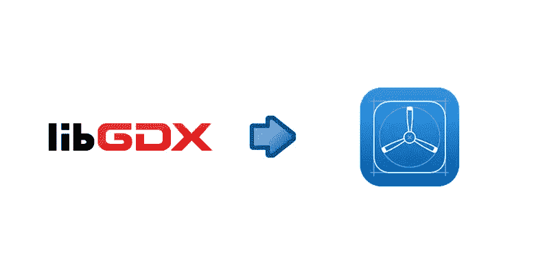

# 将您的 libGDX 游戏部署到 iOS TestFlight

> 原文：<https://blog.devgenius.io/deploying-your-libgdx-game-to-ios-testflight-163cada0696b?source=collection_archive---------7----------------------->



在我们进入任何细节之前，我只想说你需要对这个过程有一些耐心。我花了几天时间才弄清楚所有的事情，我想通过写这个指南来省去其他人的麻烦。

**完成这个过程需要的东西:**
- Android Studio
-一个完成的 libGDX 游戏(所有音频文件都需要是 mp3 格式)
-一台运行 Catalina (10.15.5)和 Xcode 11 的 Mac(我用的是 MacBook Pro)
-一台 iOS 设备(我用的是 iPad)
-一个苹果开发者账号
-很大的耐心

**步骤 1**
安装 MobiVM

首先你需要下载 MobiVM。确保获得版本 2.3.10
你可以在这里获得: [MobiVM](https://plugins.jetbrains.com/plugin/14440-mobivm)
打开 Android Studio 首选项并进入插件
点击齿轮图标
现在点击“从磁盘安装插件”
选择下载的 MobiVM 文件

打开 build.gradle，确保将您的 RoboVM 版本设置为 2.3.10
`roboVMVersion = 2.3.10`

确保您运行的是 gradle 6.5 或更高版本(您可以在 gradle-wrapper 属性中更改这一点)

**第二步**创建一个 Xcode 项目

在 Xcode 中创建一个新项目，给它一个和你的 libGDX 游戏一样的包 id `com.yourcompanyname.yourgame`。
连接你的 iPhone/iPad，在设备上运行游戏。

注意:如果你重启你的 iPhone/iPad，你需要重复这个步骤来加载你的 libGDX 游戏

**步骤 3**
您第一次接触预置描述文件

当您创建新项目时，Xcode 会自动为您生成一个临时描述文件。

(如果你没有苹果开发者账号，我不确定是不是这样)

因为你需要一个开发者帐号来发布你的游戏，你最好现在就做好准备。如果 Xcode 在设置开发者帐户之前没有自动为您生成临时描述文件，您可以删除您生成的 Xcode 项目并创建一个新项目。这应该是一个快速的过程。

注意:为了大大减少获得苹果开发者账户的痛苦，你可以在你的 iphone/iPad 上下载“开发者”应用程序，并用它来注册。只需要几分钟。

现在您已经有了一个预置描述文件，您将需要创建一个配置来在您的 iPhone/iPad 上运行您的 libGDX 项目。回到 Android Studio，打开运行/调试配置。单击左上角的“+”创建新配置。选择 RoboVM iOS。现在为您的架构选择“连接设备”和“arm64”。接下来，您需要选择您的签名身份(Auto 应该可以)和您的配置文件(iOS Team Provisioning Profile: *)。单击确定。

这应该允许你在本地 iOS 上运行你的 libGDX 游戏。你的电脑会询问你的用户密码，在弹出的窗口中你可以选择“总是允许”来避免以后遇到这种情况。
接下来，是应用商店。

注意:如果你到目前为止有任何问题，你可以查看本杰明·舒尔特 2019 年的这篇帖子。它会带你到这一步。
[https://medium . com/@ bschulte 19 e/deploying-your-libgdx-game-to-IOs-in-2019-8d 3796410d 82](https://medium.com/@bschulte19e/deploying-your-libgdx-game-to-ios-in-2019-8d3796410d82)

**第四步**
IOSLauncher.ipa

ipa 文件是苹果公司的谷歌 apk 文件。这是您将上传到 Apple 开发者帐户的文件。创建投资促进机构应该相当简单。

在 Android studio 中打开终端，输入`./gradlew ios:createIPA`

如果构建失败，请重新构建您的项目，然后重试。这个过程第一次可能需要一段时间(第一次尝试通常需要 7 分钟，之后只需要几秒钟)。也可能说`Classpath entry /path/main does not exist` ，挂 93%左右。这种情况每次都发生在我身上，但它确实完成了。

**第 5 步**
设置您的签名档案

这一步对我来说很痛苦。我花了一整天才想明白所有的事情。你真的只需要确保你有一个“苹果分销”签名身份和一个“应用商店”预置描述文件。

转到您的 Apple 开发者帐户。点击证书，身份证和个人资料。
在证书下，您需要创建一个分发证书。按照流程操作并下载文件。
在标识符下，您需要创建一个应用 ID。使用您喜欢的任何描述，并确保提供正确的包 ID。

接下来，转到 App Store Connect，使用您刚刚创建的凭据创建一个新的应用程序。

现在，在您的计算机上找到下载的证书并打开它。这将把它添加到您的钥匙串中。

**第六步**设置快车道

浪子是一个伟大的开源管理工具，它可以让你立刻注册并上传你的游戏。
首先你需要下载最新的 Xcode 命令行工具。

打开你的终端。(Go -> Utilities -> Terminal)
输入`xcode-select --install`
安装可能需要一段时间。安装完成后，您需要安装 fastlane。
输入`sudo gem install fastlane -NV`
现在导航到你创建 ipa 文件的同一个文件夹(MacHD->Users->your username->androidstudio projects->your game->IOs->build->robo VM)
注意:在`cd ..`上移一个文件夹类型，在`ls`列出该文件夹类型中的所有文件，在`cd yourFolderName`打开一个文件夹类型

**步骤 7**
认证并上传您的项目

通过键入`sudo fastlane cert`
认证您的项目通过键入`sudo fastlane sigh`
签署您的项目现在下一步是提交您的项目。不知道为什么要这样，但每次都要这样。键入`sudo fastlane sigh resign`
退出您的项目，您将看到您所有可用身份的列表。
复制苹果分销标识并粘贴在底部。这将放弃该项目。现在你已经准备好上传你的项目了。
类型`sudo fastlane pilot upload`

这将开始上传过程。如果第一次尝试就完成了，你就是神奇的！对于我们所有的正常人来说，是时候开始解决苹果抛给我们的一些问题了。

最常见的问题与图标有关。仔细阅读错误并进行适当的修改。您需要将以下内容添加到 info.plist.xml 文件中(位于项目的 ios 文件夹中):

```
<key>CFBundleIcons</key>
<dict>
    <key>CFBundlePrimaryIcon</key>
    <dict>
        <key>CFBundleIconFiles</key>
        <array>
            <string>Icon</string>
            <string>Icon-60@2x.png</string> <!-- added -->
            <string>Icon-72</string>
            <string>Icon-76@2x.png</string> <!-- added -->
            <string>Icon-120@1x.png</string> <!-- added -->
            <string>Icon-152@1x.png</string> <!-- added -->
        </array>
    </dict>
</dict>
```

如果你遇到其他问题，就去 stackoverflow.com 求助，那里有很多帮助。当我收到问题/请求时，我也会更新这个帖子。

如果你解决了苹果抛出的所有问题，你应该能够上传你的项目。打开 App Store Connect 并检查 TestFlight 选项卡。你的游戏现在应该可以测试了。

注意:如果您在签署应用程序时仍有问题，请转到您的开发者帐户中的证书、标识符和配置文件。点击档案，找到你的游戏，然后点击编辑。您将可以看到分配给此游戏的预置描述文件。确保它是分发证书。

我希望你能够使用这个指南上传你的游戏。如果你有任何问题，请随意发表评论，我会尽快回复你。另外，请随意指出你在我的指南中看到的任何错误。对我来说，这仍是一项进行中的工作。

如果你愿意支持我，你可以访问 [TMD 工作室](https://tmdstudios.wordpress.com/)并尝试我的一些游戏。

或者你可以[给我买杯咖啡](https://tmdstudios.wordpress.com/2020/04/28/support/)