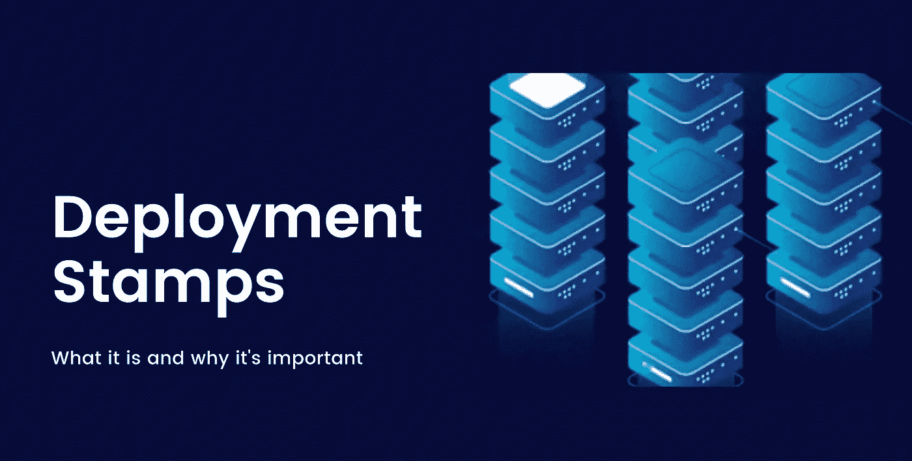
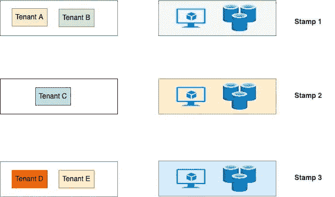
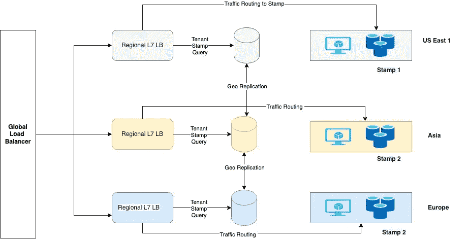

# 部署戳 101

> 原文：<https://blog.devgenius.io/deployment-stamps-101-7c04a6f704a2?source=collection_archive---------9----------------------->

这篇博客是我们从零开始讨论 101 个概念的系列文章的一部分，读者的入门知识有限。这篇文章属于 ***中级*** 系列，因为它涉及到理解**部署标记的**，它被用作在多租户设置**中扩展****异构工作负载的模式。**该模式允许隔离租户需求— *数据、计算和其他部署模块*。****

****101 系列中的一些早期博客如下:****

****[**CORS 101**](/cors-101-72b462396deb)[**断路器 101**](/circuit-breaker-pattern-101-be2d7fdb656) [**优先级队列 101**](/priority-queues-101-40eb4f6f5ee9) [**异步通信 101**](/async-communication-101-b04d5c95333a)[**数据库 101**](/database-101-13d593ec4078)****

************

# ******什么是部署戳？******

******部署标记的名称来源于术语“**橡皮标记**”，因为它有助于使用更小的可复制单元(称为**服务单元/扩展单元)扩展大型分布式工作负载。**每个单元可以为**1-N 个租户**提供流量，这取决于为资源划分选择的隔离标准。这种模式有助于限制**多租户**平台在随着客户需求增长而扩展其生产环境时受到任何云资源提供商的限制。******

****使用这种模式的其他优势包括 ***成本优化、工作负载地理分布的低延迟、部署/系统更新爆炸半径减小等*** *。*应对选择时间戳的非功能性要求进行尽职调查，以避免生产中出现过小或过大的时间戳。****

# ****结束 2 结束流程****

****如果工作量 ***即 TPS 和生命周期数据需求*** 超过了将租户单独托管到唯一 Stamp 的成本影响，则每个 Stamp 单元被映射到至少一个租户，并且在某些情况下映射到多个租户。此外，如果租户有合规需求，如[**【HIPAA】**](https://en.wikipedia.org/wiki/Health_Insurance_Portability_and_Accountability_Act)**、[**PCI**](https://www.pcicomplianceguide.org/faq/#1)**数据等，建议单独托管租户，以隔离 ***访问管理和审计需求*** 。********

## ******租户盖章映射******

********

## ****交通路线****

********

## ****顺序流程****

1.  ****所有租户都将*称为全局负载平衡器端点*。这在所有地区都是可用的。****
2.  *****全局负载均衡器*将流量路由到地理上最近的*区域负载均衡器*。****
3.  *****区域负载平衡器*查询包含租户的数据库，以标记所有用例的映射。****
4.  ****如果 stamp 部署与*区域负载均衡器*在同一区域，则选择相同的区域网络路径来服务 E2E 流量。****
5.  ****如果 stamp 部署与*区域负载平衡器*位于不同的区域，则*全局负载平衡器*会将流量路由到正确的区域网络路径。****

# ****优势****

*   ******爆炸半径减小**–在断电的情况下，只有给定的邮票和租户受到影响，以确保与其他租户的独立性。****
*   ******推广—**平台更新可以单独进行，因此租户可以灵活地避免在业务关键时段进行更新。****
*   ******成本优势**–在某些情况下，运行两个较小的云服务副本有利于降低云成本，而不是按照非线性定价模式扩展到更高的自定义 SKU。****
*   ******可扩展性限制—**大多数云服务对单个服务实例有限制，因此拥有多租户分区实例有助于隔离不断增长的数据需求。****

# ****摘要****

****我们讨论了**部署标记**的基础，这是一种可靠的模式，用于托管服务于具有不同业务需求的租户的平台，这些租户分布在不同的地理位置，具有独立的扩展和版本要求，以确保满足高性能的端到端 SLA。不同的云供应商有自己选择的全球和区域负载平衡器来设置自定义流量规则，以确保平台的高可用性。一些受欢迎的选择有 [**Azure Front Doo**](https://docs.microsoft.com/en-us/azure/frontdoor/front-door-overview) r、 [**Azure API 管理**](https://azure.microsoft.com/en-in/services/api-management/) 、 [**AWS 加速器**](https://aws.amazon.com/global-accelerator/?blogs-global-accelerator.sort-by=item.additionalFields.createdDate&blogs-global-accelerator.sort-order=desc&aws-global-accelerator-wn.sort-by=item.additionalFields.postDateTime&aws-global-accelerator-wn.sort-order=desc) 等**。******

*****如需反馈，请留言至****Amit[dot]894[at]Gmail[dot]com****或联系*[*https://about.me/amit_raj*](https://about.me/amit_raj)*的任何链接。*****