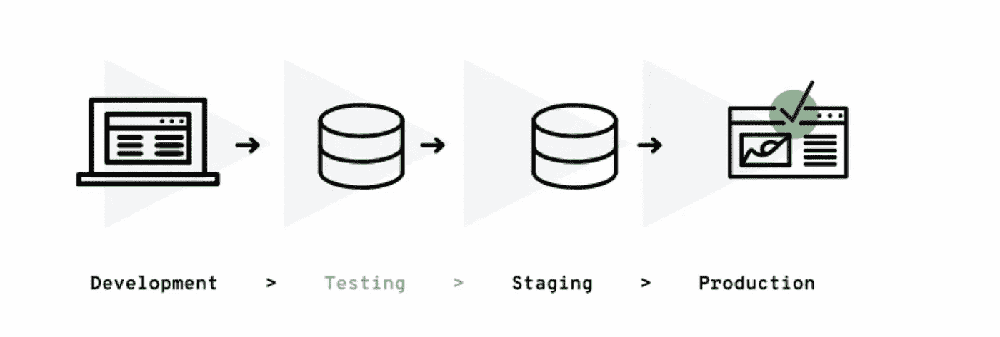
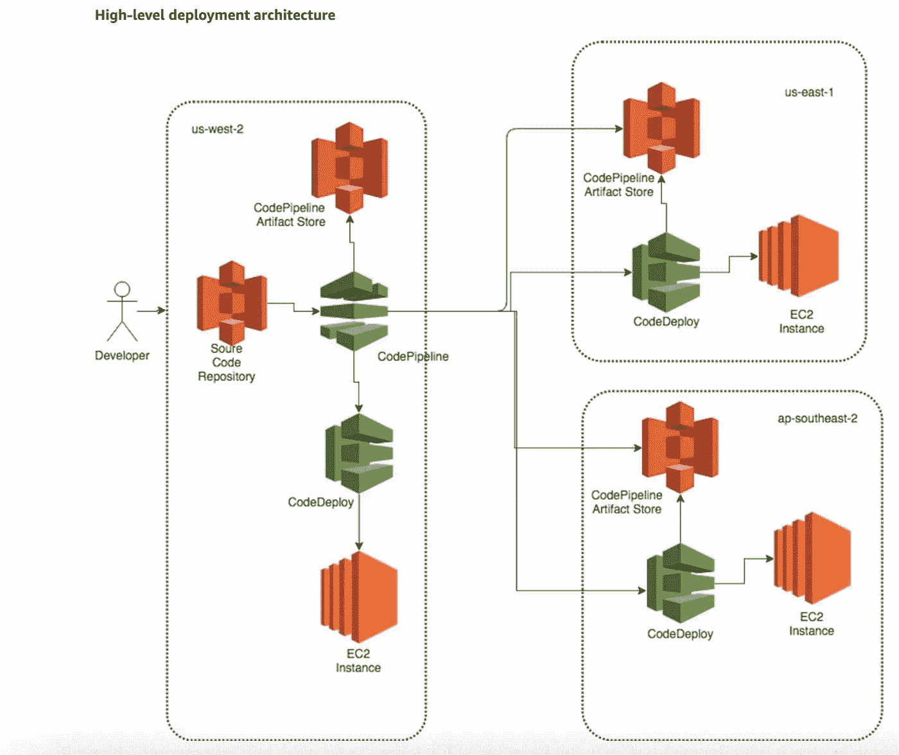
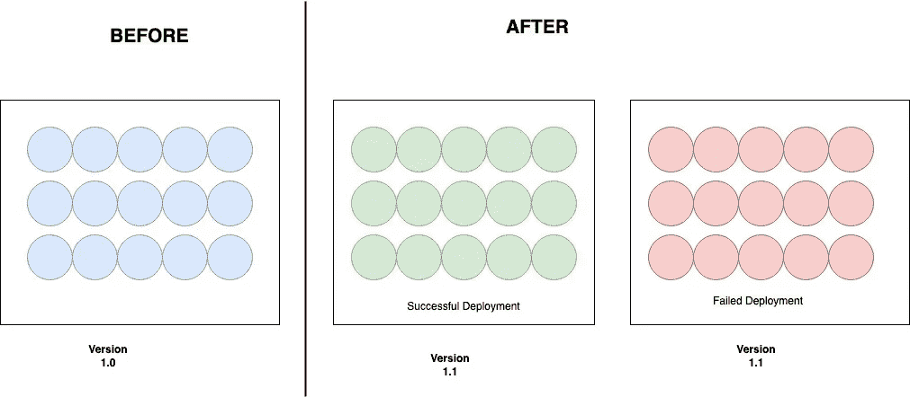
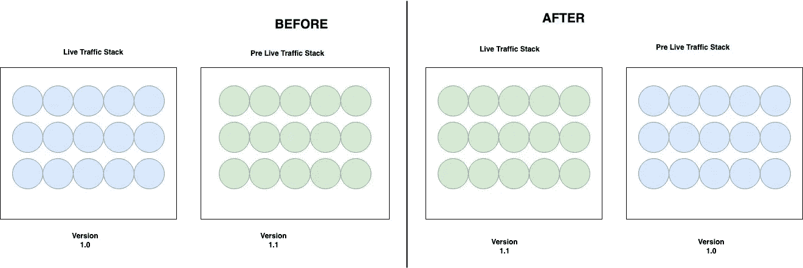
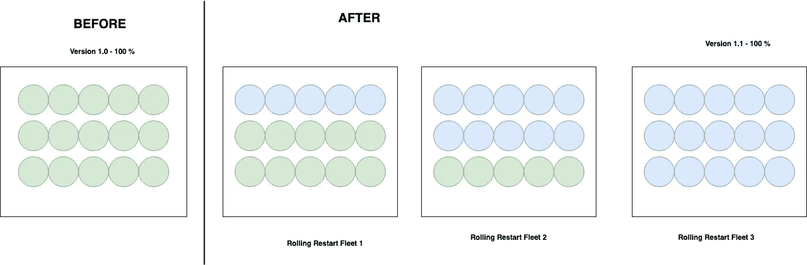
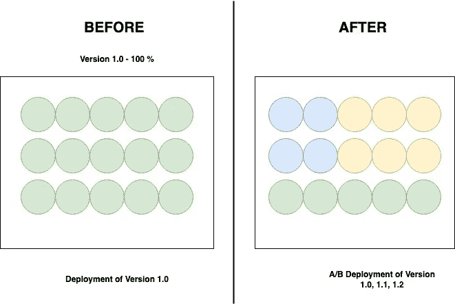

# 部署策略 101

> 原文：<https://blog.devgenius.io/deployment-strategies-101-ee2badd60799?source=collection_archive---------1----------------------->

这篇博客是我们从零开始讨论 101 个概念的系列文章的一部分，读者的入门知识有限。这篇文章属于*中级*系列，因为它涉及到理解**生产推广战略的基础知识，**对于产品特性和产品如何推广给众多客户至关重要。

101 系列中的一些早期博客如下:

[**API 101**](/api-101-773ec501b485) [**异步通信 101**](/async-communication-101-b04d5c95333a)[**数据库 101**](/database-101-13d593ec4078)[**数据库设计 101**](/database-design-101-7c019d69b97f)[**发布者-订阅者**](/publisher-subscriber-pattern-101-a0dd921025b9) **101**

**部署阶段**

# 什么是部署策略？

部署策略包括在生产环境中更新基础设施节点的一系列步骤，以优化 ***应用停机时间、客户功能爆炸半径、运行生产堆栈的运营和成本优势。*** 根据基础设施的分类，分为 ***计算、消息传递和数据库层*** ，应用不同的部署原则。

*   对于数据库来说，模式中的****【版本控制】和避免删除列/数据是关键的指导原则。****
*   ****对于消息传递层，在主动层为客户流量提供服务的同时，将向后兼容的模式更改部署到被动节点。****

****对于上述基础架构的非向后兼容变更， ***数据复制/备份/迁移*** 是选择主要版本升级场景的关键要素。****

*   ****对于这篇博客，我们将把我们的协同作用放在计算层，这通常是在 ***虚拟机/Kubernetes pods/Docker 容器*** 之间的选择。使用正确的自动化工具集可以统一应用以下原则。****

********

******AWS 上的多区域部署******

# ****部署策略的类型****

****为了对分布式体系结构的计算层所使用的部署策略进行分类，关键的分类元素是— ***%工件被部署到的服务器、部署期间应用程序的停机时间、活动/休眠服务器群的数量以及在给定 SLA 内回滚的能力*** 。结合使用上述因素，部署策略会有所不同，下面是一些流行的部署策略。****

## ****传统部署****

****在传统部署中，实时/生产堆栈中的所有服务器都一次性使用最新版本的代码进行更新。鉴于这种战略的性质，如果投入使用的时间相当长，它很容易同时出现**宕机**，并且会因为功能/非功能性错误而影响整个客户群。****

********

****这用于传统业务/基础架构，其中实时流量为 24 小时**<**，几个小时的停机对业务来说没有运行其他任务关键型部署策略的**成本影响**的风险。****

## ****蓝绿色部署****

****蓝色—绿色部署使用两个**同类堆栈/车队**计算实例，部署不同版本的应用程序。这些堆栈的名称为**蓝色/绿色**，部署策略将构件提升到**预活动堆栈**，一旦端点的基本验证完成，堆栈将被翻转。****

********

****用于具有实时 24*7 客户流量的任务关键型应用程序，蓝绿色侧重于整体体系结构的**运营和云成本**方面。此外，在**预实时堆栈**上的验证仅限于基本的健全性，一些客户用例仍然可以在实时堆栈上被发现。****

## ****金丝雀部署****

****Canary 的部署体现在最新版本的构件逐渐推广到被称为**canaris**的计算舰队子集。比如逐步推广到 **%的客户。** Canary stacks 有助于在较小的爆炸半径内识别功能性和非功能性问题。****

********

****与蓝绿色部署相比，这是任务关键型应用程序的**成本最优**选择，但是自动化和管道需要严格的自动化，以避免在整体生产部署中出现任何手动故障接触点。****

## ****A/B 部署****

****A/B 部署基于客户流中设置的实验标志，为不同的客户子集启用多个版本的应用程序。**浏览器 Cookies、A/B 测试工具或独特的部署堆栈/车队**是一些常用技术，用于识别符合版本/功能类型的客户。****

********

# ****摘要****

****我们讨论了一些用于应用基础架构计算层的最常用方法，但是基于自动化技术和配置，可以根据产品需求进一步定制生产堆栈。虽然在**成本、停机时间和自动化/运营复杂性**之间取得平衡对于团队来说是一个棘手的选择，但在**开发运维周期**的早期定义这些有助于通过正确的指标衡量所有生产部署，从而在生产部署中实现基于数据的决策****

*****如需反馈，请留言至****Amit[dot]894[at]Gmail[dot]com****或联系*[*https://about.me/amit_raj*](https://about.me/amit_raj)*的任何链接。*****