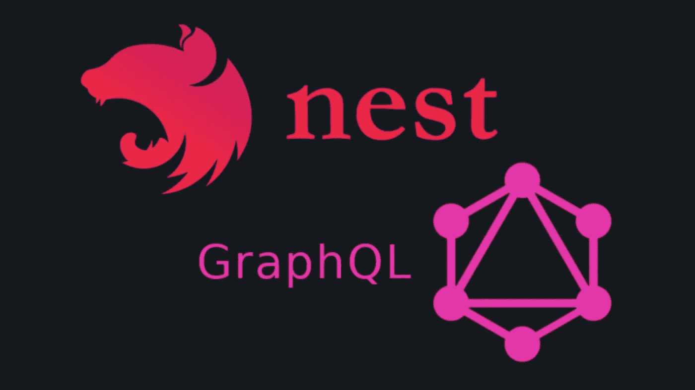
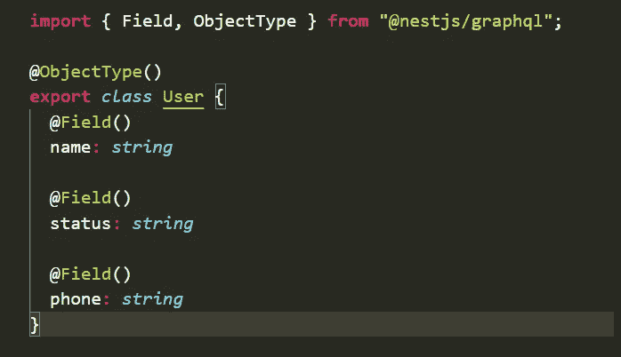
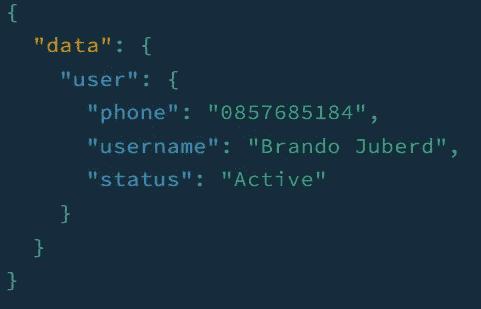
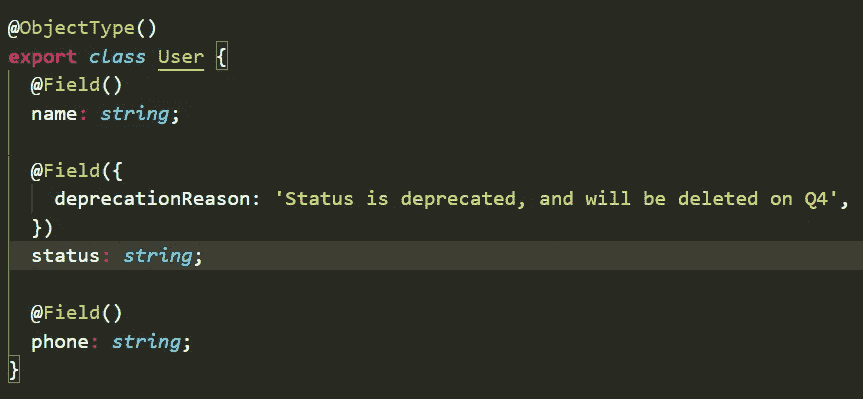
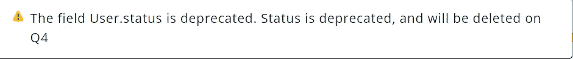
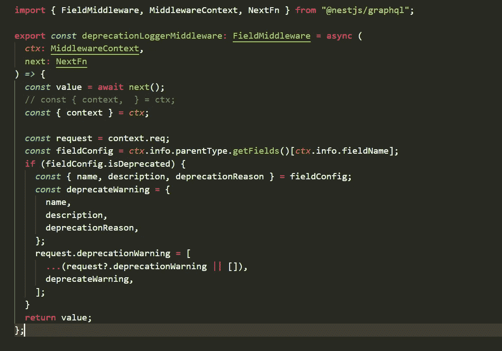
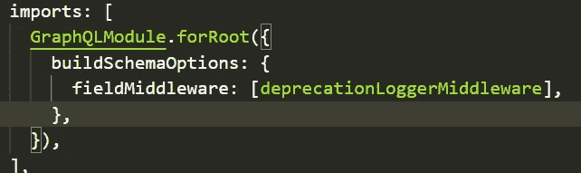
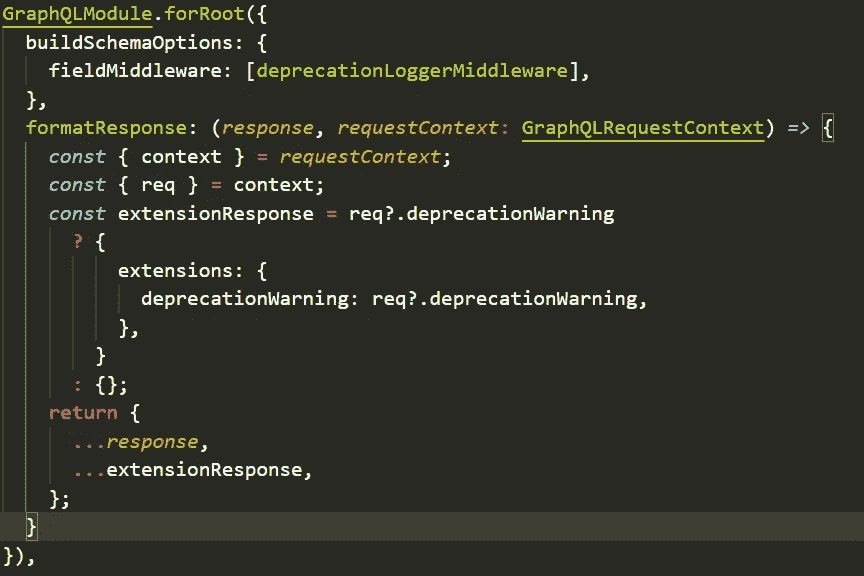
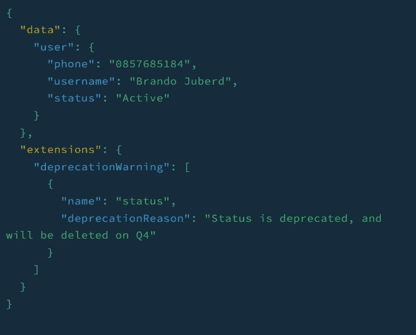

# GraphQL + NestJS 无版本 API 的弃用警告

> 原文：<https://blog.devgenius.io/deprecation-warning-with-graphql-nestjs-versionless-api-badcba08cb1f?source=collection_archive---------3----------------------->

src:[https://dev . to/3 logy/sign up-and-log in-cqrs-pattern-with-nest-js-passport-and-graph QL-32mj](https://dev.to/3logy/signup-and-login-cqrs-pattern-with-nest-js-passport-and-graphql-32mj)

# GraphQL 作为无版本 API 协议

GraphQL 已经被用作 API 协议，因为它在查询数据方面的灵活性以及创建*无版本* API 的能力。

GraphQL 中的无版本 API 可以通过添加新字段而不移除未使用的字段来继续更新 API 来实现，而不是移除字段 GraphQL 发送已经由开发者确定的不赞成消息。

开发人员可以通过 GraphQL Schema 访问不赞成使用的消息，但这意味着使用 API 的开发人员必须手动查询不赞成使用的消息，或者使用 GraphQL Playground 或 Apollo Studio 等应用程序。这种方式使得不赞成的消息很容易被错过。因此，API 开发人员需要找到一种方法，在不干扰数据结果的情况下向客户端发送反对消息。

GraphQL 响应由三个条目组成，关键字如下:数据、错误、扩展。关键数据和错误是不言自明的，扩展反而有点不同，GraphQL 开发人员没有明确定义它的功能和它的内容。

> [响应图还可以包含带有关键字](https://github.com/graphql/graphql-spec/blob/main/spec/Section%207%20--%20Response.md#response-format) `[extensions](https://github.com/graphql/graphql-spec/blob/main/spec/Section%207%20--%20Response.md#response-format)` [的条目。如果设置了这个条目，它的值必须是 map。这个条目是为实现者保留的，以他们认为合适的方式扩展协议，因此对其内容没有额外的限制。](https://github.com/graphql/graphql-spec/blob/main/spec/Section%207%20--%20Response.md#response-format)

因此，我们可以利用 extensions 键来发送不赞成的消息，而不会干扰数据或错误。

在此之前，我希望您理解弃用消息对于构建*无版本* API 的重要性，以及 GraphQL 响应上的键扩展的多用途性。

# 在 NestJS 和 GraphQL 上的实现

从这里开始，我假设您已经理解了如何用 NestJS 和 GraphQL 创建一个基本的 API。我将从称为 User 的基本对象类型开始。

该对象将返回如下响应

现在，我们将弃用状态字段，并添加弃用消息“状态已弃用，将于第 4 季度删除”。

该消息将显示在 GraphQL Playground 上，如下所示

逐个悬停的必要性使得 API 的使用不是一个好的体验。因此，取而代之的是，只在模式中定义它，我们将向客户端发送一个响应，连同我们在键**扩展**上的**数据**。

我们将使用一个全局现场中间件来访问弃用消息，现场中间件也只适用于查询所请求的字段。这种方法只适用于代码优先的方法。

1.  定义一个字段中间件函数，比如说
2.  该函数将访问包含与客户端请求相关的数据的**上下文**
3.  在请求中，我们将能够访问模式和**字段配置**
4.  从现场配置中，我们将能够访问当前现场信息
5.  如果该字段被弃用，我们将在上下文中添加一条信息
6.  最后，在 app.module 中导入 GraphQL 时，将这个中间件添加到 GraphQL 选项中

因此，我们已经向我们的 ***请求*** 添加了一个反对警告，但是我们还没有将它发送给客户端。

我们需要修改 GraphQL 响应(数据、错误、扩展)，为此我们将使用名为 **formatResponse** 的 GraphQL 选项。我们将能够在将最终响应发送给客户端之前对其进行更改。

1.  向 GraphQLModule 选项传递一个名为 formatResponse 的回调函数
2.  该函数将有两个参数 response 和 requestContext
3.  我们将访问我们的弃用警告，将其添加到键**扩展**中，并最终将其发送给客户端。

我们成功地将反对警告添加到扩展中，现在让我们看看从 GraphQL Playground 查询时的结果。

*Asik* ，我们已经完成了在每次客户查询时添加一个弃用警告。因此，我们的 API 用户将能够看到它，而不需要 GraphQL Playground 来轻松查看消息。