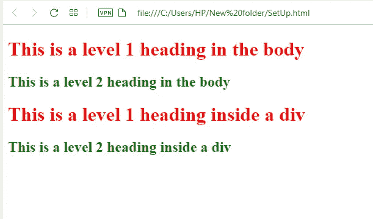
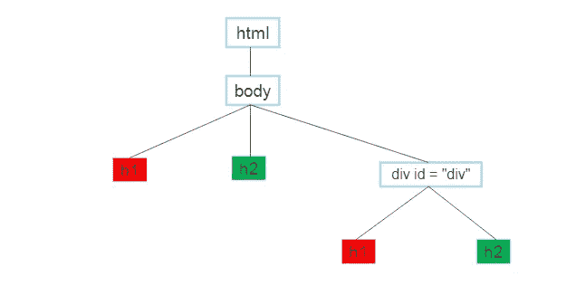
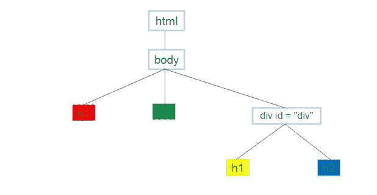
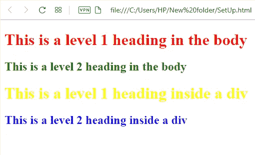

# CSS 中的后代选择器

> 原文：<https://blog.devgenius.io/descendant-selectors-in-css-b034e652bcc5?source=collection_archive---------20----------------------->


CSS 中的后代选择器允许你定位一个元素类型的后代，这个元素不必是父元素的直接子元素，而是它的任何后代。

假设我们有下面的 html 代码和样式表代码:

**HTML 代码**

```
<body>
  <h1> This is a level 1 heading </h1>
  <h2> This is a level 2 heading </h2>
  <div id ="div">
    <h1> This is a level 1 heading inside a div</h1> 
    <h2> This is a level 2 heading </h2>
  </div>
</body>
```

**CSS 代码**

```
h1{
color:red;
}
h2{
color:green;
}
```

**结局**



现在查看 CSS 样式代码，我们可以看到 h1 和 h2 元素文本分别设置为红色和绿色。这将影响整个页面中的所有 h1 和 h2 元素，包括 div 部分中的 h1 和 h2 元素文本，正如上面的结果图片所示。

但是考虑这样一种情况，我们希望 div 部分的 h1 和 h2 元素具有与主体中 h1 和 h2 的红色和绿色不同的颜色(分别为黄色和蓝色),我们该怎么办呢？

让我们看看 html 代码的 html 树，以便进一步了解发生了什么。

**我们有的:**



由于 CSS 代码要求将

# 和

## 元素分别着色为红色和绿色，因此页面中的所有

# 和

## 元素(包括 div 部分中的元素)都被分别着色为红色和绿色。但这不是我们想要的。

**我们想要什么:**



我们需要的是一种方法来告诉 CSS 我们只想选择从某些元素(div)派生的元素(h1 和 h2)。这就是后代选择器的用武之地。下面的 CSS 代码显示了它是如何做到的:

```
div h1 {
color: yellow;
}
```

从上面我们可以看到，div 是父元素，而 h1 是后代名称或子名称。

注意:父名和后代名之间必须有一个空格。

但是等一下，如果你仔细看看上面的 CSS 代码，你会发现有一个问题。问题是，如果我们稍后创建另一个具有 h1 元素的 div，它将遵守上面的 CSS 规则，因此将 h1 染成黄色，这可能不是我们想要的！。

为了避免这种情况，我们需要使用 div 的类名或 id 名来更具体地描述我们想要样式化的 h1。所以看看我们的 html 代码，我们会发现我们想要给 h1 元素指定黄色的特定 div 的 id 名称是“div”。

因此，我们将把 CSS 代码改为:

```
#div h1{
color:yellow;
}
```

同样的情况也适用于 h2，我们希望它的颜色是蓝色

```
#div h2{
color:blue;
}
```

注意:如果我们选择一个 id，我们使用井号(#)和点号(。)如果我们在 CSS 中选择一个类。

**预期结果**



从上面的图片中你可以看到，我们已经使用后代选择器正确地将 div 的 h1 和 h2 文本分别设置为我们想要的黄色和蓝色！。