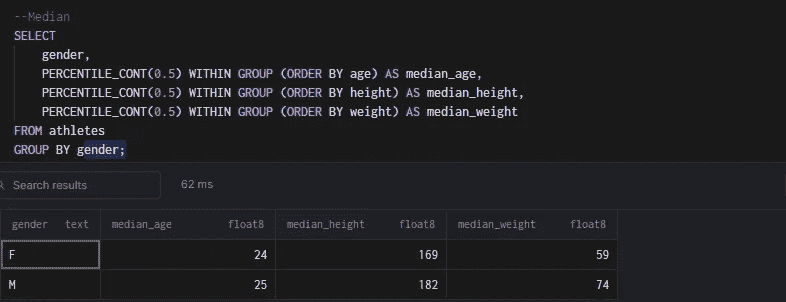

# 使用 PostgreSQL 的描述性统计

> 原文：<https://blog.devgenius.io/descriptive-statistics-with-postgresql-2811d5215270?source=collection_archive---------10----------------------->

如何在 PostgreSQL 数据库中生成汇总统计数据

了解您的数据对于任何数据分析项目的成功都至关重要。描述性统计揭示了数据中的变量以及两个或更多变量之间的关系。

在这篇博文中，我将讨论各种描述性统计技术以及如何在 Postgresql 数据库中计算它们。

**什么是描述统计？**

描述性统计在报告、图表和图示中总结并提供数字信息的定量概述。
描述性统计分析从收集的数据中提取真知灼见。
描述性统计不能超越手头的数据进行概括。

**描述性统计类型**

描述性统计有四种主要类型。

*   集中趋势测量
*   离差的度量
*   分配
*   统计相关性

**集中趋势的度量**

集中趋势的测量描述了在分布的中间或中心具有单一值的变量。三种主要的方法用于寻找集中趋势的措施是平均，中位数和模式。

**的意思是**

平均值是一个变量所有值的平均值。它可以通过将所有值相加并将总和除以值的总数来计算。

在 PostgreSQL 中， **AVG()** 函数计算平均值。 **ROUND()** 函数对 AVG()的结果进行四舍五入。

计算运动员数据集的年龄、身高和体重平均值的 select 语句:

计算按性别分组的运动员数据集的年龄、身高和体重平均值的 select 语句:

**中位数**

中位数是变量按升序或降序排列时的中间值。

在 PostgreSQL 中，GROUP**(ORDER BY****column _ name**)子句中的 **PERCENTILE_CONT(0.5)计算中位数。**

计算运动员数据集的年龄、身高和体重的中位数的 select 语句:

计算按性别分组的运动员数据集的年龄、身高和体重的中位数的 select 语句:

**模式**

众数是数据集中出现频率最高的值(变量)。

在 PostgreSQL 中，GROUP**(ORDER BY****column _ name)**子句中的 **MODE()计算模式。**

为按性别分组的运动员数据集计算年龄、身高和体重模式的 select 语句:

**分散度的度量**

离差的度量估计数值数据从中间值扩散的程度。它解释了数据的可变性。最常用的离差度量是极差、方差、标准差和四分位差。

**范围**

它是变量中最大值和最小值之差。

在 PostgreSQL 中， **MAX()** 函数计算列中的最大值， **MIN()** 函数计算列中的最小值。这两个值之间的差异是范围。

计算运动员数据集的年龄、身高和体重范围的 select 语句:

计算按性别分组的运动员数据集的年龄、身高和体重的 select 语句:

**差异**

方差是对可变性的一种度量，通过取平均值的方差的平均值来计算。

PostgreSQL 中有两个计算方差的函数。VAR_POP()用于总体数据，而 VAR_SAMP()用于样本数据。

计算运动员数据集的年龄、身高和体重方差的 select 语句:

计算按性别分组的运动员数据集的年龄、身高和体重的样本方差的 select 语句:

**标准偏差**

方差的平方根就是标准差。

PostgreSQL 中有两个计算方差的函数。 **STDDEV_POP()** 计算总体标准差， **STDDEV_SAMP()** 计算样本标准差。

计算运动员数据集年龄、身高和体重的总体标准差的 select 语句:

计算按性别分组的运动员数据集的年龄、身高和体重的样本标准差的 select 语句:

**四分位间距**

这是第三个四分位数和第一个四分位数之间的差异。

在 PostgreSQL 中，GROUP**(ORDER BY****column _ name**)子句中的 **PERCENTILE_CONT(0.75)计算第三个四分位数，GROUP (ORDER BY column_name)** 子句中的 **PERCENTILE_CONT(0.25)计算第一个四分位数。**

计算运动员数据集年龄、身高和体重的四分位范围的 select 语句:

计算按性别分组的运动员数据集的年龄、身高和体重的四分位数范围的 select 语句:

**分配**

当您绘制变量中的值与它们的频率的关系时，分布就是图形的形状。

计算运动员数据集年龄值频率的 select 语句:

计算运动员数据集年龄累积频率的 select 语句:

**统计相关性**

依赖性或相关性是两个或多个变量之间存在的关系。皮尔逊相关系数是计算变量间相关性的一种方法。它的分数从-1 到 1。两个变量之间的分数为零(0)表示它们之间没有关系。分数为-1 表示变量之间完全相反的关系，分数为 1 表示完全线性关系。

CORR()函数计算 PostgreSQL 中的皮尔逊相关系数。

为运动员数据集计算身高和体重之间相关性的 select 语句:

**结论**

这篇博文解释了各种描述性统计数据以及如何在 PostgreSQL 中计算它们的示例代码。

你可以从我的 [GitHub](https://github.com/amos-adewuni/descriptive_statistics_with_postgresql) 库下载运动员数据集和 SQL 脚本供你练习。

关注我的[推特](https://twitter.com/acube_yinka)获取更多数据相关信息。