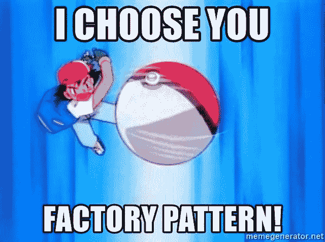

# 设计 101:简单工厂模式是什么？

> 原文：<https://blog.devgenius.io/design-101-what-is-the-simple-factory-pattern-919d957458c8?source=collection_archive---------11----------------------->

工厂设计模式基于一个简单的设计原则，即**我们必须识别可能改变的代码部分并封装它们**，这样改变代码的可变部分就不需要改变代码库的其他部分。



> **等等！封装是什么意思**？
> 在这种情况下，这具体意味着整个代码库不知道代码的特定部分是如何实现的，而是仅仅依赖于它所公开的接口，也就是说，在公开的接口改变之前，整个代码库不需要重构。

我将首先描述**简单工厂模式**,并为单独的文章保留工厂方法和抽象工厂模式。
我们可以通过 PizzaStore 的 **orderPizza()** 方法来理解这个模式

```
Pizza OrderPizza(String type) {
    Pizza pizza; /**
     * This portion of the code is bound to change.
     */
    **if(type == "cheese") {
        pizza = new CheesePizza();
    } else if(type == "veg") {
        pizza =  new VegPizza();
    } else if(type == "chocochip") {
        pizza =  new ChocoChipPizza();
    } else {
        pizza =  new BasicPizza();
    }** pizza.prepare();
    pizza.bake();
    pizza.cut();
    pizza.box();

    return pizza;
}
```

每当我们尝试引入任何新的比萨饼类型或删除任何旧的比萨饼类型时，使用 string 参数创建的比萨饼必定会发生变化。所以我们应该封装这部分代码。
让我们把这部分封装成一个披萨工厂。

```
Public Class SimplePizzaFactory {
    Public Pizza createPizza(String type) {
        Pizza pizza = null;
        **if(type == "cheese") {
            pizza = new CheesePizza();
        } else if(type == "veg") {
            pizza =  new VegPizza();
        } else if(type == "chocochip") {
            pizza =  new ChocoChipPizza();
        } else {
            pizza =  new BasicPizza();
        }**
        return pizza;
    }
}
```

**需要注意的细节！** 1。看来我们只是打包了垃圾，把它埋得更深了。
2。披萨的创建现在是集中的，所以任何需要的更改都可以在这里完成，不需要在多个地方进行重构。
3。字符串参数看起来仍然很难看。

**如果我们想要更多的参数，比如印度奶酪披萨和中国奶酪披萨不一样怎么办？** 如果我们再次使用简单工厂，除了类型参数之外，我们还需要添加另一个参数。更多字符串🤕！！

```
Public Class SimplePizzaFactory {
    Public Pizza createPizza(**String type, String place**) {
        Pizza pizza = null;

        if(place == "india") {
            if(type == "cheese") {
                pizza = new CheesePizza();
            } else if(type == "veg") {
                pizza =  new VegPizza();
            } else if(type == "chocochip") {
                pizza =  new ChocoChipPizza();
            } else {
                pizza =  new BasicPizza();
            }
        } else if(place == "china") {
            //..
        } return pizza;
    }
}
```

工厂方法模式解决了这个问题，**将具体 Pizza 的实例化委托给子类。** 在本 [**篇**](https://lug0.medium.com/design-102-why-do-we-need-factory-method-pattern-a272385731e6) **中写的更多！**

如果你觉得这篇文章很有见地，请给我一个掌声😄，快乐阅读！