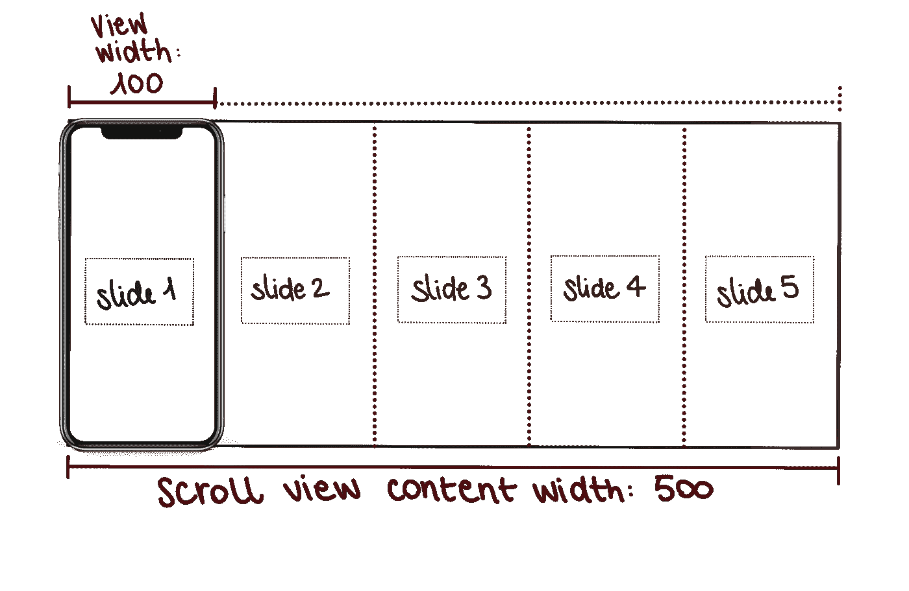
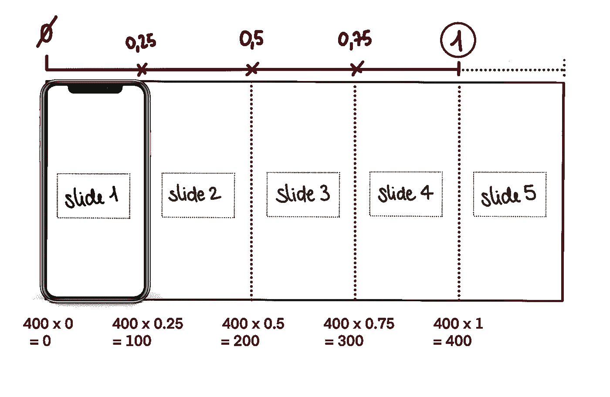

# 使用 Swift 5 为 iOS 设计一个漂亮的水平滑动演示

> 原文：<https://blog.devgenius.io/design-a-nice-horizontal-sliding-presentation-for-ios-using-swift-5-79706e27a087?source=collection_archive---------3----------------------->

## 滚动期间动画视图的大小和位置—第 3a 部分


最后是教程的最后一部分:视图的动画！如果你是新来的，请在这里找到我以前的教程:

*   [第一部分](https://betterprogramming.pub/design-a-nice-horizontal-sliding-presentation-for-ios-using-uiscrollview-and-uipagecontrol-swift-2c4fa1b11403)
*   [第二部分](https://medium.com/@margels/design-a-nice-horizontal-sliding-presentation-for-ios-using-swift-5-b312b9b1bbbc)

准备好重新开始了吗？

# 第 3 部分:滚动视图时制作动画

在本教程中，我们将了解如何:

*   翻页查看我们的滚动视图，
*   用我们的幻灯片填充它，
*   滚动时动画显示它们。

这将是一个冗长的解释，所以将有一个 3b 部分，我们将通过照片中的动画的其余部分。

说够了，我们开始吧！

## 第一步:准备幻灯片

首先:幻灯片！现在，我们只有一个在视图控制器中设置的滚动视图，里面没有视图。我们已经建立了每个视图的框架，所以我们需要做的是使用它来创建多个幻灯片。

创建一个名为`getSlides`的函数来创建幻灯片。在此功能中，我们将:

*   使用完成处理程序来传递一个布尔值，以确认幻灯片何时准备好；
*   使用 for-in 循环为我们在本教程第 2 部分中定义的每个`slides`创建一个幻灯片；
*   用每张幻灯片的标题和副标题值填充幻灯片的标题和副标题；
*   将幻灯片视图添加到数组`presentationSlides`。

该函数将如下所示:

返回到您的`viewDidLoad()`函数，添加函数`getSlides`，这样视图将开始加载幻灯片:

```
// prepare slides
self.getSlides { success in}
```

成功值将决定所有幻灯片何时完成，以及何时运行代码的下一部分。

## 第二步:计算时间间隔

滚动视图的内容宽度应该对应于视图宽度乘以幻灯片数量。这意味着，如果你的视图的宽度是 100，你有 5 张同样大小的幻灯片，当代码编译时，滚动视图的内容宽度应该是 500。



现在我们知道，对于每 100 个像素，我们有一个 100 像素宽的幻灯片！所以，准确的说…

*   第一张幻灯片将从像素 0 开始；
*   第二，在像素 100 处；
*   第三，在像素 200 处；
*   第四，在像素 300 处，
*   最后，第五个在像素 400 处(注意，在像素 500 处，除了最后一张幻灯片的右边缘，我们不应该有任何东西，因为那是我们内容视图的结尾)。

听起来很容易！另外，谁不爱简单的，整数呢？…可惜它们在现实中并不存在。与电视机的音量不同，大多数视图的大小可以用不能被 2 或 5 整除的数字来表示。去想想…

那么，我们如何在不使用计算器的情况下，从奇怪难看的数字中得到这些区间呢？很简单！首先，你需要一份大跨步的声明。

> stride 语句]返回一个序列，从起始值向结束值(可能包括结束值)步进指定的量。

你对它熟悉吗？有两种方法可以使用 stride 语句:

*   `stride(from:through:by:)`如果您希望序列包括结束值，并且
*   `stride(from:to:by:)`如果希望序列排除结束值。

在这种情况下，我们将计算从 0(第一张幻灯片的起始 x 点)到 1(最后一张幻灯片的起始 x 点)的间隔，使用数字 1 除以幻灯片的数量，减去 1。

好吧，我明白了，听起来好像我在解释量子力学。不过，我知道如何变得不那么无聊，所以这里有更多的图画:



请注意，该除法是用总幻灯片数减一来计算的。这是因为你需要的只是中间空格的偏移量，而这些空格总是比幻灯片的总数少一个。迷茫？想想五声音阶:5 行，4 格。甚至等号:`=`。两行之间有多少空格？

> 对于仍然困惑的《生活大爆炸》粉丝来说:你知道佩妮也有你同样的疑问吗？看看第 12 季第 5 集 9.22 分钟，看看科学家的解释是否能消除所有疑问。

我们想做的是找出:

*   幻灯片何时应该缩小和放大，取决于沿着滚动视图的位置，以及放大多少；
*   页面控件上应该显示哪一页(打赌你忘了那一页，我一直在给你灌输这么多信息和公式)。

以我们之前的例子为例，我们的步幅公式应该是这样的

```
stride(from: 0.0, through: 1.0, by: (1/(slides.count-1)))
```

输出应该是[0，0.25，0.5，0.75，1]，它们表示我们的滚动视图内容视图中 5 张幻灯片的起始 x 点的比率。

下面是整个函数:

在我们继续之前，创建一个名为`intervals`的属性，包含我们将从`getIntervals`函数中获得的 CGFloats 数组:

```
var intervals: [CGFloat] = []
```

当然，现在我们需要告诉我们的应用程序滚动视图应该:

*   宽度足以容纳我们的 6 张幻灯片(或多或少，如果你愿意)；
*   启用分页以定义用户滚动幻灯片的方式；
*   添加实际幻灯片，按照上述标准定义位置和大小。

在代码中:

现在回到你的`viewDidLoad`并在`getSlides`函数中，添加我们的两个新函数和一行代码来设置我们的滚动视图的代理为 self。

```
// prepare slides
self.getSlides { success in// calculate x position of each slide and set up pages
   self.intervals = self.getIntervals(pages: self**.**slides.count)
   self.presentationScrollView.delegate = selfself.setupSlideScrollView(slides: self.presentationSlides)
}
```

没有了行`self.presentationScrollView.delegate = self`,我们的滚动视图将不能传达滚动视图上的任何变化，因此，不能在我们的视图上执行任何操作。

现在一切都应该看起来不错，除了一件事:我们的滚动视图委托行上的红色错误是什么？

## 步骤 3:设置滚动视图代理

简单的解决方法:在视图控制器的末尾添加下面几行代码，用`UIScrollViewDelegate`创建它的扩展，并添加方法`scrollViewDidScroll`，以便在用户滚动时与我们的视图进行通信。

```
extension **ViewController**: UIScrollViewDelegate { func **scrollViewDidScroll**(_ scrollView: UIScrollView) { }}
```

在您的`scrollViewDidScroll`函数中，添加 [Anitaa Murthy](https://medium.com/u/b69ba9cd4ff2?source=post_page-----79706e27a087--------------------------------) 教程中的以下代码行，计算您滚动时视图的偏移量:

```
 // get the current scrolling offset
    let **maximumHorizontalOffset**: CGFloat = scrollView.contentSize.width - scrollView.frame.width
    let **currentHorizontalOffset**: CGFloat = scrollView.contentOffset.x
    let **maximumVerticalOffset**: CGFloat = scrollView.contentSize.height - view.frame.height
    let **currentVerticalOffset**: CGFloat = scrollView.contentOffset.y
    let **percentageHorizontalOffset**: CGFloat = currentHorizontalOffset / maximumHorizontalOffset
    let **percentageVerticalOffset**: CGFloat = currentVerticalOffset / maximumVerticalOffset
    let **percentOffset**: CGPoint = CGPoint(x: percentageHorizontalOffset, y: percentageVerticalOffset)
```

不错！现在，我们每滚动一次，`scrollViewDidScroll`函数就会计算我们视图的偏移量。我们想要的是`x`值，因为我们的幻灯片将水平滚动。

为了测试它，用滚动视图的`percentOffset.x`值做一个`print`语句:


如您所见，当您滚动时，控制台将打印您的`x`位置的偏移。您所要做的就是将它连接到视图中的元素，以定义它们的位置和大小！

在我们这样做之前，进入您的`viewDidLoad`方法内部，具体来说，进入方法`self.getSlides`的闭包内部，并添加以下代码行来设置您的`UIPageControl`使其与幻灯片同步:

```
// set up page control and bring to front
self.presentationPageControl.numberOfPages = self.slides.count
self.presentationPageControl.currentPage = 0
self.presentationPageControl.isUserInteractionEnabled = falseself.view.bringSubviewToFront(self.presentationPageControl)
```

今天就到这里，但是不要担心:第三篇教程的 B 部分很快就会出来。请继续关注我的内容，我的新教程会及时更新，请在下面的评论中告诉我你的反馈！

你喜欢这个教程吗？它和你的项目合作得好吗？

```
**Want to Connect?** Follow me on…
❤️ [YouTube](https://www.youtube.com/channel/UC5hqYiHxie458KSO1PAnA8Q)
💖 [Dribbble](https://dribbble.com/margelss)
💜 [Instagram](https://www.instagram.com/itsmargels/)
💙 [Ko-Fi](https://ko-fi.com/margelss)
🖤 [GitHub](https://github.com/Margels)
```