# 使用 Swift 5 为 iOS 设计一个漂亮的水平滑动演示

> 原文：<https://blog.devgenius.io/design-a-nice-horizontal-sliding-presentation-for-ios-using-swift-5-b312b9b1bbbc?source=collection_archive---------3----------------------->

## 使用 xib 文件创建定制视图—第 2 部分


你好。我终于回来了，继续我的《T3》第一部《T4》。今天我们要为我们的演示制作幻灯片！兴奋了吗？

# 第 2 部分:创建幻灯片

为了制作幻灯片，我们需要:

*   定义幻灯片应该携带什么数据的结构对象，
*   答。xib 文件来定义幻灯片的外观，
*   带有已定义标题和副标题的幻灯片列表。

准备好开始了吗？

## 步骤 1:创建 xib 文件

这一步非常简单。右键点击你的导航面板，悬停在“新文件…”并选择它。


这是添加新的。swift 文件，只是这次您将选择不同类型的文件。

在用户界面部分，选择“查看”作为您将创建的文件类型。

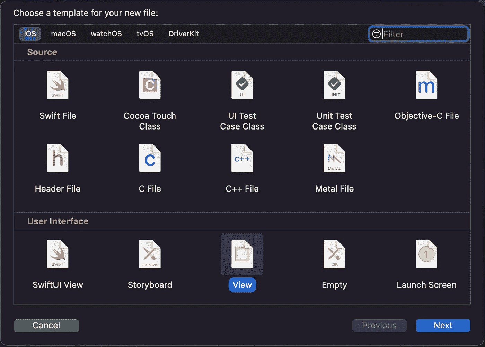

现在命名你的文件。我将使用名称`presentationSlide`,但是，像往常一样，如果你不仅仅是出于教育目的跟随本教程，我建议你使用一个在你的项目环境中更有意义的名称。

您现在应该会看到这样的内容:

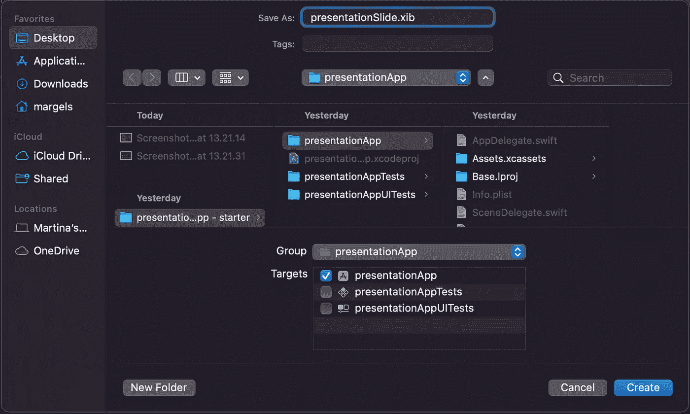

单击“创建”，您应该会看到类似这样的内容:

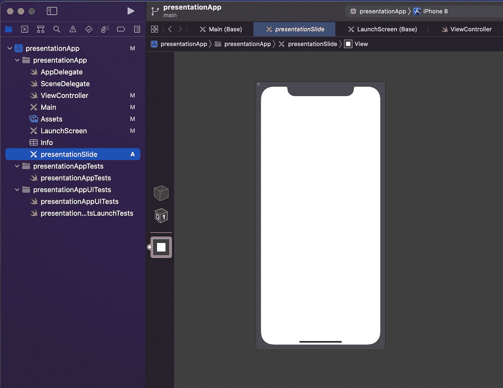

完美！的。xib 文件准备好了。现在是时候定义每张幻灯片的外观了。

## 第二步:创建你的幻灯片

我的幻灯片结构如下:

*   背景将是透明的，因此用户将能够看到滚动视图后面的背景图像；
*   在这个视图的中央会有一个垂直的堆栈视图，这就是标题和副标题标签的位置。

您可以像使用故事板一样使用这个界面来实现。点击白色视图，使用右边的检查器，将背景颜色设置为“透明色”:

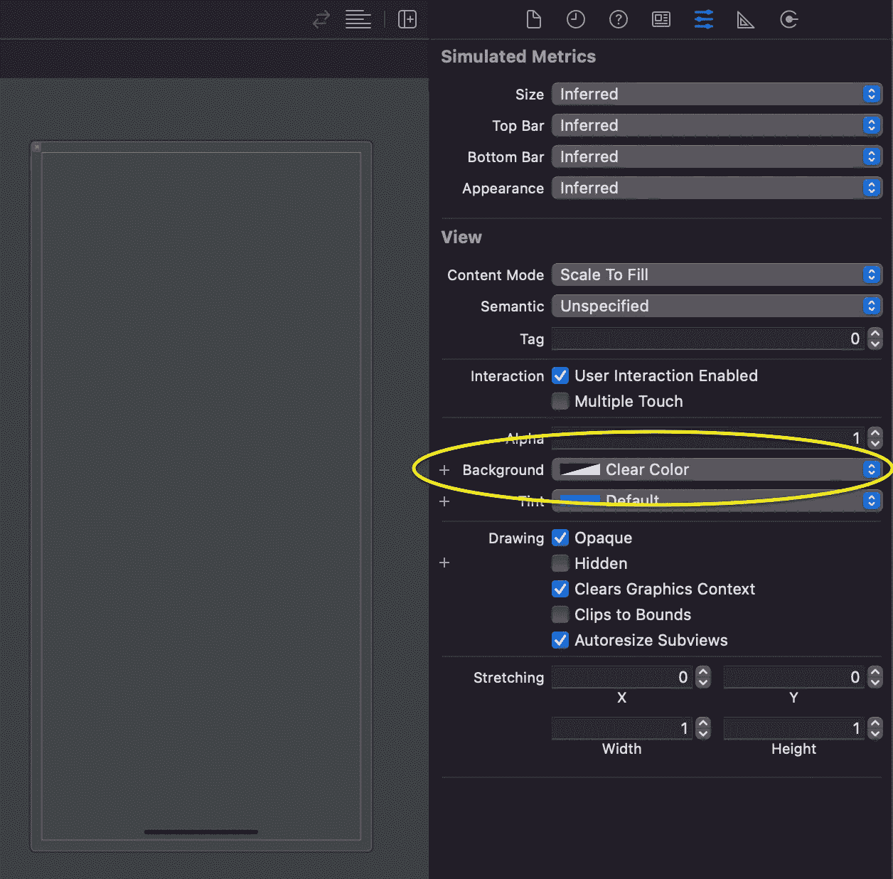

不错！现在，让我们添加堆栈视图和标签。

像处理故事板一样，通过打开对象库并在视图中拖动一个`UIStackView`,将垂直堆栈视图添加到视图中:

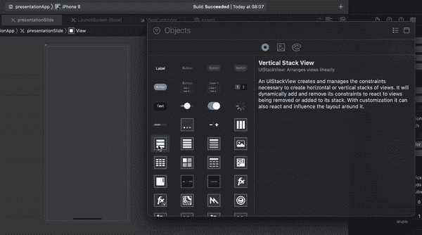

我们稍后将处理它的约束。

接下来，打开对象库并在堆栈视图中拖动两个`UILabel`对象:

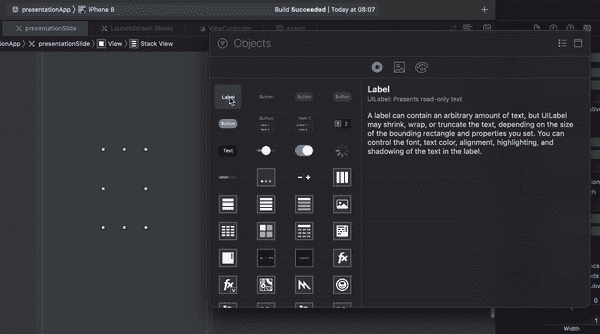

现在我们要做的就是正确地定位它们，并设计它们的样式。

我们将从堆栈视图开始。如果你很难选择它，请使用上面的面板，如下图所示:

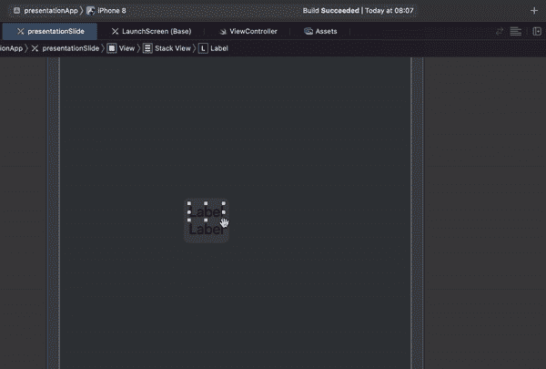

一旦选中，我们将设置以下约束:

*   在视图中水平和垂直居中，
*   前导和尾随约束大于或等于 30(您应该考虑为较高的幻灯片添加类似的顶部和底部约束)。

使用底部的“对齐”面板使视图居中:

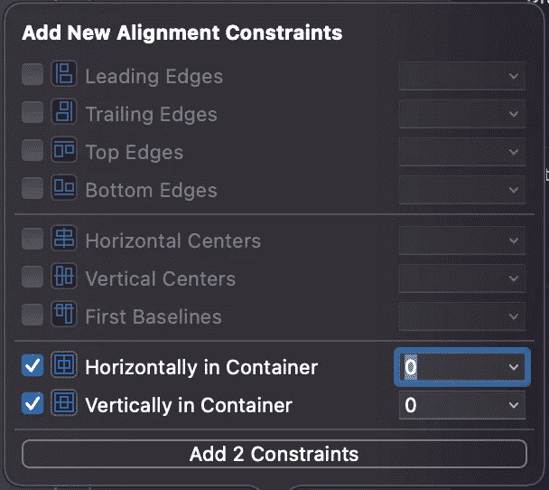

然后，添加前导和尾随约束:

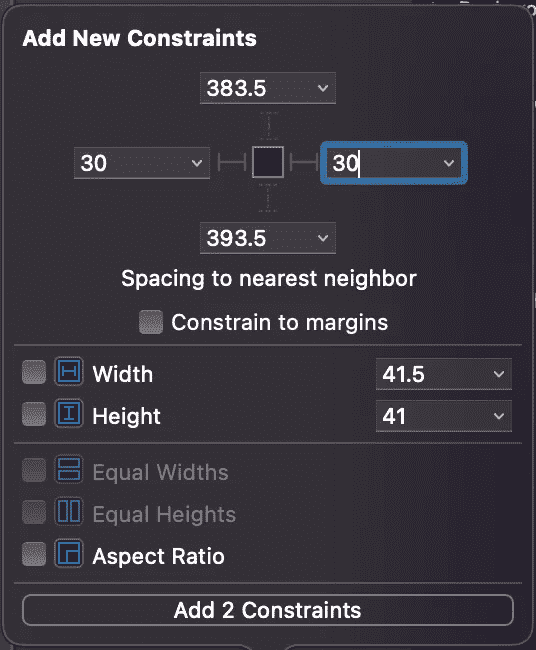

最后，选择视图上的约束，并将其关系更改为“大于或等于”。

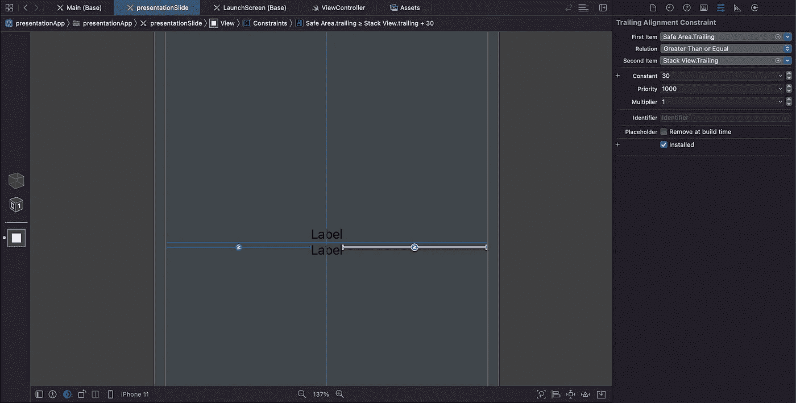

完美！现在，我们已经完美地定位了堆栈视图。

在我们设置标签样式之前，请确保将两者的行数都设置为零:

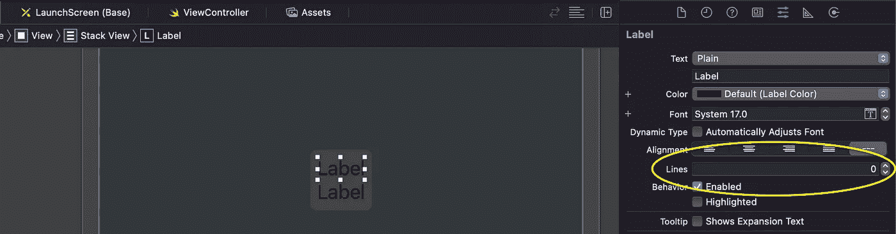

通过这样做，您可以确保标签的高度将根据它所包含的文本进行调整。

选择堆栈视图，并将间距设置为 15:

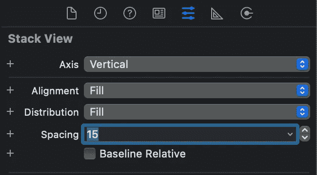

现在，设计您的标签:

*   对于标题标签，我使用了我自定义的色调、居中文本和系统粗体，字体大小为 25，粗细为粗体；
*   对于字幕标签，我使用了我自定义的色调、居中的文本和系统加粗的 18 号字体和中等粗细字体。

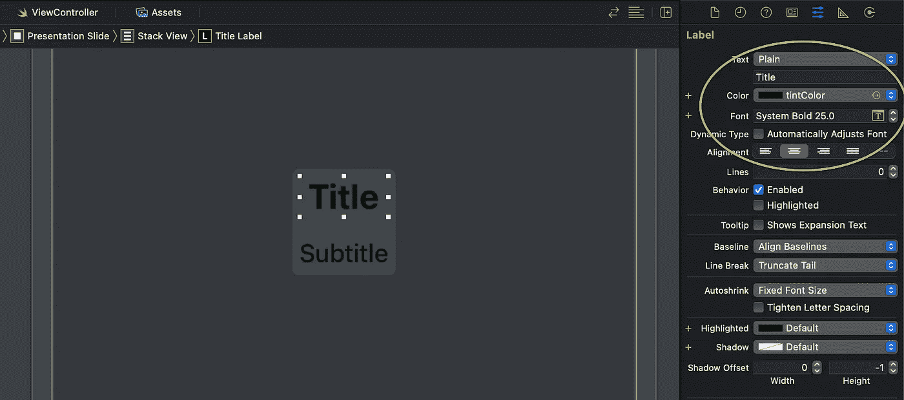

干得好，我们现在已经准备好演示幻灯片了！唯一的问题是，它仍然没有连接到我们的类。让我们进入下一步，改变这一点。

## 步骤 3:为演示幻灯片创建一个类

您可以使用不同的文件(文件>新建>文件… > Cocoa Touch 类> UIView 的子类)来完成此操作，但我将继续在视图控制器类的底部添加我的类。

在视图控制器文件的最底部，在[第 50 行](https://gist.github.com/Margels/fc39e539aab755508d795b30d6712909)上，为你的幻灯片声明一个类:

```
class presentationSlide: UIView {}
```

现在转到您的演示幻灯片 xib 文件，单击视图并打开右侧的身份检查器面板。添加`presentationSlide`作为该视图的自定义类。

完成后，当您从演示幻灯片文件中打开助手时，您将看到视图控制器文件:

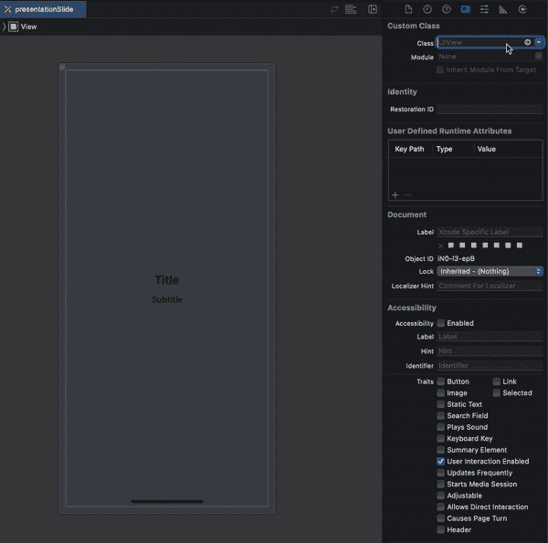

将堆栈视图、表格标签和副标题连接到`presentationSlide`类，并命名为`stackView`、`titleLabel`和`subtitleLabel`。你可以像我们通常做的那样，通过按住 control 键在类中拖动你的对象来做到这一点，但是我的 XCode 有点问题…所以我用了另一种方法，如果你的 XCode 也开始出错，这可能会有用:

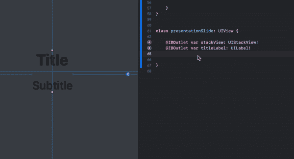

现在我们已经有了幻灯片的框架，我们可以创建我们希望它显示的数据。为此，我们将创建:

*   一个定义我们的数据类型(即一个`slide`)和值(一个标题和一个副标题，以`String`的形式)的结构；
*   一个数组，包含类型为`slide`的对象，以及我们想要在每张幻灯片中添加的标题和副标题数据的列表；
*   一组幻灯片，类型为`presentationSlide`，代表将要显示的视图。

在代码中:

```
// prepare slides
var **presentationSlides**: [**presentationSlide**] = []
var **slides**: [**slide**] = [ **slide**(title: "This is the best presentation ever!",
         subtitle: "This presentation is made of beautiful slides."), **slide**(title: "When you slide, the background moves!",
         subtitle: "Isn't that the coolest thing ever?"), **slide**(title: "The title shrinks as you slide away...",
         subtitle: "...and gets bigger as it slides in!"), **slide**(title: "Follow the tutorial to see how it's done!",
         subtitle: "Don't worry, it's easier than you think."), **slide**(title: "Press the button below...",
         subtitle: "...and make the magic happen!")]struct **slide** {
   var title = String()
   var subtitle = String()
}
```

您的视图控制器文件现在应该如下所示:

这就是教程的第二部分。动画将是本教程第三部分的主题。请继续关注我的内容，当第 3 部分出来时，我会立即更新我的内容，请在下面的评论中让我知道您的反馈！

你喜欢这个教程吗？它和你的项目合作得好吗？

```
**Want to Connect?** Follow me on…
❤️ [YouTube](https://www.youtube.com/channel/UC5hqYiHxie458KSO1PAnA8Q)
💖 [Dribbble](https://dribbble.com/margelss)
💜 [Instagram](https://www.instagram.com/itsmargels/)
💙 [Ko-Fi](https://ko-fi.com/margelss)
🖤 [GitHub](https://github.com/Margels)
```