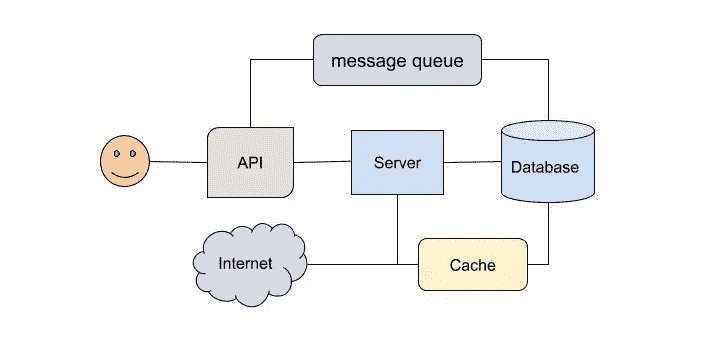
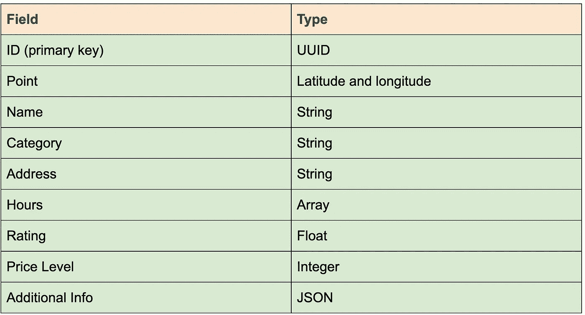
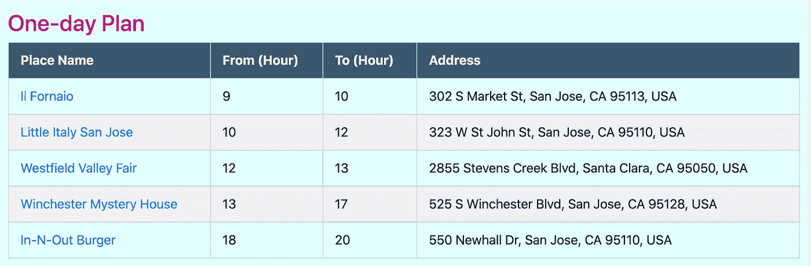

# 设计一个旅行计划

> 原文：<https://blog.devgenius.io/design-a-trip-planner-1e8d8f099d46?source=collection_archive---------6----------------------->

由 [Unsplash](https://unsplash.com?utm_source=medium&utm_medium=referral) 上的 [Element5 数码](https://unsplash.com/@element5digital?utm_source=medium&utm_medium=referral)拍摄

我们喜欢旅行。在探索新的地方时，我们有机会思考生活，欣赏我们生活的美丽世界。同时，任何旅行都有许多不确定性和担忧。人们不禁会问这样的问题:“我在某个地方明智地利用了我的时间吗？”或者“我去过某个城市所有必去的地方吗？”旅行计划是拥有美好体验的最重要的方面之一。

一个典型的旅行计划流程始于打开谷歌或 Expedia，搜索酒店、航班和有趣的游览和用餐地点。在预订机票、租车和可能的酒店后，勤奋的旅行者会开始寻找每天可以度过的地方。这是真正的麻烦开始的时候。人们经常发现他们在浏览器中打开几十个标签，比较不同的名胜，并想知道他们应该在每个地方停留多长时间。最终，计划变得如此令人难以置信，人们会放弃，或者他们最终提出了过于激进而无法执行的计划。

# 问题范围

培养一个真正好的旅行规划者的问题是非常具有挑战性的，如果不是不可能解决的话。例如，没有一个游览巴黎的计划对每个人都适用。有些人喜欢更轻松的时间表，花更多的时间在美食上。其他人可能想通过在卢浮宫博物馆投入大部分时间来关注文化。

作为一个业余爱好项目，我们并不试图构建复杂的机器学习驱动的系统。没有大量的数据，这些解决方案是无法实现的。相反，我们从纯计算的角度来处理这个问题，并允许一定程度的定制。我们设计了一个具有 Golang 执行能力的分布式系统。

旅行规划器的初始版本试图实现一个适中的目标:给定一个位置、一个工作日和一些定制输入，为用户提供当天的旅行计划。未来的发展计划是支持多日游和更多的个性化。

# 系统结构

分布式系统架构

后端系统由 web 应用程序的基本组件组成。服务器向 Google Maps APIs 查询系统中不存在的数据。并且新数据被存储在数据库中，该数据库充当基础事实。

由于这是一个读取量很大的系统，我们需要缓存来提高它的响应能力。系统采用直写策略来更新缓存。

消息队列用作消息和事件(如 API 请求)的代理。

API 网关和路由器处理请求并执行中间件功能，包括用户认证。

# 算法

该系统的主要算法是我们如何为给定的位置、持续时间和搜索半径生成旅行计划。

***输入*** :位置、开始时间、结束时间、搜索半径

1.  将开始时间和结束时间划分为时间段。
2.  根据位置和搜索半径过滤可用位置。
3.  将过滤后的位置分配到时间段。当且仅当业务在整个时间段内*开放*时，才能分配位置。
4.  使用可能的分配组合生成候选计划。
5.  用所有地方的总得分对候选方案进行排名，并返回最佳解决方案。

**时间复杂度分析**

假设我们将时间段划分为 T 个时隙，平均每个时隙有 P 个位置，则有 P 的 T 次方个候选计划。用 M 表示这个数字。然后对计划进行排序并选择最上面的计划，这需要 M÷log(M)时间来完成优先级队列数据结构。

由于大多数地方都开放了很长一段时间，即使 Golang 的执行能力很强，如果 T 很大，时间复杂度也会很高。因此，为了确保我们可以在合理的时间内计算出结果，我们需要限制 P 和 t。

# 数据模型

系统的主要数据是位置数据或兴趣点(POI)信息。根据定义，POI 信息可以是特定点位置的相关方感兴趣的任何内容。对于我们正在设计的假期计划系统，数据模型与算法密切相关。

POI 模式

大多数原始数据可以通过 Google Places API 获得。无论何时获得新数据，我们都需要处理它们，并坚持使用上面的模式。

具体来说，点数据字段用于生成二维索引。该字段的格式因您使用的数据库而异。我们对每个地方只使用两个类别，即参观和餐馆。这简化了数据模型的复杂性。

我们希望 Google API 提供的一个重要数据字段是人们在每个地方花费的平均时间。该数据可以实现自动计划生成功能。

# 详细的组件设计

使用 Goroutines，我们可以编写高效的方法，同时从 Google API 获取和处理原始数据。系统使用 gin 进行路由。对于日志框架，我们使用优步的 Zap。

鉴于数据模型具有一对多的关系，我们不需要关系数据库。我们决定使用 MongoDB 进行数据存储。在 Go 中，POI 模式可以用一个结构来表示，每个结构都可以序列化为一个 BSON 文档，存储在 MongoDB 中。此外，MongoDB 对地理空间索引有很好的支持，这对于实现高效的空间搜索非常重要。

该系统使用 Redis 进行缓存和消息传递，并且具有出色的地理空间支持。我们可以将 POI 数据序列化为一个字符串，并使用 place ID 访问数据。geo 命令支持高效的邻近搜索。一个类别的所有地点 id 都存储在一个由 geohash 索引的有序集合中。因此，Redis 中的附近搜索有两个*阶段*:获取中心位置半径内的所有地点 ID，然后获取每个地点 ID 的地点细节。

除了在 Redis 中缓存 POI 数据之外，系统还在 Redis 中存储预计算的时间段级别结果，过期时间为 24 小时。这大大减少了我们在算法部分描述的计算时间。

分析由 API 网关处理。每当 API 网关收到请求时，就会派遣一个工作人员来更新 Redis 中的分析数据。

# 计划结果示例

目前前端使用的是直接从后端提供的基本 HTML 模板。对于每个地点和给定的工作日，它会生成多个一天的旅行计划供用户选择。

在下面的例子中，一天被分成 5 个时间段:早餐-上午参观地点-午餐-下午参观地点-晚餐。并且对于每个位置，系统向用户推荐一个顶部位置。

圣何塞的规划结果

# 总结和未来工作

本质上，当前版本的旅行计划解决了一个分布式系统的算法问题。

未来，我们计划支持多日计划，并添加更多个性化功能。例如，用户可以划分他们的一天，并从可用的位置中选择来填充时间段。

# 资源

我们欢迎建议和贡献，以改善假期规划。请查看该项目的 [GitHub 页面](https://github.com/weihesdlegend/Vacation-Planner)。

这个项目的第二部分可在[这里。](/design-a-trip-planner-part-ii-312741f49655)

 [## weihesdlegend/度假计划者

### 度假计划是为旅行者在预算和时间限制下找到愉快路线的服务…

github.com](https://github.com/weihesdlegend/Vacation-Planner)