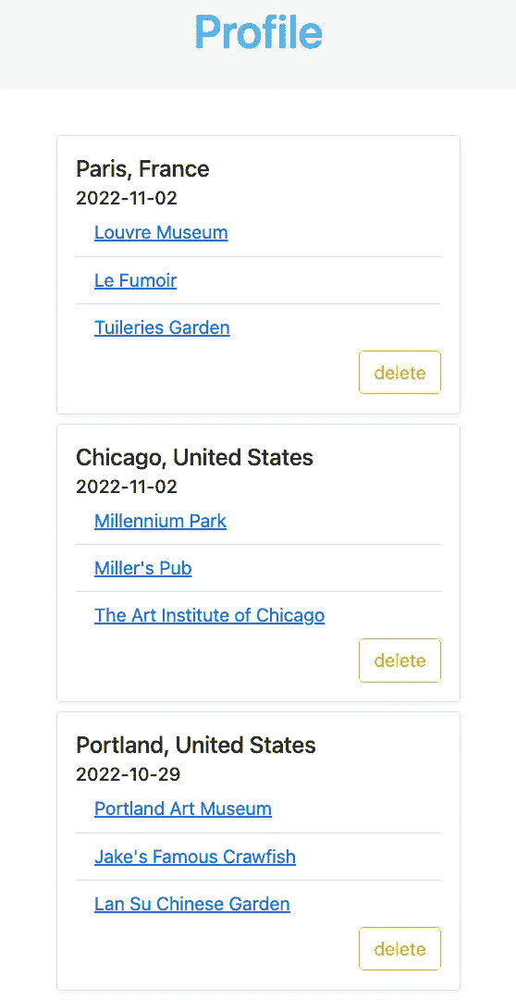
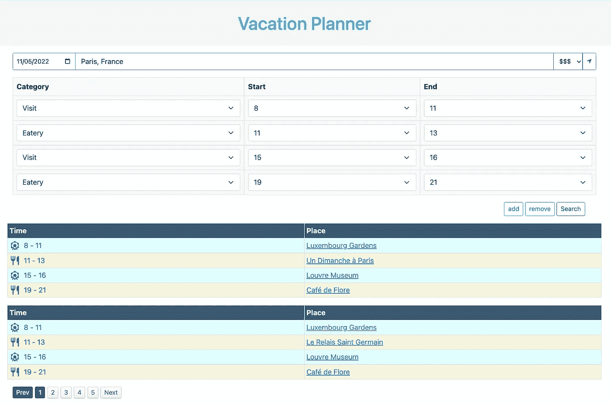

# 设计旅行计划——第二部分

> 原文：<https://blog.devgenius.io/design-a-trip-planner-part-ii-312741f49655?source=collection_archive---------11----------------------->

克里斯·劳顿在 [Unsplash](https://unsplash.com?utm_source=medium&utm_medium=referral) 上的照片

在大约两年前发表的上一篇[文章](/design-a-trip-planner-1e8d8f099d46)中，我们描述了一个非常基本的旅行规划器原型。从那时起，我们对规划器进行了大量的更改和改进，使其更加有用和强大。

# 新功能

## 计划详情

以前，列表规划结果提供了一种基本而简单的方法来检查时间和地点的详细信息。然而，这些结果并没有提供直观的信息。我们添加了*计划细节功能*，为计划中的每个地方提供了一个选择图片的幻灯片。此外，在页面底部有一个小地图，显示了地点和地点类别的接近程度。

计划详情

## 用户概要

我们引入了用户资料功能，允许用户存储他们喜欢的计划，以供将来参考。在表格式计划结果视图和计划详细信息卡片上，用户可以保存计划并在用户简档页面中查看计划摘要。计划按照用户保存计划的时间顺序进行排序。该功能提供了用户的个性化搜索历史。

用户概要

## 计划模板

现有的表格规划结果使用一个*严格的*模板。该模板包括一个从上午 10 点到下午 12 点的景点，一个从下午 12 点到下午 1 点的午餐地点和一个从下午 1 点到 5 点的游览地点。这对于产品原型来说很好。然而，该时间表可能无法满足所有用户的需求。此外，它没有利用我们后端 API 的全部功能，后端 API 支持对任何有效的时间表模板进行规划。

今年推出的主要功能之一是*计划模板*，它允许用户起草自己的时间表。用户可以指定任意数量的时间段，每个时间段由开始时间、结束时间和地点类别组成。结果以分页的方式呈现，以获得更清晰的视图和更好的导航体验。

计划模板

## Golang HTML 模板的弃用

最初，规划器具有最少的前端功能，Golang HTML 模板足以满足我们的需求。随着越来越多的交互功能的加入，这个假设不再成立。我们开始将模板迁移到纯 Javascript + jQuery + Axios 前端。从用户的角度来看，这种努力允许更多的动态功能和迭代体验。例如，计划模板页面完全基于此堆栈。此外，用户配置文件页面最近也进行了迁移。

# 未来计划

## 基于人工智能的推荐系统

目前该应用缺乏用户，因此推荐算法纯粹基于地点的优点及其彼此之间的相对接近度。更准确的推荐系统应该使用用户搜索历史、偏好等。

## 降低计算复杂性

计算具有 3 个时隙的计划的强力算法需要 O(N ),其中 N 是时隙中合格位置的平均数。因此，强力算法具有指数复杂度。这种复杂性来自于这样一个事实，即我们从附近搜索中得到的地点没有被排序，也没有被分类以便立即使用。

为了降低计算复杂度，我们计划添加*反向索引*。假设我们通过频繁使用的时间间隔+地点名称来索引地点，对于给定的时间段，我们可以快速找到满足约束的所有地点，并开始构建计划。这种优化应该将复杂度降低到多项式。这将启用其他功能，如多天计划，因为否则复杂性将令人望而却步。

# 网站(全球资讯网的主机站)

像往常一样，请试用[度假计划器](https://www.unwind.dev/)，我们欢迎所有建议。