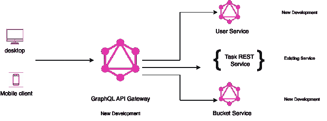

# 用 GraphQL、REST 微服务设计 my-todos 项目

> 原文：<https://blog.devgenius.io/design-my-todos-project-with-graphql-rest-microservices-482cffc7729b?source=collection_archive---------12----------------------->

米娅·贝克在 [Unsplash](https://unsplash.com?utm_source=medium&utm_medium=referral) 上拍摄的照片

本内容面向那些对 REST 和 GraphQL 有基本了解的工程师。我们将陆续公布以下内容。

**# 1 my-todos 项目设计(本帖我们在这里)**

#2 编码 GraphQL 服务

#3 GraphQL 服务认证和授权

#4 编码 GraphQL 网关服务

#5 使用 Nuxt 编码 my-todos web

#6 所有服务的部署

# 要求

开发一个项目来记录你所有的待办事项(project， ***my-todos*** )。

*   创建存储桶
*   在存储桶中注册任务
*   任务属性包括标题、描述、优先级、任务负责人、截止日期、状态等
*   用户可以很容易地找到今天最重要的三个任务，以及昨天最重要的任务

工程团队决定使用 GraphQL。你在想为什么？这里回答你[。](/what-problem-graphql-is-solving-74312c7bdccb)

# 高级设计

*   用户服务:用于用户管理和认证的 GraphQL 服务。
*   任务服务:现有的 REST 服务，我们将修改(如果需要)并使用它。
*   Bucket 服务:用于 bucket 管理的 GraphQL 服务。
*   GraphQL 网关服务:这是一个将向前端公开的 GraphQL 服务。该服务将使用模式拼接来组合所有其他服务。

# 下一步是什么

我们将在下一篇文章[*【2 号编码 GraphQL 服务*](https://medium.com/@sofikul.m/coding-graphql-services-eafd9235fdf7) 中见到您。请订阅，以便在我们发布后立即获得更新。

> 继续学习！