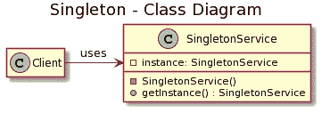
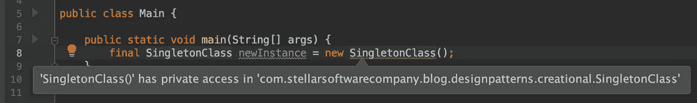

# 设计模式—单例

> 原文：<https://blog.devgenius.io/design-pattern-singleton-fa0f676a5d16?source=collection_archive---------3----------------------->

最常见的设计模式——单一模式的详细讨论

Photo by [贝莉儿 DANIST](https://unsplash.com/@danist07?utm_source=medium&utm_medium=referral) on [Unsplash](https://unsplash.com?utm_source=medium&utm_medium=referral)

单体设计模式是最常用的设计模式。这可能是因为它非常容易理解，并且解决了软件工程中的一个重要问题。

# 什么是单例设计模式？

Singleton 是四人帮(g of)设计模式之一。这是一个创造性的设计模式，意味着它处理对象的创建。

在一个场景中，当你只需要一个类的对象时，你可以使用 Singleton。Singleton 将所述类的对象的创建限制为仅一个。

这个类的单例实例对于协调整个系统的操作或保证对资源的控制非常重要。Singleton 类在应用程序中具有全局访问权限。

在单例设计模式中，类负责创建自己并管理自己的生命周期。该类的唯一实例存储在该类的私有静态成员中。然而，这个实例可以通过一个公共 getter 在类外使用。

# 例子

你可能见过或用过 Singleton 的例子—

*   Java——Java 中的 Runtime & SecurityManager 是 Java APIs 中单例类的例子。以下是您如何访问它们的实例—

*   数据库管理器、内存缓存或记录器通常是作为单例创建的。它们提供了共享资源的方法——分别是数据库、内存或日志缓冲区。
*   状态对象模式通常是单一的。

# 由 Singleton 解决的问题

*   它确保该类只有一个实例
*   可以轻松访问该类的唯一实例
*   单例类可以控制唯一实例的实例化
*   单例类也可以限制多个实例的创建
*   单例类获得全局访问

这些问题可以通过私有构造函数、公共 getter 和共享静态实例来解决。详情请继续阅读。

# 用于单例的 UML

如果没有这个设计模式的 UML 图，这个讨论将是不完整的

单例的 UML 图

*Client* 是使用 *SingletonService* 的类。 *SingletonService* 有一个共享实例“*实例*”。它还有一个公共 getter *getInstance()* 。它的构造函数是私有的。

# 创建单例类

下面是如何创建一个简单的单例类。

Java 中的简单实现

这是创建单例类的一个非常简单的方法。我已经解释了下面的每一行。请注意，下面列表的编号对应于上面代码中的注释。

*   **#1** —这是包的名称。根据您的项目和您使用的包，它可能会有所不同。
*   **#2** —我们在这里指定单例类的名称。在我的例子中，它是 *SingletonClass。*
*   这里我已经创建了 SingletonClass 类的一个实例。这个实例存储在一个*私有* & *静态*成员*共享实例*中。成员的名称表明它是一个共享实例。根据具体情况，将共享实例命名为 *sharedInstance* 或 *sharedLocationManager* 是一种常见的做法。
*   **#4** —为了确保只创建 SingletonClass 的一个实例，构造函数被标记为 private。如果我们试图实例化这个类，它将抛出一个错误。请参见下面的错误消息。

尝试实例化新对象时出错

*   最后，我们需要一个 sharedInstance 的公共 getter。这是将用于提供单例类实例的方法。请看代码，我们如何使用这个 getter 来获取 Singleton 类的实例。

将 Singleton 与 getSharedInstance()一起使用

上面 Singleton 的实现有个小问题。即使我们不需要 Singleton 类，该类仍然被初始化。有一个更好的方法来处理这个问题。输入“延迟加载”。

# 惰性装载

在注释#3 中，我们看到共享的单例实例是在类被加载时创建的。因此，即使您不打算在代码中使用 Singleton 类，也可以创建共享对象。

更好的方法是使用惰性加载，也就是说，直到需要时才创建单例类的实例。参考以下相同的代码-

延迟加载的单例实现

如果您将这段代码与上面的代码进行比较，您会注意到我们没有实例化#3 中的类。我们在#5 的 getSharedInstance()方法中有一个空检查。如果 sharedInstance 为 null，我们实例化该类。这种方法被称为延迟加载，因为除非我们尝试使用它，否则对象不会被初始化。这种方法优于前一种方法。

# 私有构造函数

如果您看到上面的代码块，您会注意到默认构造函数被标记为 private。这是为了确保该类不能从外部实例化。单例类负责自己的初始化。应该只有一个类的实例，该实例应该可以通过公共 getter 在应用程序中全局访问。私有构造函数阻止我们从外部创建 Singleton 类的另一个实例。

然而，即使使用私有构造函数，也可以使用反射创建单例类的实例。我们可以在以后的帖子中讨论这个问题。

# 线程安全

当我们的应用程序中只有一个线程时，上面提到的解决方案就足够了。当我们的单例类可以跨线程使用时，我们需要确保我们的类是线程安全的。为了达到这个目的，我们可以在实例化 Singleton 对象之前添加一个 synchronized 块。

线程安全、延迟加载的单例实现

getSharedInstance()方法现在被修改，如上所示。请注意，我们在#8 处添加了同步块。第二个重要的变化是向静态成员添加了关键字 *volatile* 。这是因为我们只想确保在访问 singleton 实例时不会有两个线程试图实例化它。

如果已经创建了单例实例，就不需要再创建了，所有的线程都可以获得这个实例。在没有创建 sharedInstance 的情况下，一个线程试图创建该实例，我们不希望任何其他线程尝试做同样的事情。这就是为什么我们在检查 null 之后有一个同步块。

这被称为双重检查单例，因为我们检查 null 两次，以确保它是线程安全的。这是创建单例类的最常见和被广泛接受的方法。

# 什么时候使用 Singleton？

J Lee 在 Unsplash 上的照片

你可以在以下场景中使用 Singleton

*   与其他设计模式一起使用—单例设计模式与其他设计模式一起使用。例如，Facade 是一个重要的设计模式，我们将在后面的文章中看到。它使用 Singleton。这是因为通常只需要一个 Facade 对象。
*   访问硬件或公共资源——您可能正在访问项目中的特定硬件。通过一个公共类来处理在所述硬件/资源上执行的所有操作可能更有意义。在这些资源上进行初始化可能是一项耗时的任务。这里常见的例子有—数据库、内存缓存、机械臂等。
*   全局变量的替换— Singleton 优于全局变量。
*   对实例的全局访问——有时项目需要存储一些重要的数据，并且可以跨应用程序访问这些数据。Singleton 可以帮你做到。Singleton 类的一个重要需求是提供对共享实例的全局访问。这通常是使用公共 getter 来完成的。

# 单例的问题

由 [Joshua Hoehne](https://unsplash.com/@mrthetrain?utm_source=medium&utm_medium=referral) 在 [Unsplash](https://unsplash.com?utm_source=medium&utm_medium=referral) 上拍摄的照片

*   过度使用——由于它的简单和强大，它被过度使用。你应该经常评估这个类是否真的需要是单例的。
*   缓慢——如果你让每件事都是单一的，它会减慢你的应用程序。
*   难以进行单元测试——单件有一个私有的构造函数，并且没有在接口上编程，它们难以进行单元测试。这可能看起来无关紧要，但却是一个大问题。
*   线程安全——如果没有正确实现，单例类可能不是线程安全的。我们上面看到的双重检查实现是一个线程安全的实现。
*   无参数-Singleton 不能带参数，如果带参数，它就不是 Singleton。它变成了工厂设计模式。在任何时候，你看到你的单例类接受参数，你应该重新思考和评估设计。
*   违反了单一责任原则——单例类一次做两件事，这违反了单一责任原则。
*   代码味道——Singleton 可能掩盖了一些糟糕的设计。我们应该确定我们是否真的需要一个独生子女。退一步重新评估我们的设计会有所帮助。我们应该看看我们是否能在不使用 Singleton 的情况下解决同样的问题。

# 摘要

*   保证一个实例。这个单例实例存储在私有静态成员中，但是可以通过公共 getter 访问。
*   易于实施和使用。
*   线程安全。
*   解决一个重要的问题/明确的问题。
*   经常被滥用/过度使用。

# 作为反模式的 Singleton

一些软件工程的绝地认为单一设计模式是一种反模式。他们的论点是，它制造的问题比解决的问题还多。只有一个类对象的限制是不必要的，它使对象是全局的，可以从应用程序的任何地方访问。我们将把批评留到另一篇文章中。

# 结论

Singleton 很牛逼。它非常强大，非常容易理解和实现。它解决了一个常见的设计问题。

另一方面，这是一种被过度使用的设计模式。学会这一点的工程师们会抓住每一个机会去应用它。单体类很难进行单元测试，单体类违反了单一责任原则。

使用这种设计模式有利也有弊。当我们使用它时，我们需要留心。

*撰写&编辑——维韦克·米塔尔*

 [## Vivek Mittal -首席软件工程师- Nuance Communications | LinkedIn

### 我是一名经验丰富的软件工程师，在软件工程方面有超过 10 年的经验。我有广泛的…

www.linkedin.com](https://www.linkedin.com/in/vivekmittal06) 

# 附加阅读

 [## 软件设计模式

### 软件设计模式概述

stellarsoftwarecompany.medium.com](https://stellarsoftwarecompany.medium.com/software-design-patterns-1b41de14ab8b)