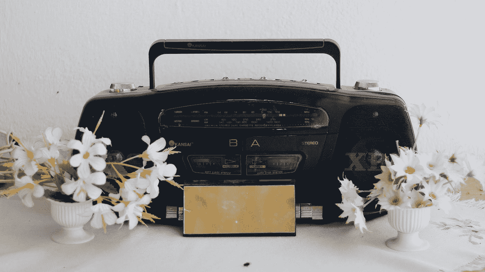
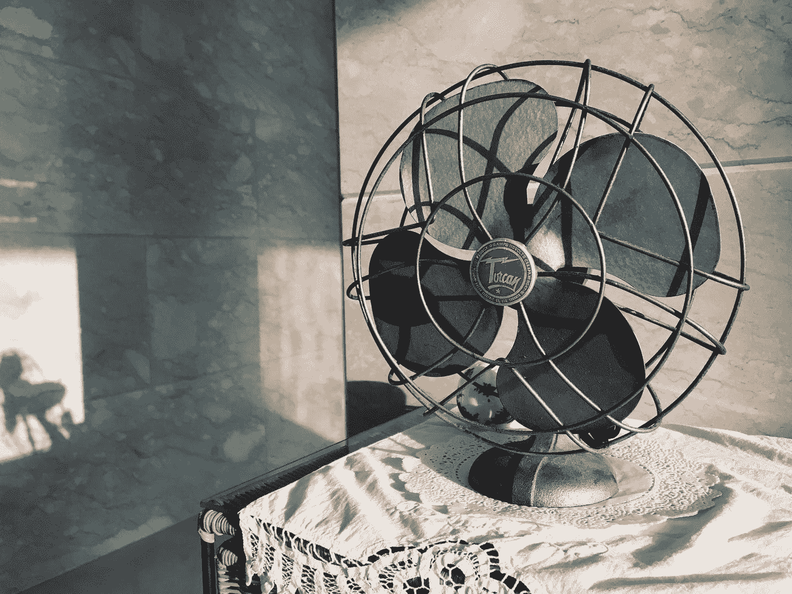
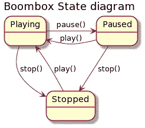
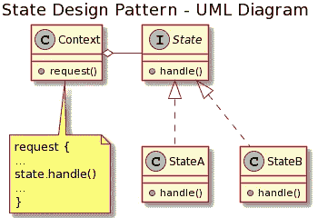

# 设计模式—状态

> 原文：<https://blog.devgenius.io/design-pattern-state-e0ed37cd853a?source=collection_archive---------0----------------------->

状态设计模式的深入探讨

安德斯·吉尔登在 [Unsplash](https://unsplash.com?utm_source=medium&utm_medium=referral) 上的照片

状态设计模式，另一种最常见的设计模式。当我们想在应用程序中表示某种状态时，就会用到它。

# 什么是状态设计模式？

状态设计模式是四人帮(g of)提出的行为设计模式之一。这种模式与有限状态机(FSM)密切相关。它实际上可以被称为有限状态机的一个应用。

这种设计模式允许基于其内部状态变化的行为变化。

这种设计模式用于分离在不同状态下需要采取的动作。有一个存储应用程序状态的对象，而不是变量的组合。

状态设计模式遵循实体设计原则的开闭原则(我们将在以后详细讨论)。类是*关闭*进行更改，而*打开*进行扩展。

状态设计模式也将代码分开。它将状态的应用程序逻辑中的位置和内容分开。

# 例子

我在核心 Java APIs 中找不到状态设计模式的例子。然而，您可以想象所有类型应用程序都需要某种状态管理。所以使用状态设计模式是很常见的。你可以想到 BoomBox。你按下*播放*按钮，音箱开始播放。您可以点击*停止*按钮停止播放。

照片由[埃利安·贾沙里](https://unsplash.com/@elionj?utm_source=medium&utm_medium=referral)在 [Unsplash](https://unsplash.com?utm_source=medium&utm_medium=referral) 上拍摄

你也可以想象一个台扇。有一根绳子，你拉它就能启动或停止。你拉一下绳子就可以启动风扇。你再拉一下就停下来了。

[野禅公园](https://unsplash.com/@yechan0422?utm_source=medium&utm_medium=referral)拍摄于 [Unsplash](https://unsplash.com?utm_source=medium&utm_medium=referral)

# 状态图

如上所述，状态设计模式松散地基于有限状态机的概念。FSM 可以很容易地用状态图来表示。

> 状态图是计算机科学和相关领域中用于描述系统行为的一种图表。

状态图具有系统的有限数量的状态。这些用圆形或椭圆形表示。连接这些状态的箭头是从一个状态到另一个状态的转换。箭头上的标签是转换的条件。

对于上面提到的 BoomBox 示例，状态图可以绘制如下

内置扬声器的状态图

# 实现状态机

状态机的一个非常基本的实现如下—

为了运行前面提到的类，我们可以使用下面的代码—

上面代码的输出是—

从上面仔细看看 BoomBox 类。这是一个如何实现状态机的例子。这个例子实现了一个具有三种状态的状态机——播放、暂停和停止。要从一种状态转换到另一种状态，我们需要执行一些检查。因为不是所有的转换都被支持。你不能从玩耍到玩耍。有趣的是，这是正确的。在一个音箱上，如果你按了 play，当它已经在播放的时候，什么都不会发生。状态限制的另一个例子是，如果 BoomBox 处于停止状态，如果您试图暂停它，将不会发生任何事情。上面的状态图可以证实这些限制。

上面显示的实现并不理想。**它实现了状态机，但没有实现状态设计模式**。

# 为什么我们需要使用状态设计模式？

*   **if-else 语句网** —在上面这样一个非常简单的状态机中，我们得到了一个 if-else 语句网。想象一下，当我们有更多的状态和更多的转换时。涵盖所有场景将会非常复杂。即使是代码也无法用这样一个简单的状态机读取。
*   **解决方案不可扩展** —我们的机器目前只有三种状态。当我们试图添加第四个和第五个时，我们将不得不重新评估我们的 play()、pause() & stop()方法。我们需要确保所有的组合都包括在内。再增加几个 if-else 条件。很快这就变得无法管理了。
*   **违反设计原则** —违反单责任&开闭原则等设计原则。我们在 BoomBox 类中做了不止一件事，我们不能在不改变现有代码的情况下引入新的状态。

# UML 图

在我看来，没有图表，任何技术讨论都是不完整的。下面是状态设计模式的一个简单表示。有一个接口叫 State。这个接口有一些方法。接口中的方法将取决于我们试图实现的状态机。

考虑一下 BoomBox 的例子。BoomBox 可以是我们下面的上下文类。状态接口有 play()、pause() & stop()这样的方法。暂停、播放和停止可以是状态接口的一种实现。

状态设计模式的 UML 图

# 状态设计模式的实现

我们试图使用状态设计模式来实现上面提到的状态机。我们将保留 BoomBox 类，并根据状态设计模式的要求修改它。我们也将测试代码保留在 void main 中。让我们从介绍状态接口开始。

这些方法大致对应于 BoomBox 接口中的方法。尽管我们没有对接口编程，但是如果我们创建了一个 BoomBox 接口，我们会在那里找到这些方法。

现在，我们的 BoomBox 示例可以处于三种状态之一——播放、暂停或停止。我们将在三个代表状态的类中实现这个接口。

# 状态 1:状态播放

一个状态将决定切换到另一个状态的命令是否可行。当我们得到一个改变状态的命令时，StatePlaying 类将保存做什么的逻辑。例如，如果我们处于播放状态，当我们收到播放命令时，我们不想做任何事情。类似地，进入暂停或停止状态需要什么动作是在 StatePlaying 类中决定的。这同样适用于 BoomBox 的其他状态类。每个状态可能有不同的逻辑&状态转换规则。

# 状态 2:状态暂停

# 状态 3:状态停止

现在我们将修改 BoomBox 类以适应状态的变化。早期的实现是基于静态整数的，现在我们有了独立的状态类。

看看 play()、pause()和 stop()方法的代码。它只是在状态对象上调用一个同名的方法。*状态*保存当前状态对象。

开始时，*状态*被初始化为停止状态对象(stateStop)。当 BoomBox 上的 play 方法被调用时，它调用停止状态对象上的 play 方法。

现在，看看 StateStopped 中 play 方法的实现。在那里，我们将 BoomBox 状态更新为正在播放，并记录“正在播放”。这很容易成为播放音箱的实际逻辑。

现在想象一下，如果我们在 BoomBox 上调用 stop 方法，并且我们已经处于停止状态。看看 StateStopped 中的 stop()方法。看看我们是如何记录我们已经处于停止状态的消息的。这种逻辑是特定于状态的实现的一部分。

# 状态设计模式解决的问题

状态设计模式解决了两个主要问题—

*   当对象的内部状态改变时，它应该改变它的行为
*   特定于状态的行为应该独立定义。也就是说，添加新状态不应该影响现有状态的行为

# 状态设计模式的问题

下面列出了状态设计模式的一些问题。这些并不严重，使用状态设计模式利大于弊。

*   **使设计变得复杂** —在一个小的状态机例子中，它通过引入几个新类使设计变得复杂。有时，只有一些 int 和几个 if 可以完成这项工作。但是如果我们使用状态模式，我们使用状态设计模式可能会矫枉过正。
*   **需要知道所有的状态**——尽管状态设计模式可以很好地扩展以适应越来越多的状态，但在开始实现之前，我们在设计阶段做好适当的准备并识别所有可能的状态总是很有帮助的。
*   **路由类** —上下文类，比如在我们的例子中，BoomBox 类变成了一个简单的路由类，没有任何自己的逻辑。所有的逻辑都驻留在特定于状态的类中。

# 摘要

*   状态机的实现
*   允许基于内部状态的不同行为
*   添加新状态非常容易——可扩展状态
*   简化代码，降低圈复杂度
*   涉及大量小班教学

照片由[卡蒂亚·奥斯丁](https://unsplash.com/@katya?utm_source=medium&utm_medium=referral)在 [Unsplash](https://unsplash.com?utm_source=medium&utm_medium=referral) 拍摄

*撰写&编辑——维韦克·米塔尔*

 [## Vivek Mittal —首席软件工程师— Nuance Communications | LinkedIn

### 我是一名经验丰富的软件工程师，在软件工程方面有超过 10 年的经验。我有广泛的…

www.linkedin.com](https://www.linkedin.com/in/vivekmittal06) 

# 附加阅读

 [## 软件设计模式

### 软件设计模式概述

medium.com](https://medium.com/dev-genius/software-design-patterns-1b41de14ab8b)  [## 设计模式—单例

### 最常见的设计模式——单一模式的详细讨论

medium.com](https://medium.com/dev-genius/design-pattern-singleton-fa0f676a5d16)  [## 设计模式—构建器

### Builder 设计模式的详细讨论

medium.com](https://medium.com/dev-genius/design-pattern-builder-1ad55ed26120)