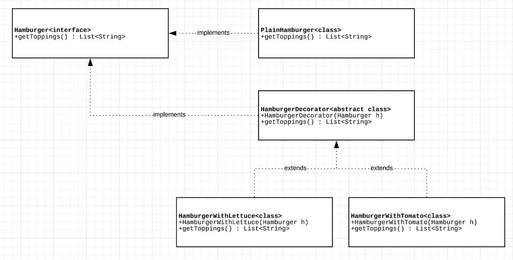

# 软件设计模式——装饰模式

> 原文：<https://blog.devgenius.io/design-patterns-decorator-design-pattern-332e7870a5c5?source=collection_archive---------4----------------------->


[Icons8 团队](https://unsplash.com/@icons8)拍摄的照片

## 介绍

装饰设计模式是一种软件设计模式，可以帮助您在运行时向对象添加职责。这种模式被认为是一种结构设计模式。这种类型的模式关注于类之间的关系以及它们如何帮助解决特定的问题。

四人组在他们的书[设计模式:可重用面向对象软件的元素](https://en.wikipedia.org/wiki/Design_Patterns)中，这样定义装饰模式的意图:

> **意图:**动态地给一个对象附加额外的责任。Decorators 为扩展功能提供了子类化的灵活替代方案。

这种设计模式的关键特征之一是它遵循*单一责任原则(SRP)* 。这是因为你添加到一个对象中的每个“装饰”都将被封装在一个类中。这个类的职责将是处理所有与给对象添加装饰相关的事情。

## 是时候集合一个🍔

为了学习装饰模式，让我们假设您想要创建一个类型为`Hamburger`的对象。

汉堡的制作方法各不相同。根据汉堡王的说法，点一个巨无霸有 221184 种可能的方法。如果你在早餐、午餐和晚餐吃一个汉堡，你至少要花 200 年才能吃完这么多汉堡！可能性是无限的。

在一个没有装饰模式的世界里，你可以采取的方法是创建一个父类`Hamburger`，然后为不同类型的汉堡包创建子类。这很容易成为一个令人头疼的维护问题，因为由于多层次继承的复杂性，这将使故障排除更加困难。

## 模式

在这样的场景中，装饰器模式变得非常方便。第一步是*定义一个合同*。你需要能够回答这个问题。当组装一个汉堡时，你需要一个汉堡物体能做什么？

*   添加配料
*   添加调味品
*   检索总卡路里数
*   检索总成本

你将有一个关于`Hamburger`的合同是什么的界面。汉堡有什么，这个父类就有什么。你添加到它里面的每一个新元素最终都会成为它自己的类。

在这之后…在运行时，你将开始添加更多的元素。需要一个西红柿汉堡吗？运行时加番茄就行了！

为了让你实现这个模式，我们需要回顾一下你实现装饰设计模式所需要的类和接口。

1 — **接口** —首先要创建一个接口，为您将要创建的对象定义契约。如果我们以汉堡包为例，想想汉堡包接口需要向其他类公开什么。在这种情况下，也许我们需要暴露我们添加了哪些配料，或者总热量是多少。

2 — **实现接口**的普通类—这个类将最终实现接口的所有方法。它将代表一个普通的汉堡。如果你做一个普通的汉堡，它应该有什么？你很可能只需要从面包开始。其他的都被认为是浇头。

3 — **装饰抽象类** —这个抽象类也实现了接口。它会注意在其构造函数中将普通的汉堡包对象作为参数。这个类将充当一个代理，它将最终把函数调用委托给普通汉堡。

4 — **装饰扩展装饰器** —你想添加到对象中的每一种新的装饰都需要一个新的类。在我们的例子中，我们将创建一个添加生菜的类，一个添加西红柿的类，等等。

现在您已经知道了装饰模式需要的所有类和接口，您可以继续实现它们了。下图包含了您需要实现的类的表示。



装饰模式图

## 如何实施

首先，您将创建一个定义对象定义的接口。如果你有一个汉堡，你需要什么？配料和卡路里？

```
public interface Hamburger {
    List<String> getToppings();
    double getTotalCalories();
}
```

一旦你完成了这些，你应该继续实现普通汉堡的类。如前所述，它只会有面包。

```
public class PlainHamburger implements Hamburger {
    @Override
    public List<String> getToppings() {
        List<String> toppings = new ArrayList<>();
        toppings.add("Bread");
        return toppings;
    }

    @Override
    public double getTotalCalories() {
        return 100.0;
    }
}
```

下一步是创建你的装饰类。如前所述，这个类将把普通汉堡包作为它的构造函数中的一个参数。然后，它会将所有调用委托给该对象。

```
public abstract class HamburgerDecorator implements Hamburger {
    private Hamburger h;

    public HamburgerDecorator(Hamburger h){
        this.h = h;
    }

    @Override
    public List<String> getToppings() {
        return this.h.getToppings();
    }

    @Override
    public double getTotalCalories() {
        return this.h.getTotalCalories();
    }
}
```

一旦完成了 decorator 类，就该实现 topping 类了。

```
public class HamburgerWithLettuce extends HamburgerDecorator {
    public HamburgerWithLettuce(Hamburger h) {
        super(h);
    } @Override
    public List<String> getToppings() {
        List<String> toppings = super.getToppings();
        toppings.add("Lettuce");
        return toppings;
    } @Override
    public double getTotalCalories() {
        return 25.0 + super.getTotalCalories();
    }
}
```

现在，让我们来看看从消费者的角度来看，如何组装你的汉堡。您将首先创建一个类型为`PlainHamburger`的对象。这样做之后，您现在将创建一个类型为`HamburgerWithLettuce`的对象，并作为参数传入您的普通汉堡包。

```
Hamburger plainHamburger = new PlainHamburger();
Hamburger withLettuce = new HamburgerWithLettuce(plainHamburger);
```

现在，您应该能够通过添加更多的类来扩展您的汉堡包装配，这些类代表您想要添加到汉堡包中的每一种浇头。够简单了吧？现在要记住的是，每个浇头都有一个类，因此需要维护更多的代码。正如所有事情一样，你应该评估利弊。尽情享受吧！

## 资源

[伽马，埃里希。设计模式:可重用面向对象软件的元素(Adobe Reader)。皮尔森教育。](https://en.wikipedia.org/wiki/Design_Patterns)