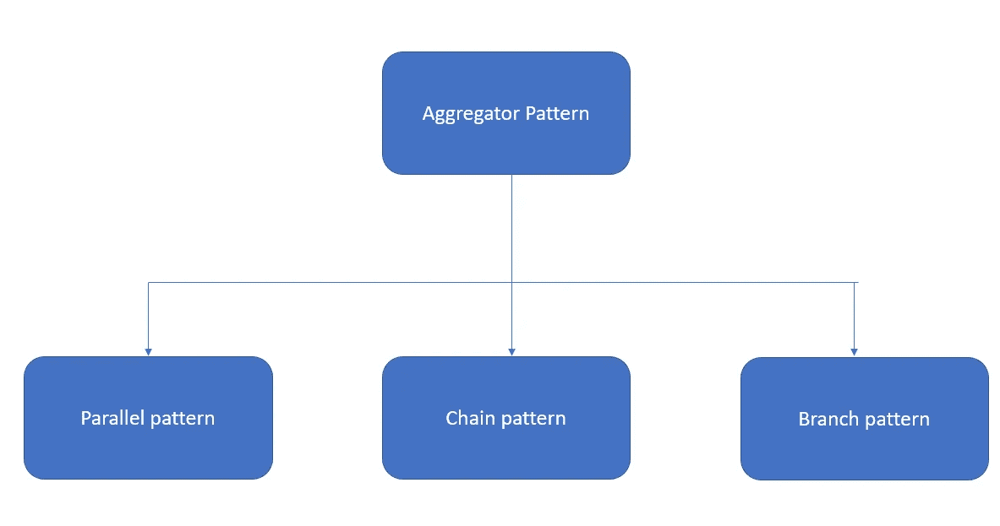

# 微服务的设计模式

> 原文：<https://blog.devgenius.io/design-patterns-for-microservices-1399eea583b7?source=collection_archive---------10----------------------->

在本文中，我们将讨论微服务的聚合器模式。

聚合器模式

*   有 3 种不同的方法来实现聚合模式。

1.  平行聚合
2.  链聚集
3.  分支聚集

*   让我们考虑一个为公司实现微服务平台场景。

**设计:**

*   服务 1:获取个人(员工)信息的服务
*   服务 2:获取休假信息的服务
*   服务三:评估信息服务
*   服务号 4:分配信息服务

**消费者:**

1.  考勤管理系统
2.  项目管理系统

> 假设给我们一个任务，将这个单片系统转换成基于微服务的系统。

*   采取考勤制度。它需要两项服务。(个人信息服务和请假信息服务)。因此，现在我们应该尝试创建一个服务来消费这两个服务，并向消费者提供反馈。该新服务将接受来自消费者的请求，并调用个人信息和离开信息服务，汇总这些响应并发送回消费者。
*   当您调用这个出勤服务时，它可以做三件事。

1.  并行聚集(分散聚集模式):向个人信息服务和离开信息服务发送并行过程，得到那些响应，并聚集那些类型的单个响应，并发送给消费者

2.链式聚合:所以我不认为休假信息依赖于个人信息。但是它仍然不知道如何从 ID 收集信息。现在，我们可以调用个人信息服务，然后获取员工代码，并将其传递给休假信息服务，获取休假信息。然后，我们可以将聚合器响应发送回消费者。

> 假设个人信息服务需要 10 ms 的响应时间，而离开信息系统需要 10 ms 的响应时间。因此，在并行聚合中，我们可以在 10 ms 内获得这两种信息(理论上)。
> 
> 但是如果你一个接一个地进行，就像在链式方法中，第一个调用需要 10 毫秒，第二个调用需要 10 毫秒，那么总的响应时间是 20 毫秒。
> 
> 这并不意味着并行聚合适合每一种实现，对于编码过程这样的场景，我们必须坚持使用链式方法。

3.分支:假设用户将发送一个雇员 ID 和他的分支机构代码，因此您调用个人信息服务，如果分支机构代码与销售有关，我们可以调用销售信息服务。如果分支代码与开发人员相关，则提取与该员工相关的项目分配信息。

*   这意味着基于一些因素的分支，我们决定它应该指向哪里。

*   所以请记住，当您执行这种类型的服务时，您需要确保您的授权/认证流程是如何工作的，因为如果认证令牌验证过程需要 5 毫秒，那么 3 个服务将需要 15 毫秒。但问题是，响应周期中的每一毫秒都非常重要。我们应该在往返过程中尽可能节省时间。
*   作为解决方案，我们可以有单独的身份管理服务，您可以通过该身份管理服务向聚合服务发送流量。

参考:

*   因此，我的下一篇文章将包含如何将断路器模式用于微服务。