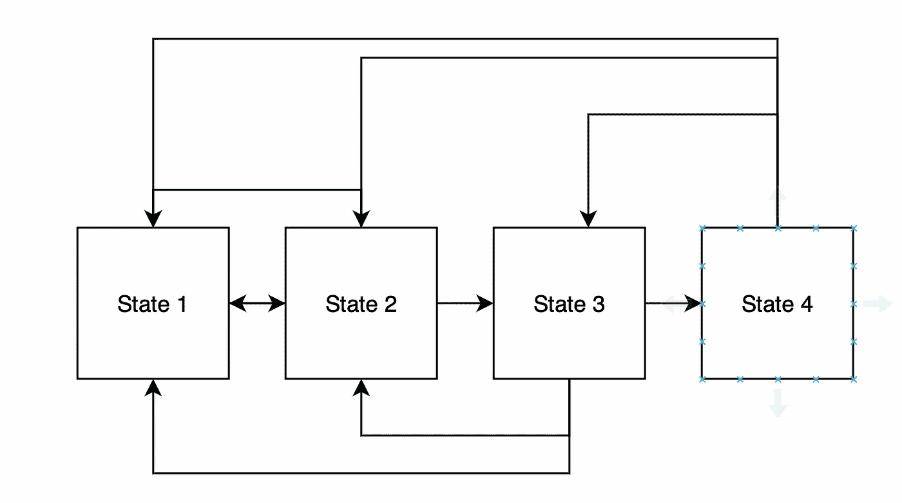
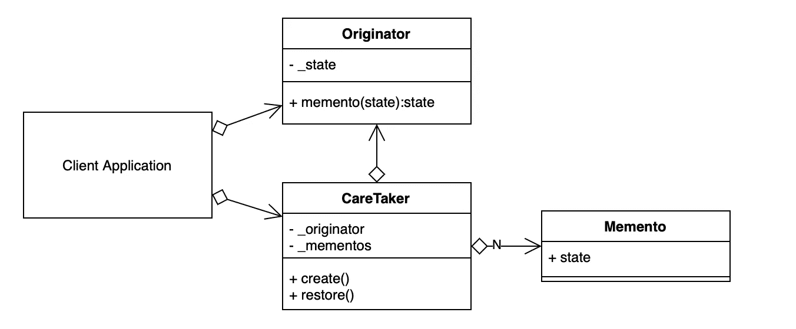
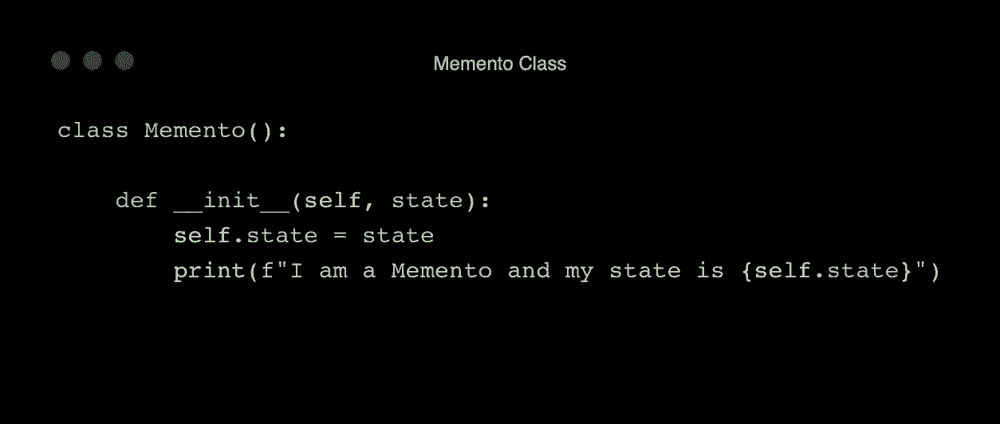
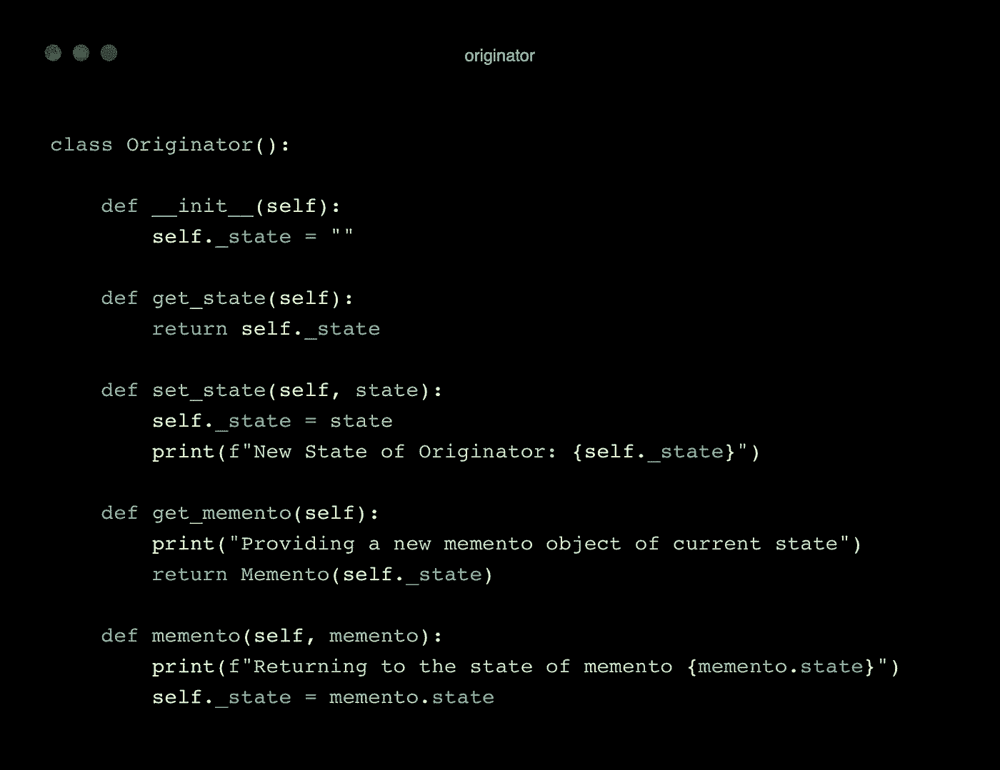
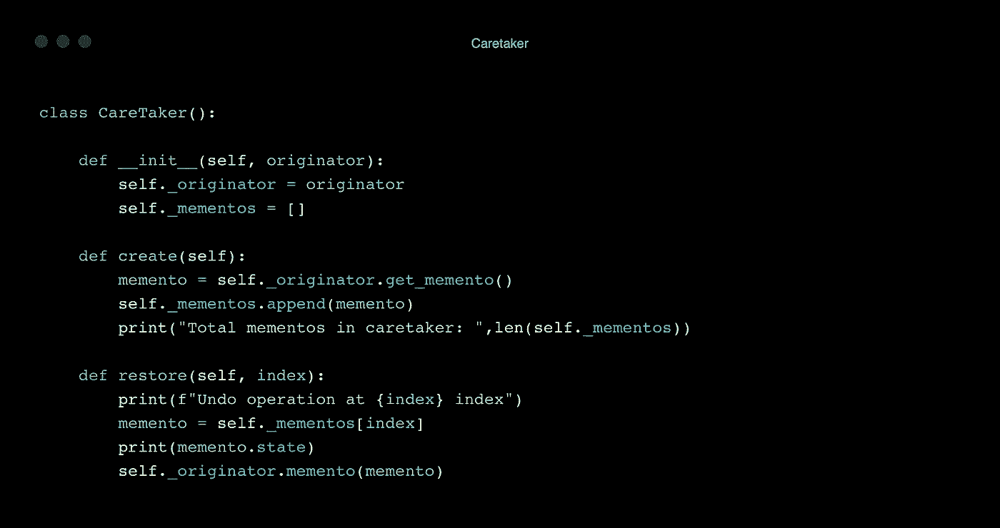

# Python 中的设计模式:纪念模式

> 原文：<https://blog.devgenius.io/design-patterns-in-python-memento-pattern-dfbb8a6f36cb?source=collection_archive---------6----------------------->

## Memento 设计模式在 Python 中的实现


纪念的电影海报。[来源](https://wall.alphacoders.com/big.php?i=1122155)

我们使用 Memento 设计模式来捕捉一个对象的瞬时状态，并将其取出。这样，物体就可以在必要的时候回到我们带出的这个状态。

前一章是:

[](https://python.plainenglish.io/design-patterns-in-python-observer-pattern-3d65307ab46a) [## Python 中的设计模式:观察者模式

### 观察者设计模式在 Python 中的实现

python .平原英语. io](https://python.plainenglish.io/design-patterns-in-python-observer-pattern-3d65307ab46a) 

在一个结构中，一个对象的状态可能会经常改变。我们可能还想存储有问题的对象所在的状态，返回到这些状态(撤销)，或者创建检查点。



撤消。

封装不允许我们导出对象的状态。那么设计另一个可以访问和存储对象状态的对象可能是明智的。为了解决这个问题，我们可以设计一个纪念品。

Memento 保护对象的快照。它接收状态信息，并将其存储在为其设计的数据结构中。它只有需要存储的状态信息，并在必要时，介入将有问题的对象转换为它为撤销操作存储的状态。

*   **发起者**是其状态将被存储的对象。
*   **纪念物**是存储状态的对象。
*   **看管人**是触发纪念品存储发起者状态的对象。



UML 类图。[来源](https://sbcode.net/python/memento/)

我们有一个 memento 类，它保存状态信息。



纪念品

发起者有通常的 getters 和 setters。此外，如果我们想要快照，它会返回一个 memento 对象(通过 *get_memento* 方法)。并且， *memento* 方法只是处理恢复或撤销操作。



发起人

管理员是纪念品和发起者之间的接口。它按顺序跟踪纪念品。因此，我们可以跳转到任何带有索引的 memento 对象。



看门人

让我们创建客户端:

```
ORIGINATOR = Originator()
CARETAKER = CareTaker(ORIGINATOR)
```

尝试做一些改变:

```
ORIGINATOR.set_state("State 1")**#New State of Originator: State 1**

ORIGINATOR.set_state("State 2")**#New State of Originator: State 2**
```

让我们创造看守者；

```
CARETAKER.create()**#Providing a new memento object of current state
#I am a Memento and my state is State 2
#Total mementos in caretaker:  1**
```

让我们在状态中再做一次改变，然后保存它。

```
ORIGINATOR.set_state("State 3")
CARETAKER.create()**#New State of Originator: State 3
#Providing a new memento object of current state
#I am a Memento and my state is State 3
#Total mementos in caretaker:  2**ORIGINATOR.set_state("State 4")**#New State of Originator: State 4****print(ORIGINATOR.get_state())**#State 4
```

让我们恢复并回到第一个纪念品的状态:

```
CARETAKER.restore(0)**#Undo operation at 0 index
#State 2
#Returning to the state of memento State 2**print(ORIGINATOR.get_state())**#State 2**
```

通过使用 memento 设计模式，我们不会在状态存储期间破坏封装。使用纪念版可能会很贵。要持有的对象数量越多，成本就越高。它用在 GUI 和编辑器等经常使用撤销操作的系统中。

感谢阅读。如果你有任何问题或意见，请随时写信给我。

## 下一章

[](https://medium.com/@okanyenigun/design-patterns-in-python-mediator-pattern-a7fe09655d44) [## Python 中的设计模式:中介模式

### 中介设计模式解释。

medium.com](https://medium.com/@okanyenigun/design-patterns-in-python-mediator-pattern-a7fe09655d44) 

## 阅读更多内容…

[](https://levelup.gitconnected.com/design-patterns-in-python-singleton-pattern-f76dc26281f8) [## Python 中的设计模式:单例模式

### Python 中 Singleton 设计模式的实现

levelup.gitconnected.com](https://levelup.gitconnected.com/design-patterns-in-python-singleton-pattern-f76dc26281f8) [](https://python.plainenglish.io/design-patterns-in-python-builder-pattern-d921fbac7fb3) [## Python 中的设计模式:构建器模式

### 用 Python 语言实现 Builder 模式

python .平原英语. io](https://python.plainenglish.io/design-patterns-in-python-builder-pattern-d921fbac7fb3) [](https://medium.com/@okanyenigun/how-does-python-work-7dc53da52065) [## Python 是如何工作的？

### Python 的内部工作原理

medium.com](https://medium.com/@okanyenigun/how-does-python-work-7dc53da52065) [](https://levelup.gitconnected.com/restful-django-django-rest-framework-8b62bed31dd8) [## RESTful Django — Django REST 框架

### 让我们开发一个 RESTful Django 项目

levelup.gitconnected.com](https://levelup.gitconnected.com/restful-django-django-rest-framework-8b62bed31dd8) 

## 参考

[https://www . geeks forgeeks . org/memento-method-python-design-patterns/](https://www.geeksforgeeks.org/memento-method-python-design-patterns/)

[https://refactoring . guru/design-patterns/memento/python/example](https://refactoring.guru/design-patterns/memento/python/example)

[http://www . course galaxy . com/design-patterns/memento-python . html](http://www.coursegalaxy.com/design-patterns/memento-python.html)

[https://pythonwife.com/memento-design-pattern-with-python/](https://pythonwife.com/memento-design-pattern-with-python/)