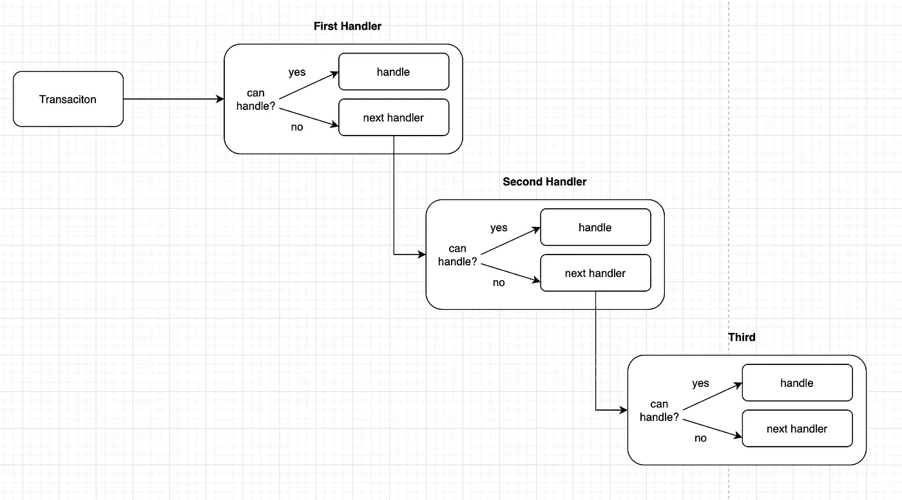

# Ruby 中的设计模式——责任链

> 原文：<https://blog.devgenius.io/design-patterns-in-ruby-chain-of-responsibility-6b984220ac37?source=collection_archive---------15----------------------->


Joshua Fuller 在 [Unsplash](https://unsplash.com?utm_source=medium&utm_medium=referral) 上拍摄的照片

你有一个大的`if/else`语句来决定如何在你的一个类中处理一些逻辑。

```
if order.currency == 'gdp' && order.amount < 500
  PayPalPayment.process(order)
elsif order.currency == 'gdp' && order.amount > 500
  StripePayment.process(order)
elsif order.currency == 'usd'
  SquarePayment.process(order)
elsif order.currency == 'eur'
  PayPalPayment.process(order) 
elsif order.currency == 'zar'
  WesternUnionPayment.process(order)
elsif # more examples 
... 
end
```

## 为什么这是个问题？

发送方对象(包含上面代码的类)完全耦合到接收方类(例如`StripePayment`、`PayPalPayment`等)，它知道所有可能的处理程序和决定使用哪个处理程序的逻辑。如果处理程序发生了变化(例如，删除、添加或更新了一个处理程序)，或者如果确定使用哪个处理程序的逻辑发生了变化(例如，Stripe 引入了一个限制)，那么在对这个已经臃肿的类进行更改时，您就有破坏应用程序的风险，更不用说让别人理解您的程序在做什么变得越来越困难了。

## 这种设计模式解决了什么问题？

1.  有多个对象可以处理这个请求(例如，`StripePayment`，`PayPalPayment`)，但是直到运行时(也就是当你知道使用哪种货币进行购买时)，你才知道使用哪一个。
2.  您希望将发出请求的对象(发送者)和处理请求的对象(接收者)分离，这样发送者只需要知道请求将被处理，接收者和发送者彼此没有明确的了解。

## 这种设计模式的一般概念是什么？

责任链模式是一种*行为设计模式*。行为设计模式与算法和对象之间的责任分配有关，包括它们之间的通信模式。设计模式的其他类别是创造型*和结构型**。

这种模式通过给多个对象一个处理请求的机会，避免了将请求的发送者耦合到接收者。链接接收对象，并沿着链传递请求，直到有对象处理它。

## 我们如何实现这种模式？

我们可以创建一个处理程序链，而不是一个大的`if/else`语句。请求将按顺序通过每个处理程序(如果链中的每个链接无法解析请求，则将其传递给下一个链接)，直到找到可以解析请求的处理程序。



逻辑图的处理程序链流程

好吧，让我们进入代码。我们将创建一个基本处理程序，所有的处理程序都将继承它

```
class BaseHandler   
  attr_reader :successor      def initialize(successor = nil)
    @successor = successor    
  end      def call(transaction)
    if can_handle?(transaction)
      handle(transaction)
    else
      successor.call(transaction)
    end
  end      def handle(_transaction)
    raise NotImplementedError, 'Each handler should respond to handle and can_handle? methods'   
  end 
end
```

现在我们需要创建链。我们可以从第一个处理程序开始，我们希望它是最具体的处理程序。

```
class PayPalHandler < BaseHandler private # all the public methods are in the BaseHandler def handle(transaction)     
    puts "handling the transaction with PayPal payment provider"
  end  def can_handle?(transaction)
    transaction.amount < 500 && transaction.currency == 'GDP' || transaction.currency == 'EUR'  
  end
end
```

我们将添加另一个处理程序，作为链中的第二个环节

```
class StripeHandler < BaseHandler private def handle(transaction)     
    puts "handling the transaction with Stripe payment provider"
  end def can_handle?(transaction)
    transaction.amount > 500 && transaction.currency == 'GDP'
  end
end
```

现在我们可以创建链。

```
transaction = Transaction.new(currency: 'GDP', amount: 600)chain = PayPalHandler.new(StripeHandler.new)chain.call
```

当我们运行`chain.call`时，它将转到第一个处理器(`PayPalHandler`)，如果它是`can_handle?`，那么它将是`handl`，链将停止。如果它不能处理，它将把事务传递给第二个处理程序`StripeHandler`并调用它的`call`方法，以此类推。

添加更多的处理程序很容易，例如:

```
chain = PayPalHandler.new(StripeHandler.new(SquareHandler.new(WesternUnionHandler.new)))chain.call
```

我们可以轻松地删除处理程序或改变处理程序的顺序。

```
chain = StripeHandler.new(SquareHandler.new(PayPalHandler.new))
```

> ***创新设计** **模式**抽象实例化过程。它们有助于使一个系统独立于它的对象是如何被创建、组合和表现的(第 3 章，Go4)。例子包括单例、工厂方法、构建器、抽象工厂和原型。
> 
> ****结构设计模式**关注的是类和对象如何组成更大的结构。他们使用继承来组成接口或实现。一个简单的例子是多重继承如何将两个或多个类混合成一个类，从而产生一个结合了其父类属性的类。例子包括适配器、桥、组合、Facade、Flyweight 和代理模式(第 4 章，Go4)。