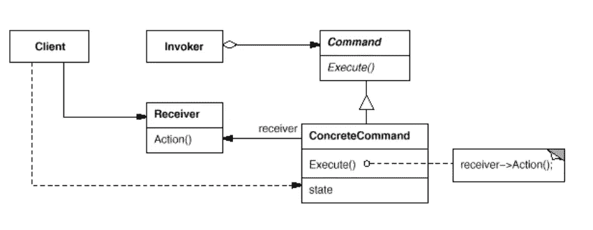
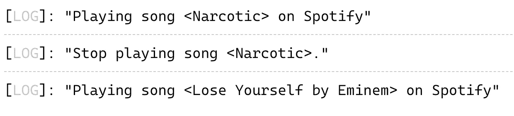

# 使用类型脚本示例设计模式:命令

> 原文：<https://blog.devgenius.io/design-patterns-with-typescript-examples-command-3a7260f15c11?source=collection_archive---------3----------------------->

## 命令模式将请求转换成对象

在 [Unsplash](https://unsplash.com?utm_source=medium&utm_medium=referral) 上由[尹新荣](https://unsplash.com/@insungyoon?utm_source=medium&utm_medium=referral)拍摄的照片

**行为**命令模式是一种引人注目的软件设计模式，并且符合基本的软件设计原则。

在本文中，我们将详细阐述该模式的目的和结构，并通过一个实际的例子解释如何使用它。此外，我们将使用高级**类型脚本**创建一个代码示例。

# 什么是设计模式？

设计模式是针对不同环境中反复出现的问题的通用的、可重用的解决方案。在软件工程中，他们帮助你更快地写出更好的代码。使用这些通用解决方案可以节省我们的时间和工作，因为我们重用了许多其他开发人员积累的知识和经验。

> “[……]对我来说，遇到没有听说过模式运动的开发人员是不常见的”“ *Grady Booch 在* [设计模式:可重用面向对象软件的元素](https://amzn.to/3i6iIIk)

也许你做了多年的程序员，却没有应用甚至不知道任何一种模式。我敢打赌，许多开发人员正是这样做的。如果是这样，我强烈推荐你先阅读这篇文章，让你的大脑相信软件设计模式是必不可少的。

 [## 为什么你必须学习软件设计模式

### 设计模式让你更快地写出更好的代码。

javascript.plainenglish.io](https://javascript.plainenglish.io/why-you-must-learn-software-design-patterns-befd77f88713) 

## 模式的类别

1994 年,《设计模式:可重用面向对象软件的元素》一书由四位作者出版:Erich Gamma、Richard Helm、Ralph Johnson 和 John Vlissides，也称为“四人组”

尽管这本书是在 25 年前出版的，但它仍然是与软件工程最相关的书籍之一。阅读它可能是丰富您的开发人员工具包的一笔可观的投资。如上所述，**四人帮(GoF)** 定义了 23 种设计模式。为了组织他们，他们把他们分成三类:**创造性的**、**结构性的**和**行为性的**。

> "**创建**模式关注对象创建的过程。**结构化**模式处理类或对象的组成。**行为**模式描述了类或对象交互和分配责任的方式— [设计模式:可重用面向对象软件的元素](https://amzn.to/3i6iIIk)

这里是由 GoF 定义的所有模式的概述。另外，看看我的其他文章，在表格中有链接。

如果你更喜欢通过视频课程学习，我推荐你查看 Skillshare 上的这个 [**Typescript 设计模式课程**](https://skillshare.eqcm.net/vnLkyj) 。它涵盖了所有 23 种 GoF(四人帮)设计模式，并教你如何使用 TypeScript 实现它们。作为代销商，如果你通过这个链接注册，我会收到一小笔佣金。你的支持帮助我为你创造更多有价值的内容。

 [## TypeScript 中的设计模式

### 解锁无限制访问此技能共享课程以及由来自世界各地的创作者讲授的数千门课程…

skillshare.eqcm.net](https://skillshare.eqcm.net/vnLkyj) 

# 命令模式

从表中可以看出，命令模式被归类到**行为**模式的类别中。考虑到这一点，它的目的必须在于描述类或对象如何交互和分配责任。

## 目的🎯

命令模式的目的是将一个请求转换成一个包含所有操作信息的对象。因此，我们可以参数化不同请求的客户端。这样，每个客户端都可以执行命令，而不必知道任何关于动作本身的信息。

也许你听过这句话:**编程到一个接口，而不是一个实现**。这意味着我们应该关注代码做什么，而不是我们如何实现它。

> 遵循这条规则将你的代码从实现中分离出来，这使得它成为“松散耦合”。解耦的代码不依赖于具体的实现，这对于编写易于维护的代码是至关重要的— **干净的代码**

命令模式是通过对许多客户机都理解的共享命令接口进行编程来做到这一点的。客户端不依赖于具体的实现，可以在不知道的情况下执行动作。

 [## Web 组件会取代前端框架吗？

### 它们是为解决不同的问题而构建的。

medium.com](https://medium.com/@mariusbongarts11/will-web-components-replace-frontend-frameworks-535891d779ba) 

## 适应性💡

命令模式在许多用例中被广泛使用和应用。您可以随时使用命令模式

*   通过要执行的操作来参数化对象
*   撤消操作。命令的执行操作可以在命令本身中存储用于反转其效果的状态。
*   排队任务、跟踪操作、拥有命令历史等。

> "命令是面向对象的回调替代物."— GoF

## 结构📐

该命令的结构很简单。它包含一个**客户端**，它创建和配置具体的命令并设置它的**接收者**。一个 **ConcreteCommand** 从 **Command** 接口扩展而来，通过各种请求实现其`ececute()`功能。 **Receiver** 类包含实际的业务逻辑，并且知道如何执行操作。任何类都可以作为接收器。毕竟，**调用者**要求命令执行请求。

命令模式的结构(图片:GoF)

## 参与者🚻

从结构中，您可以派生出以下参与者:

*   **Invoker:** 负责发起请求。
*   **命令**:声明一个方法来执行命令
*   **具体命令**:实现各种请求
*   **接收方**:包含一些业务逻辑
*   **客户端**:创建一个具体命令并设置它的接收者

## 真实世界的例子🗺

当将命令模式应用到现实世界的例子中时，它们的好处是最容易理解的。

也许你正在使用某种基于语音的数字助理，如 Alexa 或 Google Home。他们正在解读你的声音，以得出相应的行动来执行。从技术上讲，这是由所谓的自然语言理解(NLU)单元来完成的。但是，让我们保持简单。最后，他们只负责识别你执行行动的意图。

他们不需要知道那些动作是如何工作的，他们只是执行它们。甚至有一些工具可以让你编写自己的动作。为此，我们需要[编写一个数字助理能够理解的接口](https://javascript.plainenglish.io/design-patterns-with-typescript-examples-factory-method-4d145887b141)。此外，动作可以包括参数。例如:

*《播放阿姆的歌曲《迷失自己》*

在这种情况下，用户的意图是**播放一首歌曲**。我们的参数是阿姆的歌曲“**迷失自己”。**

## 代码示例💻

让我们使用 Typescript 构建真实世界的 Alexa 和 Google Home 示例。看一下代码。你也可以在 [TypeScript Playground](https://www.typescriptlang.org/play?#code/PTAEBcAsFNQYwPYFskEMB2ATUBLd5oAnAM1TmgCg8CSzYBhZNLUAbwtFGgA9o4BXAgApo+HOACeAfgBcoAM7hCeAOYBKORgkBuDqH5YEQjaC26AvhQohTAI0WEy4UACU+0HADci8ADap5eQpUeyUnPwD5UABZfnkcOAAFfwkfdk4AB2VPVAJQdFQkaDkHVV1M7NzYAUJCUXAAZQR0FRKlVVAAH30saGI8aExdPUR0B344cARCIQKituUWtTY9TigceQA6OdgAXnzC6HLQSz0MlKF5ZtaFdqWVzk4cYlAhda2auvwm+-fNxQQGWOa0gG02n3qPxUoH2VxawPgzSuvmgm18CBUQgABslUBIOnDoQAeAAkrEJ5gAfKBmqAyX8duYsWpjqdOACMsYHo9nq8-hDvtdlulHqNkaj0ZisQ0phlQOc8QTrqBSax+fxapDrlTNsyEerNYKWjCepg+gMhqsTnpLKcbKM4HU8m5yF4fHB-IEKB7IqAGhkEOBnhJcalCFxuAQsFFYvEkik0iMkUoJlMZsKrfJ+BkiEIAOT+wPBvMsm0UU7WMBQWCh2MJRgoDDYDamRHoR3QPI4JDnaBFfC5HC0hAvaugBvMZv4Iikcjez1RWtxetMJu4Hso-vgKITtcirJeKryhOEOR1+N4ojDThilOTaZCBVhs-Li9hjOPCCgrZPnz7X+EKyVicDwfCCNAlzXLItyLOo3JPC8QgAISEssToaugbbimiGL5sk0ABNAAA08qEAgng4GaraEqAEgIPwoAAO70b42C+DgADWsBTKA7GKKIEAIJsJZWn8AGbE+kFLEBegGJgRgfo8Yknv8srGDJdpgAAcrkGqoL4oAADIYCo-CoCosAAKq9IQihNh0BjiK8WmGZZyzydAURXEUoBoCoCSgDAdSVqAWmBuuAaEOAGDOMQ0xftUq4sBkuQ0Og86+i5lkrGc-C2OxcC4PIS5xgAktO+BCJ4CAJMUMGqIpnDoYQmHVbVmxTIZCCMUQ9CEcYmx4B6-BmvI+aEiWXTdG15AdQgXU9YQfXyBBaiDe2vgjZ5+ZPiWQGZHlBVFdZ8nlVG4BVTV5ALA18GgM1rVXainXdb1-VrUNm2jeNsp7WWB35QFGwlSujZYEIiBg5gci7lgJEzXVpRLHIkOTkVoAg3AsPYCKTWdhhX5gsDKTnmd9SXbVpacGy8qHQFFngAAomIkgAPLEAAak9FPXfVyN89C3Ryea6CDDln68m836DcVJOvmTlUI2ojWismCjnOIBDYPsCP-BrF15jRf2fnj4AE-I+tawA2hb7HgFraKiCoUCgAAtKAACMAC6CI06bBPC-0ouWtTViaQl919oGsB4ITURwIR6NjgnvgooQGWBKAAAiOD+dFvgAIKBOIMXck+ULY0hMNJSH+SbSaouMaFrnqcBCidpj2OPikFc19XUMq8peK91DJrl9c2MyZwDPYwAYtMXO1TziN3Oo-do0LvRB2LuO4IhDKbTLmMKxdSsq-7LVxxJPcTzXvtWg9poi4MU80ugi-kF3CM3fcu+3oio99h-BnjXeehAP4QSVgiSWSFUZNjQvjS+YoEAohwpiAs0xCASBIqVeAGB8jhSDtgLQADJzG1VmMZw9RxASBNAffgmwGbMyDGzTm3MoEP0QZhehMsToIBPsvZYUhSFNk2HJBSoAUY102KBAQwhqGSCptacsVhvRqwtkWYgIYTwN2gE3QsQYtGhlzKWf+T5zzY10U3TuNdLgBkMdoy8hA1AUBRM4TAucS6F2LnZfAVjs6ePzkXeI0VKqlgoB4vO+lgkbFCeAf4Hc5Zxi7uY182NwmRK8TE3x8TmgQK7nmUMEcaI6UIIgIMcA-qZKCT4uJmw8lPQKTKQEx5FQtCQlUwJ0TakxXqe-RptjCkpGKcqLqK1QAAE16K2WgL4F4thaGMyQAMJAf0gA) 里摆弄它。

命令模式示例代码

抽象类`MusicPlayer`和具体类`SpotifyPlayer`是我们的**接收方**类。它们包含了我们演奏音乐的逻辑。`DigitalAssistant`类充当**调用者**，使用**具体命令** `PlayMusicCommand`类与玩家对象进行交互。`PlayMusicCommand`正在实现`**Command**`接口的`execute`功能。

以下是输出:

示例日志

## 相关设计模式🔗

软件设计模式通常显示不同模式之间的关系。这里有一些引用自 [GoF](https://amzn.to/3n4SSCY) 的与命令模式相关的设计模式:

> 一个**复合** […]可以用来实现宏命令。
> 
> 一个**纪念物** […]可以保持命令要求撤销其效果的状态。
> 
> 在放入 historylist 之前必须复制的命令充当了一个**原型** […]

# 最后的想法

我希望你喜欢阅读这篇文章。我总是乐于回答问题，并乐于接受批评。随时欢迎联系我！通过**[**LinkedIn**](https://www.linkedin.com/in/marius-bongarts-6b3638171/)**，**关注我**[**Twitter**](https://twitter.com/MariusBongarts)或 [**订阅**](https://medium.com/subscribe/@mariusbongarts) 通过电子邮件获取我的故事。****

****[**这里是无限制访问介质上每一个内容的链接**](https://medium.com/@mariusbongarts/membership) 。如果你注册使用这个链接，我会赚一小笔钱，不需要你额外付费。****

**** [## 通过我的推荐链接加入 Medium-Marius bong arts

### 作为一个媒体会员，你的会员费的一部分会给你阅读的作家，你可以完全接触到每一个故事…

medium.com](https://medium.com/@mariusbongarts/membership) 

此外，如果你还没有，看看我的在线荧光笔铬扩展。使用 [Web Highlights](https://web-highlights.com/) ，您可以在任何网页或 PDF 上高亮显示，创建标签并做笔记。

 [## Web 亮点— PDF 和 Web 荧光笔

### 最佳网络荧光笔。就像你在书上做的那样，在任何网页或 PDF 上高亮显示，并做笔记。组织…

web-highlights.com](https://web-highlights.com/) 

***披露*** *:本文包含附属链接。如果你通过这些链接之一购买，我可能会收到佣金。我只推荐我认为质量高、对你有益的产品。我感谢你的支持。*

## 进一步阅读

 [## 带有类型脚本示例的设计模式:工厂方法

### 工厂方法有助于编程接口，而不是实现。

javascript.plainenglish.io](https://javascript.plainenglish.io/design-patterns-with-typescript-examples-factory-method-4d145887b141)  [## 用 Web 组件构建自己的博客组合:基础

### 第 1 部分—定制元素、阴影 DOM 和 HTML 模板

medium.com](https://medium.com/@mariusbongarts11/showcase-your-medium-articles-with-web-components-part-1-basics-d2c6618e9482)  [## 三原则——三振出局，你就重构

### 在删除重复的代码之前，请三思

javascript.plainenglish.io](https://javascript.plainenglish.io/rule-of-three-three-strikes-and-you-refactor-942d13e7d5cd)  [## Web 组件会取代前端框架吗？

### 它们是为解决不同的问题而构建的。

medium.com](https://medium.com/@mariusbongarts11/will-web-components-replace-frontend-frameworks-535891d779ba)****