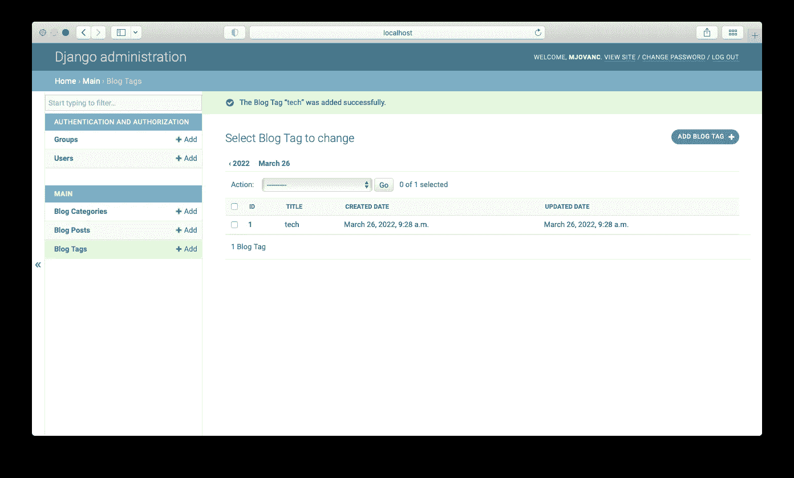

# Django 模型之间的设计关系

> 原文：<https://blog.devgenius.io/design-relationships-between-django-models-11ce7960e2ec?source=collection_archive---------4----------------------->


通常，我们需要在数据之间建立某种关系。这使得查询和获取数据变得更加容易。与例如博客帖子和类别或/和博客标签有关系也是有意义的。

在我之前的教程[中，我们已经使用 Django 完成了一个简单的博客应用程序，我们将继续在这个基础结构和实现的基础上添加更多内容。](https://mjovanc.com/quick-guide-of-the-python-web-framework-django-f7b7bcdecb57)

首先，关于以下的一些基本知识是必要的。我们需要弄清楚我们需要什么样的关系。我们需要考虑使用的关系有:

*   **一对一**
*   **一对多**
*   **多对多**

为了更清楚地理解它的含义，可以在下面举例说明:


**一对一**——所以一家汽车公司有且只有一款车型，而一款车型有且只有一辆汽车。

**一对多** —一个医生可以有多个病人，但是一个病人只有一个医生(也可以是多对多)

**多对多** —一个学生有很多科目，很多科目可以被很多学生使用。

现在我们已经解决了这个问题，我们将开始考虑如何设计我们的博客应用程序。我们需要一个博客帖子(正如我们之前已经实现)，博客类别和博客标签模型。那么我们应该如何看待它们之间的关系呢？一个建议和我们将如何做是使用以下:

*   **博客类别** — **博客发布**(多对多)
*   **博客标签** — **博客发布**(多对多)

我们需要在 BlogCategory 和 BlogPost 之间建立一种多对多的关系，因为会有许多博客文章被附加到许多不同的类别，反之亦然。

我们也需要我们的博客标签和博客文章之间的相同类型的关系。

# Django 的关系类型

因此，在 Django 中，有上述类型的关系，其中每一种都有大量的文档，说明如何用好的例子来使用它们。所以我不会在这里过多地讨论它，因为我也会参考文档。查看本文底部的参考资料，找到它们的链接。

## Django 文档中的一对一示例

```
**from** **django.db** **import** models

**class** **Place**(models.Model):
    name = models.CharField(max_length=50)
    address = models.CharField(max_length=80)

    **def** __str__(self):
        **return** "**%s** the place" % self.name

**class** **Restaurant**(models.Model):
    place = models.OneToOneField(
        Place,
        on_delete=models.CASCADE,
        primary_key=**True**,
    )
    serves_hot_dogs = models.BooleanField(default=**False**)
    serves_pizza = models.BooleanField(default=**False**)

    **def** __str__(self):
        **return** "**%s** the restaurant" % self.place.name

**class** **Waiter**(models.Model):
    restaurant = models.ForeignKey(Restaurant, on_delete=models.CASCADE)
    name = models.CharField(max_length=50)

    **def** __str__(self):
        **return** "**%s** the waiter at **%s**" % (self.name, self.restaurant)
```

当我们处理一对一关系时，我们使用 **OneToOneField** 字段类型并连接模型名称，在本例中是在示例位置，并使用 **CASCADE** 类型的方法 **on_delete** 。

## Django 文档中的多对一示例

```
**from** **django.db** **import** models

**class** **Reporter**(models.Model):
    first_name = models.CharField(max_length=30)
    last_name = models.CharField(max_length=30)
    email = models.EmailField()

    **def** __str__(self):
        **return** "**%s** **%s**" % (self.first_name, self.last_name)

**class** **Article**(models.Model):
    headline = models.CharField(max_length=100)
    pub_date = models.DateField()
    reporter = models.ForeignKey(Reporter, on_delete=models.CASCADE)

    **def** __str__(self):
        **return** self.headline

    **class** **Meta**:
        ordering = ['headline']
```

因此，当使用多对一关系时，我们使用**外键**字段类型，并描述它应该连接到什么模型，以及使用 **on_delete** 类型。通常是**级联**。这意味着当我们删除一篇文章时，我们也会删除记者数据。

## Django 文档中的多对多示例

```
**from** **django.db** **import** models

**class** **Publication**(models.Model):
    title = models.CharField(max_length=30)

    **class** **Meta**:
        ordering = ['title']

    **def** __str__(self):
        **return** self.title

**class** **Article**(models.Model):
    headline = models.CharField(max_length=100)
    publications = models.ManyToManyField(Publication)

    **class** **Meta**:
        ordering = ['headline']

    **def** __str__(self):
        **return** self.headline
```

# 创建 Django 模型

因此，让我们开始在现有项目中实现这一点。确保从这里从现有的存储库克隆存储库(使用分支**快速指南**):[https://github.com/mjovanc/medium-django/tree/quick-guide](https://github.com/mjovanc/medium-django/tree/quick-guide)

不要忘记创建你的虚拟环境，如果不确定的话，可以查看之前的教程。

既然我们已经添加了 BlogPost 类，我们需要在主应用程序的 **models.py** 文件中再添加两个类 BlogCategory 和 BlogTag:

```
**class** **BlogTag**(models.Model):
    name = models.CharField(verbose_name=_('Title'), max_length=100)
    created = models.DateTimeField(verbose_name=_('Created Date'), auto_now_add=True, blank=True, null=True)
    updated = models.DateTimeField(verbose_name=_('Updated Date'), auto_now_add=True, blank=True, null=True)**def __str__**(self):
        **return** self.name

    class **Meta**:
        verbose_name = _('Blog Tag')
        verbose_name_plural = _('Blog Tags')

**class** **BlogCategory**(models.Model):
    name = models.CharField(verbose_name=_('Title'), max_length=100)
    created = models.DateTimeField(verbose_name=_('Created Date'), auto_now_add=True, blank=True, null=True)
    updated = models.DateTimeField(verbose_name=_('Updated Date'), auto_now_add=True, blank=True, null=True)

    **def __str__**(self):
        **return** self.name **class** **Meta**:
        verbose_name = _('Blog Category')
        verbose_name_plural = _('Blog Categories')
```

因此，我们创建了两个非常简单的类，它们包含名称、创建日期和更新日期等字段。我们还添加了 __string__ 方法，当我们在管理区域中使用带有关系对象的模型时，该方法将返回 name 字段，稍后我们将更直观地了解这意味着什么。我们还添加了元类来定义详细名称和详细复数名称，这样在我们的管理区看起来会更好。

# 创建模型之间的关系

所以让我们把使它相互关联的东西加起来。首先看看我们当前的代码，大致了解一下我们得到了什么:

```
**from django.db** import models
**from django.utils.translation import** gettext_lazy as _

**class BlogTag**(models.Model):
    name = models.CharField(verbose_name=_('Title'), max_length=100)
    created = models.DateTimeField(verbose_name=_('Created Date'), auto_now_add=True, blank=True, null=True)
    updated = models.DateTimeField(verbose_name=_('Updated Date'), auto_now_add=True, blank=True, null=True)

    **def __str__**(self):
        **return** self.name

    **class Meta**:
        verbose_name = _('Blog Tag')
        verbose_name_plural = _('Blog Tags')

**class BlogCategory**(models.Model):
    name = models.CharField(verbose_name=_('Title'), max_length=100)
    created = models.DateTimeField(verbose_name=_('Created Date'), auto_now_add=True, blank=True, null=True)
    updated = models.DateTimeField(verbose_name=_('Updated Date'), auto_now_add=True, blank=True, null=True)

    **def __str__**(self):
        **return** self.name

    **class Meta**:
        verbose_name = _('Blog Category')
        verbose_name_plural = _('Blog Categories')

**class BlogPost**(models.Model):
    title = models.CharField(verbose_name=_('Title'), max_length=100)
    text = models.TextField(verbose_name=_('Description'), max_length=1000, blank=True)
    created = models.DateTimeField(verbose_name=_('Created Date'), auto_now_add=True, blank=True, null=True)
    updated = models.DateTimeField(verbose_name=_('Updated Date'), auto_now_add=True, blank=True, null=True)
    categories = models.ManyToManyField(BlogCategory)
    tags = models.ManyToManyField(BlogTag)

    **def __str__**(self):
        **return** self.title

    **class Meta**:
        verbose_name = _('Blog Post')
        verbose_name_plural = _('Blog Posts')
```

因此，由于我们需要 BlogPost 类和 BlogTag 以及 BlogPost 和 BlogCategory 之间的多对多关系，我们将在 BlogPost 类上定义两个新字段。将这些放在更新字段下:

```
categories = models.ManyToManyField(BlogCategory)
tags = models.ManyToManyField(BlogTag)
```

配置就这么多了。这就是 Django 的神奇之处，它是如此容易构建。

# 进行迁移并迁移到数据库

现在我们只需要进行迁移，因此在项目的根目录下运行以下命令。确保您在虚拟环境中处于激活状态。

```
python manage.py makemigrations
python manage.py migrate
```

让我们通过访问数据库来验证它是否有效。我个人的经验是，它显示它已被迁移，但从来没有这样做，检查一下总是好的！


迁移后的数据库表

所以我们现在看到了四个新表。我们有两个耦合表**main _ blogpost _ categories**和 **main_blogpost_tags** 。这些很重要，因此它们可以连接实体之间的关系。

# 将模型注册到管理区

现在，我们将这些模型注册到管理区，这样我们就可以在数据库中添加一些数据，并添加一些关系。目前，我们已经将 BlogPost 添加到主应用程序目录中的 **admin.py** 文件中:

```
**from django.contrib** import admin
**from .models import** BlogPost

**@admin.register**(BlogPost)
**class BlogPostAdmin**(admin.ModelAdmin):
    list_display = (
        'id',
        'title',
        'created',
        'updated',
    )
```

因此，我们将做类似的事情，但我们需要添加一些其他的东西，以便在管理区更清楚:

```
**from django.contrib import** admin
**from .models import** BlogTag, BlogCategory, BlogPost

**@admin.register**(BlogTag)
**class BlogTagAdmin**(admin.ModelAdmin):
    list_display = (
        'id',
        'name',
        'created',
        'updated',
    )
    list_per_page = 25
    date_hierarchy = 'created'

**@admin.register**(BlogCategory)
**class BlogCategoryAdmin**(admin.ModelAdmin):
    list_display = (
        'id',
        'name',
        'created',
        'updated',
    )
    list_per_page = 25
    date_hierarchy = 'created'

**@admin.register**(BlogPost)
**class BlogPostAdmin**(admin.ModelAdmin):
    list_display = (
        'id',
        'title',
        'created',
        'updated',
    )
    list_per_page = 25
    date_hierarchy = 'created'
```

因此，我们使用快速入门指南中的 **list_display** 来选择应该显示哪些字段。我们还可以添加一个 exclude 属性，这将默认添加除了字段之外的所有内容*。然后我们有一个简单易懂的 **list_per_page** 属性，所以我们设置 25，这似乎是每页的合理数量。然后我们还有一个 **date_hierarchy** ，我们按照创建日期对对象进行排序。*

现在我们已经完成了管理员配置，我们将转到[http://localhost:8000](http://localhost:8000)/admin，输入您的用户名和密码，现在让我们检查一下:


Django 仪表板

我们看到，我们现在有博客类别，博客文章和博客标签的主要部分。所以让我们从添加博客类别开始:


添加博客类别


博客类别列表

现在让我们对博客标签做同样的事情:


添加博客标签



博客标签列表

很好，最后一步是添加实际的博客文章，并将这些对象附加到它上面:


添加博客文章

现在我们看到列出了类别和标签。这些列表是多选列表，因此我们可以为博客文章选择许多不同的类别或标签。你可以使用类别作为**外键**以及**多对一**关系，这样你只能选择一个类别，但是我认为有时候你需要多个类别来适应内容。

# 摘要

本教程到此为止。希望你觉得有用。我将在未来报道更多的 Django 教程，所以请继续关注我的 LinkedIn 文章:[https://www.linkedin.com/in/marcuscvjeticanin/](https://www.linkedin.com/in/marcuscvjeticanin/)

谢谢！:)

# 资源

*   [https://github.com/mjovanc/medium-django/tree/relationships](https://github.com/mjovanc/medium-django/tree/relationships)
*   [https://docs . django project . com/en/4.0/topics/db/examples/one _ to _ one/](https://docs.djangoproject.com/en/4.0/topics/db/examples/one_to_one/)
*   [https://docs . django project . com/en/4.0/topics/db/examples/many _ to _ one/](https://docs.djangoproject.com/en/4.0/topics/db/examples/many_to_one/)
*   [https://docs . django project . com/en/4.0/topics/db/examples/many _ to _ many/](https://docs.djangoproject.com/en/4.0/topics/db/examples/many_to_many/)