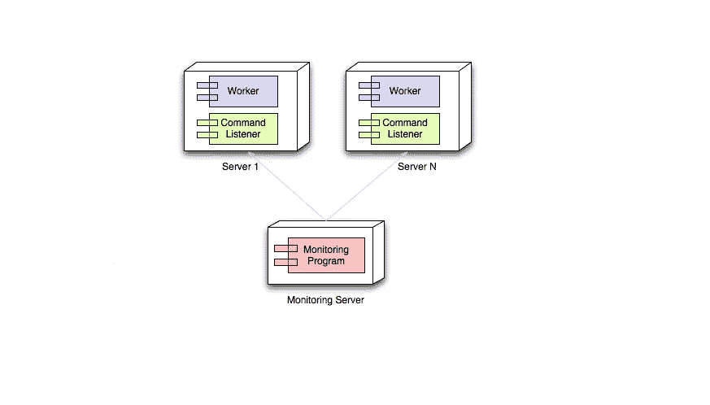
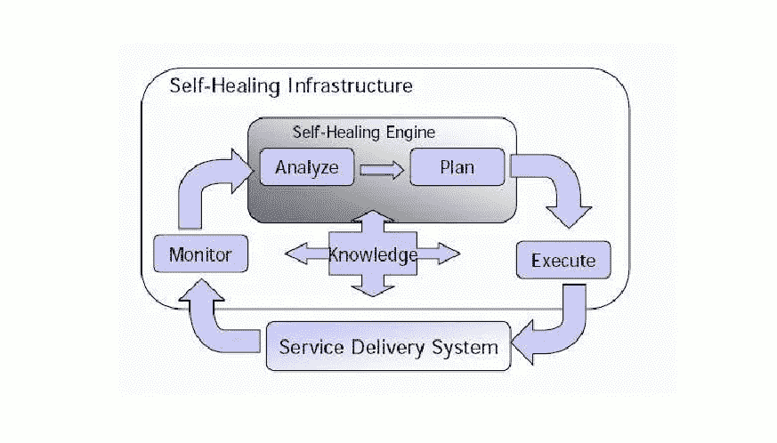
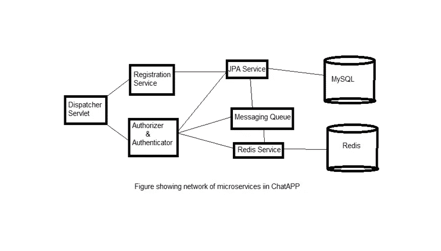
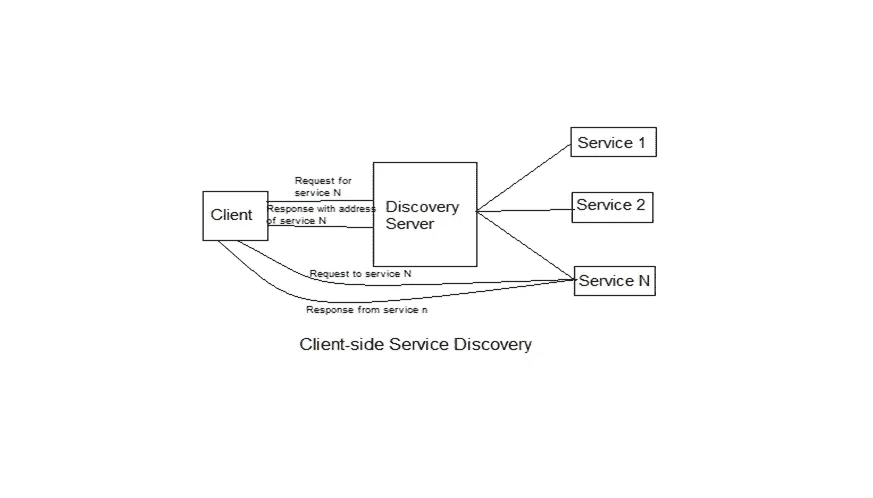
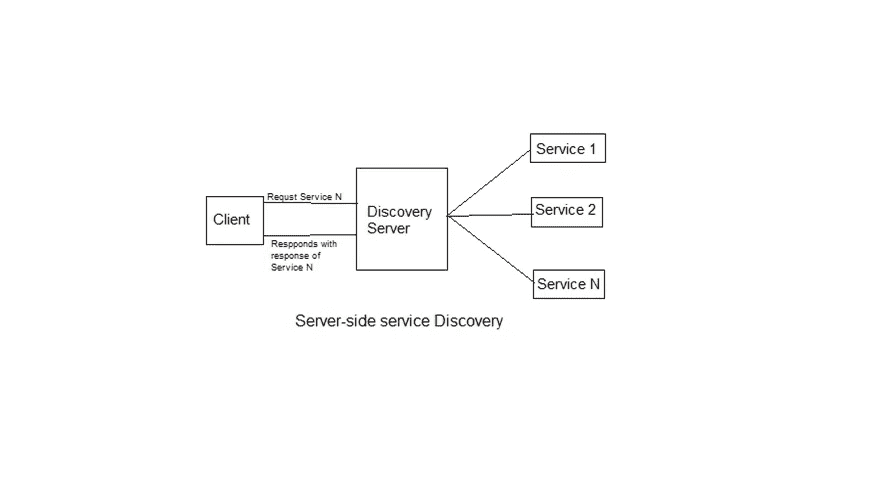
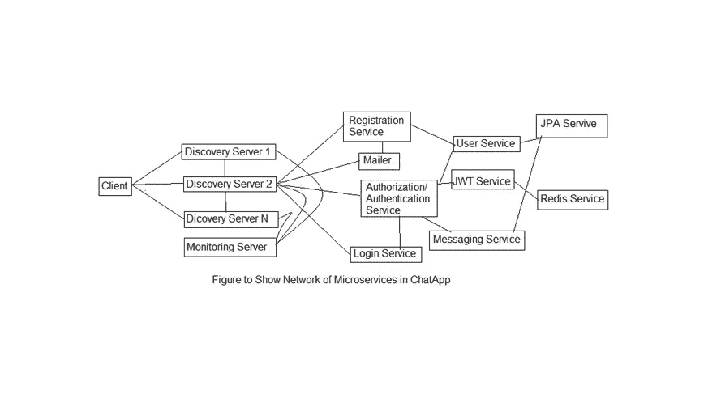

# 设计自我修复的自主服务器

> 原文：<https://blog.devgenius.io/designing-a-self-healing-autonomic-server-56ab94de8fcf?source=collection_archive---------28----------------------->

# 1.介绍

所有 web 服务器都配置了最大工作线程，可以创建这些线程来处理来自客户端的请求。通常，工作线程的最大数量由系统管理员基于每个实例的预期请求数量来预定义。只要请求的数量小于工作线程的总数，它就能正常工作。一旦每个实例的请求超过工作线程总数，服务将无法处理来自客户端的请求。因此，客户端的请求超时。情况变得更糟，因为用户感到沮丧，并开始点击刷新页面时，看到从应用程序通常的延迟。这会增加每个实例的请求数量，从而使情况变得更糟。这导致了一个循环，最终服务器失败并完全停止工作。一种解决方案是手动监控服务器，并在流量突发时将其关闭，增加工作线程的数量并重启服务器。这种想法是不可行的，因为服务器关闭时业务将会丢失，这也将导致硬件资源管理不善。

# 2.自主服务器

自主这个词来自于在哺乳动物和其他高级生物中发现的自主神经系统。神经系统的这一部分能够在没有意识的情况下执行所需的身体功能。自主计算的基础围绕着系统自我管理。在这种情况下，内部组件之间的协作以自我管理的方式进行描述。自主计算旨在减少系统管理中的人为干预，并优化系统正常运行时间的效率。为此，IBM 确定了四个基本组件特性:自我配置、自我修复、自我优化和自我保护。

服务器配置中人工干预的减少使得服务器自己决定如何适应当前的流量，由于 Slashdot 效应使得它们适应闪存群集，从而相对更具容错性。理论上，自主服务器可以容忍任何突发流量，只要它们有底层硬件支持。

就像在*自主神经系统中一样，*自主服务器需要一个监控服务器来充当负载平衡器和工作调度器，以决定哪个服务需要服务即将到来的请求。该服务器需要保持对所有可用服务端口的健康检查，并主要执行三个操作，如下所述:

所有可用服务的健康监控

将请求分派给准确的服务

监控请求，从而根据预先决定的短路挂钩创建或销毁服务实例

下图描述了自治服务器的概念:

自主服务器

这里，监控程序充当调度服务器，所有请求都将由它来处理。必须注意，为了更好地扩大规模，可以创建多个监控程序实例来帮助 dispatcher 服务器。

# 3.自我修复服务器

自愈服务器是一种特殊类型的服务器，可以在没有人工干预的情况下纠正故障。在自修复服务器体系结构中，由于 Slashdot 效应，服务器本身能够处理闪存群集，而无需人工干预，只要它有物理基础架构来处理它。在自我修复架构中，有一个名为 Discovery Server 的服务器，它监控所有可用服务及其实例的健康状况。它使用预定义的短路挂钩来平衡服务器实例上的负载，并在发现流量过低且不需要服务器实例时关闭它们。这种服务的自动销毁或创建有助于修复，并在给定资源中提供最佳性能。理论上，自我修复服务器可以为尽可能多的客户端提供服务，只要它们有底层硬件基础设施支持。发现服务器基于异步请求和响应的概念工作，因此线程在整个请求和响应周期中不会被阻塞，并且在服务处理当前请求时可以自由处理其他请求。

下图解释了自我修复服务器的周期:

自愈系统

# 4.微服务

应用程序被划分为一组微服务。每个微服务提供一组特殊的服务。这种架构将应用程序解耦为一组松散耦合的独立服务，每个服务相互通信，不知道系统是如何实现的，而只知道会出现什么状态。这种应用程序的分离使得系统容错，即使任何微服务发生故障。系统作为一个整体可以工作，直到和除非一些系统关键服务关闭。

将一个应用程序分解成不同的更小的服务有很多好处:

模块化:它使设计更容易理解、构建、评估，并且对架构侵蚀更有弹性。与整体系统的困难相比，它的优势经常被争论。

可伸缩性:因为微服务的实现和部署是相互独立的，即在独立的进程中运行，所以它们可以独立管理和伸缩。

异构系统和遗留系统的集成:微服务被认为是现代化当前单片应用程序的可行方法。有几项客户体验研究已经用微服务有效地取代了他们当前的应用，或者正在这样做。用于软件更新遗留应用程序的方法是使用增量方法来实现的。

分布式开发:它通过允许小型、自治的团队独立开发、部署和扩展他们各自的服务来与开发并行。它还允许单个服务的架构通过持续的重构出现。专注于微服务的系统支持持续集成、持续开发和部署。

图中显示了 ChatApp 中的高级微服务:

简单微服务网络

# 5.普通老式微服务的问题

硬连线的老式微服务主要有两个问题，如下所述:

实例已关闭。

实例可能会关闭，理想情况下，只要任何系统关键服务已经关闭，服务就必须继续为客户端请求提供服务。但是在硬连线的微服务中，即使非系统关键服务也可能关闭整个服务器

实例运行缓慢。

在大多数企业应用中，很少有计算量大、请求响应周期慢微服务。乍一看，人们可能会觉得这种微服务只会影响那些针对它们请求，但是实际上，由于所有的服务都是相互链接的，所以这些服务会降低整个系统的速度。

上述问题的解决方案是拥有单个服务的多个实例，并使用断路器模式来识别慢速服务并避免阻塞它们。服务发现可以用来解决上述问题。

服务发现主要有两种类型，如下所述:

客户端服务发现

在客户端服务发现中，客户端机器要求所有可用服务的地址，类似于 DNS 查找，并且发现服务器返回带有位置的所有服务的列表。现在，客户机本身向特定服务发出请求，并接收来自该服务的响应。所有服务都会在一定时间后发送一条实时消息，让 discovery server 知道它们的存在。描绘客户端服务发现的图如下所示:

客户端服务发现

服务器端服务发现

在服务器端服务中，发现客户端向发现服务器发送请求，发现服务器将该请求转发给相关的微服务，微服务处理该请求并将响应发送回发现服务器，发现服务器将响应发送回客户端。下图显示了服务器端服务发现的工作原理:

服务器端服务发现

# 6.作为一组自我修复微服务的 Web 应用程序

Web 应用程序可以设计为一组微服务，如下所述:

***授权认证微服务:*** 对应用的每一个请求都经过授权认证微服务过滤。如果请求是针对登录服务的，它会将请求重定向到页面。它验证用户凭证并以有效的 JWT 作为响应。如果对任何其他服务的请求，这个微服务在请求的报头中搜索 JWT，并验证这个 jwt。如果 JSON Web Token 有效，它会将请求重定向到有效的微服务，否则会以错误 403 Forbidden 响应。

***简单微服务:*** 这些是为客户端提供特定服务的简单微服务。

***Discovery Server:***它保存注册到它的所有微服务的所有实例的更新列表。所有微服务都需要 ping discovery server，以表明它们在阈值时间后仍处于活动状态。必须注意，discovery server 的所有实例都需要相互注册。所有发现服务器在一定时间后让监控服务器知道对它们的请求，以及所有微服务在预定的时间间隔后对它的响应情况

***监控服务器:*** 监控服务器通过分析发现服务器提供给它的状态，持续检查可用微服务的不同实例的健康状况。监控服务器可能会遇到以下情况:

对某个服务的请求失败，因为所有实例都在满负荷工作:在这种情况下，监控服务器创建相关服务的新实例。

对某个服务实例的请求失败:在这种情况下，监控服务器关闭该服务的特定实例，并创建该服务的新实例。

v 没有向系统非关键服务的特定实例发出请求:在这种情况下，监控服务器关闭该服务的特定实例。

v 没有向系统关键服务的特定实例发出请求。在这种情况下，监控服务器将检查它是否是该服务的唯一实例。如果是这样的话，它就什么都不会做了，把它关掉。

对某个服务的请求失败，因为不存在实例:在这种情况下，监控服务器将简单地创建该服务的新实例。

监控服务器、发现服务器和其他服务器实例的网络如下所示:

发现服务器、监控服务器和服务的网络

**发现服务器 0** 是发现服务器的根实例，始终存在于应用程序中。如果客户端不知道 discovery server 的其他实例，或者客户端知道的所有实例都因故障而关闭，则客户端仅向该实例发出请求。

一个完整的微服务网络如下所示。必须注意，所有微服务都与所有发现服务器相链接。但是并不是所有的连接都被画出来以使图表看起来清晰易懂。

Web 应用中的微服务网络