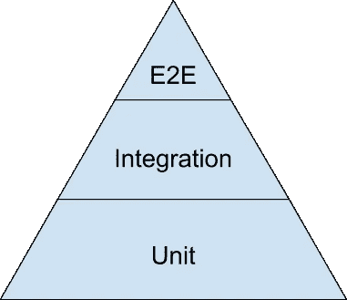

# 设计一个坚实漂亮的代码库

> 原文：<https://blog.devgenius.io/designing-a-solid-and-beautiful-code-base-77a143c4dc15?source=collection_archive---------15----------------------->

设计一个大的应用程序可能具有挑战性，并且不是一件容易的事情，随着需求的增加，我们对大的应用程序有很多期望，例如可用性、容错性、可伸缩性…但是所有这些似乎都有利于最终用户的观点，但是我们呢？我们需要一些特别的东西吗？

如果你可以说“这是一个漂亮的界面”或“这样一个用户友好的工具”，我可以说同样的事情也适用于代码库，没有什么比一个新人看着你的代码说“哇！！！太棒了”或者“这段代码非常具有可扩展性和灵活性”。

设计和构建应用程序是一门艺术，不能想当然，因为在整个过程中必须做出许多关键决策。但是我应该和你分享一下我目前的知识，让我们开始吧。

# 架构定义

这是整个过程中最重要的一步，因为你必须精确地分析需求并选择最合适的架构，因为没有完美的选择，我们总是要做出妥协。在这一步中，预见未来是可取的，因为有时需求缺乏远见，并且往往局限于当前的时间表，但这取决于项目的性质。

## 范围

对于软件架构的范围，人们有不同的看法:

*   总体的、宏观的系统结构；这是指作为软件系统的更高级抽象的体系结构，它由计算组件的集合以及描述这些组件之间的交互的连接器组成。
*   重要的东西——不管是什么；这是指软件架构师应该关心那些对系统及其涉众有很大影响的决策。
*   理解一个系统在其环境中的基本要素”
*   人们认为难以改变的事情；由于设计架构发生在软件系统生命周期的开始，架构师应该关注第一次“必须”正确的决策。按照这种思路，一旦不可逆转性被克服，架构设计问题可能会变成非架构性的。
*   一组架构设计决策；软件架构不应该仅仅被认为是一组模型或结构，而是应该包括导致这些特定结构的决策，以及它们背后的基本原理。这种见解导致了对软件架构知识管理的大量研究。
*   软件架构与设计和需求工程之间没有明显的区别。它们都是从高层意图到低层细节的“意图链”的一部分。

## 建筑模式和风格

在架构模式之间进行选择可能是一个棘手的过程，因为有大量的架构模式，架构师必须小心谨慎，并且必须注意成本、性能和可持续性。你可以在这里找到一篇讨论一些软件架构模式的文章。

下面是一些架构风格和模式的列表:

*   [黑板](https://en.wikipedia.org/wiki/Blackboard_(computing))
*   [客户端-服务器](https://en.wikipedia.org/wiki/Client%E2%80%93server_model) (2 层、 [3 层](https://en.wikipedia.org/wiki/Three-tier_(computing))、 [*n 层*、](https://en.wikipedia.org/wiki/N-tier)、[云计算](https://en.wikipedia.org/wiki/Cloud_computing)展现这种风格)
*   [基于组件的](https://en.wikipedia.org/wiki/Software_componentry)
*   [以数据为中心](https://en.wikipedia.org/wiki/Database-centric_architecture)
*   [事件驱动](https://en.wikipedia.org/wiki/Event-driven_architecture)(或[隐式调用](https://en.wikipedia.org/wiki/Implicit_invocation))
*   [分层](https://en.wikipedia.org/wiki/Abstraction_(computer_science)#Layered_architecture)(或[多层架构](https://en.wikipedia.org/wiki/Multilayered_architecture))
*   [微服务架构](https://en.wikipedia.org/wiki/Microservices)
*   [单片应用](https://en.wikipedia.org/wiki/Monolithic_application)
*   [模型-视图-控制器](https://en.wikipedia.org/wiki/Model%E2%80%93view%E2%80%93controller) (MVC)
*   点对点 (P2P)
*   [管道和过滤器](https://en.wikipedia.org/wiki/Pipes_and_filters)
*   [插件](https://en.wikipedia.org/wiki/Plug-in_(computing))
*   [反应式架构](https://en.wikipedia.org/w/index.php?title=Reactive_architecture&action=edit&redlink=1)
*   [具象状态转移](https://en.wikipedia.org/wiki/Representational_state_transfer)(休息)
*   [基于规则的](https://en.wikipedia.org/wiki/Rule-based_system)
*   [面向服务](https://en.wikipedia.org/wiki/Service-oriented_architecture)
*   [无共享架构](https://en.wikipedia.org/wiki/Shared_nothing_architecture)
*   [天基架构](https://en.wikipedia.org/wiki/Space-based_architecture)

## 一些需要避免的障碍

*   缺乏足够的建筑才能和/或经验
*   花费在架构设计和分析上的时间不足
*   未能识别质量驱动因素并为其设计
*   未能正确记录和传达架构
*   未能评估强制性政府审查之外的架构
*   未能理解标准不是软件架构的替代品
*   未能确保架构指导实现
*   未能改进架构并维护最新的文档
*   未能理解软件架构不会随 COTS 或 C4ISR 框架免费提供

# 密码

虽然架构和设计很重要，但我认为代码是这个过程中最基本的东西。这就像盖房子一样，你必须使用能支撑你更长时间的好材料，不像建筑看起来更有组织性，使系统更具可扩展性。

通过简单的步骤和遵循我将在后面列举的一组规则，可以达到代码质量的最高水平。

## 内部框架

高效地建造一个大东西，需要使用坚固的组件。如果你愿意坚持传统的方法和工具，做大并不是你能成功的事情。唯一会永远站在你和那个大东西之间的是“看着你视野中的东西”。

每个大系统的成功因素都是可重用组件，为什么？因为更新很容易传播，因为它尊重单一责任原则，因为构建就是这样。

所以我建议你做的事情是，构建可重用的组件，把你的系统想象成一个堆栈，在备份框架的基础上制作你自己的一套工具。

## 使用稳定的外部库

嗯，你将最终使用一个库列表，随着你的产品的增长，这些库的列表将会增长，你的系统将会依赖它们。所以保持你的系统健康和安全需要你跟踪你使用过的库，确保它是合法的，并且得到社区的支持。

## 记录

错误是任何系统都无法避免的，我们需要知道在出现错误、故障或异常的情况下发生了什么。把它想象成飞机的黑匣子。

日志记录非常重要，需要集成到系统的每个角落。在大型系统中，集中式日志接收器和服务器非常有用，并且易于使用。如果不想使用日志服务器，就使用支持任何 DBMS 的日志库。

可以派上用场的日志服务器的一个例子是 [Datalust Seq](https://datalust.co/) 。

## 描摹

在分布式系统中，跟踪请求和查询对于识别性能问题和确定特定数据块路径的正确性非常重要。由于组件的数量和交互随着系统的大小而增加，您需要建立一个跟踪功能。你可以看一看[耶格](https://www.jaegertracing.io)。

## 南国际劳工组织

SOLID 是进行 OOP(面向对象编程)时 5 个重要设计原则的首字母缩写。每个字母代表一个原则，定义如下:

*   S: [**单责任原则**](https://scotch.io/bar-talk/s-o-l-i-d-the-first-five-principles-of-object-oriented-design#toc-single-responsibility-principle)
*   O: [**开闭原理**](https://scotch.io/bar-talk/s-o-l-i-d-the-first-five-principles-of-object-oriented-design#toc-open-closed-principle)
*   L: [**利斯科夫替代原理**](https://scotch.io/bar-talk/s-o-l-i-d-the-first-five-principles-of-object-oriented-design#toc-liskov-substitution-principle)
*   I: [**界面分离原理**](https://scotch.io/bar-talk/s-o-l-i-d-the-first-five-principles-of-object-oriented-design#toc-interface-segregation-principle)
*   D: [**依存倒置原则**](https://scotch.io/bar-talk/s-o-l-i-d-the-first-five-principles-of-object-oriented-design#toc-dependency-inversion-principle)

这些原则的目的是使软件设计更容易理解，更容易维护，更容易扩展。作为一名软件工程师，这 5 条原则是必须知道的！

## 减少重复

使用设计模式减少重复，重构你的代码，选择更好的架构。减少重复是通过采用我上面提到的所有措施来实现的，因此，重要的是要注意，充满重复的代码库将很难维护。

## 证明文件

文件，文件，文件，你可能会想为什么我重复了三次。第一个是基本代码文档，包括(摘要、目的描述、代码注释、算法步骤描述)。第二个是开发人员文档，如果您想要扩展您的团队并确保构建机器是标准和健壮的，这是至关重要的，这可以通过使用内部 wiki 来完成，其中包括(教程、如何做、组件设计、图表、技术参考和论文……)。最后，第三种类型的文档是 API 文档，你希望你的系统是可重用的，如果你愿意公开一些服务，你需要记录这些接口，这样任何第三方开发者，甚至你在不同团队的同事(比如前端)都可以很容易地使用它。

用户指南是理所当然的东西，这就是为什么我没有提到它。

## 自动化测试

测试和自动化测试。这一点非常重要，我知道 MVP 或小规模产品可以跳过这一部分，因为实施时间很紧。可是我宁愿不要，为什么？因为如果我们不断说服自己这是正确的，我们可能会醒来，直到为时已晚。

测试是至关重要的，它并不简单，有各种类型的测试，每一种都有一个目的。你可能听说过单元测试、集成测试、端到端测试…让我来解释这三个最重要的:

*   **端到端**:一个辅助机器人，其行为就像用户在应用周围点击并验证其功能是否正确。有时被称为“功能测试”或 E2E。
*   **整合**:验证几个单位和谐地一起工作。
*   **单元**:验证单个、孤立的部件是否按预期工作。

> 为了在所有三种测试类型之间找到正确的平衡，最好的视觉辅助工具是测试金字塔。这是测试金字塔的简化版本

你的大部分测试是金字塔底部的单元测试。当你在金字塔上向上移动时，你的测试变得更大，但是同时测试的数量(你的金字塔的宽度)变得更小。

# 密码

写一个漂亮干净的代码需要遵守一定的准则和约定。建议使用标准命名约定，通常是您正在使用的编程语言或目标框架所使用的命名约定。但是我们总是容易犯错误，这就是为什么我们需要工具来让我们意识到这些错误，并为我们指出正确的方向。

## 语义和语法分析

第一件基本的事情是使用支持代码语义和语法分析的工具。你不能使用记事本或 gedit 来编写代码并期望它没有错误。我们最终都会犯这些错误，我们最不希望的就是由于语法错误而导致构建失败。

## 集成驱动电子设备

使用 IDE 非常重要，它使我们非常高效，尤其是当它们包含智能索引功能，允许快速智能的代码自动完成时。一个集成的开发环境，减少了几乎 99%的不可构建代码的风险，让你非常非常高效。因为它知道你输入的是什么代码，它意味着什么，所以它可以给你指出最近的你想进入的方向。

## 代码复制/重构工具

把它想象成警察和康复机构，这个例子可能很极端，但不知何故看起来就是这样。code cops 确保您没有违反约定和规则，它甚至在代码可能包含 bug 的情况下提醒您(例如:使用可能为空的引用)。

## 代码扫描仪

为团队使用代码扫描器，随着团队的成长，你不能依赖单独的代码警察和重构工具，因此，你必须建立一个集中的代码分析工具，确保每个人都遵守规则，没有人违反约定。这些工具还有助于降低出现错误、漏洞的风险，甚至有助于检测代码覆盖率。

有一个示例工具可以帮助您进一步探索这个主题，那就是 [SonarQube](https://www.sonarqube.org/sonarqube-8-3/?gclid=EAIaIQobChMI49nz1tC06gIVBywYCh2EQAnTEAAYASAAEgLcqPD_BwE) 。

## Git 流程/同行评审

同行评议是非常重要的，我们必须始终有第二种意见，因为我们人类缺乏从单一角度看待一切的能力。同行评议和有两只眼睛而不是一只眼睛一样重要。

使用 Git 流来控制功能开发，并在合并之前引入一个健壮的同行评审系统。这也可以通过添加质量控制构建和自动化 PR 装饰来进一步推动。

## 海峡群岛

最后，我推荐使用持续集成(CI)。如果您愿意自动化测试，并确保集成的代码是可构建的，并且通过了所有的回归测试，这是非常重要的。

# 结论

我希望我能涵盖尽可能多的内容，但最终，设计一个漂亮的代码库不是使用一两个工具或原则就能实现的，而是许多原则和工具的组合。我建议你使用我们的朋友谷歌进一步探索每个单独的主题。

# 参考

 [## 软件架构:你需要知道的 5 种模式

### 当我在夜校成为一名程序员时，我学习了几种设计模式:单例模式、存储库模式…

dzone.com](https://dzone.com/articles/software-architecture-the-5-patterns-you-need-to-k)  [## 软件体系结构

### 在软件架构实践(第二版)中，Bass、Clements 和 Kazman 对架构的定义如下

cio-wiki.org](https://cio-wiki.org/wiki/Software_Architecture)