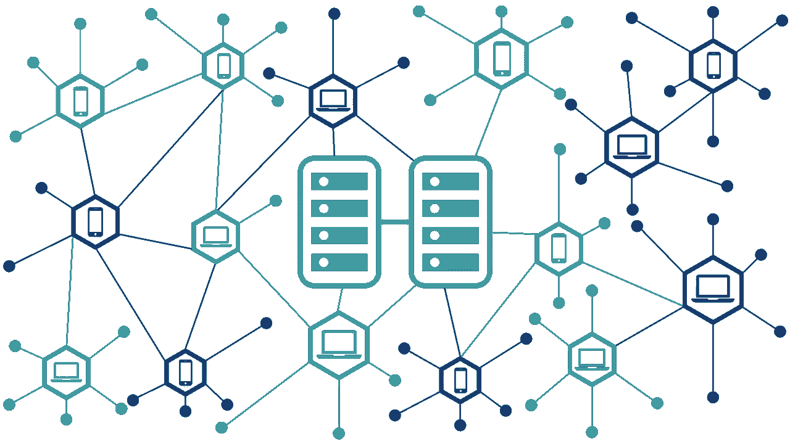
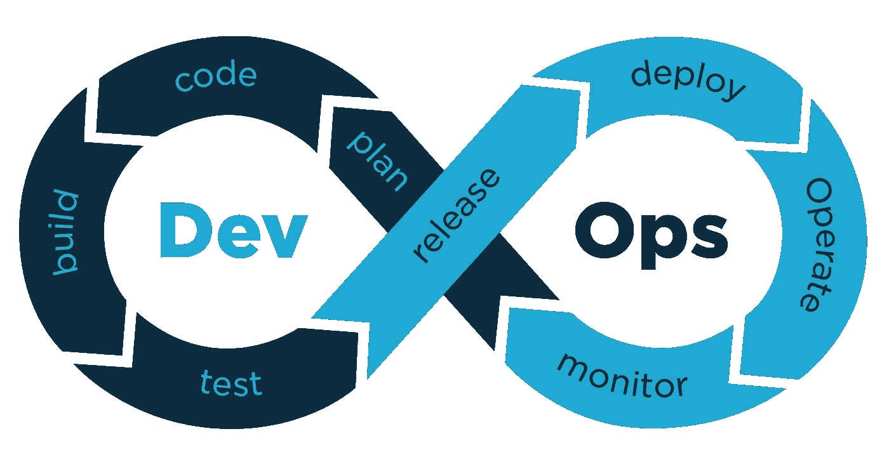

# 设计企业级分布式系统

> 原文：<https://blog.devgenius.io/designing-an-enterprise-grade-distributed-system-7408a331f1e8?source=collection_archive---------5----------------------->

我们现在看到的技术进步使得很多事情变得可能和容易，每个人都可以在几秒钟内获得服务。对于工程师和研究人员来说，拥有一个可用且健壮的系统一直是一个很好的挑战，分布式系统是这些问题和许多其他问题的代表和答案。请注意，这并不是什么新东西，但我们现在越来越多地看到它，它已经成为每个大系统的黄金标准。

## 什么是分布式系统？

分布式系统本质上是一组软件和硬件组件，它们通过网络上的消息相互协调，以实现共同的目标。这一目标在本质上可能很复杂，例如处理大数据或创建模拟，如 MMO(大型多人在线游戏)或更具体的东西，如海啸或地震的传感器网络，当某些事件发生时会触发警报。

分布式系统的关键是组件之间通过网络的互连。这种关系带来了几个值得考虑的有趣概念:

*   ***并发*** —分布式系统的每个成员都在同时或彼此并行地做一些工作。
*   ***没有全局时钟*** —成员之间的时间同步不是那么容易的。即使在网络内部，消息也会有延迟，这会影响同步。
*   ***独立故障*** —分布式系统的成员可能在某一点发生故障，而分布式系统的其他部分可能仍在运行。

## 为什么是分布式系统？

分布式系统的特征在于许多标准，这些标准实际上代表了它的好处，我们将引用这些标准:

*   资源共享
*   公开
*   并发
*   可量测性
*   容错
*   透明度

分布式系统基于分而治之的原则，通过划分职责和缩小范围，我们将获得良好的性能/价格比、增加的可靠性、增量增长和增加的容错能力。

## 有什么要求？

为了构建一个分布式系统，我们需要记住一些事情，因为任何东西都有它的成本，我们不能否认分布式系统看起来像下一个救世主和未来的领先设计风格，但是为了掌握它并以正确的方式做它，有一些必须满足的要求，我必须引用:

*   ***网络可靠*** —由于网络将大量用于跨不同服务传输数据，一个不可靠的网络只会造成混乱。
*   ***延迟为零*** —无延迟网络将使系统能够在创纪录的时间内处理请求，这与传统系统在低负载下的性能相当。
*   ***带宽是无限的*** —如果本地数据库管理系统有带宽，系统最终会停止，同样的事情也适用于分布式系统，在分布式系统中，服务充当数据源，因为责任是分离的，我们最不希望的是需要无限数据传输的系统中的带宽限制。
*   ***网络是安全的*** —依赖网络的应用必须是安全的，分布式系统就是其中之一。
*   ***拓扑不变*** —我们需要一个高度可移植的系统，它可以在任何环境下运行，或者至少可以处理变化或不同的配置。
*   ***传输成本为零*** —为了获得合理的性能/成本比，并且考虑到信息在网络上流通的事实，我们需要尽可能地保持这一成本。

## **我们必须考虑什么？**

**有许多类型的分布式系统，每一种都是为满足特定的业务需求而设计的。根据需求的优先级，以下考虑事项可能会发生变化，但一般来说，大多数开发人员在设计分布式系统时都需要记住这些:**

*   *****可用性*** —系统总是准备好处理请求的操作特性。**
*   *****可扩展性*** —系统增加容量以处理更多负载的能力。这可以通过向集群添加更多服务器来实现。**
*   *****性能*** —系统能够处理请求的速度。**
*   *****成本*** —系统的总拥有成本。这可能包括硬件、软件、开发、测试、托管和云基础设施。**
*   ****可管理性** —维护、更新、迁移、扩展和诊断都应该是可管理的。**
*   *****可靠性*** —能够适应负载并在异常情况下做出适当反应。**
*   *****异构*** —支持多种设备和协议的能力。**
*   *****容错和故障管理*** —设计时对故障有预期的系统将使其容错能力更强。**
*   ****并发**——当多个部件同时工作时(分布式系统的一个给定条件)。**
*   *****迁移和负载均衡*** —与可靠性、容错和故障管理密切相关。**
*   ****安全性** —确保用户和系统组件之间的适当授权和认证是确保数据机密性和完整性的关键。**
*   ****模块化** —许多小的子系统和模块形成一个更大的系统，可以以不同的方式配置和重用。**

## **分布式系统中的基本元素？**

**在一个分布式系统中，有几个元素是必不可少的，一个复杂的系统将满足我们列出的所有要求，还有几个实现起来不简单，但我们不是第一个这样做的人，所以我们从我们的先驱和疯狂的工程师那里学到了一些东西。**

**在这篇文章中，我将推荐一些工具，这些工具将使您能够启动您的分布式系统，但是对于生产级应用程序，还需要进一步的探索。**

****拥抱 DevOps****

**为了成功地部署您的系统，您必须采用 DevOps，简单地说，使用 DevOps 原则，您将确保拥有一个强大的交付和开发管道，并提高质量保证和减少时间。听起来很有希望，地狱耶刚刚看了这篇[文章](https://medium.com/@DaPowerPlay/the-6-benefits-of-devops-bb513005cc62)。**

****

**DevOps**

****基本基础设施****

**我们谈到了基础设施，特别是我将提到几个你可能已经知道的工具，Combo (Docker/Kubernetes)。**

**为了保证交叉可移植性和隔离性，我们需要 docker，为了编排我们的 Docker 容器，我们需要 K8s。**

**如果你是编排和 docker 的新手，只要谷歌一下，你就会找到很多资源和精彩的视频。**

**这些工具不仅能让我们做到这一点，还能保证可用性、可伸缩性、负载平衡和可维护性。**

**为了设置您的基础设施，您将使用:CI/CD、Linux、Docker 镜像注册表、Kubernetes、NGINX、LetsEncrypt…**

****基于应用的基础设施****

**我们仍然落后，我们需要设置一些其他东西来满足启动分布式系统项目的最低要求，为了做到这一点，我们需要:**

*   **例如，在服务之间交换消息和命令的消息代理(RabbitMq)。**
*   **一个(或多个)符合 ACID 的 DBMS，以便同时管理数据(SQL Server、MySQL、Neo4j……)。**
*   **一个追踪工具来追踪跨服务的网络中流通的信息，这将帮助我们有效地优化和诊断(例如:Jaeger)。**
*   **集中日志条目和信任日志的远程日志服务器/接收器非常非常重要，尤其是在分布式系统中(例如:Datalust Seq，MySQL)。**
*   **像 REDIS 这样的缓存服务。**
*   **存储服务指标的时间序列数据库，为了做到这一点，您可以实施或使用现有的库来帮助实现它(例如:ASP.NET 核心的 AppMetrics ),对于时间序列数据库，您可以使用 InfluxDB。**
*   **一个可视化集群和服务指标的控制面板，您可以使用 Grafana，因为它易于使用和定制。**

## **要考虑的架构/设计模式**

**如果你的目标是一个复杂的系统，你可能需要看看 [CQRS](https://microservices.io/patterns/data/cqrs.html) (命令查询责任分离) [Sagas 模式](https://microservices.io/patterns/data/saga.html)。**

**还可以在[微服务. io](https://microservices.io/patterns/index.html) 探索更多不同等级的模式。**

## **结论**

**如果你愿意实现一个分布式系统，确保它是值得的，因为它不会是所有事情的最佳选择，它在小系统中有一些缺点，如果你不注意细节，有时开发它会很痛苦。明智地研究您的用例，然后选择！**

## **参考**

**[http://en.wikipedia.org/wiki/Distributed_computing](http://en.wikipedia.org/wiki/Distributed_computing)**

**[http://en . Wikipedia . org/wiki/Fallacies _ of _ Distributed _ Computing](http://en.wikipedia.org/wiki/Fallacies_of_Distributed_Computing)**

**[http://www.rgoarchitects.com/Files/fallacies.pdf](http://www.rgoarchitects.com/Files/fallacies.pdf)**

**[https://www . Secure Coding . cert . org/confluence/display/sec code/Top+10+Secure+Coding+Practices](https://www.securecoding.cert.org/confluence/display/seccode/Top+10+Secure+Coding+Practices)**

**[https://www . Secure Coding . cert . org/confluence/display/sec code/Secure+Coding+Standards+Newsletter](https://www.securecoding.cert.org/confluence/display/seccode/Secure+Coding+Standards+Newsletter)**

** [## 设计分布式系统的最佳实践

### 在过去的两篇文章中，我讨论了分布式系统的基础和分布式系统的谬误…

multimedia.telos.com](https://multimedia.telos.com/blog/best-practices-for-designing-distributed-systems-part-3/) 

[https://microservices.io/patterns/index.html](https://microservices.io/patterns/index.html)**