# 设计敌人

> 原文：<https://blog.devgenius.io/designing-enemies-4ba43eba3ef9?source=collection_archive---------1----------------------->

## 使用抽象类

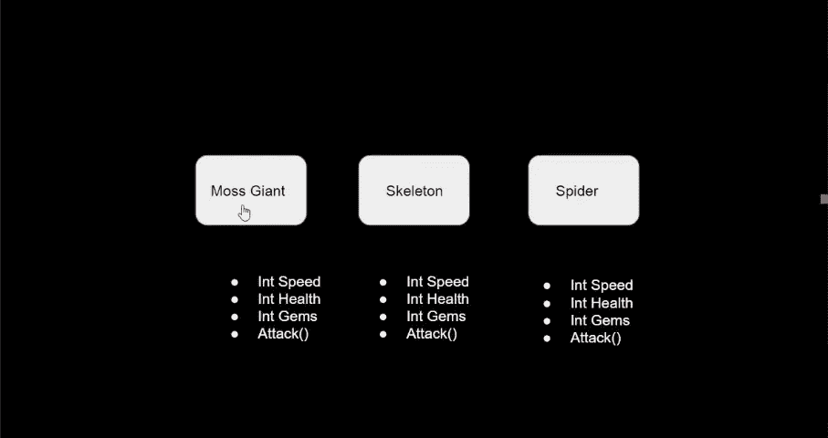

我有 3 个不同的敌人，他们都有共同的功能。为了实现这一点，我将使用一个抽象类。

 [## 使用类。

### 代码可重复性

ktmarine1999.medium.com](https://ktmarine1999.medium.com/using-classes-9c5742c8f7d1)  [## 抽象行为

### 实现抽象行为以保证方法可用，并强制子行为实现该方法。

ktmarine1999.medium.com](https://ktmarine1999.medium.com/abstract-behaviors-ba4a5aefa55e) 

敌人类将包含所有的公共变量和方法，每个敌人将被迫实现相同但工作方式不同的方法。

我希望我所有的敌人都保持相同的空闲和移动状态，但是如果需要的话，我希望能够增加针对特定类型敌人的功能。我将专注于我的苔藓巨人，让它以我想要的方式工作，但在敌人的行为中使用所有的代码。

我创造了一个摩斯巨人敌人游戏对象。我添加了一个航路点对象，它有一个到我的苔藓巨人敌人的平滑路径。我还添加了一个苔藓巨人，它的设置类似于播放器(刚体和长方体碰撞器组件以及一个带有 Animator 的精灵游戏对象)。

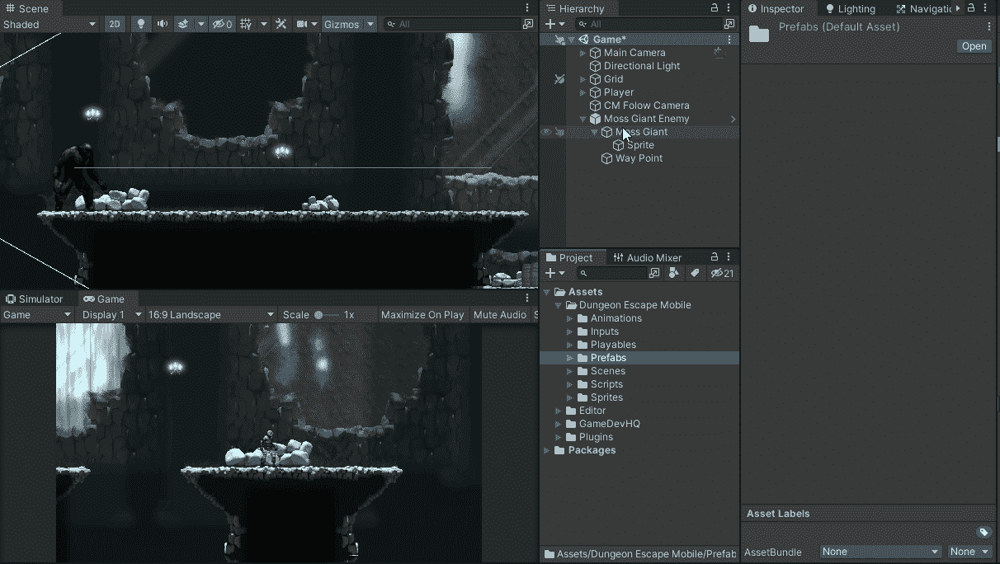

我将我的动画控制器设置为一个空闲动画，一旦它完成，就转换为行走动画。为了转换回行走动画，我将在代码中设置一个触发器。

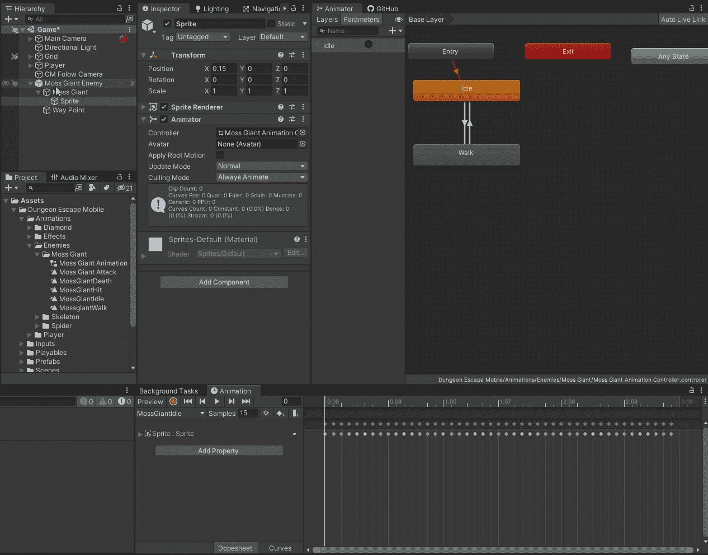

我开始让苔藓巨人在路径点之间移动。

我使用 Cinemachine Base Path 实现了一个路点系统。

 [## 以不同的方式移动平台

### 创建一个模块化的移动平台，并把它变成一个预制组件

blog.devgenius.io](/moving-platform-a-different-way-ce5992cc8dec) 

我希望子行为可以访问的变量被保护了。如果将来我需要访问其中一个私有变量，我会为它们创建受保护的 assessor，有些东西我不想意外更改，因为这可能会导致一个很难找到的 bug。我希望子行为能够修改的方法是虚拟的。

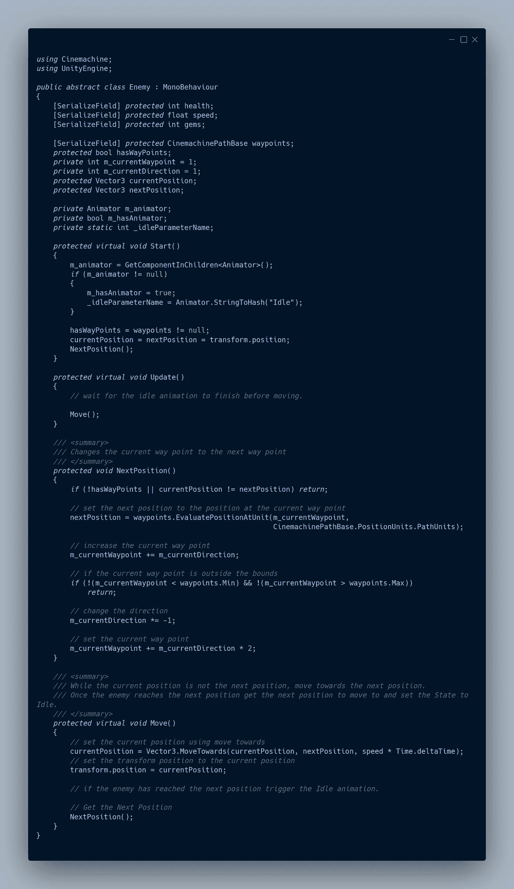

我的苔藓巨人是从敌人那里继承来的空行为。这是必要的，因为抽象类不能作为组件添加到游戏对象中。

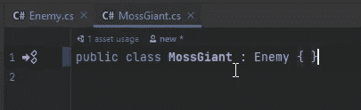

我的苔藓巨人现在在路径点之间移动。

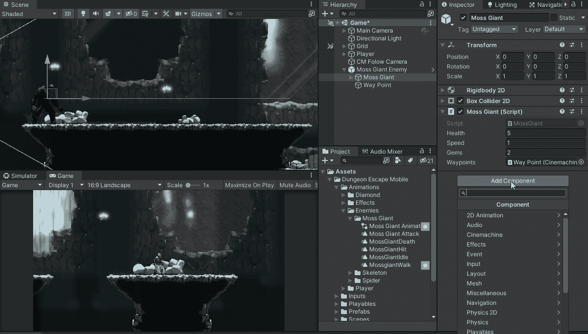

接下来，我使它在播放空闲动画时不能移动。动画师作为一种方法来获得当前状态的信息。

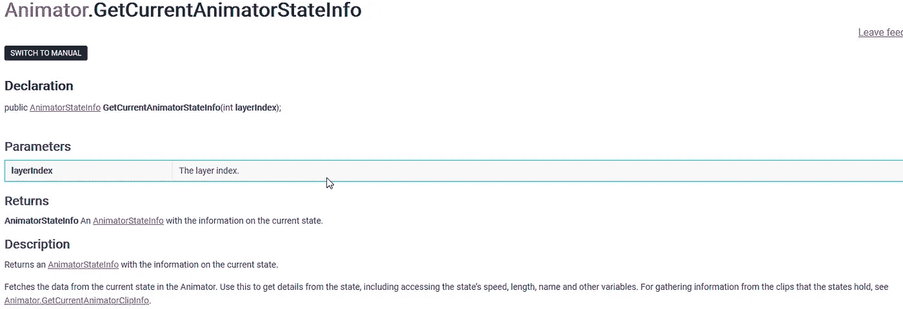

[https://docs . unity 3d . com/2021.1/Documentation/script reference/Animator。GetCurrentAnimatorStateInfo.html](https://docs.unity3d.com/2021.1/Documentation/ScriptReference/Animator.GetCurrentAnimatorStateInfo.html)

我检查当前状态名是否为 Idle，如果是，我退出 Update 方法。

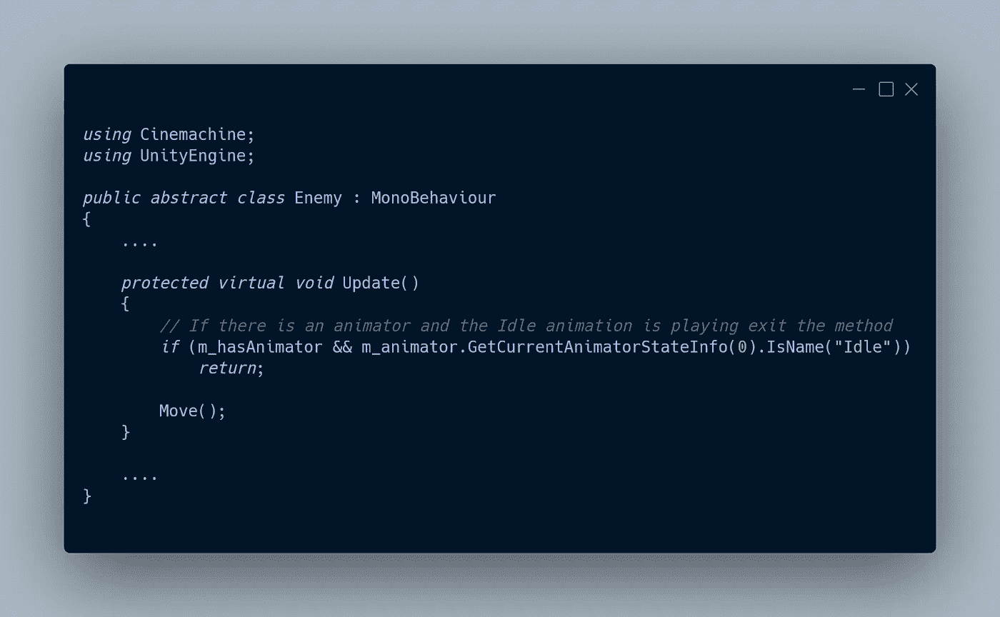

现在我的敌人在移动之前播放空闲动画。

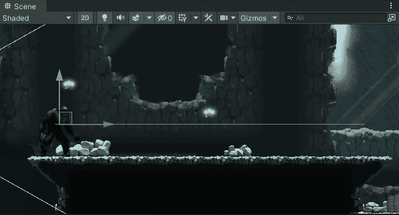

接下来，当敌人到达下一个路径点时，我触发空闲动画

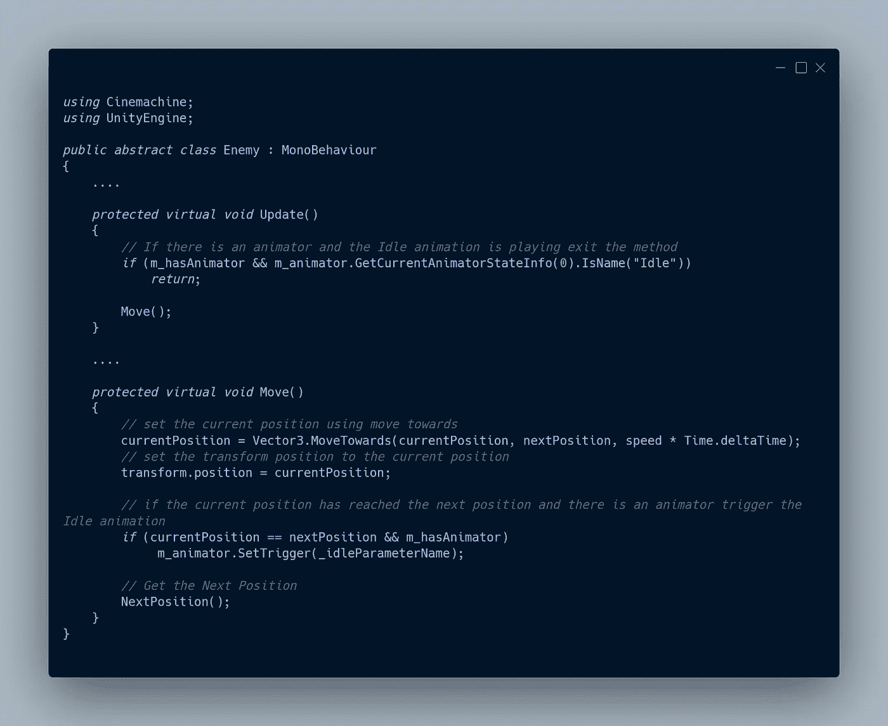

确保这按预期工作。

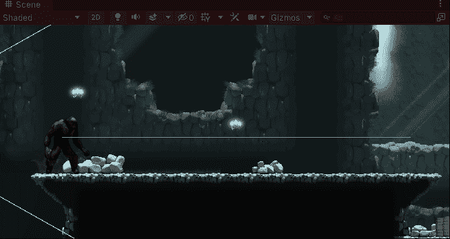

最后一步是改变敌人移动时面对的方向。为此，我将改变变换的方向，使其朝向移动的方向。

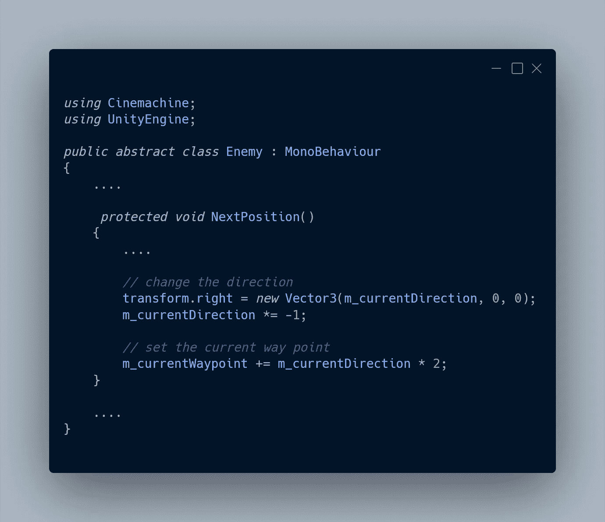

这工作，但不是在正确的位置退出，因为我想让它改变面对的方向后，它下来与闲置的动画。

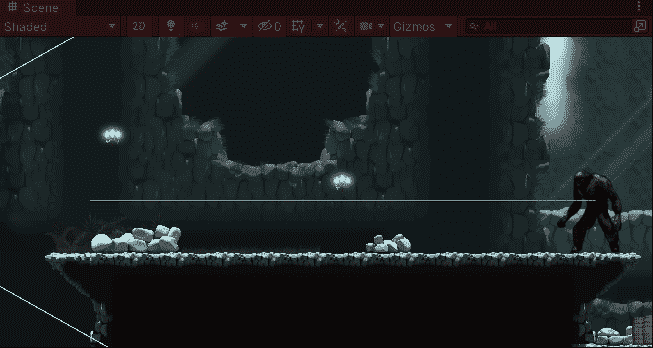

在移动之前，我将代码移动到更新方法中。当前方向是我通过 s 点的当前方向，也就是敌人移动的相反方向。

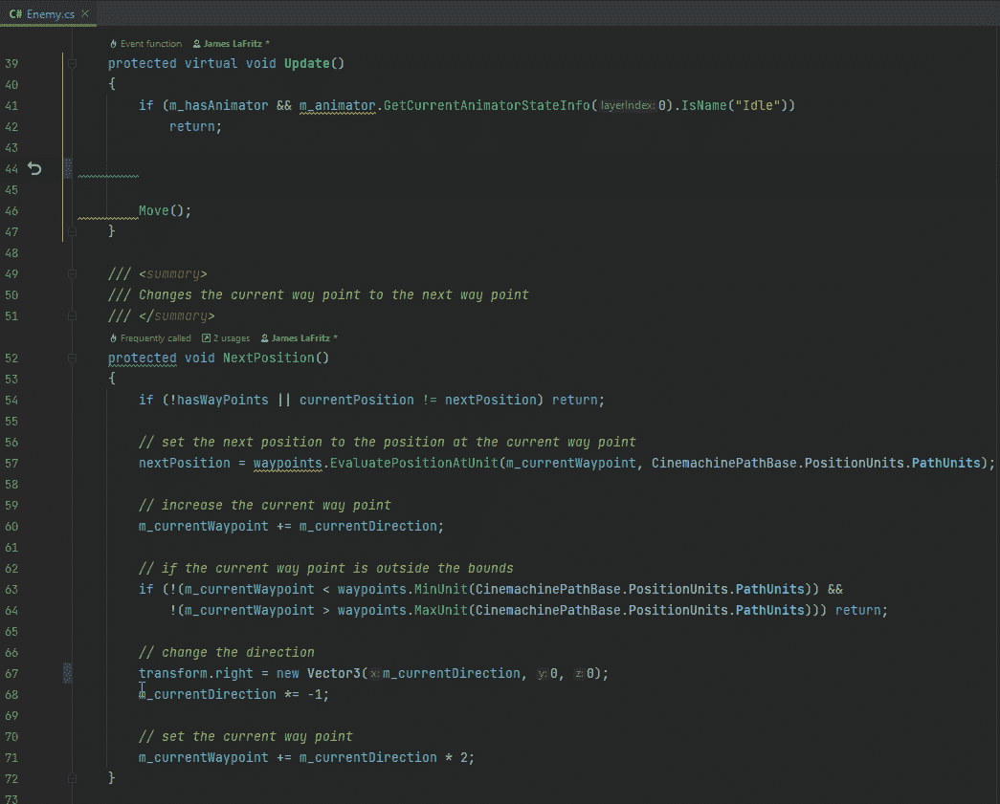

现在我把它逻辑上放在了正确的位置。

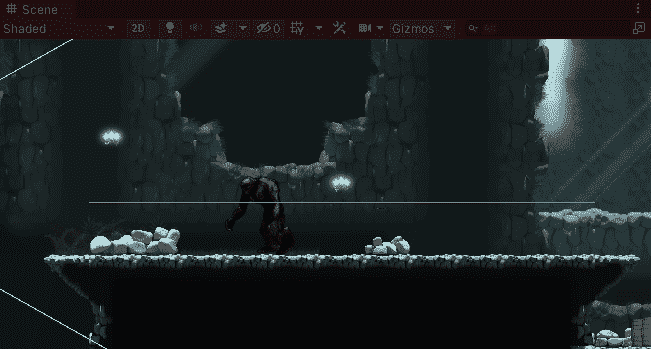

我只需要在敌人改变方向时改变面对的方向。为了做到这一点，如果敌人改变方向，我添加一个布尔。当我改变方向时，我将它设置为 true，当我改变方向时，我将它设置为 false。

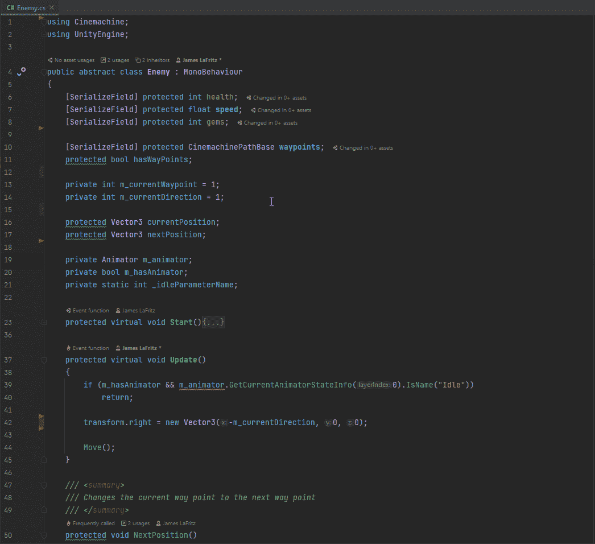

这在视觉上仍然是一样的，但是现在只在需要的时候发生，这使得它更有性能。

然后，我重构了一些代码，使其更加模块化。

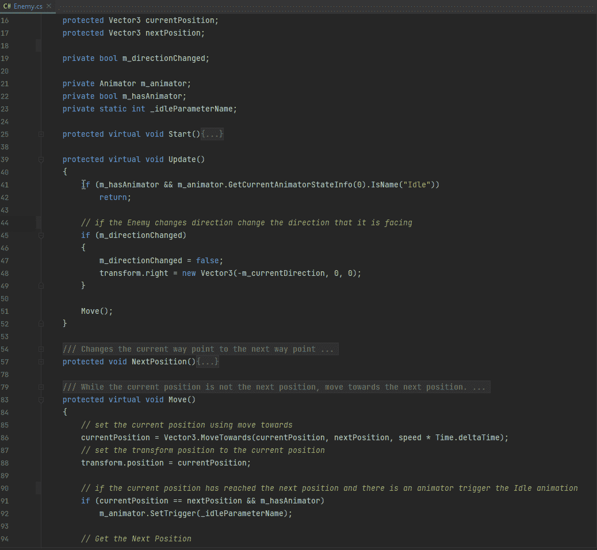