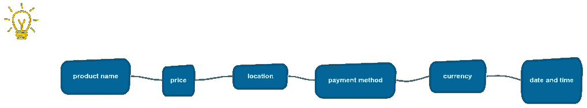
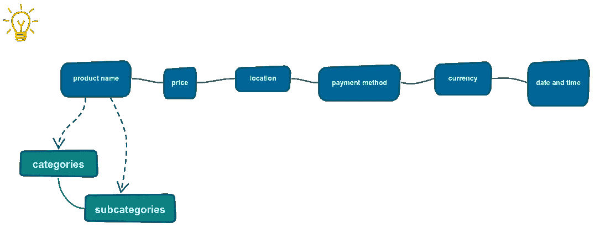
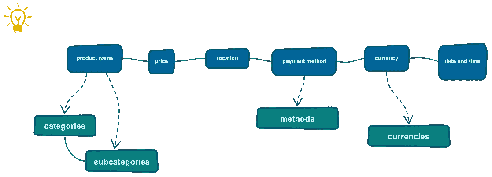
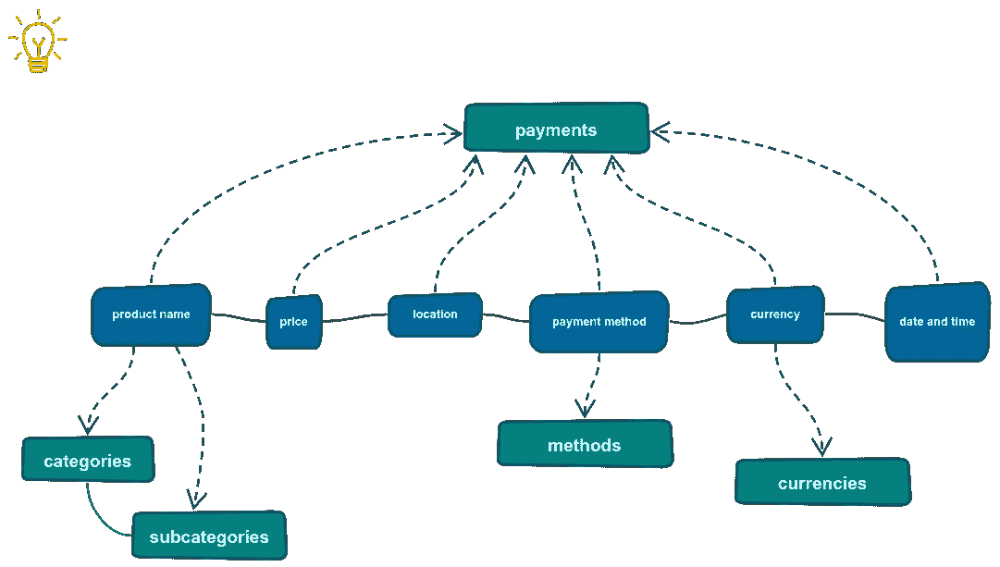
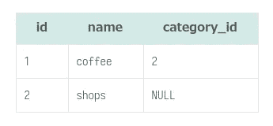
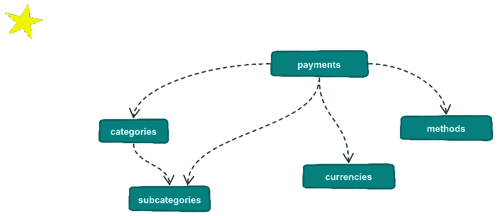

# 实例设计关系数据库

> 原文：<https://blog.devgenius.io/designing-relational-database-in-example-258e978dabcf?source=collection_archive---------5----------------------->

## 在这个故事中，我想与你分享一个基本的关系数据库，它帮助我理解了组织关系数据库数据的思想。如果你是设计关系数据库的新手，这份材料是给你的。

[活动发起人](https://unsplash.com/@campaign_creators?utm_source=medium&utm_medium=referral)在 [Unsplash](https://unsplash.com?utm_source=medium&utm_medium=referral) 上的照片

# 前言

几年前，我是一名初级开发人员，雄心勃勃地想开发 web 应用程序。有一次，我有了一个想法，要分析我花的所有钱，以便更好地了解我的支出。我需要一个应用程序，可以存储付款，显示统计图表，而不仅仅是一个月内所有付款的彩色圆形图。

出于这些原因，我决定开发一个应用程序，包括我想要的所有功能。
我要和你讨论一个关系数据库的设计，这是我为这个应用程序做的。

# 我需要存储哪些数据？

我用一个例子探讨了这个问题。我想象着我在书店买了《火星人》的书，书店位于“爱书人”书店。然后，我在 2020 年 8 月 20 日下午 3:04 用现金支付了这本书 5 美元。

相应地，此时此刻，购买有几个参数:

*   产品的名字——“火星人”书，
*   价格——5 美元，
*   商店的位置——“爱书人”商店，
*   支付类型—现金，
*   货币—美元，
*   日期和时间—2020 年 8 月 20 日下午 3:04。

图一。购买参数。

我一直在想我是否需要指定一个确切的产品。在书店里，除了书，你还可以买很多东西。那在超市购物呢？产品列表可能会非常长。

# 整理表格

我决定为一个产品创建一个抽象模型。我将这个参数(产品名)分为类别和子类别表，并通过主键和外键将它们连接起来。对于前面的例子，*类别*是商店，而*子类别*是书店。

图二。两个新表格:类别和子类别。

另一个选择是将*类别*和*子类别*存储在一个表中。虽然存储类别和子类别简化了整个模型，但是在一个表中设置它们会使从表中选择*类别*变得复杂——脚本部分中的这个表就是一个例子。

支付方式(现金或信用卡)和货币(美元、欧元等)的值是已知且不可改变的。因此，为了存储支付方式和货币，我分别创建了*方式*和*货币*表。

图 3。两个新表:方法和货币。

价格、地点、日期和时间总是不同的。没有必要将这些参数存储在单独的表中。

最后一个条目是 *payments* ，它包含所有前面的参数。

图 4。一个新的表格:付款。

# 剧本

下一步是定义列和约束。

*子类别*表包含一个额外的 *category_id* 列，这是一个外键约束，用于连接到*类别*表。

所有的 *id* 列都具有**序列**伪数据类型。使用整数数据类型也是正确的。

*类别*、*货币*、*方法*中的一个名称列是**跨表唯一的**。子类别的名称不是唯一的，因为一个子类别可以引用许多类别。

默认情况下，PostgreSQL 中的所有列都是空的。我为特定的列添加了 **not null** 约束，其中的信息是有价值的，并且是分析所必需的。

执行以下脚本来创建表:

我包含了*drop table if exists table _ name cascade*以便更容易应用新的更改。因此，例如，当您添加属性时，您不需要手动销毁表。

存储*类别*和*子类别*的另一个表是:

*   *id* 是类别和子类别的标识符。
*   *名称*是类别和子类别的名称。
*   *category_id* 仅指一个类别。

*产品*表的示例:

表 1。用随机值填充的产品表

# 结果

*支付*表是这个应用的关键表。该表通过外键连接到*类别*、*子类别*、*方法*和*货币*表。

图 5。最终的关系数据库模型。

# 进一步阅读

 [## PostgreSQL 外键

### 摘要:在本教程中，您将了解 PostgreSQL 外键以及如何使用…

www.postgresqltutorial.com](https://www.postgresqltutorial.com/postgresql-foreign-key/)  [## PostgreSQL 主键

### 摘要:在本教程中，我们将向您展示什么是主键以及如何管理 PostgreSQL 主键…

www.postgresqltutorial.com](https://www.postgresqltutorial.com/postgresql-primary-key/)  [## PostgreSQL 非空约束

### 摘要:在本教程中，您将学习 PostgreSQL 非空约束，以确保列的值不被…

www.postgresqltutorial.com](https://www.postgresqltutorial.com/postgresql-not-null-constraint/)  [## PostgreSQL 唯一约束

### 摘要:在本教程中，您将了解 PostgreSQL 唯一约束，以确保存储在

www.postgresqltutorial.com](https://www.postgresqltutorial.com/postgresql-unique-constraint/)  [## 使用 PostgreSQL 序列创建自动递增列

### 摘要:在本教程中，您将了解 PostgreSQL 串行伪类型以及如何使用串行伪类型…

www.postgresqltutorial.com](https://www.postgresqltutorial.com/postgresql-serial/) 

# 关于作者

Jane 是一名围棋程序员和软件工程方面的技术作家。她已经用英语和俄语写了 5 年的技术资料。她从新西伯利亚国立技术大学获得了信息安全专业学位，专攻自动化系统的信息安全。你可以在 [*推特*](https://twitter.com/enthusiastic_io) *上关注她，在*[*publications . excellent . io*](https://publications.enthusiastic.io/)*上看她的其他文字作品。*