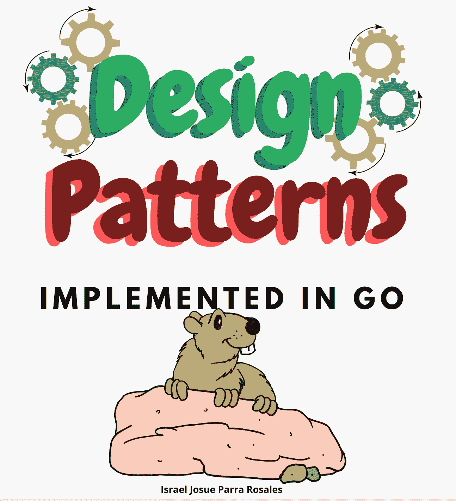
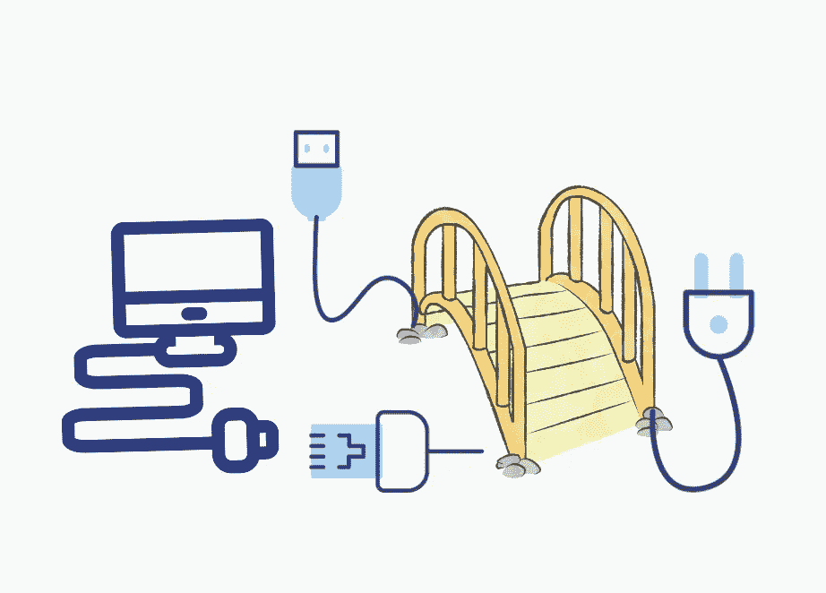

# Golang 图案设计

> 原文：<https://blog.devgenius.io/desing-patters-in-golang-1b03de4fb89?source=collection_archive---------2----------------------->

## 什么是设计模式？

设计模式是软件架构的一部分，它帮助我们组织我们正在编写的代码，因为它为不同的软件设计问题提供了一个通用的、可重用的和适用的解决方案。

例如，您在代码中检测到下一种情况:*“您检测到许多行正在创建一个 struct 实例，一些实例的一些赋值是相似的”。*这里是设计模式发挥作用的时候，例如，我们可以继续定义一种实现“工厂模式”的方法，然后保存所有这些相似/重复的行。

再想一个案例:*“你想只初始化一个 struct 一次，并阻止与那个类型相关的新实例，都是为了在执行过程中保持值”*。所以他记得一种叫做“Singleton”的设计模式，并决定实现它。

正如您从这些小例子中看到的，设计模式可以被描述为一个模板，它有助于识别软件中的问题，并为每个特定的情况提供合适的解决方案。

# 设计模式的类型

根据模式的目的，我们可以发现三种类型，我们有创造模式、结构模式和行为模式。以下部分描述了每一个模式组。

## 创造模式

这些模式提供了对象创建机制，增加了现有代码的灵活性和重用性。

*   工厂([转到第](https://medium.com/@josueparra2892/factory-patterns-in-go-d9a93ed47d96)条)
*   构建器([转到文章](https://medium.com/@josueparra2892/builder-pattern-in-go-5c740f369119))
*   单例([转到第](https://medium.com/@josueparra2892/singleton-pattern-in-go-4faea607ad0f)条)

## 结构模式

这些模式解释了如何将对象和类组装成更大的结构，同时保持结构的灵活性和效率。

*   适配器([转到文章](https://medium.com/@josueparra2892/adapter-pattern-in-go-832d04e5bc56))
*   桥梁([转到第](https://medium.com/@josueparra2892/bridge-pattern-in-go-bba508449db)条)
*   复合([转到文章](https://medium.com/@josueparra2892/composite-pattern-in-go-e41496130ec6))
*   装饰者([转到文章](https://medium.com/@josueparra2892/decorator-pattern-in-go-e3760957fd3a))
*   代理([转到文章](https://medium.com/@josueparra2892/proxy-pattern-in-go-4a675d36efd8))
*   轻量级([转到文章](https://medium.com/@josueparra2892/flyweight-pattern-in-go-4bb59b9e0203)

## 行为模式

这些模式处理算法和功能之间的责任分配。

*   策略([转到文章](https://medium.com/@josueparra2892/strategy-pattern-in-go-112df89b046b))
*   状态([转到文章](https://medium.com/@josueparra2892/state-pattern-in-go-eeb05739d12d))
*   迭代器([转到文章](https://medium.com/@josueparra2892/iterator-pattern-in-go-e310bcd533e8))
*   调解员([转到第](https://medium.com/@josueparra2892/mediator-pattern-in-go-b84c28edf10d)条)
*   访问者([转到文章](https://medium.com/@josueparra2892/visitor-pattern-in-go-9636fe43851e))

> **最终备注:**
> 
> 所有给出的例子和信息都是为了帮助你理解什么是模式以及如何实现，我在寻找简单的代码例子和隐喻的使用，以使其易于理解。
> 
> 对我来说，帮助新开发人员理解对我来说很难的概念是一件愉快的事情，写这种文章我想帮助其他人了解设计模式，或者作为继续学习设计模式的起点，我想提到的另一件重要的事情是，你也在帮助我，因为每次我写一篇新文章，我都在刷新我的知识。
> 
> 感谢阅读！