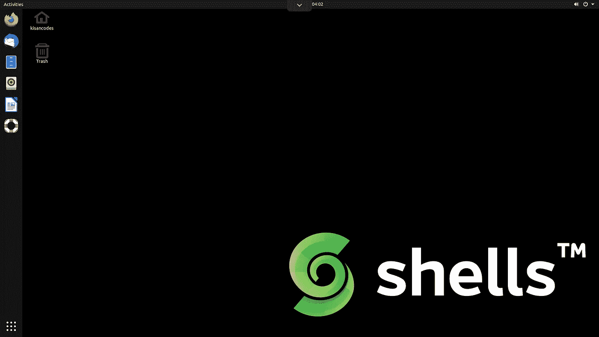
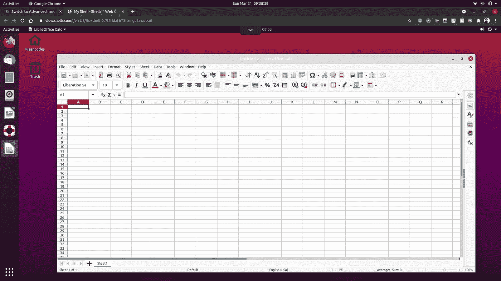

# 桌面即服务—它有多可靠？

> 原文：<https://blog.devgenius.io/desktop-as-a-service-how-reliable-is-it-de8800553ebb?source=collection_archive---------8----------------------->

## DaaS 是一种使用云计算机提供虚拟化桌面环境的现代方式。

Shells 桌面环境

Linux 于 1991 年首次发布。从那时起，它走过了漫长的道路。

我们都非常喜欢 Linux。它无处不在，它已经改变了整个开源世界。如今，大多数服务器都运行 Linux。最初，Linux 上没有图形层，它只用于服务器。尽管如此，Linux 仍在桌面世界中苦苦挣扎。

在云业务时代，今天我们只需点击一个按钮就可以获得虚拟化的操作系统。AWS EC2 等服务使之成为可能，这是云业务中一项改变游戏规则的发明。我们也看到了 big giant 也提供 MacOS 作为服务。

在裸机上安装桌面 Linux 对我来说总是很痛苦。和其他人一样，我没有一个功能强大的工作站来加速这个过程。我仍然记得我第一次在我的垃圾笔记本电脑上启动 Ubuntu，花了大约一个半小时完成安装过程。即使您使用 VMWare 或 Virtualbox，启动也需要大约 15-20 分钟。又这么痛苦。

如果某个供应商向您提供桌面即服务，这不是很好吗？这正是[shell](https://www.shells.com/?_a=NAtWu9)一直在提供的。

我已经用了大约一个月了。很酷。想在这篇文章中分享我的经历。

## 让我先告诉你什么是 DaaS。

Shells 是一个基于云的桌面即服务，它提供了各种主要浏览器，可以在任何有互联网连接的地方将任何设备屏幕变成桌面。

在 Shells 中运行 LibreOffice Calc

一个月来，我一直在手机和笔记本电脑上使用它。太棒了。即使您在外面，您仍然可以将桌面放在口袋里，直接在那里工作。

事实上，我之前已经写了一篇关于贝壳的[博客](https://towardsaws.com/run-linux-in-the-browser-with-any-device-anywhere-b122ab70c844?sk=85677f6676d2a796ffdd08553c820e43)。我已经包含了关于 Shells 的桌面即服务的所有内容。

但在本文中，我想分享我使用 shells 的经验，以及它们如何为企业带来可靠性。

在无服务器和云计算时代，你可以获得任何你想要的服务。桌面即服务并不奇怪。

为了理解为什么你应该使用这项服务，你首先应该明白这是什么，为什么你应该一个。桌面即服务是一个基于云的虚拟化桌面环境，由分布在世界各地的一组计算机提供支持。

让我们讨论一下使用 DaaS 的一些关键优势:

## 1.在任何屏幕上的任何地方

你可以在任何地方使用你的桌面。对我来说真的很酷。我甚至可以把我的手机变成桌面，在移动中工作。

## 2.不用担心 IT 问题

大多数人都受到这些问题的困扰，尤其是非 IT 人员，他们甚至不知道如何解决一个简单的问题。这个问题将会被移除，因为将会有非常有经验和熟练的专业人员在后台工作，为你们使一切成为可能。

## 3.隐私

在当今的数字时代，隐私至关重要。您的设备和服务之间的连接是非常安全和加密的，因此它将比您自己的本地桌面更加安全。

## 4.可靠的

DaaS 是可靠的。因为有高技能的专业人员共同努力使之成为可能，而且你可以在日常工作中使用它。

## **5。实惠**

如今，大多数云服务要么基于订阅，要么基于现购现付。DaaS 是基于订阅的，价格实惠。

## 最后的想法

由于越来越多的企业需要自动 DaaS，这项服务将会有很大的改进。随着越来越多的业务迁移到云，云业务在过去几年中有了显著增长。一开始，使用别人的桌面感觉很奇怪，每项新发明都会出现这种情况，但随着时间的推移，人们会开始使用它，并成为我们生活中不可或缺的一部分。这些年来，每一项新的技术创新都是这样经历的。这只是过程的一部分。

自己试一试[这里](https://www.shells.com/?_a=NAtWu9)。

*感谢您的阅读，请关注我的更多内容！*

 [## 随时随地在任何设备的浏览器中运行 Linux

### 在您最喜欢的浏览器中体验虚拟机

towardsaws.com](https://towardsaws.com/run-linux-in-the-browser-with-any-device-anywhere-b122ab70c844)